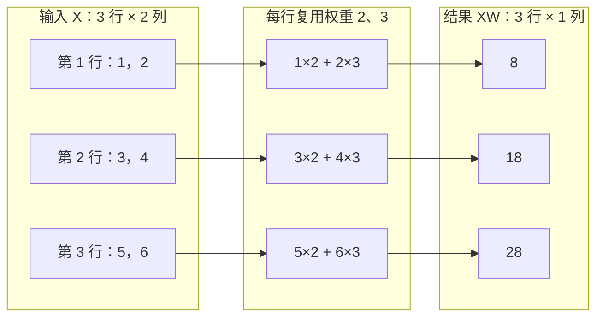

# D01：大模型内部究竟在计算什么？

你向大模型输入“解释一下这段代码”，它返回一段文字。你看到的是文字交流，但模型内部执行的是数值计算：输入的文字被编码、转换成向量，经过模型计算，再根据计算结果逐步生成文字。

这中间有三个问题：文字怎样变成数字？模型怎样处理这些数字？结果怎样变回文字？今天先讲中间这一段：**模型怎样用参数，把输入数字计算成输出数字。**

这也是[整体知识地图](../../../knowledge-map.md)中训练与推理都会用到的一块基础。我们从一个能手算的小模型开始，再看为什么会需要向量、矩阵和张量。这个小模型用于解释计算机制，并不具备语言能力。

## 1. 从一个输入、一个输出看模型计算

先看一个简单关系 **y = 2x + 1**。输入 x = 3，输出就是 7；输入 x = 5，输出就是 11。这里把它当作一个用于预测数值的小模型。模型规定了输入与输出的关系，你提供输入，它按这个关系计算结果。

把它写成 **y = wx + b**：**x 是输入，w 和 b 是参数，y 是输出**。在刚才的例子中，w = 2，b = 1。

为什么区分输入和参数？因为它们承担不同角色。x 随本次处理的数据变化，w 和 b 决定模型怎样处理数据。同一组参数可以处理许多不同输入；改变参数，则会改变输入与输出之间的关系。

w 称为**权重（weight）**。在这个模型中，x 每增加 1，输出就增加 w。b 称为**偏置（bias）**，它让整个输出增加一个固定值；当 x = 0，输出就是 b。

这里的参数是我们直接指定的。机器学习要进一步解决的是：怎样从数据中找到合适的参数。先把“使用参数计算”和“学习参数”分开，后面才容易理解训练。

## 2. 如果一个输入需要多个数来描述呢？

一个数往往不足以描述要处理的对象。比如描述一间房子，可以同时考虑面积和房龄；描述一段文字，也需要一组数值表示，不过这些数字怎样得到，要到后面的文字编码章节再讲。

先把输入扩展为两个数 x₁、x₂，给每个输入一个权重，再相加，得到 **y = w₁x₁ + w₂x₂ + b**。这叫**加权求和**。每项权重控制对应输入对结果的贡献。这里用无量纲的合成数字演示：输入 [1,2]，权重分别为 2、3，偏置为 1，得到 **y = 2×1 + 3×2 + 1 = 9**。

把输入的两个数放在一起，写成 [1, 2]，就是一个**向量（vector）**。在这里，它表示一条输入中的两个特征。“特征”指输入中用于描述对象的数值，顺序必须固定，第一项始终配第一个权重。向量让我们能把多个数当作一条完整输入来讨论。计算仍然是把各项乘以对应权重，然后求和。

现在只把 w₁ 从 2 改为 4。对于输入 [1, 2]，输出增加 2；对于输入 [3, 4]，输出会增加多少？先算一下，再看下一节。关键在于：同一个参数的变化，对不同输入造成的影响可能不同。

## 3. 如果要一起处理多条输入呢？

仍然使用同一组参数，处理三条输入：

| 输入 | 计算 | 输出 |
| --- | --- | --- |
| [1, 2] | 2×1 + 3×2 + 1 | 9 |
| [3, 4] | 2×3 + 3×4 + 1 | 19 |
| [5, 6] | 2×5 + 3×6 + 1 | 29 |

每一行重复同一种计算。为了把这组计算放在一起，可以将输入按行排成一张数字表：

```text
X = [[1, 2],
     [3, 4],
     [5, 6]]
```

这样的二维数字表叫矩阵（matrix）。这里每行是一条样本，每列是一个特征；一起处理的这组样本叫一个批次（batch）。

再把权重排成一列：

```text
W = [[2],
     [3]]
```

矩阵乘法 XW 会对 X 的每一行执行同一个加权求和。以第一行为例：拿 [1, 2] 与权重列中的 [2, 3] 对应相乘，再相加，得到 8。其余两行得到 18 和 28。

然后给每个结果加上偏置 1：

```text
XW = [[ 8],        Y = XW + b = [[ 9],
      [18],                      [19],
      [28]]                      [29]]
```

因此，**矩阵乘法把多条输入的加权求和写成了一次运算。** 在模型实现中，这类成组计算也便于使用优化过的计算库。

注意这里的乘法不是对应位置直接相乘。**矩阵乘法会做“相乘再求和”，逐元素乘法只将对应位置相乘。** 先理解这个区别即可。

## 4. 这次计算中的 shape，到底表示什么？

上一节用同一组权重处理了三条输入。下面的图把三条计算放在一起：**每行输入有两个数，分别乘权重 2 和 3，再相加得到一个结果。** 图中暂不加偏置。



**shape 是形状，描述数据怎样排列，不是数据本身。** X 中的数据是 1、2、3、4、5、6；它们排成三行两列，所以 shape 是 **[3,2]**。权重矩阵 W 排成一列 [[2],[3]]，shape 是 **[2,1]**。执行的是**矩阵乘法 XW**，其结果为 [[8],[18],[28]]，shape 是 **[3,1]**；不是拿形状列表本身相乘。

这个形状关系可以直接从图里读出来：输入有三行，所以结果有三行；每行输入有两个数，需要两个权重一一对应；只有一列权重，也就是一套求和规则，所以每行得到一个结果。**输入的特征数，必须等于每列权重的个数。** 如果权重改为 [[2],[3],[4]]，第一行会变成“1×2 + 2×3 + ?×4”，输入没有第三个数可以配对，这就是形状不匹配的原因。

反过来，如果只是增加第四条输入 [7,8]，它仍有两个数，可以继续用权重 2、3 得到 38。输入形状变为 [4,2]，结果变为 [4,1]，权重仍为 [2,1]。**增加样本条数，不需要改变处理每条样本的权重。** 框架把行、列这样的方向称为“轴”；本例有两个轴，第一个数行，第二个数列。

那张量在哪里？仍然是图中这些数据：在 PyTorch 中，X 可以保存为一个 **Tensor（张量）对象**，它的 **shape 属性**为 [3,2]；W 和结果也可以保存为 Tensor。**张量承载数值，shape 描述这些数值的形状。** 这里并没有增加新的计算。Tensor 也能表示更多轴的数据，但先理解眼前的二维例子即可。

用一个变化检查理解：X 如果有五行，每行仍有两个数，继续使用原来的 W，结果是什么形状？按“几条输入、每条几个结果”解释即可。多输出与广播放在[选读补充](shape-extension.md)中，不影响继续学习。

## 5. 刚才的过程，就是前向计算

从输入出发，按模型规定的运算使用参数，得到输出，这个过程叫**前向计算或前向传播（forward pass）**。

今天的小模型只计算 XW + b。大型语言模型内部会执行许多层运算，把一组数值逐步转换成另一组数值；其中包含大量矩阵运算，也包含非线性等其他操作。

回到开头的文字请求：文字先经过编码并转换为向量表示，这些表示进入模型计算；模型最后产生用于选择后续 Token 的分数，生成过程据此逐步得到文字。今天弄清的是中间的数值计算基础，完整的文字编码与生成过程会在 D04～D06 展开。

**一次模型推理可以包含多次前向计算。**例如自回归文本生成会随着新 Token 的产生继续计算。所以一次前向计算不必对应一条完整回答。

## 6. 那么，参数为什么应该取这些值？

我们始终假定 w₁ = 2、w₂ = 3、b = 1。它们只是方便手算的选择，还没有证据表明这组参数适合某个真实任务。

假设输入 [1, 2] 的目标结果是 10，我们的模型却算出了 9。模型已经完成了前向计算，但还需要知道：

- 预测与目标之间的差距如何衡量？
- 怎样修改参数，才能让预测更接近目标？

这就是 D02 要讲的学习过程：计算误差，并据此更新参数。**训练会使用前向计算，但还包含后续的更新步骤**；单纯重复执行今天的 XW + b 不会自动学到更好的参数。

读到这里，你已经能把“模型在计算”展开成具体过程：输入用向量或矩阵组织，参数决定如何组合这些数值，运算产生输出。张量是承载这些数值的形式，前向计算是这一过程的名称。

接下来先用卡片回忆，再做自测题，**不需要运行实验**。本章解释的是怎样使用参数；下一章 D02 解释参数怎样从数据中学出来。

## 助记卡片

先尝试回答，再展开。每张只记住一条关系。

**1. 输入和参数有什么区别？**

> **答案：** 输入是本次要处理的数据；参数决定模型怎样处理它。同一组参数可以用于多条输入。

**2. 在 y = wx + b 中，权重与偏置分别做什么？**

> **答案：** w 控制 x 对输出的贡献；b 提供固定偏移。在这个模型里，x = 0 时输出为 b。

**3. 为什么引入向量和矩阵？**

> **答案：** 向量可以组织一条输入的多个数；按一行一条样本排列时，矩阵可以组织多条输入。

**4. 张量与 shape 是什么关系？**

> **答案：** 张量承载数值，shape 描述它们的形状。对于本课二维矩阵，[3,2] 表示三行两列，不是矩阵中的数据值。

**5. 矩阵 A 有 3 行 2 列，B 有 2 行 1 列，为什么矩阵乘积 AB 有 3 行 1 列？**

> **答案：** **A 的每一行与 B 的每一列对应相乘再求和，产生一个结果。** A 有 3 行，B 有 1 列，因此结果有 3 行 1 列；A 的列数与 B 的行数同为 2，保证每次配对成立。这里讨论矩阵乘法，[3,2]、[2,1] 只是矩阵的形状。

**6. 增加样本条数，是否需要增加模型参数？**

> **答案：** 本课模型不需要。只要每条样本的特征数不变，就能复用同一组权重。

**7. 什么是前向计算？**

> **答案：** 按模型定义，用输入和已有参数计算输出的过程。它既出现在训练中，也出现在推理中。

**8. 前向计算与训练有什么区别？**

> **答案：** 前向计算得到预测；训练还需要衡量误差并更新参数。只重复前向不会自动让本课模型变好。

## 自测题

建议用 10～20 分钟口头或纸上回答，无需代码。做完再看[参考答案](quiz-answers.md)。

1. **区分角色：**模型为 y = 3x + 2，将输入从 x = 1 换为 x = 4。输入、参数和输出分别发生了什么变化？
2. **解释表示：**某矩阵 shape 为 [4,2]，按一行一条样本排列。它有几条样本、每条几个特征、共几个数？只看到 shape 能否确定轴的业务含义？
3. **判断匹配：**每条输入有两个特征，权重却为一列三个数。为什么不能直接执行本课的加权求和？
4. **判断变化：**使用形状为 [2,1] 的权重，输入从 [3,2] 变为 [5,2]。输出形状与参数数量分别怎样变化？
5. **少量心算：**输入 [1,2]，两个权重为 2、3，偏置为 1，输出是多少？若只把第一个权重从 2 改为 4，输出增加多少？
6. **辨别误解：**有人说“同一个输入多计算一千遍，模型就会学得更好”。对于本课固定参数模型，这句话为什么不成立？
7. **接回大模型：**为什么文字需要进入数值表示？本章说明了其中哪段过程，还有哪两段留待后续章节展开？

---

原理参考：[PyTorch Tensor](https://docs.pytorch.org/tutorials/beginner/basics/tensorqs_tutorial.html)、[矩阵乘法](https://docs.pytorch.org/docs/2.14/generated/torch.matmul.html)、[广播](https://docs.pytorch.org/docs/2.14/notes/broadcasting.html)。小整数示例沿用已验证实验，见[验证记录](lab/verification.md)。
