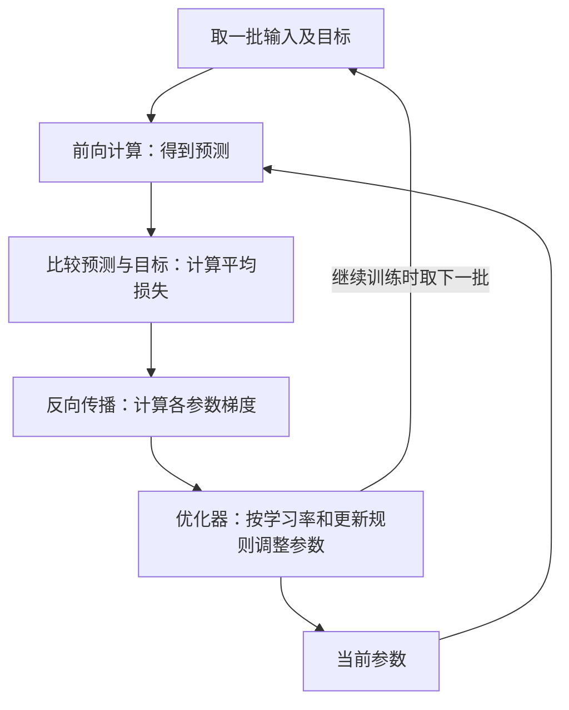

# D02：参数怎样从数据中学出来？

D01 中，我们给定参数，让模型算出预测。但真正使用模型时，我们并不知道哪些参数合适。**训练，就是利用数据中的目标和模型的预测，反复调整参数。** 本章接着上一章的例子，走完一次调整过程；它解释的是整体知识地图中“模型怎样学习”这一块，还不是文字生成的具体机制。

## 1. 预测是 9，目标是 10：怎样衡量差距？

沿用 D01 的计算：输入为两个数 x₁=1、x₂=2，模型按 **ŷ=w₁x₁+w₂x₂+b** 计算。其中 ŷ（读作 y 帽）表示预测，w₁、w₂ 是权重，b 是偏置，三者都是可调整的参数。现在 w₁=2、w₂=3、b=1，所以预测为 2×1+3×2+1=9。这条训练数据给出的目标记作 y，值为 10。

预测比目标少 1，可以直接写误差 e=ŷ−y=−1。但我们还需要一个统一的分数，便于比较参数调整前后谁更好。本例使用 **损失函数（Loss Function）L=½(ŷ−y)²**：差得越远，损失越大；刚好相等，损失为 0。预测为 9 时，L=0.5；预测为 9.6 时，L=0.08；预测为 11 时，L 也为 0.5。平方让偏大和偏小都受到惩罚；前面的 ½ 只是方便后续计算，不改变最佳预测的位置。这是适合本例数值预测的平方损失，不是所有模型都使用的唯一公式。[教材依据](https://d2l.ai/chapter_linear-regression/linear-regression.html)

现在问题明确了：**找一组参数，让预测对应的损失变小。** 但损失只告诉我们目前差多少，还没有告诉我们 w₁、w₂、b 分别应该怎么改。

## 2. 怎样知道某个参数该增大还是减小？

先只看 w₁，把其他参数和输入固定。w₁ 从 2 增加到 2.01，预测便从 9 增加到 9.01，损失从 0.5 降到 0.49005。因此，在当前这个位置，**稍微增大 w₁，可以让损失下降**。

如果换成 w₂ 呢？同样增加 0.01，因为它乘着输入 x₂=2，预测会增加 0.02，而不是 0.01。这说明不同参数对结果的影响不一样，不能把“预测差 1”直接理解为“每个参数都加 1”。我们需要衡量：**其他条件固定时，一个参数发生很小的变化，会让损失变化多少。** 这个局部变化率称为损失对该参数的导数；把所有参数对应的导数组在一起，就是**梯度（Gradient）**。

记某个参数的梯度分量为 g，可以用“损失变化 ≈ g×参数的小变化”理解它。g 为负，说明当前稍微增大该参数会降低损失；g 为正，则应稍微减小。这里强调“当前”和“很小”：**梯度是当前位置的方向线索，不是一步就能到达最佳参数的答案。** 参数改动很大时，不能继续套用原来的局部判断。

## 3. 不逐个试参数，怎样算出梯度？

仍用本章的模型与平方损失：

**ŷ = w₁x₁ + w₂x₂ + b**

**L = ½(ŷ−y)²**

其中 x₁=1、x₂=2，目标 y=10，当前参数 w₁=2、w₂=3、b=1，所以 ŷ=9。现在要求损失对三个参数的偏导数。

### 3.1 直接求 w₂ 的偏导数

把 w₁、b、x₁、x₂、y 看作常量。预测关于 w₂ 的函数为：

**ŷ = 2×1 + 2w₂ + 1 = 3 + 2w₂**

代入损失函数：

**L(w₂) = ½(3+2w₂−10)² = ½(2w₂−7)²**

直接求导：

**∂L/∂w₂ = ½ × 2(2w₂−7) × 2 = 2(2w₂−7)**

代入当前的 w₂=3：

**∂L/∂w₂ = 2(2×3−7) = −2**

因此，当前 w₂ 对应的梯度分量是 **−2**。它表示在当前位置附近，w₂ 增加一个很小的量 Δw₂ 时，损失近似变化 **−2Δw₂**。

### 3.2 用链式法则拆开推导

上面的 L(w₂) 是复合函数：

**w₂ → ŷ → L**

分别求两段的偏导数：

**∂L/∂ŷ = ∂[½(ŷ−y)²]/∂ŷ = ŷ−y**

**∂ŷ/∂w₂ = ∂(w₁x₁+w₂x₂+b)/∂w₂ = x₂**

根据链式法则：

**∂L/∂w₂ = (∂L/∂ŷ)(∂ŷ/∂w₂) = (ŷ−y)x₂**

代入 ŷ=9、y=10、x₂=2：

**∂L/∂w₂ = (9−10)×2 = −2**

所以 **−1×2** 分别来自两部分：−1 是预测误差 ŷ−y，2 是输入 x₂。链式法则把“参数对预测的影响”和“预测对损失的影响”相乘。

### 3.3 一次写出全部参数的梯度

对同一个损失分别求偏导：

**∂L/∂w₁ = (ŷ−y)x₁**

**∂L/∂w₂ = (ŷ−y)x₂**

**∂L/∂b = ŷ−y**

代入 ŷ−y=−1、x₁=1、x₂=2：

**∇L = (∂L/∂w₁, ∂L/∂w₂, ∂L/∂b) = (−1, −2, −1)**

**梯度 ∇L 是所有参数偏导数组成的向量。** 每个分量都回答“只改变这个参数时，损失在当前位置怎样变化”，所以不能把预测误差 −1 直接当成所有参数的梯度。

### 可选：用导数定义验证 ∂L/∂w₂=−2

当前 w₂=3，且 L(w₂)=½(2w₂−7)²。在 w₂=3 处，按照导数定义：

**∂L/∂w₂ = lim[h→0] [L(3+h)−L(3)]/h**

**= lim[h→0] [½(−1+2h)²−½]/h**

**= lim[h→0] (−2+2h)**

**= −2**

对于多层神经网络，损失与某个参数之间会经过很多层复合函数。**反向传播（Backpropagation）就是从损失出发，反向应用链式法则，高效计算所有参数的梯度；它只负责求梯度，不负责修改参数。** 参数更新由下一节的优化器完成。[机制依据](https://docs.pytorch.org/tutorials/beginner/blitz/autograd_tutorial.html)

## 4. 有了梯度，参数到底怎么改？

既然梯度指出损失增大的局部方向，我们就往反方向移动。最基本的**梯度下降（Gradient Descent）**规则是：**新参数=旧参数−学习率×该参数的梯度**。学习率（Learning Rate）控制每一步移动多大；它是我们设置的训练配置，不是模型在本例中学出的权重。[更新规则依据](https://docs.pytorch.org/tutorials/beginner/basics/optimization_tutorial.html)

选择学习率 0.1，使用刚才在同一组旧参数上算出的梯度，一起更新三个参数：

| 参数 | 旧值 | 本次梯度 | 更新计算 | 新值 |
| --- | --- | --- | --- | --- |
| w₁ | 2 | −1 | 2−0.1×(−1) | 2.1 |
| w₂ | 3 | −2 | 3−0.1×(−2) | 3.2 |
| b | 1 | −1 | 1−0.1×(−1) | 1.1 |

用新参数重新预测：ŷ=2.1×1+3.2×2+1.1=**9.6**，损失变成 ½×(9.6−10)²=**0.08**。相比原来的预测 9、损失 0.5，这一步确实改善了这条样本的预测。接下来若继续训练，就要根据新预测**重新计算梯度**，不能一直使用旧梯度。

那把学习率调大，能不能更快到达目标？不一定。从原始参数重新出发，若学习率改为 1，三个参数会更新为 3、5、2，预测变成 15，损失反而升到 12.5。**方向正确，不代表步子越大越好。** 负责按规则调整参数的方法称为**优化器（Optimizer）**；本章只用最基本的梯度下降说明原理，不展开更复杂的更新策略。

## 5. 一条数据算对了，就是学会了吗？

我们刚才只让一条样本的损失下降。事实上，只要满足 w₁+2w₂+b=10，就能把这条样本预测对；这样的参数有很多组，它们在其他输入上未必表现相同。**训练的目标通常不是迎合一个例子，而是在许多数据上降低总体损失。**

因此，训练常常一次取一小批数据，称为**小批量（Mini-batch）**，分别计算损失，再求平均，并对这个平均损失求梯度。不同样本可能要求同一个参数往不同方向变化；平均梯度综合这些影响，而不是保证每一条样本都同时变好。更新参数后，再取一批数据，重复以下过程：

这就把 D01 的前向计算接成了学习循环：**前向得到预测，损失衡量差距，反向计算梯度，优化器更新参数。** 普通推理使用已有参数计算结果，不进行这个参数更新循环；输入内容变化不等于权重被训练修改。

回到文本大模型，它预测的通常不是本例中的一个数，而是“下一个 Token 各种可能取值的概率”。在常见的下一 Token 预训练中，目标来自原始文本中实际出现的下一个 Token，因此不需要每个目标都由人工另行标注。预测对象变了，衡量预测的损失也会变，但“预测—损失—梯度—更新”的主线仍然适用。[语言模型训练目标](https://huggingface.co/learn/llm-course/chapter1/4)

于是下一章自然有两个问题：**预测变成概率后，怎样衡量它好不好？训练数据上的损失降低，又能否说明模型在新数据上也学得好？** D03 将用概率、交叉熵与泛化把这两个问题接起来。

## 助记卡片

**卡片 1：本章例子中的损失函数有什么作用？**

> **答案：** 把预测与目标的差距变成可比较的数值。采用 L=½(ŷ−y)² 时，预测越接近目标，损失越小。

**卡片 2：损失对某个参数的梯度分量，描述什么？**

> **答案：** 其他条件固定时，该参数发生微小变化所引起的损失局部变化率；它不是预测误差，也不是该参数应该直接改动的量。

**卡片 3：某参数的梯度为负时，局部降低损失应往哪个方向调整？**

> **答案：** 稍微增大该参数。这里是局部判断，不保证任意大的增加都能降低损失。

**卡片 4：反向传播与优化器分别负责什么？**

> **答案：** 反向传播沿计算关系求出损失对各参数的梯度；优化器利用梯度和更新规则调整参数。

**卡片 5：基本梯度下降怎样使用梯度和学习率？**

> **答案：** 新参数=旧参数−学习率×梯度。学习率控制步长，过大可能让损失反而增加。

**卡片 6：为什么更新参数后要重新计算梯度？**

> **答案：** 梯度描述旧参数所在位置的局部变化率；参数改变后，预测、损失及梯度都可能改变。

**卡片 7：对一批样本的平均损失求梯度，是否保证每条样本都改善？**

> **答案：** 不保证。各样本的调整方向可能冲突，平均梯度综合它们的影响。

**卡片 8：普通推理与训练在参数更新上有什么区别？**

> **答案：** 普通推理用已有参数计算结果；训练还要利用损失、梯度和优化器更新参数。

## 自测题

1. 在损失 L=½(ŷ−y)²、目标 y=10 时，预测为 8 和 12 的损失各是多少？这个损失值能单独说明预测偏大还是偏小吗？
2. 某参数当前为 3，它的梯度为 +2。使用基本梯度下降，学习率为 0.1，新参数是多少？为什么不是往增大的方向改？
3. 对模型 ŷ=w₁x₁+w₂x₂+b，输入 x₁=1、x₂=2，目标 y=10，当前预测为 9，采用 L=½(ŷ−y)²。为什么 w₂ 的梯度为 −2，而不是 −1？用“参数→预测→损失”解释。
4. 有人说：“反向传播已经完成了学习，所以算完梯度，参数就自动变好了。”这句话漏掉了哪个步骤？
5. 从 w₁=2、w₂=3、b=1 出发，用本章梯度 (−1,−2,−1) 和学习率 1 更新，得到预测 15。为什么这不说明梯度方向算反了？
6. 一次小批量更新后，平均损失下降，但其中一条样本的损失上升。这是否一定是计算错误？说明原因。
7. 用户在普通对话里补充一段背景，模型随即给出了不同回答。这能否证明模型权重被重新训练了？结合本章的训练循环说明。

完成后再看[参考答案](quiz-answers.md)。返回[知识地图](../../../knowledge-map.md)或回顾[D01](../d01-tensors/README.md)。
