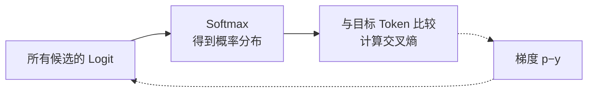
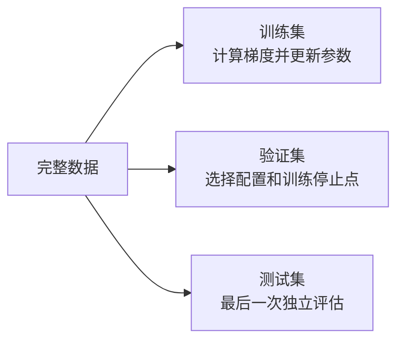

# D03：怎样判断模型有没有学好？

D02 用一个数值预测说明了“预测—损失—梯度—更新”。文本大模型面对的问题不同：给定前文后，它需要在大量候选 Token 中判断哪个更可能出现。因此，本章先把模型输出变成概率并定义相应损失，再回答一个更重要的问题：**训练数据上的损失很低，能否证明模型在新数据上也表现良好？**

## 1. 模型先输出分数，而不是直接输出概率

假设输入是“我喜欢喝”，为了便于手算，只保留三个候选 Token。模型最后一层给出三个原始分数：

| 候选 Token | 原始分数 z |
| --- | ---: |
| 咖啡 | 2 |
| 跑步 | 1 |
| 石头 | 0 |

这些分数叫 **Logit**。Logit 越大，模型越倾向该候选，但它不是概率：它可以为负，三个 Logit 也不要求相加等于 1。我们需要把整组 Logit 转成一组非负且总和为 1 的概率。

对第 i 个候选，**Softmax** 定义为：

**pᵢ = exp(zᵢ) / Σⱼ exp(zⱼ)**

先对每个 Logit 取指数，再除以所有指数值之和。本例中 e²≈7.389、e¹≈2.718、e⁰=1，总和约为 11.107，因此：

| 候选 Token | Softmax 概率 |
| --- | ---: |
| 咖啡 | 7.389 / 11.107 ≈ **0.665** |
| 跑步 | 2.718 / 11.107 ≈ **0.245** |
| 石头 | 1 / 11.107 ≈ **0.090** |

三个概率之和为 1。Softmax 不是逐个独立处理候选：某个候选的 Logit 上升，会提高它所占的比例，也会挤压其他候选的概率。**Logit 表示相对倾向，Softmax 将整组相对倾向归一化为概率分布。** [Softmax 与分类损失参考](https://d2l.ai/chapter_linear-classification/softmax-regression.html)

## 2. 交叉熵怎样衡量一次 Token 预测？

训练文本中，“我喜欢喝”后面实际出现的是“咖啡”，所以目标 Token 是“咖啡”。对于只有一个正确目标的情况，常用的**交叉熵损失（Cross-Entropy Loss）**可以写成：

**L = −ln(p目标)**

本例给正确 Token 的概率为 0.665，所以：

**L = −ln(0.665) ≈ 0.408**

这个公式只关注模型分给正确 Token 的概率，但其他候选仍会通过 Softmax 间接影响它。正确 Token 的概率越高，损失越小：

| 正确 Token 的概率 p目标 | 交叉熵 −ln(p目标) |
| ---: | ---: |
| 0.9 | 0.105 |
| 0.5 | 0.693 |
| 0.1 | 2.303 |
| 0.01 | 4.605 |

因此，交叉熵不仅判断“概率最高的是不是正确 Token”，还衡量模型有多确信。两个模型都把正确 Token 排第一，一个给它 0.51，另一个给它 0.99，它们这一次的准确率都为 1，但交叉熵分别约为 0.673 和 0.010。反过来，模型若非常自信地预测错误，正确 Token 的概率会非常低，损失会很大。

**准确率是离散结果，交叉熵保留了概率置信度，并能为参数更新提供连续的梯度。** 大模型词表很大，训练通常对各位置的 Token 损失求平均；这里的三个候选只是教学缩小版。

## 3. 交叉熵怎样接回 D02 的梯度？

设所有候选的 Logit 为 z₁…zₙ，Softmax 概率为：

**pᵢ = exp(zᵢ) / Σₖ exp(zₖ)**

若正确 Token 的下标为 t，交叉熵为：

**L = −ln(pₜ)**

将 pₜ 代入并使用 ln(a/b)=ln(a)−ln(b)：

**L = −ln[exp(zₜ) / Σₖ exp(zₖ)]**

**= −zₜ + ln[Σₖ exp(zₖ)]**

对任意 Logit zⱼ 求偏导：

**∂L/∂zⱼ = pⱼ − 1，若 j=t**

**∂L/∂zⱼ = pⱼ，若 j≠t**

若用 yⱼ 表示目标：正确位置 yₜ=1，其余位置为 0，就可以统一写成：

**∂L/∂zⱼ = pⱼ − yⱼ**

本例的概率约为 (0.665, 0.245, 0.090)，目标向量是 (1,0,0)，所以 Logit 层的梯度约为：

**Logit 梯度 = (−0.335, 0.245, 0.090)**

梯度下降会减去梯度：正确 Token 的梯度为负，因此它的 Logit 会被提高；错误 Token 的梯度为正，因此它们的 Logit 会被降低。下一次 Softmax 后，正确 Token 通常获得更高概率，交叉熵随之下降。**这正是 D02 的学习循环，只是损失从平方损失换成了适合概率分类的交叉熵。**

## 4. 训练损失低，为什么仍不能说明学得好？

如果只在参与训练的数据上检查，模型可能记住其中的具体模式，却没有学到能用于新数据的规律。这种现象叫**过拟合（Overfitting）**：训练集表现继续改善，未见数据上的表现却开始变差。模型在未参与训练的新数据上仍然有效的能力叫**泛化（Generalization）**。[泛化参考](https://d2l.ai/chapter_linear-regression/generalization.html)

因此，数据通常承担不同职责：

**训练集（Training Set）**直接参与损失计算和参数更新；**验证集（Validation Set）**不更新参数，用于比较模型、超参数或训练轮次；**测试集（Test Set）**应留到方案确定后做最终评估。验证集虽然不直接反向传播，但如果反复根据它调整方案，人已经在间接适配验证集，所以还需要更独立的测试集。

下面是一个教学示例，不是实际实验数据：

| 检查点 | 训练损失 | 验证损失 | 判断 |
| --- | ---: | ---: | --- |
| 较早 | 0.90 | 0.95 | 训练尚不充分 |
| 中期 | 0.40 | **0.45** | 当前泛化最好 |
| 很晚 | **0.10** | 0.70 | 训练集更好，但已经过拟合 |

如果只看训练损失，会选择最后一个检查点；如果关心新数据上的表现，中期检查点更合适。**判断“是否学好”不能只看训练损失，还要看与目标使用场景相匹配的未见数据。**

## 5. 验证损失低，就能证明大模型回答好吗？

仍然不能一概而论。下一 Token 交叉熵衡量的是模型给真实后续 Token 的概率，主要反映概率建模能力；用户真正关心的可能是事实正确、指令遵循、安全性、回答风格、延迟或成本。训练目标与实际目标并不完全相同。

此外，验证数据若与真实请求分布差异很大，验证结果也可能失真；训练内容泄漏进验证或测试集，还会让指标虚高。所以评估需要同时回答两个问题：**指标测量的能力是否是我们真正需要的？评估数据是否代表实际使用场景？** 完整的大模型质量与服务评测将在 D16 展开。

现在，计算与学习基础的三块拼图已经连起来：**D01 解释怎样前向计算，D02 解释怎样根据损失更新参数，D03 解释概率预测使用什么损失，以及怎样在未见数据上判断泛化。** 下一章开始进入大模型本身：文字怎样被切成 Token，并变成模型能够计算的向量。

## 助记卡片

**卡片 1：Logit 与概率有什么区别？**

> **答案：** Logit 是模型对各候选给出的未归一化分数，可以为任意实数；Softmax 才把整组 Logit 转成非负且总和为 1 的概率。

**卡片 2：Softmax 为什么必须同时考虑所有候选？**

> **答案：** 每个概率的分母都是所有候选指数值之和；一个候选所占比例上升，会挤压其他候选的概率。

**卡片 3：单一正确目标下，交叉熵怎样计算？**

> **答案：** L=−ln(p目标)。正确 Token 的概率越接近 1，损失越接近 0；概率越接近 0，损失越大。

**卡片 4：为什么概率最高的 Token 相同，交叉熵仍可能不同？**

> **答案：** 交叉熵还衡量分给正确 Token 的具体概率，因此能区分勉强排第一和高度确信。

**卡片 5：Softmax 与交叉熵组合后，损失对 Logit zⱼ 的梯度是什么？**

> **答案：** ∂L/∂zⱼ=pⱼ−yⱼ；正确位置的 yⱼ=1，其余位置为 0。

**卡片 6：训练集、验证集和测试集分别做什么？**

> **答案：** 训练集更新参数，验证集选择配置与停止点，测试集在方案确定后做独立的最终评估。

**卡片 7：什么是过拟合？**

> **答案：** 模型继续改善训练集表现，却在未见数据上表现变差，说明它没有获得同等程度的泛化能力。

**卡片 8：验证交叉熵低，为什么不等于模型满足所有用户需求？**

> **答案：** 交叉熵只衡量指定概率预测目标；事实性、指令遵循、安全、延迟等需要各自匹配的评估。

## 自测题

1. 三个候选的 Logit 分别为 2、1、0。它们能否直接解释为 2%、1%、0%？Softmax 解决了什么问题？
2. 正确 Token 的概率分别为 0.8 和 0.2 时，哪一次交叉熵更小？不精确计算也要说明理由。
3. 两个模型都把正确 Token 排在第一位，模型 A 给它 0.55，模型 B 给它 0.95。它们这一次的准确率和交叉熵分别能否区分二者？
4. 已知概率 p=(0.7,0.2,0.1)，正确位置是第一个，目标 y=(1,0,0)。写出交叉熵对三个 Logit 的梯度 p−y，并判断梯度下降会让哪些 Logit 上升或下降。
5. 某次训练中，训练损失从 0.4 降到 0.1，验证损失却从 0.5 升到 0.8。最可能出现了什么现象？选择模型时应只看训练损失吗？
6. 为什么验证集不参与梯度更新，仍可能因为反复调参而被间接适配？测试集的作用是什么？
7. 一个模型在通用网页文本上的下一 Token 损失很低，能否直接证明它在企业问答中事实准确、延迟合格？还缺少哪些类型的评估？

完成后再看[参考答案](quiz-answers.md)。返回[知识地图](../../../knowledge-map.md)，或回顾[D02](../d02-learning/README.md)。
