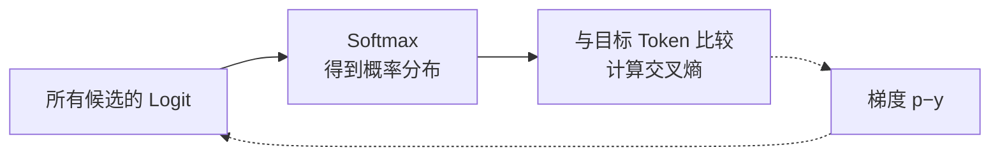
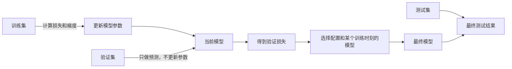

# D03：怎样判断模型有没有学好？

D02 用一个数值预测说明了“预测—损失—梯度—更新”。文本大模型面对的问题不同：给定前文后，它需要在大量候选 Token 中判断哪个更可能出现。因此，本章先把模型输出变成概率并定义相应损失，再回答一个更重要的问题：**训练数据上的损失很低，能否证明模型在新数据上也表现良好？**

## 1. 模型先输出分数，而不是直接输出概率

假设输入是“我喜欢喝”，为了便于手算，只保留三个候选 Token。模型最后一层给出三个原始分数：

| 候选 Token | 原始分数 z |
| --- | ---: |
| 咖啡 | 2 |
| 跑步 | 1 |
| 石头 | 0 |

这些分数叫 **Logit**。Logit 越大，模型越倾向该候选，但它不是概率：它可以为负，三个 Logit 也不要求相加等于 1。我们需要把整组 Logit 转成一组非负且总和为 1 的概率。

对第 i 个候选，**Softmax** 定义为：

**pᵢ = exp(zᵢ) / Σₖ exp(zₖ)**

这里 i 表示当前候选的位置，k 是遍历全部候选的求和下标。先对每个 Logit 取指数，再除以所有指数值之和。本例中 e²≈7.389、e¹≈2.718、e⁰=1，总和约为 11.107，因此：

| 候选 Token | Softmax 概率 |
| --- | ---: |
| 咖啡 | 7.389 / 11.107 ≈ **0.665** |
| 跑步 | 2.718 / 11.107 ≈ **0.245** |
| 石头 | 1 / 11.107 ≈ **0.090** |

三个概率之和为 1。Softmax 不是逐个独立处理候选：某个候选的 Logit 上升，会提高它所占的比例，也会挤压其他候选的概率。**Logit 表示相对倾向，Softmax 将整组相对倾向归一化为概率分布。** [Softmax 与分类损失参考](https://d2l.ai/chapter_linear-classification/softmax-regression.html)

## 2. 交叉熵怎样衡量一次 Token 预测？

训练文本中，“我喜欢喝”后面实际出现的是“咖啡”，所以目标 Token 是“咖啡”。如果只记录“概率最高的 Token 是否正确”，那么给“咖啡”0.51 和 0.99 的两个模型都会被记为预测正确；这个结果无法区分“勉强选对”和“非常确信”。训练参数需要一个能连续反映这种差别的损失：正确 Token 的概率越高，损失越小；模型越确信一个错误答案，损失越大。

满足这个要求的一种常用选择是**交叉熵损失（Cross-Entropy Loss）**。当训练数据只给出一个正确目标时，它可以写成：

**L = −ln(p目标)**

本例给正确 Token 的概率为 0.665，所以：

**L = −ln(0.665) ≈ 0.408**

公式中的 p目标 表示模型分给正确 Token 的概率。虽然公式只直接读取这个概率，其他候选仍会通过 Softmax 的共同分母间接影响它。正确 Token 的概率越高，损失越小：

| 正确 Token 的概率 p目标 | 交叉熵 −ln(p目标) |
| ---: | ---: |
| 0.9 | 0.105 |
| 0.5 | 0.693 |
| 0.1 | 2.303 |
| 0.01 | 4.605 |

现在可以回看开头的两个模型：它们都把正确 Token 排第一，所以这一次的**准确率（Accuracy）**都记为 1；但交叉熵分别约为 0.673 和 0.010，能够区分二者。反过来，模型若非常自信地预测错误，正确 Token 的概率会非常低，损失会很大。

**准确率是离散结果，交叉熵保留了概率置信度，并能为参数更新提供连续的梯度。** 大模型词表很大，训练通常对各位置的 Token 损失求平均；这里的三个候选只是教学缩小版。

## 3. 交叉熵怎样接回 D02 的梯度？

设词表中共有 n 个候选 Token，它们的 Logit 记为 z₁…zₙ。这里 **zⱼ 表示模型给第 j 个候选 Token 的 Logit，pⱼ 表示该候选经过 Softmax 后的预测概率**：

**pⱼ = exp(zⱼ) / Σₖ exp(zₖ)**

公式中的 k 只是求和下标，表示分母要遍历全部 n 个候选。若训练数据中的正确 Token 位于第 t 个位置，那么 pₜ 就是模型分给正确 Token 的概率，交叉熵为：

**L = −ln(pₜ)**

这一节的目标不是再次计算损失，而是求 **损失对每个 Logit 的偏导数 ∂L/∂zⱼ**。只写 L=−ln(pₜ) 会隐藏 pₜ 与所有 Logit 的关系，因此先把 Softmax 公式代入，让 L 显式写成 z₁…zₙ 的函数。再使用 ln(a/b)=ln(a)−ln(b) 和 ln[exp(zₜ)]=zₜ，将式子化成容易求导的形式：

**L = −ln[exp(zₜ) / Σₖ exp(zₖ)]**

**= −zₜ + ln[Σₖ exp(zₖ)]**

现在对任意一个候选的 Logit zⱼ 求偏导。定义 **yⱼ 为第 j 个位置的目标值：j=t 时 yⱼ=1，否则 yⱼ=0**。第一部分只在 j=t 时包含 zⱼ，因此：

**∂(−zₜ)/∂zⱼ = −yⱼ**

设 S=Σₖexp(zₖ)，第二部分使用复合函数求导：

**∂ln(S)/∂zⱼ = [1/S] × exp(zⱼ) = pⱼ**

两部分相加：

**∂L/∂zⱼ = −yⱼ+pⱼ = pⱼ−yⱼ**

把 yⱼ 的取值展开，就得到：

**∂L/∂zⱼ = pⱼ − 1，若 j=t**

**∂L/∂zⱼ = pⱼ，若 j≠t**

回到“咖啡、跑步、石头”的例子，正确 Token 是“咖啡”：

| j | Token | pⱼ：模型概率 | yⱼ：目标值 | pⱼ−yⱼ：Logit 梯度 |
| ---: | --- | ---: | ---: | ---: |
| 1 | 咖啡 | 0.665 | 1 | −0.335 |
| 2 | 跑步 | 0.245 | 0 | 0.245 |
| 3 | 石头 | 0.090 | 0 | 0.090 |

梯度下降会减去梯度：正确 Token 的梯度为负，因此它的 Logit 会被提高；错误 Token 的梯度为正，因此它们的 Logit 会被降低。下一次 Softmax 后，正确 Token 通常获得更高概率，交叉熵随之下降。**这正是 D02 的学习循环，只是损失从平方损失换成了适合概率分类的交叉熵。**

## 4. 训练损失低，为什么仍不能说明学得好？

先看训练损失到底证明了什么。假设训练数据中反复出现“1+1=2”和“2+2=4”，模型通过 D02 的参数更新，逐渐给正确答案“2”和“4”很高的概率，于是训练损失下降。这个结果只能说明：**模型越来越擅长预测它训练时见过的数据。**

现在给模型一个没有参与训练的新输入“3+3=”。模型可能有两种学习结果：

- 它学到了加法规律，能够预测“6”。
- 它只记住了“1+1→2”和“2+2→4”的对应关系，不知道“3+3”的答案。

这两种模型在训练数据上的损失都可能很低，但第二种模型到了新数据就会失败。**模型把训练中学到的规律用于未见数据的能力，叫泛化（Generalization）。只记住训练数据的细节，却不能在未见数据上保持表现，叫过拟合（Overfitting）。** 这里的算术只是缩小后的例子；语言模型面对的是词语搭配、语义关系和文本模式。[泛化参考](https://d2l.ai/chapter_linear-regression/generalization.html)

### 4.1 为什么要留下模型没训练过的数据？

如果所有数据都用于更新参数，我们最后只能检查模型会不会做“训练时已经看过的题”，无法区分它学到了规律还是记住了答案。因此，要在训练前把一部分数据留出来，不让它参与梯度计算：

三种数据承担的职责不同：

- **训练集（Training Set）**用于计算梯度并更新参数，是模型真正用来学习的数据。
- **验证集（Validation Set）**只让当前模型做预测，不用它的损失反向传播；它用于比较不同配置和训练过程中保存的模型版本，这些版本通常叫**检查点（Checkpoint）**。
- **测试集（Test Set）**在模型和配置确定后用于最终评估，尽量保持独立。

验证集没有直接修改参数，为什么还需要测试集？因为人会反复查看验证结果，然后选择学习率、模型结构或停止训练的时刻。选择次数多了，整个方案可能逐渐迎合验证集。因此，测试集负责在选择完成后再做一次相对独立的检查。

### 4.2 怎样从训练损失和验证损失发现过拟合？

下面是教学数据，不是实际实验结果。每一行表示训练过程中保存的一个模型检查点：

| 检查点 | 训练损失 | 验证损失 | 说明 |
| --- | ---: | ---: | --- |
| 较早 | 0.90 | 0.95 | 两边都高，模型还没充分学到规律 |
| 中期 | 0.40 | **0.45** | 两边都下降，未见数据表现最好 |
| 很晚 | **0.10** | 0.70 | 训练题继续变好，新题却开始变差 |

从“中期”训练到“很晚”时：

**训练损失：0.40 → 0.10，说明模型更贴合训练数据。**

**验证损失：0.45 → 0.70，说明模型在未参与训练的数据上反而退步。**

这两个变化同时出现，才是这里判断过拟合的关键信号。它并不是说“训练损失低就是坏事”，而是说：**训练损失继续下降时，验证损失却上升，模型正在用泛化表现换取对训练数据的进一步贴合。** 因此，本例应选择验证损失最低的“中期”检查点，而不是训练损失最低的“很晚”检查点。

把第四节压缩成一句话就是：**训练集负责让模型学习；验证集负责检查这些学习能否迁移到未见数据；训练变好而验证变差，说明发生了过拟合。**

## 5. 验证损失低，就能证明大模型回答好吗？

第四节用验证集解决了“模型是在记训练答案，还是能处理未见数据”的问题。但“数据没有参与训练”只是第一个条件，**还不能保证验证结果代表真实使用效果。**

先看评估目标。下一 Token 交叉熵衡量的是模型给真实后续 Token 的概率，主要反映概率建模能力；用户真正关心的还可能包括事实正确、指令遵循、安全性、回答风格、延迟和成本。**指标测量的对象与用户真正需要的能力不一致，验证损失再低也不能回答全部问题。**

再看评估数据。假设模型将用于企业技术问答，验证集却全部来自普通网页；即使这些网页没有参与训练，它们也不能充分代表企业术语、内部文档和真实问题。这种训练或评估数据与实际使用数据规律不同的情况，可概括为**数据分布不匹配（Distribution Mismatch）**。

最后，即便选对了评估场景，还要确保评估内容没有混入训练数据。若测试题或高度相似的内容已经被模型训练过，测试就又变成了“检查记忆”，指标可能虚高；这种本应隔离的信息进入训练过程的现象叫**数据泄漏（Data Leakage）**。

因此，一次可信的评估至少要继续追问：**指标是否测量了真正需要的能力？评估数据是否代表实际场景？评估内容是否与训练过程保持隔离？** 完整的大模型质量与服务评测将在 D16 展开。

现在，计算与学习基础的三块拼图已经连起来：**D01 解释怎样前向计算，D02 解释怎样根据损失更新参数，D03 解释概率预测使用什么损失，以及怎样在未见数据上判断泛化。** 下一章开始进入大模型本身：文字怎样被切成 Token，并变成模型能够计算的向量。

## 助记卡片

**卡片 1：Logit 与概率有什么区别？**

> **答案：** Logit 是模型对各候选给出的未归一化分数，可以为任意实数；Softmax 才把整组 Logit 转成非负且总和为 1 的概率。

**卡片 2：Softmax 为什么必须同时考虑所有候选？**

> **答案：** 每个概率的分母都是所有候选指数值之和；一个候选所占比例上升，会挤压其他候选的概率。

**卡片 3：单一正确目标下，交叉熵怎样计算？**

> **答案：** L=−ln(p目标)。正确 Token 的概率越接近 1，损失越接近 0；概率越接近 0，损失越大。

**卡片 4：为什么概率最高的 Token 相同，交叉熵仍可能不同？**

> **答案：** 交叉熵还衡量分给正确 Token 的具体概率，因此能区分勉强排第一和高度确信。

**卡片 5：在 ∂L/∂zⱼ=pⱼ−yⱼ 中，pⱼ 和 yⱼ 分别表示什么？**

> **答案：** pⱼ 是模型分给第 j 个候选 Token 的概率；yⱼ 是训练目标在该位置的值，正确位置为 1，其余位置为 0。

**卡片 6：训练集、验证集和测试集分别做什么？**

> **答案：** 训练集更新参数，验证集选择配置与停止点，测试集在方案确定后做独立的最终评估。

**卡片 7：什么是过拟合？**

> **答案：** 模型继续改善训练集表现，却在未见数据上表现变差，说明它没有获得同等程度的泛化能力。

**卡片 8：验证交叉熵低，为什么不等于模型满足所有用户需求？**

> **答案：** 交叉熵只衡量指定概率预测目标；事实性、指令遵循、安全、延迟等需要各自匹配的评估。

## 自测题

1. 三个候选的 Logit 分别为 2、1、0。它们能否直接解释为 2%、1%、0%？Softmax 解决了什么问题？
2. 正确 Token 的概率分别为 0.8 和 0.2 时，哪一次交叉熵更小？不精确计算也要说明理由。
3. 两个模型都把正确 Token 排在第一位，模型 A 给它 0.55，模型 B 给它 0.95。它们这一次的准确率和交叉熵分别能否区分二者？
4. 已知概率 p=(0.7,0.2,0.1)，正确位置是第一个，目标 y=(1,0,0)。写出交叉熵对三个 Logit 的梯度 p−y，并判断梯度下降会让哪些 Logit 上升或下降。
5. 某次训练中，训练损失从 0.4 降到 0.1，验证损失却从 0.5 升到 0.8。最可能出现了什么现象？选择模型时应只看训练损失吗？
6. 为什么验证集不参与梯度更新，仍可能因为反复调参而被间接适配？测试集的作用是什么？
7. 一个模型在通用网页文本上的下一 Token 损失很低，能否直接证明它在企业问答中事实准确、延迟合格？请从评估目标、数据分布和数据隔离三个方面说明。

完成后再看[参考答案](quiz-answers.md)。返回[知识地图](../../../knowledge-map.md)，或回顾[D02](../d02-learning/README.md)。
