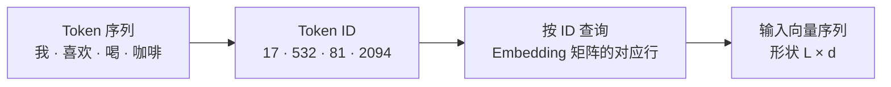
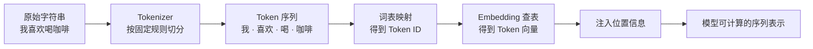

# D04：文字怎样变成模型的输入？

D03 里我们直接说模型为“咖啡”等候选 Token 输出 Logit，但还没有解释 Token 从哪里来。计算机收到的原始输入只是字符串，而 D01 已经说明模型内部只能对数值张量做计算。两者之间必须有一条转换链：**先把文字切成有限词表中的 Token，再用编号找到每个 Token 的向量，并补上它在序列中的位置。**

## 1. 为什么不能把一句话直接交给模型？

假设用户输入“我喜欢喝咖啡”。如果把整句话当成一个单位，模型就需要为每一种可能的句子准备一个编号；句子组合近乎无穷，这条路行不通。如果把文字全部拆成单个字符，词表会变小，但“咖啡”“大模型”等常见组合会被拆散，序列也会变长。我们需要在“词表不能无限大”和“序列不能过长”之间取得折中。

为此，模型使用一套固定的切分规则，把字符串转换成一串 **Token**。Token 是分词器处理文本时使用的基本单位，可以是一个字、一个词、词的一部分、标点，或者字节片段；它不等于自然语言中的“单词”。完成这一步的组件叫 **分词器（Tokenizer）**，转换过程叫 **Tokenization**。

下面定义一个只供本章使用的简化分词器：

**“我喜欢喝咖啡” → [“我”, “喜欢”, “喝”, “咖啡”]**

这不是所有真实模型都会得到的切分结果。不同模型的分词器拥有不同词表和切分规则，同一段文字可能产生不同 Token 序列。真实分词还可能包含规范化、子词切分和特殊 Token 等步骤；本章只保留理解模型输入所需的主线。[Hugging Face Tokenizers 文档](https://huggingface.co/docs/tokenizers/main/api/tokenizer)给出了从文本规范化、切分到映射为 ID 的完整组件关系。

## 2. Token 为什么还要变成编号？

得到 [“我”, “喜欢”, “喝”, “咖啡”] 后，模型仍然不能直接拿字符串做矩阵运算。既然分词器的词表是有限集合，就可以为每个 Token 分配一个整数编号，这个编号叫 **Token ID**。假设教学词表中有如下对应关系：

| Token | Token ID |
| --- | ---: |
| 我 | 17 |
| 喜欢 | 532 |
| 喝 | 81 |
| 咖啡 | 2094 |

于是输入变成：

**[“我”, “喜欢”, “喝”, “咖啡”] → [17, 532, 81, 2094]**

Token ID 只是词表中的索引，不表示大小或相似程度。编号 2094 不意味着“咖啡”比编号 81 的“喝”更重要，也不意味着两者相差 2013 个语义单位。这个编号的作用和数组下标相似：**它告诉模型去哪里取出该 Token 对应的数据。**

词表和 Token ID 必须与模型匹配。若换了一套分词器，同一个 ID 可能代表完全不同的 Token；此时即使张量形状正确，模型读到的内容也会错位。因此，Tokenizer 不是可以随意替换的文本预处理工具，而是模型输入约定的一部分。

## 3. 一个整数为什么还不足以表达 Token？

Token ID 可以定位 Token，却不能表达它与其他 Token 的关系。若直接把 17、532、81、2094 当成连续数值输入，计算会错误地暗示 81 比 17“大”、2094 与 532 的距离具有语义。模型需要为每个 Token 准备一组可参与计算、并能在训练中调整的数值。

把词表中每个 Token 对应到一个向量的表称为 **Embedding 矩阵**。假设教学词表共有 V=3000 个 Token，每个 Token 用 d=4 个数表示，那么 Embedding 矩阵 E 的形状是 **[V,d]=[3000,4]**：每一行属于一个 Token，每一列是向量的一个维度。

为了看清查表过程，假设矩阵 E 中相关的几行是：

| Token ID | 对应的向量 E[id] |
| ---: | --- |
| 17 | [0.2, −0.1, 0.7, 0.3] |
| 532 | [−0.4, 0.8, 0.1, 0.5] |
| 81 | [0.6, 0.2, −0.3, 0.4] |
| 2094 | [0.1, 0.9, 0.4, −0.2] |

现在依次用 Token ID 取出对应行，四个 ID 就变成四个向量：

**[17,532,81,2094] → [E[17],E[532],E[81],E[2094]]**

把这些向量按原顺序排在一起，得到形状为 **[L,d]=[4,4]** 的输入矩阵 X。这里 L=4 表示序列中有四个 Token，d=4 表示每个 Token 用四维向量表示。真实模型的词表和向量维度通常大得多，但查表关系相同：

这一步叫 **Embedding（嵌入）**：把离散的 Token 映射到连续向量空间。矩阵 E 不是人工填写的词典；其中的数值是模型参数，会在 D02 所讲的训练循环中根据损失和梯度不断更新。大量上下文共同推动参数调整后，一些用法相近的 Token 可能形成可利用的向量关系，但不能把单个维度直接解释成固定的人类概念。

## 4. 有了 Token 向量，为什么还要表示位置？

查表保留了 Token 的顺序，却给同一个 Token 始终取出同一行。例如“很很好”经过教学分词器可能得到 [“很”,“很”,“好”]，前两个“很”的初始 Token 向量完全相同。仅靠向量内容，模型无法知道一个“很”位于第 1 个位置，另一个位于第 2 个位置。

顺序还会改变整句话的关系。“猫追狗”和“狗追猫”包含相同的三个 Token，如果后续计算只把它们当成无序集合，两句话就无法区分。模型因此还需要知道每个 Token **在哪里**，以及 Token 之间相隔多远；这类额外信号统称为 **位置信息（Positional Information）**。

一种直观做法是为第 0、1、2、3 个位置分别准备位置向量 P₀、P₁、P₂、P₃，并将其加入对应的 Token 向量。对于序列中第 i 个位置，输入可以概括为：

**Hᵢ = E[tokenᵢ] + Pᵢ**

这里 tokenᵢ 表示第 i 个位置上的 Token，E[tokenᵢ] 是通过它的 ID 查到的 Token 向量，Pᵢ 是该位置的位置向量，Hᵢ 是同时携带内容与位置的表示。写出这个式子的目的不是规定所有大模型都必须相加，而是看清模型需要同时获得两类信息：**“这是什么 Token”和“它处于什么位置”。**

不同 Transformer 会用不同方式注入位置信息。原始 Transformer 将位置编码加入输入向量；一些后续模型则在注意力计算中使用旋转位置编码 **RoPE（Rotary Position Embedding）** 等方法。具体公式留到需要分析模型结构时再展开，本章只需要确认：没有位置信息，后续机制无法可靠区分顺序和距离。[原始 Transformer 论文](https://arxiv.org/abs/1706.03762)和 [RoPE 论文](https://arxiv.org/abs/2104.09864)展示了两种不同方案。

## 5. 从字符串到模型输入的完整链路

现在可以把本章各步接起来。Tokenizer 决定字符串怎样切成 Token；词表把 Token 映射为 Token ID；Embedding 矩阵把 ID 变成可学习的向量；位置信息让相同 Token 在不同位置可以被区别。整个过程如下：

这条链路也解释了几个常见误解：Token 不一定是一个字或一个词；Token ID 不是带语义大小的数值；Embedding 不是分词，而是 ID 到向量的映射；位置信息也不是新的 Token，而是帮助模型理解顺序的信号。

不过，现在每个 Token 的向量主要表示它自身及位置。“咖啡”的表示怎样结合前面的“我喜欢喝”，从而根据上下文发生变化？这需要一个让序列中各位置相互读取信息的机制。D05 将从这个缺口引出 Attention 和 Transformer 层。

## 助记卡片

**卡片 1：Token 与自然语言中的词有什么区别？**

> **答案：** Token 是分词器按固定规则得到的处理单位，可以是字、词、子词、标点或字节片段，不保证等于一个自然语言单词。

**卡片 2：为什么不同模型可能把同一句话切成不同 Token？**

> **答案：** 不同模型可能配套不同词表和切分规则，因此相同字符串对应的 Token 序列不一定相同。

**卡片 3：Token ID 表示 Token 的语义大小吗？**

> **答案：** 不表示。Token ID 只是词表索引，用于定位对应的 Embedding 行；编号大小没有直接语义。

**卡片 4：形状为 [V,d] 的 Embedding 矩阵中，V 和 d 分别表示什么？**

> **答案：** V 是词表中的 Token 数量，d 是每个 Token 向量的维度；矩阵每一行对应一个 Token。

**卡片 5：输入含 L 个 Token、每个 Embedding 为 d 维时，向量序列的形状是什么？**

> **答案：** 形状是 [L,d]，共有 L 行，每行是一个 d 维 Token 向量。

**卡片 6：Embedding 矩阵中的数值从哪里来？**

> **答案：** 它们是模型参数，在训练中根据损失和梯度更新，不是人工为每个词填写的语义标签。

**卡片 7：为什么只有 Token Embedding 还不足以表示一句话？**

> **答案：** 同一 Token 在不同位置会查到相同向量；没有位置信息，模型难以区分顺序和距离。

**卡片 8：D04 最终把字符串转换成了什么？**

> **答案：** 字符串经过 Token、Token ID、Embedding 和位置信息处理，变成模型可以继续计算的序列表示。

## 自测题

1. 为什么不能简单地为每一种完整句子分配一个编号？把文本全部拆成单字符又会带来什么代价？
2. 教学分词器把“我喜欢喝咖啡”切成 [“我”,“喜欢”,“喝”,“咖啡”]。能否据此断言所有模型都会这样切分？为什么？
3. 某词表中“咖啡”的 Token ID 是 2094，“喝”的 Token ID 是 81。能否说“咖啡”的语义数值比“喝”大？Token ID 真正用于什么？
4. 某模型词表大小 V=5000，Embedding 维度 d=8。Embedding 矩阵的形状是什么？输入含 6 个 Token 时，查表得到的向量序列形状是什么？
5. 为什么说 Embedding 是模型参数？它与人工编写的“词语含义表”有什么区别？
6. “猫追狗”和“狗追猫”包含相同的 Token。位置信息帮助模型解决什么问题？
7. 请按顺序复述原始字符串变成模型可计算序列表示的四个关键转换，并分别说明 Token ID 与 Embedding 的职责。

完成后再看[参考答案](quiz-answers.md)。返回[知识地图](../../../knowledge-map.md)，或回顾[D03](../../00-foundations/d03-probability-generalization/README.md)。
