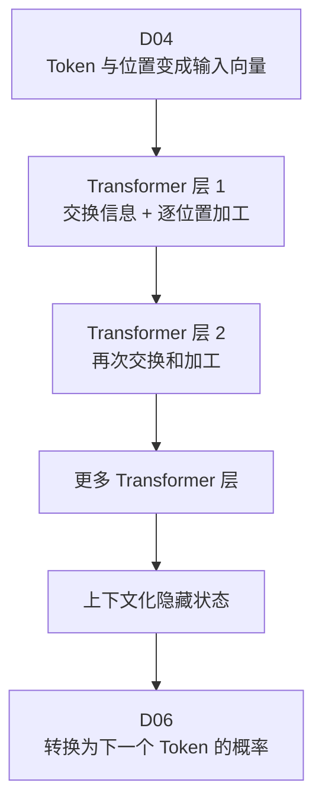
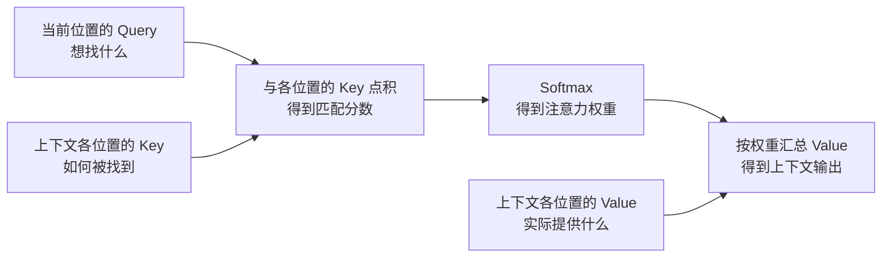
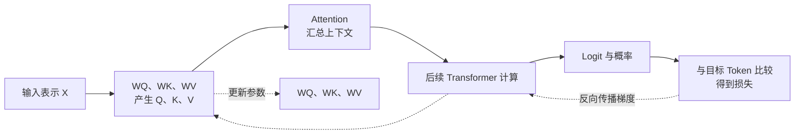
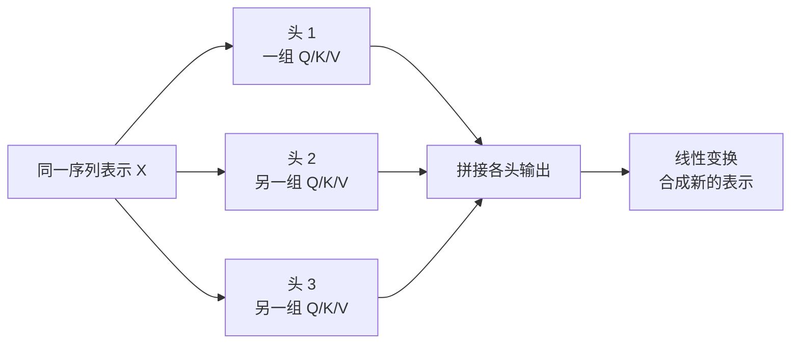
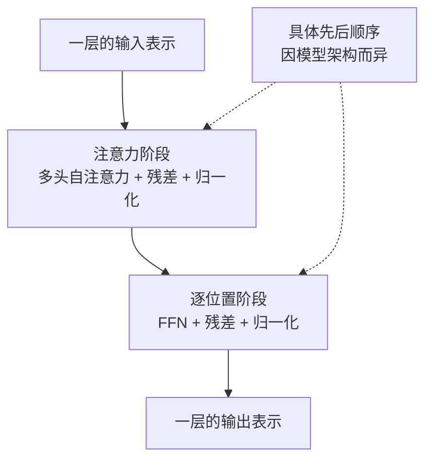

# D05：模型怎样结合上下文处理信息？

D04 把文字转换成了一串带位置信息的向量，但每个向量主要描述当前位置的 Token。真正理解一句话还需要把不同位置联系起来：在“小明吃了苹果，因为它很甜”中，模型处理“它”时必须从前文找到与它相关的信息。本章先看 Transformer 的整体位置，再拆开它内部最重要的几种计算，避免只见 Q/K/V 而不知道它们属于哪台“机器”。

## 1. Transformer 到底是什么？

**Transformer 不是某一个公式，而是一种处理序列的神经网络架构。**对本课程讨论的文本大模型，可以先把它看成由许多相似计算层堆叠成的主体：D04 产生的 Token 向量从底部进入，每一层都让 Token 交换信息并继续加工，顶部输出结合了上下文的隐藏状态。D06 再把顶部隐藏状态转换成下一个 Token 的概率。

图中的“Transformer 层”才是本章要拆开的对象。一个典型层包含两项主要变换：**自注意力（Self-Attention）负责不同 Token 之间交换信息，前馈网络（Feed-Forward Network，FFN）负责分别加工每个 Token 的信息。**残差连接和层归一化则围绕这两项变换，帮助保留信息并稳定堆叠。先记住这张总图，后面的 Q/K/V 都只是自注意力内部用于“怎样交换信息”的参数化方法。

## 2. 为什么每个 Token 不能只看自己的向量？

D04 的 Embedding 查表给同一个 Token 相同的初始向量，但“它”具体指什么取决于上下文。在“小明吃了苹果，因为它很甜”中，“它”更可能与“苹果”有关；换成“小明清洗了盘子，因为它很脏”，“它”又更可能与“盘子”有关。只读取“它”自身的 Token 向量，无法做出这种区别。

一种固定办法是把相邻几个 Token 平均起来，但“相关信息”不一定就在固定距离内，不同位置需要的信息也不同。处理“它”时，“苹果”可能比紧挨着的“因为”更重要；处理其他 Token 时，关注对象又会改变。因此，模型需要根据当前位置的需求，动态决定从上下文各位置读取多少信息。

这个机制叫 **注意力（Attention）**。它不会先硬选出唯一 Token，而是为允许读取的各位置计算权重，再按权重汇总信息。权重越大，表示该位置的信息对当前计算的影响越大。

## 3. 当前 Token 怎样找到相关位置？

要计算“它”与前文各 Token 的相关程度，模型需要区分三个角色：当前位置想找什么、其他位置能否匹配这个需求，以及匹配后实际取走什么内容。由此产生三个向量：

- **Query（Q，查询向量）**表示当前位置正在寻找什么。
- **Key（K，键向量）**表示某个位置能够用什么特征被匹配。
- **Value（V，值向量）**表示该位置真正提供给结果的信息。

可以把它类比成检索：Query 是检索条件，Key 用来判断每条记录与条件有多匹配，Value 是匹配后读取的记录内容。Key 和 Value 必须分开，因为“用什么特征找到我”与“找到后取走什么信息”并不是同一职责。

这些向量不是人工编写的语言规则。设 D04 得到的某个 Token 表示为行向量 x，模型用三组可训练矩阵 WQ、WK、WV 做线性变换：

**q = xWQ，k = xWK，v = xWV**

这里 q、k、v 分别是该位置生成的 Query、Key、Value；WQ、WK、WV 是在训练中通过梯度更新的参数。序列中的每个位置都会生成自己的 q、k、v，所以同一个 Token 表示可以同时承担“发出查询”“接受匹配”和“提供内容”三种角色。这种让序列内部各位置相互读取信息的机制称为 **自注意力（Self-Attention）**。

## 4. 一次注意力计算究竟做了什么？

先只站在“它”这个位置看一次计算。为了知道该读谁，模型先用“它”的 Query qᵢ 与每个可读取位置 j 的 Key kⱼ 做点积。下标 i 表示当前查询位置，下标 j 表示被查询的上下文位置。点积越大，说明两者在当前参数下越匹配。

直接的点积会随着向量维度增大而出现较大的数值，使 Softmax 容易过度集中。为了控制分数尺度，将点积除以 √dₖ，其中 dₖ 是 Key 和 Query 的维度：

**sᵢⱼ = (qᵢ · kⱼ) / √dₖ**

sᵢⱼ 是位置 i 对位置 j 的注意力分数。分数还不是概率，因此对位置 i 的全部可读取分数使用 D03 学过的 Softmax，得到权重 aᵢⱼ：

**aᵢⱼ = exp(sᵢⱼ) / Σᵣ exp(sᵢᵣ)**

求和下标 r 遍历位置 i 当前允许读取的全部位置，所以这些权重非负且总和为 1。最后按权重对各位置的 Value 求和，得到位置 i 汇总上下文后的输出 oᵢ：

**oᵢ = Σⱼ aᵢⱼvⱼ**

把三步连起来就是：**Query 与 Key 计算匹配分数 → Softmax 把分数变成权重 → 用权重加权汇总 Value。**

用一个教学算例看权重如何产生。假设“它”的 Query 与“小明”“苹果”两个位置的缩放后分数分别为 0 和 1，那么 Softmax 权重为：

**a小明 = e⁰/(e⁰+e¹) ≈ 0.269**

**a苹果 = e¹/(e⁰+e¹) ≈ 0.731**

因此，“它”的新表示会读取约 26.9% 的“小明”Value 和 73.1% 的“苹果”Value。这个算例只是展示计算机制，不表示真实模型必定得到这两个权重，也不意味着权重可以直接当成人类可验证的语法解释。

若把整条序列所有位置的 Query、Key、Value 分别堆成矩阵 Q、K、V，上面的逐位置计算可以压缩为：

**Attention(Q,K,V) = softmax(QKᵀ/√dₖ)V**

QKᵀ 一次得到所有“查询位置—被查询位置”的分数，Softmax 对每个查询位置的可读取分数归一化，再与 V 相乘完成加权汇总。这正是 D01 中矩阵运算在模型结构里的一个具体用途。[缩放点积注意力来源](https://arxiv.org/abs/1706.03762)

## 5. Q/K/V 没有标准答案，模型怎样把它们训练出来？

到这里可能会产生一个疑问：训练数据只给出了正确的下一个 Token，并没有告诉模型“它”的 Query 应该是什么，也没有标注它应该对“苹果”分配多少注意力。那 WQ、WK、WV 怎样学习？

答案是：**Q/K/V 不需要各自的人工标准答案，它们通过最终预测损失进行端到端训练。**这里的“端到端”表示监督信号放在计算链末端，但梯度会沿整条链反向传回前面的所有可训练参数。

一次训练的前向过程是：输入 x 乘 WQ、WK、WV 得到 Q、K、V；注意力用它们产生上下文表示；表示继续通过后续 Transformer 层；模型顶部输出 D03 讲过的 Logit、Softmax 概率和交叉熵损失。若正确的下一个 Token 是“甜”，模型却给“甜”很低的概率，损失就会较大。

这正是 D02 的链式法则，只是计算图更长。以 WQ 为例，损失 L 依赖注意力输出，注意力输出依赖 Q，而 Q=XWQ，所以反向传播会得到 ∂L/∂WQ；WK、WV、Embedding、FFN 参数也同理。优化器随后沿降低损失的方向更新这些矩阵。**训练更新并保存的是 WQ、WK、WV 等参数；Q、K、V 是这些参数遇到当前输入 X 时临时计算出的中间结果，换一段输入就会重新计算。**经过大量训练样本反复更新后，某些 Query 与 Key 的匹配方式、某些 Value 携带的信息会逐渐变得有利于下一 Token 预测。

因此，不应把训练理解为“先单独教会 Q，再教 K 和 V”。实际因果链是：**预测错了 → 产生损失 → 梯度穿过整个 Transformer → 同时调整所有相关参数 → 下一次预测略有变化。**注意力权重是这套训练过程形成的内部结果，而不是人工写入的规则。

## 6. 为什么一个注意力结果还不够？

一句话中同时存在多种关系。“它”可能需要查找指代对象，“甜”可能需要联系被描述的事物，句末位置还可能需要关注整句主题。若所有关系都必须挤进同一组 Q/K/V 变换和同一套权重，模型能够使用的匹配方式会受到限制。

因此，Transformer 并行使用多组不同的 WQ、WK、WV。每组变换产生一套独立的 Q、K、V 并完成一次注意力计算，这一组称为一个 **注意力头（Attention Head）**；多组并行计算合称 **多头注意力（Multi-Head Attention）**。各头输出拼接后再经过一次线性变换，重新合成为每个位置的表示。

不同头拥有学习不同关系的机会，但不能机械地认为“某个头固定负责语法、另一个头固定负责指代”。这些关系由训练形成，一个头可能混合多种模式，多个头也可能共同承担同一种功能。**多头的核心价值是为同一序列提供多组不同的匹配与信息汇总方式。**

## 7. Attention 为什么还不是完整的 Transformer 层？

Attention 擅长让 Token 之间交换信息，但“把相关信息拿过来”不等于“已经完成理解”。例如，“它”的表示通过 Attention 混入了“苹果”的信息，模型还需要把这些组合后的数值转换成对后续预测有用的新特征。此外，许多层连续变换时，还要避免每层都把原信息完全覆盖，并控制数值尺度。由这些困难，才需要 FFN、残差连接和层归一化。

### 7.1 FFN 怎样加工每个 Token？

Attention 的输出中，每一行仍对应一个 Token。FFN 对每一行单独执行相同的两层变换，可以概括为：

**FFN(h) = ϕ(hW₁+b₁)W₂+b₂**

这里 h 是某个位置已经汇总上下文的向量；W₁、b₁、W₂、b₂ 是训练参数；ϕ 是非线性激活函数。第一层通常把向量映射到更宽的中间空间，非线性函数改变其中各特征的组合，第二层再映射回模型所需维度。写出这条公式的目的，是看清 FFN 不读取其他 Token：**它只继续加工当前这一行已经拿到的信息。**

如果把 Attention 想成一次“跨位置取资料”，FFN 就像拿到资料后在当前位置做“分析和重组”。序列中每个位置都使用同一套 FFN 参数，但因为各自的 h 不同，输出不会相同。FFN 的参数也没有单独标签，而是通过第五节所述的最终预测损失一起训练。

### 7.2 残差连接怎样防止原信息被覆盖？

设一个子层要对输入 x 做变换 F(x)。如果只输出 F(x)，后续层必须完全依赖这次变换后的结果；一旦该子层暂时学得不好，原信息可能难以保留。残差连接改为：

**y = x + F(x)**

这表示子层主要学习“在 x 上应该增加什么变化”，而不是每次从头重建全部表示。若当前最好的选择接近“不改”，只要让 F(x) 接近 0，y 就仍接近 x。

残差连接也让梯度拥有一条直接通路。对 x 求导可得：

**∂y/∂x = I + ∂F(x)/∂x**

I 是恒等映射对应的导数。即使经过 F 的梯度路径很小，梯度仍可以沿 x→y 的加法支路直接向更早层反向传播。它不能保证训练永远稳定，但能减轻深层网络中信息和梯度必须完全穿过每个复杂子层的问题。

### 7.3 LayerNorm 究竟归一化了什么？

层层相加和变换后，不同位置向量的数值尺度可能不断变化，使后续计算难以在稳定范围内工作。LayerNorm 对**单个 Token 向量内部的各个特征维度**做归一化，而不是把一句话中不同 Token 混在一起平均。

设某个 Token 的 d 维向量为 h=(h₁,…,h_d)。先计算这 d 个数的均值 μ 和方差 σ²：

**μ = (1/d)Σₘhₘ**

**σ² = (1/d)Σₘ(hₘ−μ)²**

再把第 m 个维度归一化：

**ĥₘ = (hₘ−μ)/√(σ²+ε)**

这里 m 遍历向量的各个特征维度，ε 是防止分母为 0 的小正数。归一化会让该向量各维的均值接近 0、方差接近 1。但模型不一定希望永远保持这个固定尺度，所以还会使用可训练的缩放 γₘ 和偏移 βₘ：

**LayerNorm(h)ₘ = γₘĥₘ+βₘ**

用 h=(1,2,3) 做一个忽略 ε 的教学计算：μ=2，σ²=2/3，归一化后约为 (−1.225,0,1.225)。这个结果展示了 LayerNorm 会重新居中和缩放当前 Token 的特征；随后 γ 和 β 允许训练重新选择每个维度合适的尺度与偏移。

### 7.4 四种机制怎样组合成一层？

现在可以准确分工：Attention 负责跨 Token 读取信息，FFN 负责逐 Token 加工，残差连接保留原表示并提供直接通路，LayerNorm 调整数值尺度。不同模型会把 LayerNorm 放在子层之前或之后，所以图中只表达功能组合，不把某一种顺序当成唯一标准。

一层只能完成一次信息交换和加工。模型将许多 Transformer 层堆叠起来：后一层接收前一层产生的上下文表示，再重新计算需要关注的位置并继续变换。经过多层后，同一个 Token 的表示不再只是 D04 的固定 Embedding，而是已经融合当前上下文的 **隐藏状态（Hidden State）**。

## 8. D04 的输入怎样经过 Transformer？

现在可以把两章接起来。D04 负责把字符串变成带位置信息的序列表示；进入每个 Transformer 层后，多头自注意力让各位置按需要汇总上下文，FFN 在各位置继续加工，残差连接和层归一化支撑深层堆叠。这个过程重复多层，最终得到每个位置的上下文化隐藏状态。

对于“小明吃了苹果，因为它很甜”，“它”的初始 Embedding 只表示这个 Token 本身；经过自注意力后，它可以读入“苹果”等相关位置的信息；继续经过多层后，它的表示逐步携带当前句子中的关系。**Embedding 提供起点，Attention 交换信息，Transformer 层反复加工，隐藏状态则是当前上下文下的结果。**

这里还有一个关键问题没有回答：模型得到隐藏状态之后，怎样产生下一个 Token？在生成式大模型中，某个位置通常只能读取规则允许的上下文，不能偷看尚未生成的未来 Token；随后模型还要把隐藏状态变成 D03 的 Logit 和概率，并选择一个 Token。D06 将把这些步骤串成完整的自回归生成循环。

## 助记卡片

**卡片 1：Transformer 是一个公式吗？**

> **答案：** 不是。Transformer 是处理序列的神经网络架构，主体由多层结构堆叠，每层组合 Attention、FFN、残差连接和层归一化等机制。

**卡片 2：为什么 Token 的初始 Embedding 不能独立决定它在句子中的含义？**

> **答案：** 同一 Token 在不同上下文中可能承担不同关系；初始 Embedding 主要表示 Token 自身，需要读取其他位置的信息形成上下文化表示。

**卡片 3：Query、Key 和 Value 分别负责什么？**

> **答案：** Query 表示当前位置想找什么，Key 用于判断其他位置是否匹配，Value 是匹配后实际汇总的信息。

**卡片 4：注意力权重是怎样得到的？**

> **答案：** Query 与各 Key 的缩放点积产生分数，再经 Softmax 变成非负且总和为 1 的权重。

**卡片 5：注意力输出 oᵢ=Σⱼaᵢⱼvⱼ 表示什么？**

> **答案：** 位置 i 按注意力权重 aᵢⱼ 对各位置 j 的 Value vⱼ 加权求和，得到汇总上下文后的表示。

**卡片 6：WQ、WK、WV 没有直接标签，为什么仍能被训练？**

> **答案：** 最终 Token 预测产生的损失会沿完整计算图反向传播，为 WQ、WK、WV 计算梯度并更新它们。

**卡片 7：多头注意力比单头多了什么？**

> **答案：** 它并行使用多组 Q/K/V 变换，以多种匹配和汇总方式处理同一序列，再合成各头结果。

**卡片 8：Attention 与 FFN 在 Transformer 层中怎样分工？**

> **答案：** Attention 负责跨 Token 汇总信息，FFN 使用相同参数分别对每个 Token 的上下文表示做非线性加工。

**卡片 9：残差连接 y=x+F(x) 解决什么问题？**

> **答案：** 它让子层学习对原表示的增量，并为信息和梯度提供不必完全穿过 F 的直接通路。

**卡片 10：LayerNorm 对什么进行归一化？**

> **答案：** 它对单个 Token 向量内部的特征维度进行居中和缩放，再用可训练的 γ、β 调整各维尺度和偏移。

**卡片 11：Embedding 与隐藏状态有什么区别？**

> **答案：** Embedding 是 Token 的初始向量；隐藏状态经过 Transformer 层处理，已经融合当前上下文信息。

## 自测题

1. 用一句话定义 Transformer，并说明一个典型 Transformer 层中四类机制的分工。
2. 用检索类比说明 Query、Key、Value 为什么是三个不同角色。
3. 某位置对 A、B 两个位置的缩放后注意力分数分别为 0 和 1。写出 Softmax 权重的表达式，并说明哪个位置贡献更大。
4. 训练数据没有提供“正确注意力权重”，WQ、WK、WV 为什么仍然能够学习？请从最终预测损失开始说明。
5. FFN(h)=ϕ(hW₁+b₁)W₂+b₂ 是怎样处理序列的？它与 Attention 的信息流动范围有什么区别？
6. 对残差连接 y=x+F(x)，为什么 F(x) 接近 0 时能保留原信息？∂y/∂x 中的哪一项提供直接梯度通路？
7. 对向量 h=(1,2,3)，忽略 ε、γ 和 β，计算 LayerNorm 使用的均值和方差，并说明它归一化的是 Token 之间还是单个 Token 的特征维度。
8. 请从 D04 的 Token Embedding 开始，解释它怎样经过多层 Transformer 变成上下文化隐藏状态，并指出 D06 还需要补上的步骤。

完成后再看[参考答案](quiz-answers.md)。返回[知识地图](../../../knowledge-map.md)，或回顾[D04](../d04-text-input/README.md)。
