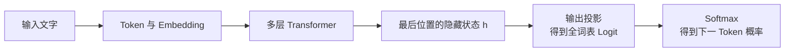
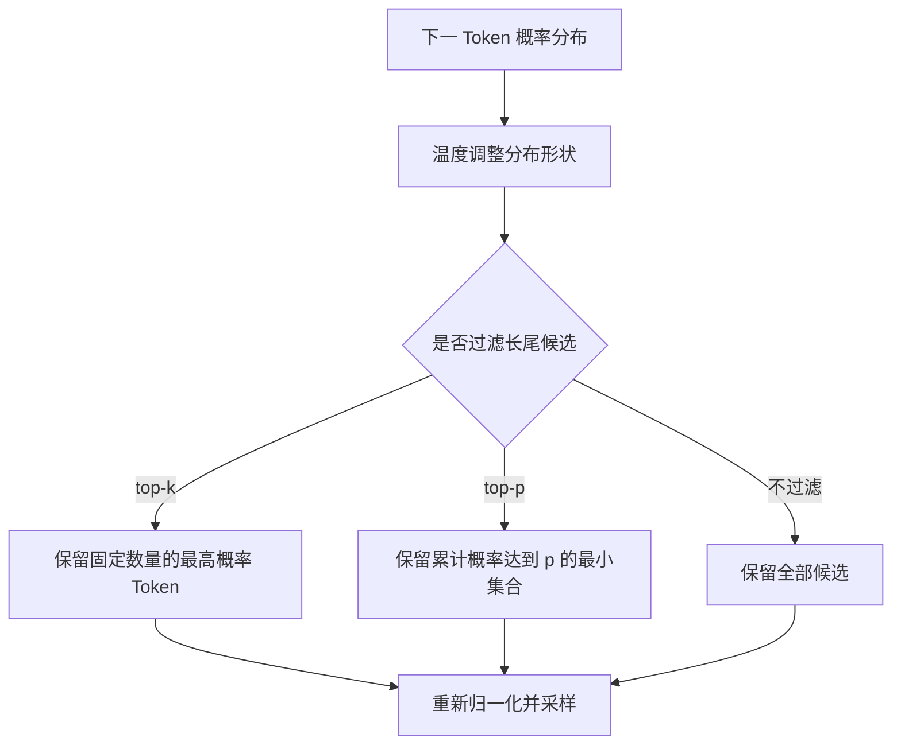
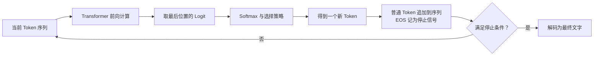
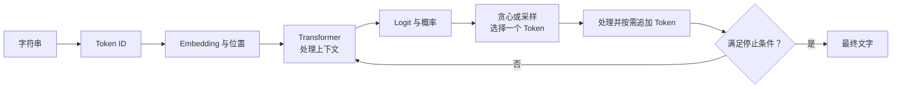

# D06：模型怎样一个接一个生成 Token？

D05 结束时，Transformer 已经为每个输入位置产生了结合上下文的隐藏状态，但隐藏状态仍是一串向量，并不是文字。要生成回答，模型必须把最后位置的隐藏状态变成全词表的 Logit，选择一个 Token，把它接回已有序列，再重复同一过程。**这就是自回归生成：每一步只预测下一个 Token，整段文本由许多步循环形成。**

## 1. 隐藏状态怎样变成下一个 Token 的概率？

继续使用“我喜欢喝”这个输入。经过 D04 的编码和 D05 的多层 Transformer 后，每个位置都有一个隐藏状态；最后位置“喝”的隐藏状态 h 已经融合了此前上下文。现在的问题是：怎样把一个 d 维向量 h 变成词表中 V 个 Token 的候选分数？

这一步通常可以抽象为一个输出投影矩阵 Wout。若 h 的维度是 d、词表大小是 V，那么 Wout 的形状为 [d,V]。为便于说明，写成带偏置的形式：

**z = hWout+b**

这里 b 是长度为 V 的偏置向量，结果 z 也是长度为 V 的向量；z 的第 j 个数 zⱼ，就是词表中第 j 个 Token 的 Logit。它与 D03 的 Logit 是同一个概念，只是现在看清了它来自 Transformer 顶部的隐藏状态。

假设教学词表只保留三个候选，输出为：

| 候选 Token | Logit z |
| --- | ---: |
| 咖啡 | 2 |
| 茶 | 1 |
| 石头 | 0 |

对整组 Logit 使用 Softmax，就得到下一 Token 的概率：

| 候选 Token | 概率 |
| --- | ---: |
| 咖啡 | 0.665 |
| 茶 | 0.245 |
| 石头 | 0.090 |

因此，从 D04 到这里的完整前向链是：

概率分布只说明模型在当前上下文下对各候选的相对倾向，还没有决定最终使用哪个 Token。选择规则将在第三节引出。

## 2. 训练时为什么不能让当前位置看到未来？

生成时，输入“我喜欢喝”之后，“咖啡”尚未出现，模型当然不能依赖它来预测“咖啡”。但训练数据通常已经包含完整句子“我喜欢喝咖啡”。如果处理“喝”这个位置时允许 Attention 直接读取右侧的“咖啡”，模型就能偷看答案，训练损失虽然很低，实际生成却无法复现这种条件。

为使训练条件与生成条件一致，生成式语言模型会限制位置 i 只能读取自己和此前位置，不能读取 i 之后的 Token。实现时通常在注意力分数进入 Softmax 前屏蔽未来位置，这叫 **因果遮罩（Causal Mask）**。

下面的表中，行表示正在计算的 Query 位置，列表示它想读取的 Key/Value 位置。✓ 表示允许读取，× 表示被遮罩：

| Query 位置 | 我 | 喜欢 | 喝 | 咖啡 |
| --- | :---: | :---: | :---: | :---: |
| 我 | ✓ | × | × | × |
| 喜欢 | ✓ | ✓ | × | × |
| 喝 | ✓ | ✓ | ✓ | × |
| 咖啡 | ✓ | ✓ | ✓ | ✓ |

这个下三角结构保证“喝”的隐藏状态无法读取右侧“咖啡”，所以用它预测“咖啡”仍是真正的下一 Token 预测。原始 Transformer 的解码器同样通过遮罩阻止位置关注后续位置。[因果遮罩来源](https://arxiv.org/abs/1706.03762)

既然每个位置都只能使用左侧上下文，一条训练序列就可以同时提供多组预测关系：

| 当前可见内容 | 训练目标 |
| --- | --- |
| 我 | 喜欢 |
| 我 喜欢 | 喝 |
| 我 喜欢 喝 | 咖啡 |
| 我 喜欢 喝 咖啡 | 结束 Token |

训练时，这些位置的隐藏状态和损失可以利用矩阵运算并行计算；“并行计算”不代表它们能互相偷看未来，因为因果遮罩已经限制了信息流。所有位置的交叉熵汇总后，梯度像 D05 所述一样反向更新 Transformer 和输出层参数。

## 3. 有了概率，怎样决定选哪个 Token？

最直接的办法是每次选择概率最大的 Token，这叫 **贪心解码（Greedy Decoding）**。在上例中，它总会选择“咖啡”。相同输入和参数通常得到相同选择，但每一步只选择当前最优候选，不保证整段序列一定是全局最优，也容易让输出缺少变化。

另一种办法是把概率当作抽签比例进行随机选择，这叫 **采样（Sampling）**。概率 0.665 的“咖啡”更容易被选中，但概率 0.245 的“茶”也有机会出现。同一输入多次生成可能不同。采样不是“无视概率随机乱选”，而是高概率 Token 更常被选中。

在采样前，可以先用 **温度（Temperature）**调整分布。设原 Logit 为 zⱼ、温度为 T>0，计算概率时改为：

**pⱼ(T) = exp(zⱼ/T) / Σₖexp(zₖ/T)**

写成 zⱼ/T 的目的，是控制候选之间的差距。沿用 Logit (2,1,0)：

| 温度 T | 调整后的 Logit | 大致概率 | 效果 |
| ---: | --- | --- | --- |
| 0.5 | (4,2,0) | (0.867,0.117,0.016) | 分布更尖锐，更偏向第一名 |
| 1 | (2,1,0) | (0.665,0.245,0.090) | 保持原分布 |
| 2 | (1,0.5,0) | (0.506,0.307,0.186) | 分布更平坦，选择更多样 |

因此，**低温度通常降低随机性，高温度通常增加随机性，但温度不会修正模型不知道的事实。**当 T 趋近 0 时分布会极度集中；实际系统通常直接用贪心规则表达完全确定的选择，而不是把 T 设置为 0，因为公式要求 T>0。

## 4. 为什么采样前还要过滤候选？

大词表中可能有许多概率很低但并非严格为 0 的 Token。如果完全按原分布采样，这些长尾候选偶尔会被选中，使文本突然偏离。我们需要保留合理的不确定性，同时排除明显不合适的尾部候选。

**Top-k** 固定保留概率最高的 k 个 Token，其余候选不参与本次采样。例如概率为 (0.50,0.25,0.15,0.07,0.03) 时，top-k=2 只保留前两个，再把 0.50 和 0.25 重新归一化后抽样。

固定数量并不总适合：有时两个候选已经占据绝大多数概率，有时需要更多候选才能覆盖合理答案。**Top-p（Nucleus Sampling）**因此改为保留累计概率至少达到 p 的最小候选集合。对同一分布使用 top-p=0.8：前两个累计为 0.75，尚未达到 0.8；加入第三个后累计为 0.90，所以保留前三个，再重新归一化采样。

Top-p 中的 p 是**累计概率阈值**，不是“每个 Token 的最低概率”。Top-k 与 top-p 可以单独使用，也可以组合；具体系统对 Logit 处理和过滤的先后细节可能不同，本章只需要掌握它们各自解决的问题。Hugging Face Transformers v5.6.2 的[生成策略文档](https://huggingface.co/docs/transformers/v5.6.2/en/generation_strategies)展示了贪心和采样策略；接口细节核对日期为 2026-09-15。

## 5. 为什么生成整段文字必须循环？

假设“我喜欢喝”第一次选择出“咖啡”。模型并没有一次生成后面的整句话，而是把新 Token 接到已有序列：

**[我,喜欢,喝] → 预测“咖啡” → [我,喜欢,喝,咖啡]**

新序列再次经过模型，最后位置产生新的概率分布，再选择下一个 Token。若下一步选择“。”，序列变成 [我,喜欢,喝,咖啡,。]。每一步的输入都包含此前已生成结果，因此第 t 步的选择会改变第 t+1 步看到的上下文和概率，这种循环称为 **自回归生成（Autoregressive Generation）**。

生成阶段通常只使用训练好的参数做前向计算，**不会因为当前回答被生成出来就更新模型权重**。循环中变化的是 Token 序列和相应的中间状态，而不是 WQ、WK、WV 等模型参数。为了避免每一步重复计算所有旧 Token，推理系统会缓存部分注意力中间结果；这就是后续 D14 要讲的 KV Cache，本章暂不展开。

## 6. 模型什么时候停止生成？

如果循环没有退出条件，模型可以一直继续预测。常见停止来源有三类：

- 模型选择了专门表示序列结束的 **EOS（End of Sequence）Token**。
- 系统达到了允许生成的最大新 Token 数或上下文容量限制。
- 应用检测到约定的停止字符串、结构完成条件或其他业务规则。

EOS 本身也在词表中，也有 Token ID。训练文本会让模型学习在合适位置提高 EOS 的概率；生成时一旦选中它，系统通常停止循环而不把 EOS 显示给用户。但最大长度和应用停止条件来自生成系统，不是模型“理解自己已经回答完整”的可靠证明。

停止过早可能得到残缺回答，停止过晚可能产生重复或无关内容。生成质量因此不仅由模型参数决定，也受到选择策略和停止规则影响。不过，这些设置只能改变模型怎样从已有概率中选择，**不能凭空补充模型参数中没有形成的知识和能力。**

## 7. 从输入到输出的完整生成链

现在，大模型的一次基本文本生成已经能够从头串起来：Tokenizer 把文字变成 Token ID，Embedding 和位置信息形成输入表示，多层 Transformer 产生上下文化隐藏状态，输出投影得到 Logit，Softmax 得到概率，选择策略产生一个 Token，再追加并重复，直到命中停止条件。

需要特别区分两条路径：**训练时**，完整文本在因果遮罩下并行产生多个位置的损失，再反向更新参数；**生成时**，模型使用固定参数一次选择一个 Token，不做参数更新。这一区分也解释了为什么“调整温度”不是重新训练模型。

D04～D06 至此完成“文字怎样进入模型、怎样结合上下文、怎样逐步输出”的拼图。但这些参数为什么已经能够预测语言、事实和常见模式？D07 将转向模型准备阶段，解释预训练数据和下一 Token 训练目标怎样形成基础模型能力。

## 助记卡片

**卡片 1：隐藏状态怎样变成全词表的 Logit？**

> **答案：** 最后位置的隐藏状态 h 经过输出投影 z=hWout+b，得到长度等于词表大小的 Logit 向量。

**卡片 2：因果遮罩解决什么问题？**

> **答案：** 它阻止当前位置读取未来 Token，避免训练时偷看预测目标，使训练和实际生成使用相同的可见上下文条件。

**卡片 3：训练可以并行计算多个位置，为什么不等于看到了未来？**

> **答案：** 并行只是同时执行矩阵计算；因果遮罩仍限制每个位置只能从自己及左侧位置读取信息。

**卡片 4：贪心解码与采样有什么区别？**

> **答案：** 贪心解码总选当前概率最大的 Token；采样按概率随机选择，高概率候选更容易被选中，但结果可能变化。

**卡片 5：温度 T 变小通常会怎样改变概率分布？**

> **答案：** Logit 除以更小的正数后差距扩大，Softmax 分布通常更尖锐，选择更集中于高概率 Token。

**卡片 6：Top-k 与 Top-p 的筛选标准分别是什么？**

> **答案：** Top-k 固定保留概率最高的 k 个候选；Top-p 保留累计概率达到阈值 p 的最小高概率候选集合。

**卡片 7：什么是自回归生成？**

> **答案：** 模型每次根据当前全部可见 Token 预测一个新 Token，将其追加后再次预测，循环形成完整序列。

**卡片 8：生成一段回答时会更新 WQ、WK、WV 吗？**

> **答案：** 通常不会。生成阶段使用训练好的固定参数做前向计算，变化的是序列与中间状态。

**卡片 9：生成循环常见的停止条件有哪些？**

> **答案：** 选中 EOS、达到最大长度或上下文限制，以及命中应用定义的停止字符串或结构条件。

## 自测题

1. 隐藏状态 h 的维度为 d，词表大小为 V。输出投影矩阵 Wout 的形状是什么？hWout 得到的结果表示什么？
2. 训练句子为“我喜欢喝咖啡”。为什么预测“咖啡”的位置不能读取“咖啡”本身？因果遮罩怎样阻止这种泄漏？
3. 对 Logit (2,1,0)，温度从 1 降为 0.5 时，为什么概率会更集中？请写出调整后的 Logit。
4. 某次下一 Token 概率为 (0.50,0.25,0.15,0.07,0.03)。top-k=2 保留哪些位置？top-p=0.8 保留哪些位置？
5. 为什么“采样”不等于在整个词表中等概率乱选？贪心与采样分别会怎样影响重复生成的结果？
6. 从输入“我喜欢喝”开始，按顺序描述模型生成“咖啡。”的两轮自回归循环。
7. 为什么调整温度、Top-k 或 Top-p 不等于重新训练模型，也不能保证修正事实错误？
8. 对比训练与生成：两者是否都使用因果上下文？是否都一次处理多个位置？是否都会更新参数？

完成后再看[参考答案](quiz-answers.md)。返回[知识地图](../../../knowledge-map.md)，或回顾[D05](../d05-attention-transformer/README.md)。
