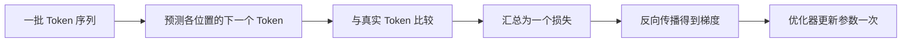
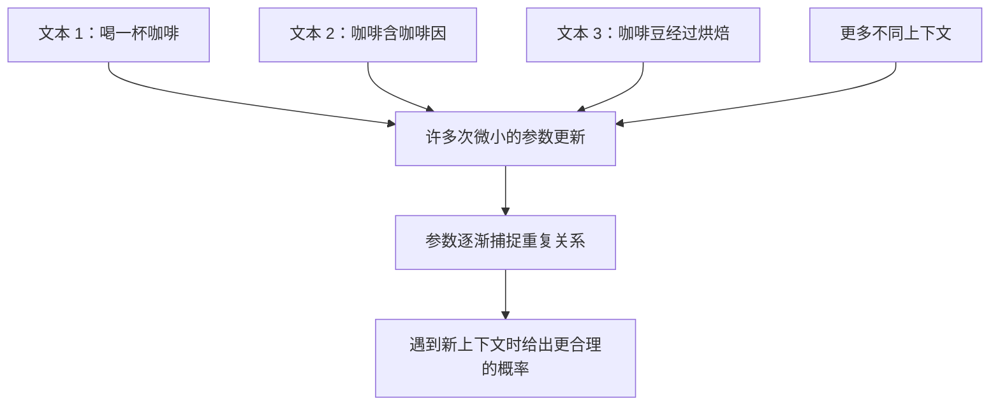
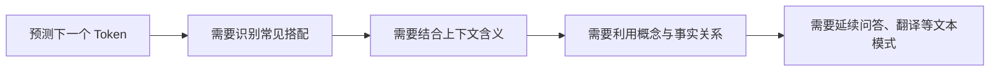
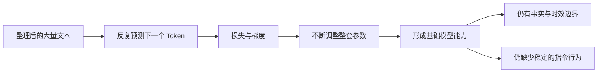

# D07：基础模型的能力从哪里来？

D06 讲的是一个已经训练好的模型怎样生成文字。现在把时间倒回训练开始前：Transformer 的参数是随机的，输入“我喜欢喝”，它可能认为“石头”比“咖啡”更适合作为下一个 Token。**预训练要做的事情，就是让模型做大量“猜下一个 Token”的题，每次猜错后稍微调整参数，最终从无数次调整中形成语言和知识模式。**

## 1. 先看模型怎样从“不会”变得“会一点”

假设训练文本中有一句“我 喜欢 喝 咖啡”。这句话不只是让模型完整阅读一遍，而是可以错开一个位置，变成连续的预测题：

| 模型当前能看到的内容 | 应该预测的下一个 Token |
| --- | --- |
| 我 | 喜欢 |
| 我 喜欢 | 喝 |
| 我 喜欢 喝 | 咖啡 |
| 我 喜欢 喝 咖啡 | EOS |

以第三行为例，模型只能看到“我 喜欢 喝”。它经过 Transformer 计算后，为整个词表给出概率：也许“茶”是 0.5，“咖啡”只有 0.2。训练数据已经告诉我们正确答案是“咖啡”，因此可以计算这次预测有多差，再按照 D02 学过的梯度调整参数。调整后，模型下一次遇到相似上下文时，通常会稍微提高“咖啡”一类合理 Token 的概率。

这里不需要人工额外标注每一道题，因为**文字右侧原本存在的 Token 就是答案**。训练目标由数据自身产生，这种学习方式叫**自监督学习（Self-supervised Learning）**。“自监督”不是模型自己决定答案，而是监督答案可以从原始数据自动构造。

## 2. 一次训练到底发生了什么？

模型不会只根据“咖啡”这一题更新。实际训练会取一批 Token 序列，并同时计算其中许多位置的下一 Token 预测。D06 的因果遮罩保证每个位置只能读取自己和左侧内容，所以即使多个位置一起计算，也没有偷看右侧答案。

下面是一批数据完成一次参数更新的完整过程：

这次完整过程通常叫一个**训练步（Training Step）**。其中没有新的魔法：

- D04 的 Token 和 Embedding 负责把文字送进模型。
- D05 的 Transformer 负责结合左侧上下文。
- D06 的输出层给出下一 Token 概率。
- D03 的交叉熵衡量预测与正确答案的差距。
- D02 的反向传播和优化器负责更新参数。

如果正确 Token 是 t，模型给它的概率是 pₜ，那么该位置的损失仍是 **L = −ln(pₜ)**。pₜ 越小，损失越大；训练就会产生更强的纠错信号。多个位置的损失会被汇总后再反向传播，本章不需要额外记忆批次损失公式。**预训练只是把前面几章的机制放进一个规模很大的重复循环。**

## 3. 做一道题，为什么不能让模型真正学会？

假设模型只见过一次“我喜欢喝咖啡”。它可能只是针对这段上下文发生了一次很小的参数变化，既不能稳定记住这句话，也不能因此理解咖啡。真正重要的是：相似规律会在不同文本和不同上下文中反复出现。

例如，训练数据可能包含：

- “早晨喝了一杯咖啡。”
- “咖啡中通常含有咖啡因。”
- “相比咖啡，他更喜欢喝茶。”
- “咖啡豆经过烘焙后会产生不同风味。”

这些句子的字面内容不同，却反复建立“喝—咖啡”“咖啡—咖啡因”“咖啡—豆—烘焙”等关系。每当这些关系有助于预测下一个 Token，梯度就会调整 Attention、FFN、Embedding 等大量参数。**一次更新只改变一点；许多相关文本从不同方向反复推动参数，稳定的规律才逐渐沉淀下来。**

这也解释了“训练一次”和“模型已经掌握”之间的差别。单个样本提供一次局部纠错，能力来自大量样本与大量训练步的共同作用。

## 4. 只猜下一个 Token，为什么会形成语言和知识能力？

乍看之下，“猜下一个 Token”像一道很浅的题。但要在不同文本中持续猜对，模型必须利用越来越复杂的线索。

如果要补全“他每天早上喝一杯……”，常见搭配已经有帮助；如果要补全“法国的首都是……”，模型需要利用训练数据中反复出现的事实关系；如果前文要求“把下面内容翻译成英文”，模型还需要识别任务形式并延续正确语言。**训练目标始终只有下一 Token 预测，但做好这个目标所需的内部规律并不简单。**

因此，模型直接学到的不是一组人工编写的规则，而是“在什么上下文中，哪些 Token 更可能出现”。为了让这种概率判断在海量文本上都更准确，模型内部逐渐形成对语法、语义、概念关系和部分任务模式有用的表示。GPT-3 的研究展示了扩大自回归语言模型后，模型可以仅根据文本说明或少量示例完成多种任务，但论文也记录了明显失败。[GPT-3 论文](https://arxiv.org/abs/2005.14165)

## 5. 模型把知识存成了一张数据库吗？

仍以“法国的首都是巴黎”为例。数据库可以保存一条明确记录，并返回来源和更新时间；语言模型训练时只收到“怎样调整参数才能让后续 Token 概率更合理”的信号。这个关系会与其他语言规律一起，**分散地影响许多参数**，而不是落入一个可以直接查看的“法国→巴黎”单元格。

所以输入“法国的首都是”，模型可能给“巴黎”很高概率，但这不等于它执行了一次数据库查询。训练数据若互相冲突、某项事实很少出现、问题超出训练时间范围，模型仍可能给错误 Token 较高概率。更关键的是：无论是否确定，它的生成机制都会继续选择下一个 Token。

**模型中的知识更像从大量文本中压缩出的预测规律，不像带来源、版本和一致性约束的事实表。**这个区别解释了为什么回答可以既流畅又错误，也解释了后续为什么还需要 RAG 和外部工具。

## 6. 模型变强是否只需要增加参数？

参数更多，模型有机会表示更复杂的规律，但能力还取决于它看到了什么以及得到了多少训练。可以把预训练理解为三个条件必须配合：

| 条件 | 它提供什么 | 条件不足时会怎样 |
| --- | --- | --- |
| 模型参数 | 表示复杂规律的容量 | 容量太小，很多模式难以同时容纳 |
| 训练数据 | 可供学习的语言、事实和任务模式 | 覆盖不足或质量差，学习信号会缺失或被扭曲 |
| 训练计算 | 让数据真正推动参数更新的机会 | 训练不足，已有容量和数据没有被充分利用 |

因此，**参数量大不等于必然更强**。如果只扩大模型，却没有匹配的数据和计算，新增参数可能没有被充分训练。Chinchilla 研究也表明，在给定计算预算下，模型大小与训练 Token 数需要合理配合。[Chinchilla 论文](https://arxiv.org/abs/2203.15556) 本章不要求记具体比例，只需记住“参数、数据、计算共同决定训练结果”。

## 7. 预训练结束后，为什么还不是一个可靠助手？

预训练让模型擅长延续训练数据中的文本，却没有直接规定“看到用户请求就必须准确、有帮助并按格式回答”。基础模型看到“请总结以下文章”，可能生成总结，也可能续写出新的问题或网页片段；从文本补全角度看都可能合理，从助手角度看却不一定合格。

基础模型还有四个直接来自训练方式的边界：

- **知识可能过时。** 普通生成不会自动知道训练结束后发生的事情。
- **流畅不代表真实。** 下一 Token 很合理，不代表整句话有事实依据。
- **能力覆盖不均匀。** 训练数据稀少的语言、领域和罕见情况更容易出错。
- **会续写不等于会听指令。** 预训练目标没有专门定义理想助手行为。

至此，D07 的主线可以压缩成一句话：**文本自动提供预测答案，错误产生梯度，大量相似规律经过许多次微小更新沉淀进参数，于是形成基础能力。**D08 接着解决最后一个缺口：怎样用指令示例和人类偏好，把“会续写”的基础模型进一步调整成“更会按要求回答”的模型。

## 助记卡片

**卡片 1：预训练最核心的重复任务是什么？**

> **答案：** 根据左侧上下文预测真实的下一个 Token，并在预测有误时更新参数。

**卡片 2：为什么下一 Token 训练不需要人工逐题标注？**

> **答案：** 原始文本中右侧真实存在的 Token 就是答案，可以从序列本身自动构造监督目标。

**卡片 3：一个训练步包含哪些关键过程？**

> **答案：** 对一批序列前向预测、汇总损失、反向传播得到梯度，再由优化器更新一次参数。

**卡片 4：训练并行计算多个位置，为什么不算偷看答案？**

> **答案：** 因果遮罩仍限制每个位置只能读取自己和左侧 Token；同时计算不会改变信息可见范围。

**卡片 5：为什么一个训练样本不能让模型真正掌握规律？**

> **答案：** 单个样本通常只产生一次局部且微小的更新，稳定规律要靠许多相关上下文反复推动参数形成。

**卡片 6：下一 Token 预测为什么能形成更广泛的能力？**

> **答案：** 要在多样文本中持续预测准确，模型必须捕捉语法、上下文含义、概念关系和任务模式。

**卡片 7：模型参数中的知识与数据库记录有什么区别？**

> **答案：** 模型把关系分散编码为预测规律，没有数据库记录天然具备的明确来源、时间和一致性约束。

**卡片 8：预训练能力只由参数量决定吗？**

> **答案：** 不是，模型容量、数据数量与质量、训练计算及其配合共同影响结果。

**卡片 9：为什么基础模型不一定稳定遵循指令？**

> **答案：** 预训练直接优化文本续写，没有专门把准确、有帮助且按用户要求回答设为目标。

## 自测题

1. 把“机器 学习 改变 世界”变成前三道下一 Token 预测题，并说明答案从哪里来。
2. 模型看到“我 喜欢 喝”时给正确答案“咖啡”的概率很低。一次训练步怎样把这个错误转成参数变化？
3. 为什么训练可以同时计算多个位置，又能保证每个位置没有看到右侧答案？
4. 同一个模型反复看到“咖啡—饮品”“咖啡—咖啡因”“咖啡豆—烘焙”等文本时，为什么比只看到一句话更可能形成可泛化的关系？
5. 只优化下一 Token 预测，为什么模型仍可能逐渐具备翻译、问答等能力？
6. 为什么“模型正确回答法国首都”不能证明它像数据库一样存储并查询事实？
7. 判断并解释：“模型参数扩大十倍，其他条件不变，能力就一定更强。”
8. 用一句因果链解释基础模型能力怎样形成，并指出它为什么仍可能不按指令回答。

完成后再看[参考答案](quiz-answers.md)。返回[知识地图](../../../knowledge-map.md)，或继续[D08](../d08-post-training/README.md)。
