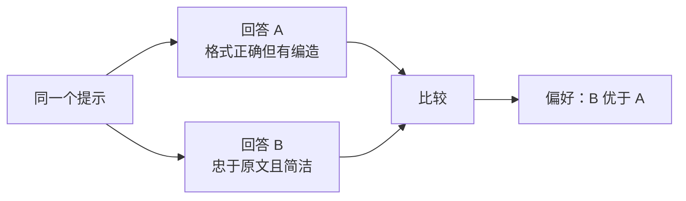
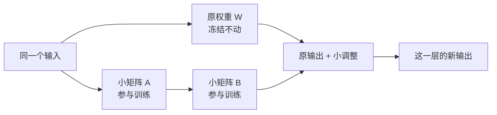

# D08：怎样让模型更适合指令和任务？

D07 结束时，基础模型已经能流畅续写文字，但“会续写”不等于“会按要求回答”。如果输入“请把这篇文章总结成三点”，基础模型可能写出总结，也可能继续仿写文章或生成另一个问题。要把它变成更像助手的模型，需要在预训练之后继续调整行为，这个阶段统称为**后训练（Post-training）**。

本章始终使用“三点总结”这个例子。先看模型怎样学会做任务，再看它怎样学会区分回答质量，最后再解决一个独立问题：模型太大时，怎样用较少参数完成这些调整。

## 1. 怎样让模型先学会按照指令回答？

最直接的办法，是给模型看大量“输入是什么、理想回答是什么”的完整示范：

| 给模型的指令 | 希望模型继续生成的回答 |
| --- | --- |
| 请把这篇文章总结成三点 | 严格依据文章、恰好包含三点的总结 |
| 请用一句话解释咖啡因 | 一句简明且有边界的解释 |
| 信息不足时不要猜测 | 说明缺少哪些信息 |

训练“三点总结”这个样本时，模型先看到指令和原文，然后逐 Token 预测示范回答。若示范回答以“第一点”开头，而模型却给“下面继续介绍”更高概率，就用交叉熵和梯度调整参数。经过许多类似示范，模型逐渐学会：看到总结指令后，应提取原文内容并按指定格式作答。

这种用**指令和理想回答**继续训练模型的方法叫**监督微调（Supervised Fine-tuning，SFT）**。它并没有发明一种全新的学习机制，仍然使用 D07 的“预测 → 损失 → 梯度 → 参数更新”；改变的是训练材料，从普通文本变成了专门展示理想行为的样本。

可以把 SFT 记成一句话：**示范回答是在告诉模型“这类任务应该怎么做”。**但同一道题可能有很多合格答案，单个示范很难表达哪个更简洁、更可靠，这就需要第二种信号。

## 2. 两个回答都像答案，怎样告诉模型哪个更好？

对同一篇文章，模型生成了两个三点总结：

- 回答 A 的确有三点，但加入了原文没有的推测。
- 回答 B 也有三点，而且更忠于原文、表达更简洁。

让标注者重新写一份“唯一标准答案”并不容易，但判断 **B 优于 A** 相对简单。这种数据称为**偏好数据（Preference Data）**：同一个提示配有较优回答和较差回答，训练信号不是“只能这样写”，而是“以后应当更倾向前一种回答方式”。

因此，SFT 和偏好数据提供的信息不同：**SFT 给模型看一个应该模仿的答案；偏好数据让模型比较多个答案之间的质量取舍。**偏好可能涉及帮助性、真实性、安全性、简洁程度或风格，但这些标准必须由具体训练规范决定，并非天然客观一致。

## 3. “B 优于 A”怎样真正改变模型？

只有一条比较结果，还不能直接告诉模型每个 Token 应该怎样改。实践中有不同方法把偏好变成可优化的损失，本章只区分两条代表性路线。

第一条路线先训练一个**奖励模型（Reward Model）**。它学习人类给出的比较，之后可以给新回答打一个分数。语言模型生成回答，奖励模型负责打分，再用强化学习调整语言模型，使高分回答更容易出现。这条路线称为**基于人类反馈的强化学习（Reinforcement Learning from Human Feedback，RLHF）**。

奖励模型可以对没被人工逐条比较的新回答提供分数，但整条训练链比较复杂，而且语言模型可能找到“骗取高分”而非真正改善回答的方式，所以通常还要限制它不要偏离原模型过远。InstructGPT 展示的流程就是先做 SFT，再训练奖励模型，最后使用强化学习调整模型。[InstructGPT 论文](https://arxiv.org/abs/2203.02155)

第二条路线跳过“先训练独立奖励模型、再做强化学习”这两个阶段，直接拿“B 优于 A”的偏好对训练语言模型，让 B 的相对可能性提高、A 的相对可能性降低。**直接偏好优化（Direct Preference Optimization，DPO）**是这种路线的一种方法。[DPO 论文](https://arxiv.org/abs/2305.18290)

| 路线 | 偏好怎样进入训练 | 当前只需记住什么 |
| --- | --- | --- |
| 经典 RLHF | 偏好先训练奖励模型，再由奖励驱动强化学习 | 中间有一个负责打分的奖励模型 |
| DPO | 偏好对直接形成语言模型的训练目标 | 不需要独立奖励模型和强化学习阶段 |

**RLHF 和 DPO 都能利用回答偏好，但 DPO 本身不是强化学习。**“偏好优化”是更大的类别，RLHF 只是其中一条路线。

## 4. 到这里，模型经历了哪三次变化？

把 D07 和本章前三节放在一起，模型的变化就清楚了：

三阶段的训练都可能修改同一个 Transformer，但训练信号不同：

| 阶段 | 数据在告诉模型什么 | 主要补上的缺口 |
| --- | --- | --- |
| 预训练 | 真实文本通常怎样继续 | 从随机参数形成广泛基础能力 |
| SFT | 看到某类指令时应该怎样回答 | 从文本续写转向基本指令遵循 |
| 偏好优化 | 多个回答中哪一个更符合期望 | 学习单个示范难以表达的质量取舍 |

偏好优化通常建立在已经具备基础能力和基本指令行为的模型之上。它更像调整模型已有能力的使用方式，而不是凭空教会模型一个此前完全不会的复杂领域。

## 5. 模型这么大，每次都要修改全部参数吗？

前四节回答的是“模型根据什么数据学习”。现在出现另一个问题：一个大模型可能有大量参数，若每个任务都更新并保存一整套权重，训练和存储成本会很高。最直接的做法确实是更新全部可训练参数，这叫**全量微调（Full Fine-tuning）**；但并非每次都必须如此。

可以冻结原来的大权重，只为某些层增加一小组可训练参数。模型计算时，原权重继续提供已有能力，这组小参数只负责学习“应该改多少”。这种方法叫**参数高效微调（Parameter-Efficient Fine-tuning，PEFT）**。

**低秩适配（Low-Rank Adaptation，LoRA）**是常见的 PEFT 方法。假设某层原权重是 W，LoRA 不直接修改 W，而是学习一个较小的增量 ΔW，使用时得到：

**新权重效果 = 原权重 W + 小增量 ΔW**

LoRA 又把 ΔW 拆成两个较小矩阵 A 和 B 的乘积：**ΔW = BA**。这样做不是为了改变训练目标，而是为了用更少的可训练数字表示这次调整。[LoRA 论文](https://arxiv.org/abs/2106.09685)

例如，一个 1024×1024 的完整矩阵有 1,048,576 个参数。如果 LoRA 选择中间宽度 r=8，可以用 8×1024 和 1024×8 两个矩阵表达增量，共 16,384 个参数，是完整矩阵参数量的 1/64。这个例子只说明参数量为何减少，不代表所有 LoRA 配置都固定使用 r=8，也不代表整个模型的训练开销恰好降低 64 倍。

## 6. 为什么“SFT 还是 LoRA”这个问题问错了？

SFT 与 LoRA 看似都是微调术语，实际回答两个不同问题：

- **SFT、RLHF、DPO：用什么训练信号？**它们决定为什么产生梯度。
- **全量微调、LoRA：允许哪些参数变化？**它们决定梯度最终更新哪里。

因此可以用 LoRA 做 SFT，也可以用 LoRA 做 DPO；也可以对同样的 SFT 数据进行全量微调。下面的组合图比记术语更重要：

| 训练信号 | 全量更新参数 | 只训练 LoRA 增量 |
| --- | --- | --- |
| 指令与示范回答 | 全量 SFT | LoRA SFT |
| 较优与较差回答 | 全量 DPO | LoRA DPO |

所以听到“这个模型用了 LoRA”，只能知道它**怎样更新参数**，还不知道它用什么数据、在学习什么行为；听到“这个模型做了 SFT”，只能知道它**根据什么示范学习**，还不知道更新了全部参数还是 LoRA 参数。

## 7. 哪些问题不应该只靠微调解决？

后训练可以让行为更加稳定，但它不能解决所有问题。选择方案前，先判断需求到底是一次请求、长期行为还是外部知识：

| 需求 | 更直接的方向 | 为什么 |
| --- | --- | --- |
| 只要求这一次回答采用某种格式 | 提示词和上下文 | 无需修改参数，D09 将展开 |
| 希望许多请求都稳定遵循某种任务行为 | SFT 或偏好优化 | 行为倾向需要跨请求保持 |
| 算力有限但确实需要改变参数 | LoRA 等 PEFT | 减少需要训练和保存的参数 |
| 内部资料经常变化并且回答要附出处 | RAG | 资料可以独立更新和检索，D10～D11 将展开 |

微调不能保证事实绝对正确，也不会自动知道训练之后发生的事情；低质量 SFT 或偏好数据还可能把错误倾向写入参数。**后训练主要调整“模型怎样使用已有能力”，不是把模型变成永远正确的知识库。**

本章可以压缩成两条线：**预训练形成基础能力，SFT 和偏好优化调整行为；全量微调与 LoRA 决定修改参数的范围。**下一章将从更轻量的方式开始：完全不改参数，怎样通过提示词和上下文影响当前一次回答。

## 助记卡片

**卡片 1：为什么预训练后的基础模型还需要后训练？**

> **答案：** 预训练主要学习文本怎样继续，没有专门要求模型稳定执行用户指令并符合回答偏好。

**卡片 2：SFT 用什么数据教模型？**

> **答案：** 使用“指令和理想回答”示范，让模型学习看到这类指令后应该怎样生成回答。

**卡片 3：偏好数据比单个示范多提供了什么信息？**

> **答案：** 它比较同一提示下多个回答的相对优劣，表达简洁、忠实、安全等质量取舍。

**卡片 4：经典 RLHF 为什么需要奖励模型？**

> **答案：** 奖励模型先从人类比较中学习打分，再为新回答提供可用于强化学习的奖励信号。

**卡片 5：DPO 与经典 RLHF 的流程差别是什么？**

> **答案：** DPO 直接用偏好对训练语言模型，不需要独立奖励模型和强化学习阶段。

**卡片 6：SFT 与偏好优化分别补什么缺口？**

> **答案：** SFT 教基本任务行为；偏好优化进一步教多个可行回答之间的质量取舍。

**卡片 7：LoRA 为什么能减少可训练参数？**

> **答案：** 它冻结原权重，只用两个较小矩阵的乘积表示需要学习的权重增量。

**卡片 8：SFT 与 LoRA 是互斥方案吗？**

> **答案：** 不是。SFT 决定训练信号，LoRA 决定参数更新范围，两者可以组合。

**卡片 9：为什么经常变化且需要出处的知识不适合只靠微调？**

> **答案：** 写入参数需要重新训练且难以精确追踪来源，这类知识更适合通过可更新、可检索的外部资料提供。

## 自测题

1. 基础模型能续写文章，却不稳定执行“三点总结”。为什么这与预训练目标并不矛盾？
2. 围绕“三点总结”，分别写出一个 SFT 样本应包含什么，以及一条偏好数据应包含什么。
3. SFT 已经有理想回答，为什么还可能需要偏好数据？
4. 按顺序说明经典 RLHF 怎样把人类比较变成语言模型的参数变化。奖励模型承担什么作用？
5. 判断并解释：“DPO 使用偏好数据，所以 DPO 就是强化学习。”
6. 一个 1024×1024 的权重矩阵使用 r=8 的 LoRA。两个小矩阵各是什么形状，共有多少参数？与完整矩阵相比是多少？
7. 为什么不能在 SFT 和 LoRA 之间二选一？请分别说明它们回答的问题。
8. 公司要求模型使用每天更新的知识库回答，并附文档来源。为什么不应只依赖微调？后续更适合学习哪个方向？

完成后再看[参考答案](quiz-answers.md)。返回[知识地图](../../../knowledge-map.md)，或回顾[D07](../d07-pretraining/README.md)。
