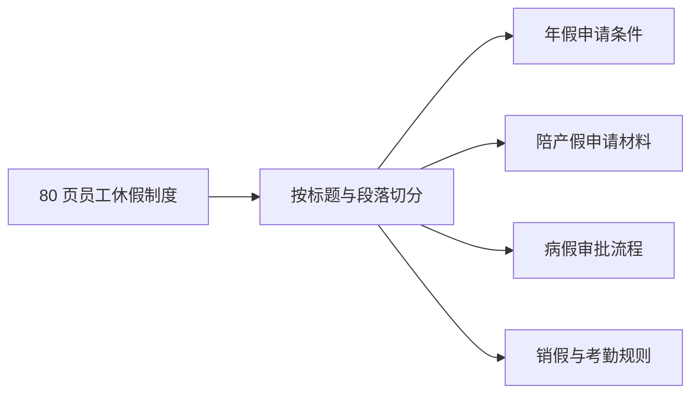
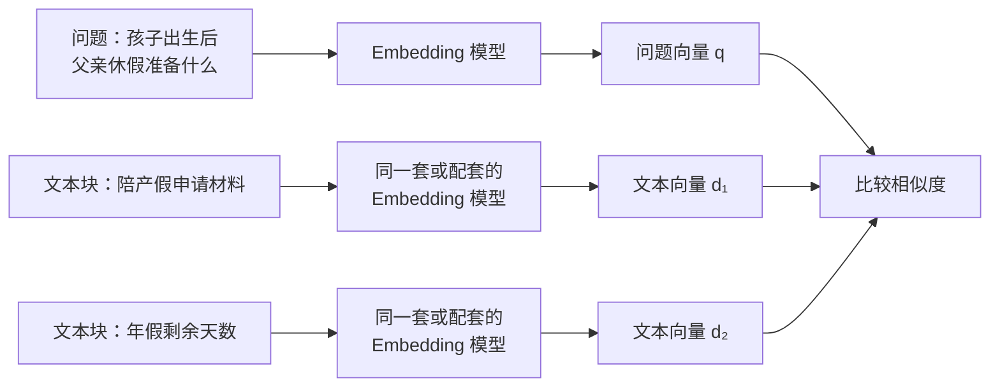
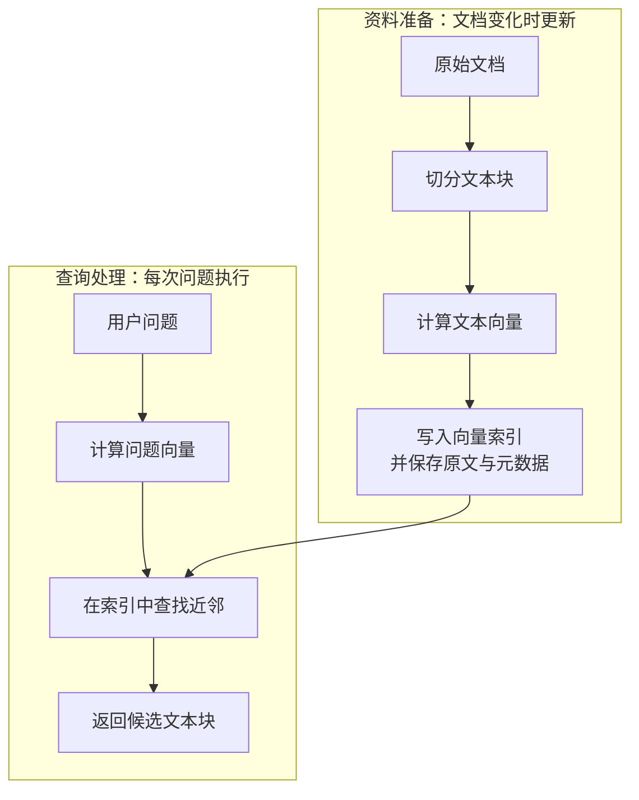
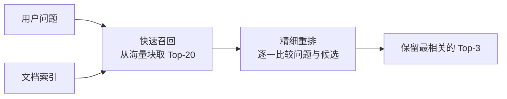

# D10：怎样从大量资料中找到相关内容？

D09 说明了：把一小段公司制度放入当前上下文，模型就能依据它回答。但如果公司有几千份文档，每次都把全部内容塞进上下文，既会超过窗口，也会让无关信息干扰回答。现在需要先完成一个更小的任务：用户问“员工请陪产假需要哪些材料？”时，**从大量资料中找到最可能包含答案的少数片段。这个过程叫检索（Retrieval）。**

## 1. 为什么不能直接按整篇文档查找？

假设《员工休假制度》有 80 页，其中只有一段列出陪产假材料。如果把整篇文档作为一个结果，它虽然相关，却携带大量无关内容；如果只搜索文档标题，“陪产假需要哪些材料”又未必与“员工休假制度”共享足够关键词。因此，建立检索库前通常先把长文档拆成较短、能够独立表达一个局部意思的**文本块（Chunk）**。

切分不是简单追求越短越好。块太大，会混入多个主题并浪费上下文；块太小，“出生证明”和“申请陪产假”可能被分到两块，单块失去完整含义。实际系统常结合标题、段落、句子或固定长度切分，并让相邻块保留少量重复内容，这叫**重叠（Overlap）**，用来降低关键信息恰好被边界切断的风险。

每个文本块还应保留来源文档、章节标题、更新时间、权限范围等**元数据（Metadata）**。正文负责匹配问题，元数据则帮助过滤、展示出处和判断版本。至此我们得到许多候选文本块，但还不知道怎样衡量问题与文本块是否相关。

## 2. 关键词不同，怎样仍然找到意思相近的片段？

最直观的搜索依赖关键词重合。如果用户问“陪产假要交什么证明”，文档写的是“申请材料包括新生儿出生医学证明”，双方仍有“陪产假”这个共同词，关键词检索可能找到它；但用户若问“孩子出生后父亲休假需要准备什么”，字面重合明显减少，相关段落可能排得很后。

为比较文字表达的含义，可以使用一个专门的**Embedding 模型**，把问题和每个文本块分别转换成固定长度的向量。这类向量称为**检索向量或文本向量**：意思接近的文本，希望在向量空间中也更接近。

这里的 Embedding 与 D04 的 Token Embedding 有联系，但用途不同。D04 的 Token Embedding 是生成模型内部每个 Token 的初始表示；这里需要的是能代表**整段问题或文本块**、便于跨文本比较的向量。检索所用的 Embedding 模型也不必与最后负责回答的生成模型相同。

Dense Passage Retrieval 展示了将问题和段落编码为稠密向量，再用向量相似度检索段落的典型路线。[DPR 论文](https://arxiv.org/abs/2004.04906) “稠密”表示向量的大量维度都可以取非零值，与主要依赖词项出现情况的稀疏关键词表示相对。

## 3. 两个向量怎样比较“接近”？

得到问题向量和文本向量后，需要一个分数排序候选。常见方法之一是**余弦相似度（Cosine Similarity）**，它比较两个向量方向是否接近，而不是直接比较文字。

设问题向量为 q，某个文本块向量为 d。为了消除向量长度对点积的影响，用两者的点积除以各自长度：

**sim(q,d) = (q·d) / (‖q‖‖d‖)**

这里 q·d 是向量点积，‖q‖ 和 ‖d‖ 分别是两个向量的长度，sim(q,d) 是相似度分数。使用这个公式的目的，是让方向越一致的向量得到越高分。对非零向量，余弦相似度范围是 −1 到 1；越接近 1，方向越相似。

用一个二维教学例子理解即可。问题向量 q=(1,0)，三个文本块向量分别为：

| 文本块 | 向量 | 与 q 的余弦相似度 | 排序 |
| --- | --- | ---: | ---: |
| 陪产假申请材料 | d₁=(0.9,0.1) | 约 0.994 | 1 |
| 新生儿福利办理 | d₂=(0.7,0.7) | 约 0.707 | 2 |
| 年假余额查询 | d₃=(0,1) | 0 | 3 |

以 d₁ 为例，q·d₁=0.9，‖q‖=1，‖d₁‖=√(0.9²+0.1²)≈0.906，所以相似度约为 0.9/0.906≈0.994。**这些坐标只是为了手算；真实检索向量通常维度更高，而且相似度高只表示模型认为文本相关，不保证它真的包含正确答案。**Sentence-BERT 是使用可比较句向量与余弦相似度的一种代表性工作。[Sentence-BERT 论文](https://arxiv.org/abs/1908.10084)

## 4. 文本块很多时，难道要每次全部比较？

如果只有一百个文本块，可以把问题向量与它们逐一比较；如果有数百万个，每次完整扫描的计算和延迟就会很高。为减少搜索范围，可以预先把文本向量组织成便于查找近邻的数据结构，这叫**向量索引（Vector Index）**。

建立资料库时，系统先切分文档、计算每个文本块的向量，再把向量、原文和元数据写入索引。这部分不依赖某个具体用户问题，可以提前完成。收到问题后，只需计算一次问题向量，再到索引中寻找最接近的候选。

大型索引常使用**近似最近邻（Approximate Nearest Neighbor，ANN）**搜索：它不保证每次都找到数学上绝对最近的全部向量，而是用少量准确率交换更低的延迟和资源消耗。索引还可以先按部门、文档版本、语言或访问权限过滤元数据，避免把无权访问或已经失效的文本送入候选集合。

## 5. 为什么“找回很多”之后还要重新排序？

第一阶段的目标是快速找出一批可能相关的文本块，这叫**召回（Recall）**。如果只返回一个结果，一旦第一名判断错了，正确片段就完全丢失；因此常先取相似度最高的若干项，例如 Top-20。这里的 Top-k 表示返回 k 个检索候选，与 D06 在词表中筛选生成 Token 的 Top-k 不是同一个操作。

但快速召回的排序可能只抓住“陪产假”“材料”等表面或大致语义。例如下面三个文本块都可能得到较高分：

| 候选文本块 | 为什么可能被召回 | 是否直接回答问题 |
| --- | --- | :---: |
| 陪产假申请材料清单 | 与问题主题和需求都一致 | 是 |
| 陪产假申请流程 | 主题一致，但重点是审批步骤 | 否 |
| 新生儿福利材料清单 | “孩子、材料”语义接近，但不是休假 | 否 |

为了更精确地判断“这个文本块能否回答这个问题”，可以让第二个模型同时阅读问题和每个候选文本块，再给出更细的相关性分数并重新排序，这叫**重排（Reranking）**。召回模型需要面对整个资料库，重点是快且尽量不漏；重排模型只处理少量候选，可以更慢但判断更细。

**召回负责把正确答案尽量带进候选集合，重排负责把真正有用的候选推到前面。**如果正确文本在召回阶段就没出现，重排无法凭空找回来；如果只重视召回数量而不控制精度，后续上下文又会被无关片段占满。

## 6. 关键词检索和向量检索应该二选一吗？

向量检索擅长处理不同措辞表达相近意思，但关键词检索在产品编号、错误码、人名、精确条款名称等场景往往更可靠。例如查询“ERR-4821”，语义相似并不重要，精确匹配这个字符串更关键。

| 查询特点 | 关键词检索更有优势 | 向量检索更有优势 |
| --- | :---: | :---: |
| 错误码、合同编号、专有名词 | ✓ | 可能 |
| 问法与文档措辞不同但含义接近 | 可能 | ✓ |
| 必须包含某个准确短语 | ✓ | 不一定 |
| 自然语言概念查询 | 可以 | ✓ |

因此实际系统常把两类结果结合，称为**混合检索（Hybrid Retrieval）**，再统一重排。混合并不自动更好：不同分数怎样合并、各取多少候选仍需根据真实问题评测。本章只需避免“向量检索一定全面替代关键词检索”的误解。

## 7. 检索失败时应该检查哪一环？

用户最终看见“没有找到制度”时，原因可能不在同一层。沿流程检查更容易定位：

| 现象 | 可能出错的环节 | 原因示例 |
| --- | --- | --- |
| 正确内容被拆散 | 文档切分 | 块太小或边界不合理 |
| 问法变化后找不到 | 检索表示 | Embedding 模型不适合该语言或领域 |
| 新制度始终搜不到 | 索引更新 | 文档已更新但向量索引仍是旧版本 |
| 正确块在第 30 名 | 召回数量 | 只取 Top-10，候选过早被截断 |
| 主题相近的错误块排第一 | 排序或重排 | 相似不等于能回答当前问题 |
| 返回了无权限文档 | 元数据过滤 | 权限条件未在检索阶段生效 |

检索质量不能只看“第一名像不像”，还要检查正确文本是否进入候选集合、最终排名是否足够靠前，以及来源和权限是否正确。D16 会系统讲评测，本章先建立分层定位意识。

至此，我们已经能够从大量资料中返回少数相关片段，但**检索器只负责找材料，不负责根据材料组织最终答案**。D11 将把用户问题、检索片段和生成模型连接起来，解释 RAG 的完整请求过程，以及怎样区分“没找对”和“找对了但答错了”。

本章的核心链条是：**文档切成文本块并建立索引 → 问题和文本块变成可比较的表示 → 快速召回候选 → 精细重排 → 返回少量相关材料。**

## 助记卡片

**卡片 1：为什么长文档通常要先切成文本块？**

> **答案：** 为了让检索结果聚焦局部主题，减少无关内容占用上下文；文本块仍要保留足够语义。

**卡片 2：切分时为什么会使用重叠？**

> **答案：** 相邻块保留少量重复内容，可以降低关键信息恰好被切分边界拆开的风险。

**卡片 3：检索向量与 Token Embedding 有什么区别？**

> **答案：** 检索向量代表整段问题或文本块，用于跨文本比较；Token Embedding 是生成模型内部单个 Token 的初始表示。

**卡片 4：余弦相似度在比较什么？**

> **答案：** 它比较两个非零向量的方向是否接近，并消除向量长度对点积大小的直接影响。

**卡片 5：向量索引解决什么问题？**

> **答案：** 它预先组织文本向量，使查询不必每次完整扫描海量文本块。

**卡片 6：近似最近邻搜索为什么允许“近似”？**

> **答案：** 为了用少量召回准确率交换更低的搜索延迟和资源消耗，具体取舍需要评测。

**卡片 7：召回与重排分别负责什么？**

> **答案：** 召回快速取得一批可能相关的候选并尽量不漏；重排对少量候选做更精细的相关性判断。

**卡片 8：关键词检索与向量检索为什么可以组合？**

> **答案：** 关键词擅长精确字符串，向量擅长语义相近的不同说法，两者覆盖的失败场景不同。

**卡片 9：检索结果相似度高，为什么仍不保证能回答问题？**

> **答案：** 语义或主题相近不等于包含所需事实，结果还受切分、表示、索引、排序和资料本身影响。

## 自测题

1. 一份 80 页制度只有一段说明陪产假材料。为什么按整篇文档检索和把段落切得极短都不理想？
2. 用户问“孩子出生后父亲休假准备什么”，文档写“陪产假申请材料”。为什么纯关键词检索可能漏掉，向量检索试图怎样解决？
3. 问题向量 q=(1,0)，文本向量 d=(0.6,0.8)。计算二者的余弦相似度，并解释该分数表示什么、不表示什么。
4. 区分资料准备阶段和查询阶段：切分、计算文本向量、建立索引、计算问题向量分别发生在哪里？
5. 为什么大型向量索引常使用近似最近邻，而不是保证扫描并精确比较全部向量？
6. 正确文本块位于召回结果第 15 名，但系统只取 Top-10 进入重排。重排模型再强能否找回它？应该检查哪个环节？
7. 对“ERR-4821”和“孩子出生后父亲能休多久”两个查询，分别说明关键词与向量检索的优势，并解释为什么可以混合使用。
8. 新制度已经发布，但检索始终返回旧条款。沿 D10 流程列出至少两个可能原因；此时能否直接断定生成模型能力不足？

完成后再看[参考答案](quiz-answers.md)。返回[知识地图](../../../knowledge-map.md)，或回顾[D09](../d09-prompt-context/README.md)。
