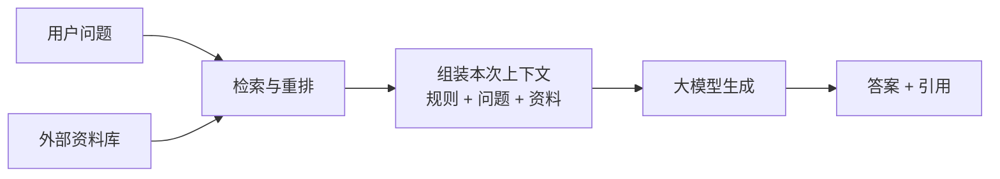
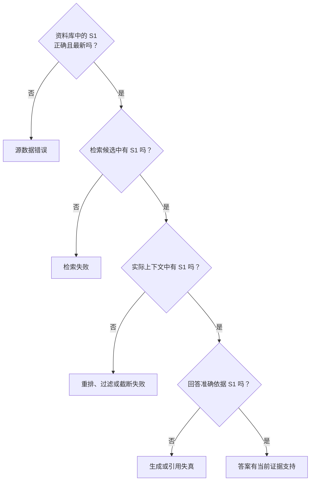

# D11：检索到资料后，模型怎样生成答案？

D10 已经能够从大量文档中找出少量相关文本块，但用户需要的不是材料列表，而是一个有依据、可核查的答案。为此，系统要把**用户问题和检索结果一起交给生成模型**。这条“先检索，再补充上下文，最后生成”的链路叫**检索增强生成（Retrieval-Augmented Generation，RAG）**。

## 1. 为什么检索结果还不是最终答案？

假设下面内容来自虚构公司的教学示例制度，不代表任何真实公司规定：

| 编号 | 检索片段 | 来源状态 |
| --- | --- | --- |
| S1 | 申请材料：陪产假申请表、出生医学证明复印件 | 《员工休假制度（2026 版）》，现行 |
| S2 | 申请材料：申请表、结婚证复印件 | 《员工休假制度（2023 版）》，已废止 |
| S3 | 员工提交申请后，由直属负责人审批 | 《休假审批流程》，现行 |

检索器可能同时返回这些相关片段，却不会自动为用户比较版本、区分材料与流程并组织答案。因此，D10 的输出要成为 D11 的输入：系统选出真正需要的证据并保留来源，再让生成模型完成归纳和表达。**检索器负责把证据带进来，生成模型负责依据证据回答。**

## 2. RAG 怎样把检索与生成连接起来？

收到问题后，系统先执行 D10 的检索与重排，再把选中的文本块放入本次上下文，最后由大模型逐 Token 生成答案。这里的“增强（Augmented）”不是修改模型参数，而是**给这一次生成补充外部资料**。

延续示例，版本过滤后只保留 S1，系统可以组装出如下内容：

> **回答要求：** 只依据给定资料回答；资料不足时明确说明；引用使用资料编号。
>
> **用户问题：** 员工请陪产假需要哪些材料？
> **资料 S1：** 《员工休假制度（2026 版）》4.2 节：申请材料包括陪产假申请表、出生医学证明复印件。

模型由此生成：“根据现行制度，需要提交陪产假申请表和出生医学证明复印件。[S1]”资料编号、标题和版本既帮助模型区分来源，也让最终引用可以回到原文。若资料中没有答案，合理结果是明确说明证据不足，而不是自行补全。

原始 RAG 研究把生成时使用检索到的外部文档作为核心机制。[RAG 论文](https://arxiv.org/abs/2005.11401) 本章关注常见系统链路，不展开论文中的训练细节。

## 3. 有引用，为什么仍不代表答案可靠？

模型在句末生成“[S1]”，只说明它输出了一个引用标记。可靠引用至少要满足：编号确实存在，S1 包含相关内容，回答没有在 S1 之外增加结论。

| 回答 | 是否被 S1 支持 | 原因 |
| --- | :---: | --- |
| 需要申请表和出生医学证明复印件。[S1] | 是 | 两项都能在 S1 中找到 |
| 还需要户口簿。[S1] | 否 | S1 没有提到户口簿 |
| 陪产假一定为 15 天。[S1] | 否 | S1 只说明材料，不说明天数 |
| 需要申请表和出生证明。[S9] | 否 | 本次上下文不存在 S9 |

系统可以校验引用编号是否属于本次资料集合，并进一步检查结论能否由引用片段支持。即使回答完全忠于 S1，也只说明它忠于当前资料；如果 S1 本身过期或错误，答案仍可能不符合现实。**“有引用”“引用支持结论”和“资料本身正确”是三个不同层次。**

## 4. 回答错了，怎样沿证据链定位？

RAG 把资料、检索、上下文选择和生成串在一起，不能看到错误就统一归因于“大模型幻觉”。假设正确答案应来自 S1，可以从最早的证据开始检查：

正确片段没有进入候选时，应检查切分、索引和召回；它已被召回但没有进入实际上下文时，应检查重排、版本过滤和长度截断；模型已经看到正确证据却仍添加“户口簿”，才应重点检查回答指令、上下文噪声或模型能力。**修复应落在最早丢失或扭曲证据的环节。**

RAG 仍不能保证正确：资料可能过期，模型也可能误读证据。检索到的文档还应被当作不可信数据，而不是更高优先级的系统指令；权限和版本过滤应尽量在资料进入模型上下文之前完成。这样做既是回答质量要求，也是信息访问边界。

## 5. 什么时候使用 RAG，什么时候选择其他办法？

D08 的微调会更新模型参数，D09 的提示词和上下文影响当前请求，RAG 则在当前请求前自动检索资料。它们解决的问题不同：

| 需求 | 更直接的选择 | 原因 |
| --- | --- | --- |
| 阅读用户本次提供的短材料 | 直接放入上下文 | 材料少且已经明确 |
| 查询大量、常更新的内部制度并给出出处 | RAG | 资料可独立更新并保留来源 |
| 长期形成特定任务行为或输出风格 | 提示词先验证，必要时微调 | 目标是改变稳定行为而非补充事实 |
| 读取实时状态或改变外部系统 | 工具调用 | RAG 只提供资料，不能真正执行动作 |

普通 RAG 请求通常不修改生成模型权重，但检索模型、重排模型或生成模型可以在其他阶段单独训练。第一轮只需抓住边界：**变化的外部知识用 RAG，当前请求要求用上下文，稳定行为再考虑微调，真实动作交给工具。**D12 将沿最后一种需求，解释模型怎样提出结构化工具调用，由外部程序真实执行。

本章的核心链条是：**问题触发检索 → 证据进入本次上下文 → 模型依据证据生成并引用 → 沿资料、检索、选择、生成逐层定位错误。**

## 助记卡片

**卡片 1：RAG 的三个核心步骤是什么？**

> **答案：** 检索外部资料、用资料增强本次上下文、让模型依据上下文生成答案。

**卡片 2：RAG 的“增强”会修改模型参数吗？**

> **答案：** 普通请求不会；它只是把检索资料加入这一次上下文。

**卡片 3：检索器和生成模型分别负责什么？**

> **答案：** 检索器寻找证据，生成模型依据实际进入上下文的证据组织回答。

**卡片 4：有引用为什么不等于结论可靠？**

> **答案：** 还要检查编号存在、资料确实支持结论，并且资料本身正确且未过期。

**卡片 5：怎样区分检索失败和生成失真？**

> **答案：** 正确证据未进入候选是检索失败；证据已经进入实际上下文但回答仍违背它，才是生成失真。

**卡片 6：为什么外部文档不能当作系统指令？**

> **答案：** 文档是不可信数据，可能过期、被篡改或包含诱导文字，不应因此获得更高权限。

**卡片 7：RAG 与微调最核心的区别是什么？**

> **答案：** RAG 为请求补充可更新的外部知识；微调通过参数更新塑造较稳定的模型行为。

## 自测题

1. D10 已返回几个相关文本块，为什么还需要生成模型？
2. 用自己的话解释 Retrieve、Augment、Generate 三步；其中哪一步让资料进入本次上下文？
3. 回答写着“还需要户口簿。[S1]”，而 S1 没有这项内容。为什么“带引用”仍不能让该结论成立？
4. 正确 S1 没有进入检索候选；另一种情况下，S1 进入候选却被截断，没有送给模型。分别应检查哪一层？
5. 正确且最新的 S1 已进入模型上下文，回答却用它证明制度中不存在的休假天数。应优先检查什么？
6. 为什么权限和版本过滤应尽量发生在资料进入模型上下文之前？
7. 为以下需求选择更直接的方案并说明理由：阅读两段现成文字、查询经常更新的制度、稳定输出风格、真正提交申请。

完成后再看[参考答案](quiz-answers.md)。返回[知识地图](../../../knowledge-map.md)，或回顾[D10](../d10-retrieval/README.md)。
