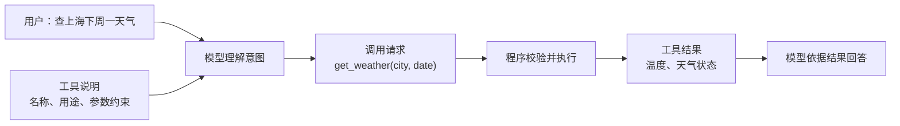
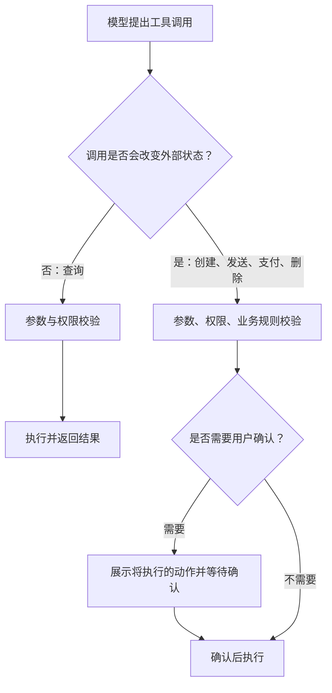
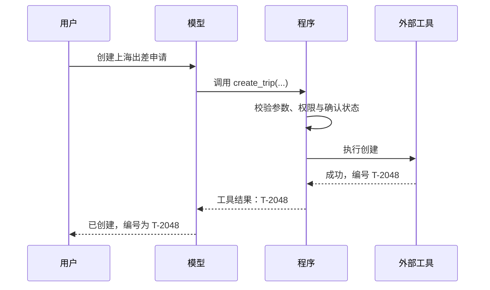

# D12：模型怎样使用外部工具完成动作？

D11 中的模型能够依据公司制度回答“出差需要什么材料”，但用户若继续说“帮我查一下上海下周一的天气，并创建出差申请”，仅靠生成文字并不会真的查询实时天气，也不会在审批系统里新增记录。要完成这类任务，模型必须把意图表达成程序能识别的调用请求，由外部程序校验并执行，再把结果交回模型。这个过程通常称为**工具调用（Tool Calling）**。

## 1. 为什么模型生成一句“已创建”还不算执行？

大模型的直接输出仍是 Token 序列。它可以生成“出差申请已创建”，却无法仅凭这句话改变审批系统中的数据；它对实时天气的回答也可能来自旧知识或猜测。真正能读取天气服务、查询数据库或写入审批记录的是外部程序。

因此系统需要明确分工：**模型负责理解自然语言并决定要调用什么，程序负责检查参数、执行操作和返回真实结果。**模型提出调用意图，不等于调用已经成功，更不等于副作用已经发生。

## 2. 自然语言怎样变成程序可以执行的调用？

假设系统向模型提供一个 `get_weather` 工具，其说明包括工具用途以及 `city`、`date` 两个参数。用户说“查上海下周一的天气”后，模型不直接编造天气，而是生成一段结构化的调用信息：工具名为 `get_weather`，城市为“上海”，日期为解析后的具体日期。

这里的**工具定义（Tool Schema）**相当于模型与程序之间的接口契约：它说明有哪些工具、每个工具解决什么问题、需要哪些参数以及参数类型。结构化输出的目的不是让格式更漂亮，而是让程序能够稳定解析，而不是从一段随意文字中猜测模型想做什么。

## 3. 模型生成了参数，为什么程序还要校验？

模型可能漏填日期、把城市写入日期字段，甚至生成工具定义中不存在的参数。外部输入也可能故意构造危险值。因此，程序不能把模型输出视为可信命令，而要像处理普通用户输入一样校验。

| 校验对象 | 需要回答的问题 | 失败时的处理示例 |
| --- | --- | --- |
| 工具名称 | 是否属于允许调用的工具集合？ | 拒绝未知工具 |
| 必填参数 | 城市、日期等是否齐全？ | 返回缺少字段 |
| 参数类型与格式 | 日期是否为合法日期？ | 要求模型修正或询问用户 |
| 业务规则 | 日期是否允许申请、金额是否超限？ | 返回明确业务错误 |
| 用户权限 | 当前用户能否创建这类申请？ | 拒绝执行并记录原因 |

例如模型把日期写成“下周一”，而天气接口只接受 `YYYY-MM-DD`。程序应先解析或要求补全，不能把模糊值直接发送给下游。**Schema 约束能减少格式错误，但不能替代权限、业务规则和安全校验。**

## 4. 为什么“查询”和“创建申请”要区别对待？

查询天气通常只读取信息；创建出差申请会改变外部状态，这种可观察的改变叫**副作用（Side Effect）**。副作用越难撤销，执行门槛越应提高。

是否需要确认取决于产品规则和风险，而不是由模型随意决定。查看天气可以直接执行；提交正式申请、发送邮件或付款通常需要更严格的授权，有时还需明确确认。确认状态必须由可信程序记录，不能因为模型生成了“用户已确认”就视为真的确认。程序还可使用请求标识避免网络重试造成重复创建，这叫**幂等性（Idempotency）**：同一个逻辑请求重复到达时，不应产生多份申请。

## 5. 工具结果为什么要再次交给模型？

模型在调用前只知道用户意图，不知道真实执行结果。天气服务可能返回“上海，12～18℃，有雨”，审批系统也可能返回“申请编号 T-2048”，或返回“预算不足”。这些结果必须加入后续上下文，模型才能给出准确回复或决定下一步。

如果工具返回错误，程序也应以清晰结构告诉模型错误类别和可修复信息。模型可以据此补参数或向用户解释，但不能把失败改写成成功。**最终回答必须以工具返回的事实为准，而不是以模型最初的计划为准。**

## 6. 工具调用失败时怎样定位？

一次失败至少可能发生在四层：模型选错工具，参数不合法，程序拒绝执行，或者外部系统失败。

| 现象 | 主要检查层 | 例子 |
| --- | --- | --- |
| 模型调用天气工具来创建申请 | 工具选择 | 工具说明含糊或模型判断错误 |
| 选择正确但日期字段缺失 | 参数生成 | Schema 不清或用户信息不足 |
| 参数合法但无权限 | 执行前校验 | 当前账号没有创建权限 |
| 已发送请求但服务超时 | 外部工具 | 网络或下游服务异常 |
| 工具成功却回复“创建失败” | 结果理解 | 模型误读工具返回值 |

记录调用请求、校验结果、工具响应和最终回答，才能判断错误出现在哪里。日志中仍要避免泄露令牌、隐私和敏感参数。

## 7. 工具调用与 RAG 有什么区别？

RAG 主要把外部资料带入上下文，帮助模型回答；工具调用则让外部程序读取实时状态或执行动作。查询天气既可看作读取工具，也会把结果加入上下文，但它并不等同于从文档库检索段落。创建申请更明确地展示了差别：RAG 能告诉你申请规则，只有工具才能真正写入审批系统。

本章只处理一次“模型提出调用—程序执行—模型解释结果”。真实出差任务往往要先查制度、再查天气、再算预算、最后创建申请，并根据每一步结果调整后续动作。D13 将解释怎样组织这种多步骤任务，以及工作流与 Agent 的区别。

本章的核心链条是：**模型依据工具定义生成结构化调用 → 程序校验参数、权限与副作用 → 外部工具真实执行 → 结果回到上下文 → 模型依据结果回答。**

## 助记卡片

**卡片 1：为什么模型说“已创建”不代表真的创建？**

> **答案：** 模型直接产生的是文本；只有外部程序执行写操作，系统状态才会改变。

**卡片 2：工具定义解决什么问题？**

> **答案：** 它向模型和程序约定工具用途、名称、参数及类型，使调用可以被稳定解析。

**卡片 3：为什么模型参数必须再次校验？**

> **答案：** 模型可能漏填、错填或生成危险值，Schema 也不能替代权限和业务校验。

**卡片 4：什么是副作用？**

> **答案：** 调用对外部状态产生的可观察改变，例如创建申请、发送邮件或付款。

**卡片 5：什么是幂等性？**

> **答案：** 同一逻辑请求即使因重试重复到达，也不会重复产生副作用。

**卡片 6：为什么工具结果要返回模型？**

> **答案：** 模型只有看到真实成功、失败或数据结果，才能准确回复或决定下一步。

**卡片 7：谁负责权限判断？**

> **答案：** 可信的外部程序负责；不能仅依赖模型自行判断是否有权限。

**卡片 8：RAG 与工具调用的核心区别是什么？**

> **答案：** RAG 主要提供回答所需资料；工具调用可以读取实时状态或让外部系统真正执行动作。

## 自测题

1. 用户要求“创建出差申请”，为什么模型直接生成“已创建”是不可靠的？
2. 工具定义至少需要告诉模型哪些信息？结构化调用比自由文本调用有什么优势？
3. 模型选择了正确工具，但把日期写成“随便哪天”。程序为什么不能直接执行？应检查哪些方面？
4. 查询天气和提交付款在执行控制上为什么不应完全相同？
5. 网络超时后系统自动重试创建申请。怎样避免生成两份申请？
6. 外部系统返回“预算不足”，模型却回复“申请已成功”。错误主要发生在哪一环？
7. 对“告诉我报销规则”和“替我提交报销单”两个请求，分别说明 RAG 与工具调用能发挥什么作用。

完成后再看[参考答案](quiz-answers.md)。返回[知识地图](../../../knowledge-map.md)，或回顾[D11](../d11-rag/README.md)。
