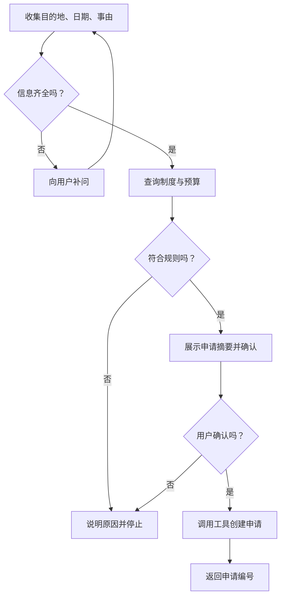
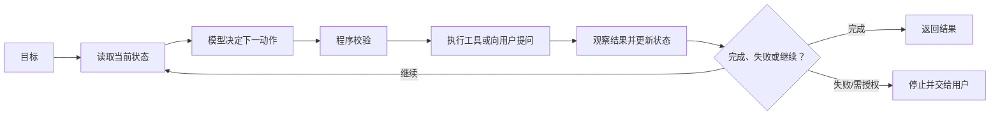
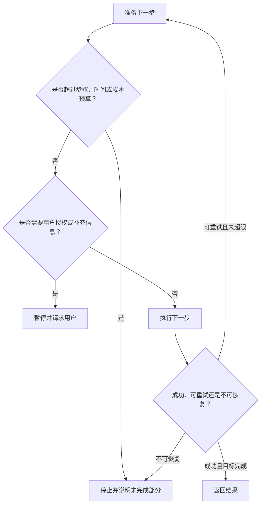

# D13：多步骤任务怎样组织和停止？

D12 完成了一次工具调用，但“替我安排下周一去上海出差”不是一次调用就能结束：系统要读取出差制度、确认日期和目的地、查询天气与交通、核对预算、创建申请；任何一步失败都可能改变后续计划。要让任务可控地推进，需要把步骤、状态、分支和停止条件组织起来。

## 1. 为什么把所有动作一次写死并不够？

如果程序固定执行“查天气 → 查车票 → 创建申请”，它遇到预算超限时仍可能继续提交；用户没有给出返程日期时，也不知道应跳过、猜测还是追问。多步骤任务的难点不只是步骤多，而是**后一步依赖前一步的新结果**。

例如查询交通后可能出现三种结果：有合适车次则继续；只有超预算方案则请用户决定；服务失败则重试或停止。系统必须保存已知信息和执行结果，才能选择下一步。这些会影响后续决策的信息称为**状态（State）**。

## 2. 路径稳定时，怎样让执行更可预测？

如果业务步骤和分支能够提前列清，例如公司的出差审批必须依次完成信息检查、预算核验、用户确认和创建申请，那么最直接的方法是由程序预先定义节点与连线。这叫**工作流（Workflow）**。

工作流的优点是路径可见、容易测试、关键副作用可设置固定门禁；缺点是只能走预先设计的分支。对于规则明确、风险较高、需要审计的任务，确定性往往比“自由发挥”更重要。

## 3. 路径无法完全预先列出时，需要什么？

用户也可能说：“帮我规划一次符合公司制度、总预算不超过 3000 元的上海行程，有问题就调整。”系统可能先查交通，也可能发现日期不合理后先改日程；工具数量和顺序取决于中间结果。此时可让模型根据当前目标和状态选择下一动作，并在得到反馈后重新判断。这样的循环通常被称为**Agent（智能体）**式执行。

ReAct 工作展示了一种将推理与行动交错、根据环境反馈更新后续行动的思路。[ReAct 论文](https://arxiv.org/abs/2210.03629) 本章中的 Agent 是更宽泛的系统概念：**模型参与决定下一步，外部程序仍负责状态、权限、工具执行和停止控制。**Agent 不是一个神秘的新模型，也不等于无限循环调用工具。

## 4. 工作流与 Agent 应该二选一吗？

二者更像一条控制程度的连续谱。稳定步骤可由工作流固定，局部开放问题再交给模型选择。例如“审批前必须用户确认”写死在工作流中，而“在多个交通方案中先查哪一个”可以让模型决定。

| 任务特征 | 更适合固定工作流 | 更适合 Agent 决策 |
| --- | :---: | :---: |
| 步骤和分支提前已知 | ✓ | 可以但无必要 |
| 有严格审批与审计要求 | ✓ | 只用于受控局部 |
| 环境变化大、路径难穷举 | 部分 | ✓ |
| 错误动作代价高 | 固定关键门禁 | 必须受强约束 |
| 需要探索多个信息源 | 可编排已知路线 | ✓ |

实际系统常采用**工作流包住 Agent**：程序决定总体阶段和安全边界，模型只在某些节点中做开放选择。这样既保留适应性，也避免把全部控制权交给概率生成模型。

## 5. 状态中应该保存什么？

模型的当前上下文不是可靠的业务数据库。对话过长会被截断，模型也可能复述错误。因此，关键状态应由外部程序结构化保存，例如目标、已确认参数、工具调用结果、审批状态、失败次数和已经产生的副作用。

| 状态字段 | 示例 | 作用 |
| --- | --- | --- |
| 任务目标 | 创建上海出差申请 | 防止循环中偏离目标 |
| 已确认事实 | 2026-09-21 出发，预算 3000 元 | 避免重复询问或擅自改值 |
| 工具结果 | 车次 G1，价格 553 元 | 为下一步决策提供依据 |
| 执行记录 | 申请尚未创建 | 防止误报成功和重复副作用 |
| 控制信息 | 已重试 1 次，最多 2 次 | 支持停止判断 |

给模型的上下文可以由这些状态重新组装，但**业务真相应以外部状态存储和真实工具结果为准**。

## 6. 循环什么时候必须停止？

如果只告诉 Agent“直到完成为止”，它可能反复调用失败工具、在两个方案间来回切换，或持续消耗资源。系统需要明确的停止条件：目标已完成、用户拒绝授权、缺少必须信息、达到最大步骤或成本、重复失败，以及触发人工处理规则。

重试也必须区分只读操作和有副作用操作。查询超时可以有限重试；创建申请若结果未知，应先用请求标识查询原操作状态，而不是盲目再次创建。必要时交给人工不是失败设计，而是可靠系统的一部分。

## 7. 怎样判断多步骤任务错在哪里？

最终任务失败可能来自计划不合理、单步工具失败、状态未更新、停止条件错误或副作用重复。仅看最终一句回复无法定位，因此需要保存每一步的输入、决策、工具结果、状态变化和停止原因。

一次执行形成的步骤序列可称为**轨迹（Trajectory）**。评审轨迹时要问：是否选择了必要步骤，是否在正确条件下调用工具，结果是否写回状态，是否在风险动作前确认，是否在完成或无法推进时停止。D16 会把这种逐步检查纳入评测。

至此，应用层的知识已经串起：上下文影响当前回答，RAG 提供外部资料，工具让程序读取或改变外部世界，工作流与 Agent 组织多步执行。但每一次模型判断和生成都要消耗计算资源；上下文越长、并发请求越多，响应就越慢。D14 将转入推理服务，解释时间和显存到底花在哪里。

本章的核心链条是：**目标与状态 → 工作流固定可靠路径或 Agent 选择开放步骤 → 工具反馈更新状态 → 停止条件控制循环 → 轨迹支持诊断。**

## 助记卡片

**卡片 1：多步骤任务比多次调用难在哪里？**

> **答案：** 后一步依赖前一步结果，系统必须维护状态、处理分支并决定何时停止。

**卡片 2：什么是工作流？**

> **答案：** 由程序预先定义步骤、分支和控制条件的执行路径，适合稳定且需审计的任务。

**卡片 3：Agent 式执行的关键是什么？**

> **答案：** 模型根据当前目标、状态和工具反馈动态选择下一动作。

**卡片 4：Agent 是否负责真实执行和权限？**

> **答案：** 不应由模型独自负责；可信程序仍要校验权限、执行工具和控制停止。

**卡片 5：为什么常用工作流包住 Agent？**

> **答案：** 固定关键门禁和总体阶段，同时只在开放节点使用模型的适应性。

**卡片 6：为什么关键状态不能只放在对话中？**

> **答案：** 对话可能截断或被模型误述，业务真相需要由外部程序结构化保存。

**卡片 7：常见停止条件有哪些？**

> **答案：** 目标完成、需要用户输入或授权、达到预算、重复失败或遇到不可恢复错误。

**卡片 8：什么是执行轨迹？**

> **答案：** 一次任务中各步决策、调用、结果和状态变化组成的序列，用于复现与诊断。

## 自测题

1. 固定执行“查票—创建申请”为什么可能在多步骤出差任务中失败？
2. 什么情况下优先使用固定工作流？什么情况下需要 Agent 式动态决策？
3. “工作流包住 Agent”具体意味着什么？请以用户确认环节举例。
4. 为什么申请是否已创建不能只依赖模型在对话中的记忆？
5. 一个工具连续超时，Agent 已调用 20 次仍继续。系统缺少什么控制？
6. 创建申请调用超时且结果未知，为什么不应直接再次创建？
7. 最终申请失败时，一条可诊断的执行轨迹至少应保留哪些信息？

完成后再看[参考答案](quiz-answers.md)。返回[知识地图](../../../knowledge-map.md)，或回顾[D12](../d12-tool-calling/README.md)。
