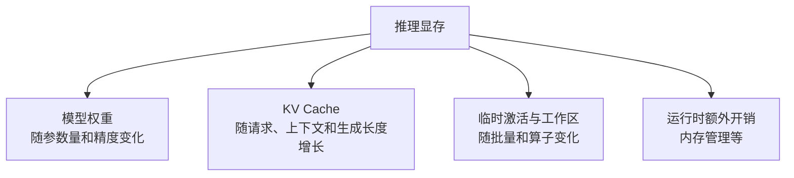
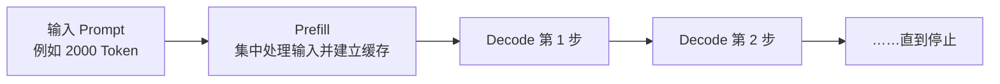

# D14：模型推理为什么占显存，响应为什么会变慢？

D13 的多步骤任务会多次调用模型。即使不再训练参数，每次调用仍要把输入送入 Transformer，并逐 Token 生成输出。用户常看到两种现象：长问题需要更久才出现第一个字，长回答则持续占用显存并逐字变慢。要理解这些现象，需要把一次推理拆成**加载什么、保存什么、计算什么**。

## 1. 不训练参数，显存里为什么仍有大量数据？

模型推理至少要容纳三类数据：模型权重、当前计算的临时结果，以及为后续生成保留的缓存。权重就是 D07、D08 训练得到的参数；推理时通常只读取，不需要像训练那样保存梯度和优化器状态，但参数数量本身仍很大。

若某模型有 P 个参数，每个参数平均使用 b 字节，仅权重存储可粗略估算为 **P × b 字节**。例如教学计算中，70 亿参数若每个使用 2 字节，权重约需 140 亿字节，也就是约 14 GB 的十进制容量；实际占用还会受格式、额外张量和运行时管理影响。这个估算的目的不是给出部署承诺，而是看清：**参数量与每参数字节数共同决定权重的基础显存。**

因此，“权重能放进显存”只是能否运行的第一道条件，不表示还剩足够空间承载长上下文和并发请求。

## 2. 为什么历史 Token 会形成 KV Cache？

D05 讲过，在 Transformer 的每一层中，每个 Token 当前的表示会分别变换成 Query、Key 和 Value。先用一句不严格但好记的话回顾三者的分工：**Query 表示“我现在要找什么”，Key 表示“我这里有什么特征可供匹配”，Value 表示“如果关注我，实际取走什么信息”。**当前 Token 的 Query 与上下文各 Token 的 Key 比较，得到注意力权重，再按权重汇总对应的 Value。

现在把这个过程放进 D06 的自回归生成。为了便于观察，下面做一个教学简化：假设 Prompt“北京是中国的”恰好被分成“北京 / 是 / 中国 / 的”4 个 Token，模型接着生成一个 Token“首都”；真实分词结果由 Tokenizer 决定，不一定按词或字切开。为了继续预测“首都”后面的 Token，模型要把“首都”作为新输入再经过每一层。在某一层中，新 Token 会产生自己的 Query、Key 和 Value：它的 Query 要查询“北京、是、中国、的、首都”等位置的 Key，再汇总这些位置的 Value。

关键在于：**历史 Token 的 Key 和 Value 在前一步已经计算过，并且模型参数没有变化，所以再次计算会得到相同结果。**如果没有缓存，生成每个新 Token 时都要把越来越长的完整序列重新送过所有层，反复计算历史位置的 Key、Value 和其他层内结果。

| 生成进度 | 不使用缓存 | 使用 KV Cache |
| --- | --- | --- |
| Prompt 已处理 | 计算“北京是中国的”的全部位置 | 计算全部位置，并保存各层 Key/Value |
| 加入“首都” | 再计算“北京是中国的首都”的全部位置 | 只计算“首都”的新表示，并读取历史 Key/Value |
| 再加入一个 Token | 又计算更长序列的全部位置 | 只计算新增 Token，并把它的 Key/Value 追加到缓存 |

为避免重复，推理系统把**每一层、每个历史 Token 的 Key 和 Value**保存起来，形成 **KV Cache（键值缓存）**。后续一步只为新增 Token 计算新的 Query、Key 和 Value：执行注意力时，新 Query 使用历史缓存以及当前 Token 自己的新 Key/Value；完成后再把新 Key/Value 留在缓存中，供下一步使用。

这里要先澄清“新 Token 经历整个神经网络”的含义：推理时参数已经固定，新 Token 经历的是一次**前向计算（Forward Pass）**，不会反向传播或更新参数。它先变成向量，再依次通过第 1 层、第 2 层，直到第 L 层；其中 L 表示模型的 Transformer 层数。下面把 Prompt 的第一个 Token、首个生成 Token、中间 Token 和最后一个 Token 放在同一张图里：

```mermaid
flowchart LR
    X["Prompt Token<br/>x₁, x₂, …, xₙ"] --> E0["Embedding<br/>+ 位置信息"]
    E0 --> P1["Prefill：第 1 层<br/>处理 x₁…xₙ<br/>建立第 1 层 KV"]
    P1 --> P2["第 2 层<br/>接收第 1 层输出<br/>建立第 2 层 KV"]
    P2 --> PM["……中间层……"]
    PM --> PL["第 L 层<br/>建立第 L 层 KV"]
    PL --> H0["LM Head + 采样<br/>预测 y₁"]

    H0 --> Y1["新 Token y₁<br/>Embedding"]
    Y1 --> D11["Decode：第 1 层<br/>Q 使用第 1 层历史 KV<br/>保存 y₁ 的 K/V"]
    D11 --> D12["第 2 层<br/>使用第 2 层历史 KV<br/>保存 y₁ 的 K/V"]
    D12 --> D1M["……中间层……"]
    D1M --> D1L["第 L 层<br/>使用第 L 层历史 KV<br/>保存 y₁ 的 K/V"]
    D1L --> H1["LM Head + 采样<br/>预测 y₂"]

    H1 --> Y2["y₂ 经第 1…L 层<br/>各层 KV 继续增长"]
    Y2 --> MORE["y₃ … yₘ₋₁<br/>每次重复完整多层前向"]
    MORE --> YM["最后一个正文 Token yₘ<br/>再次经过第 1…L 层"]
    YM --> HE["LM Head<br/>预测 EOS"]
    HE --> STOP["停止生成"]

    classDef prefill fill:#e8f1ff,stroke:#4a78c2,color:#111
    classDef decode fill:#fff2cc,stroke:#c69720,color:#111
    classDef stop fill:#e5f5e0,stroke:#4b8f45,color:#111
    class X,E0,P1,P2,PM,PL,H0 prefill
    class Y1,D11,D12,D1M,D1L,H1,Y2,MORE,YM,HE decode
    class STOP stop
```

这张图要按**从左到右**阅读。蓝色部分是 Prefill：x₁ 到 xₙ 可以在一轮前向计算中共同穿过多层网络，但仍受因果遮罩限制，x₁ 只能关注 x₁，x₂ 可以关注 x₁～x₂，直到 xₙ 可以关注 x₁～xₙ。它们在每一层留下该层自己的 KV Cache；第 1 层缓存来自第 1 层的表示，第 2 层缓存来自第 2 层的表示，彼此不能混用。最终通常取 xₙ 在第 L 层的输出送入 LM Head，得到词表中下一个 Token 的分数，再由生成策略选出 y₁。

y₁ 被选出后还只是一个 Token ID。为了预测 y₂，系统把 y₁ 转成向量，让它从第 1 层重新走到第 L 层。在第 j 层中，j 表示当前层号，y₁ 会产生该层的 Q、K、V：计算注意力时，Q 使用**第 j 层**已经保存的历史 Key/Value，并加入 y₁ 当前的 Key/Value；得到的新隐藏表示传给第 j+1 层，而本层的 K、V 留在第 j 层缓存。最终第 L 层输出再经过 LM Head，预测 y₂。

y₂、y₃直到最后一个正文 Token yₘ都重复同一条多层路径。最后一个正文 Token 也必须走完整个网络，因为模型只有处理完它，才能预测下一个 Token 是 EOS；EOS 是结束标记，命中后才停止生成。**因此，Token 在层与层之间传递的是不断更新的隐藏表示，在时间步之间保留下来的是各层自己的历史 Key/Value。**

为什么通常缓存 K 和 V，却不保存历史 Query？因为新的 Token 需要用**自己的 Query**询问历史信息；旧 Token 的 Query 已经完成了旧位置当时的查询，后续新 Token 不会拿旧 Query 再查一次。相反，历史 Key 和 Value 仍要被每一个新 Query 使用，所以值得保留。

KV Cache 并没有让历史内容“消失”：新 Query 仍要读取并关注历史 Key/Value，上下文越长，这部分读取和注意力工作通常越多。它省掉的是对历史 Token 的重复前向计算，因此是**用显存换计算**。历史越长、并发请求越多、模型层数和注意力头规模越大，缓存通常越大。它不会修改模型权重，也不是简单保存一份对话原文，而是保存各 Transformer 层后续注意力所需的中间表示。

## 3. 一次请求为什么分为 Prefill 和 Decode？

用户提交整段输入后，模型要先处理输入中的全部 Token，建立它们的内部表示与 KV Cache。这个阶段称为 **Prefill（输入预填充）**。完成后模型开始逐个生成新 Token；每一步读取已有 KV Cache、计算一个新 Token，并把新 Key/Value 追加进去，这个阶段称为 **Decode（逐 Token 解码）**。

Prefill 可以同时处理输入中的许多 Token，通常更容易利用 GPU 的并行计算；Decode 存在前后依赖，必须得到上一个 Token 后才能生成下一个 Token。长输入会增加首个输出出现前的工作，长输出则增加 Decode 循环次数。于是“多久看到第一个 Token”和“之后 Token 出得多快”应分开观察。

## 4. GPU 在这里解决了什么问题？

Transformer 的主要计算包含大量矩阵运算。同一层中许多乘加可以并行执行，GPU 拥有大量适合并行数值计算的执行单元和高带宽显存，因此能比通用串行处理更有效地承担这些工作。但 GPU 并不会消除数据依赖：Decode 的第 n+1 步仍必须等第 n 步产生 Token。

推理速度可能受两类资源限制。一类是计算量大，执行单元忙于矩阵乘法；另一类是需要频繁从显存读取权重或 KV Cache，速度受内存带宽限制。不同模型、批量和阶段的瓶颈不同，因此不能简单地说“GPU 利用率不满就是计算少”或“换更强 GPU 一定按比例加速”。

## 5. 输入长度、输出长度和并发分别影响什么？

三者都会增加成本，但路径不同：

| 变化 | 主要增加的工作 | 用户常见感受 |
| --- | --- | --- |
| 输入更长 | Prefill 计算与初始 KV Cache | 首 Token 等待更久 |
| 输出更长 | Decode 步数与持续增长的 KV Cache | 完成时间更长 |
| 并发更多 | 同时存在的请求与缓存 | 排队、显存压力或吞吐变化 |
| 模型更大 | 权重读取、计算量与缓存规模 | 单步通常更重 |

注意力对上下文长度的计算关系还会受到具体模型结构和实现影响，第一轮不记复杂度公式。当前最重要的判断是：**长输入主要扩大 Prefill，长输出主要拉长 Decode，并发主要让多个请求争用计算与显存。**

## 6. “显存不足”和“响应慢”怎样分层检查？

看到显存不足时，先区分权重是否已经接近容量上限，还是并发与长上下文导致 KV Cache 增长，或临时工作区在特定批量下达到峰值。看到响应慢时，则先问慢在首 Token 前、逐 Token 生成中，还是排队阶段。

| 现象 | 优先检查 | 可能方向 |
| --- | --- | --- |
| 模型刚加载就显存不足 | 权重与精度 | 更小模型、量化或多设备切分 |
| 少量请求正常，并发一高就溢出 | KV Cache 与调度 | 限制并发、长度或改进缓存管理 |
| 长 Prompt 首 Token 很慢 | Prefill | 输入长度、算力与批处理 |
| 首 Token 很快，长答案生成慢 | Decode | 输出长度、单 Token 速度与调度 |
| GPU 空闲但用户等待久 | 排队或上游 | 请求队列、检索、工具或网络 |

这张表只给出定位入口，并不表示每个现象只有一个原因。D15 会解释推理引擎怎样通过调度、批处理和缓存管理改善资源使用。

本章的核心链条是：**权重提供模型参数 → Prefill 处理整段输入并建立 KV Cache → Decode 读取缓存逐 Token 生成 → 输入、输出与并发通过不同路径影响显存和延迟。**

## 助记卡片

**卡片 1：推理显存主要由哪些部分组成？**

> **答案：** 模型权重、KV Cache、临时激活与工作区，以及运行时额外开销。

**卡片 2：权重显存怎样粗略估算？**

> **答案：** 参数数量乘以每个参数平均占用的字节数；实际运行还会有额外占用。

**卡片 3：KV Cache 保存什么？**

> **答案：** 它保存每一层中历史 Token 的 Key 和 Value，让新 Token 用自己的 Query 直接查询这些历史结果，避免全部重算。

**卡片 4：KV Cache 为什么会增长？**

> **答案：** 请求上下文和生成 Token 越多，需要保留的历史 Key/Value 越多；并发请求也各自占用缓存。

**卡片 5：什么是 Prefill？**

> **答案：** 模型集中处理输入 Token、计算内部表示并建立初始 KV Cache 的阶段。

**卡片 6：什么是 Decode？**

> **答案：** 模型依赖已有结果逐步生成新 Token，并持续追加 KV Cache 的阶段。

**卡片 7：为什么 Decode 不能把所有未来 Token 一次并行算出？**

> **答案：** 自回归生成中下一个 Token 依赖前面已经生成的 Token。

**卡片 8：响应慢时为什么要区分首 Token 和后续 Token？**

> **答案：** 首 Token 前主要包含排队和 Prefill，后续速度主要反映 Decode，优化方向不同。

## 自测题

1. 一个 70 亿参数模型若每参数按 2 字节粗估，权重约占多少十进制 GB？为什么实际部署不能只预留这部分？
2. 如果不使用 KV Cache，自回归生成会产生什么重复工作？为什么通常缓存历史 Key/Value，而不缓存历史 Query？
3. 分别解释 Prefill 和 Decode 的输入、主要工作与输出。
4. 为什么长 Prompt 常影响首 Token 等待，而长回答主要增加总完成时间？
5. 并发提高后显存突然不足，为什么不能只断定“模型权重太大”？
6. GPU 有很强并行能力，为什么仍不能一次生成完整自回归回答？
7. 用户等待很久但 GPU 很空闲，应只优化模型矩阵计算吗？还应检查什么？

完成后再看[参考答案](quiz-answers.md)。返回[知识地图](../../../knowledge-map.md)，或回顾[D13](../d13-agent-workflow/README.md)。
