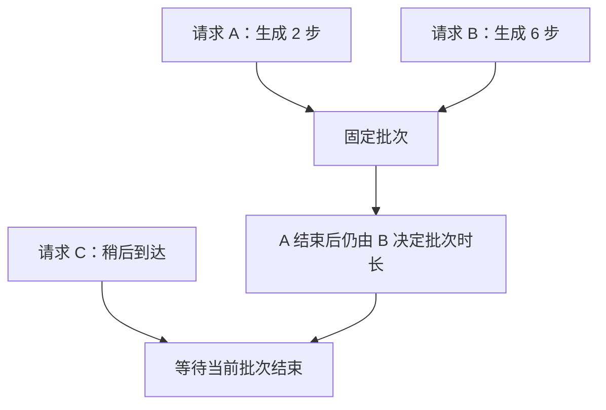
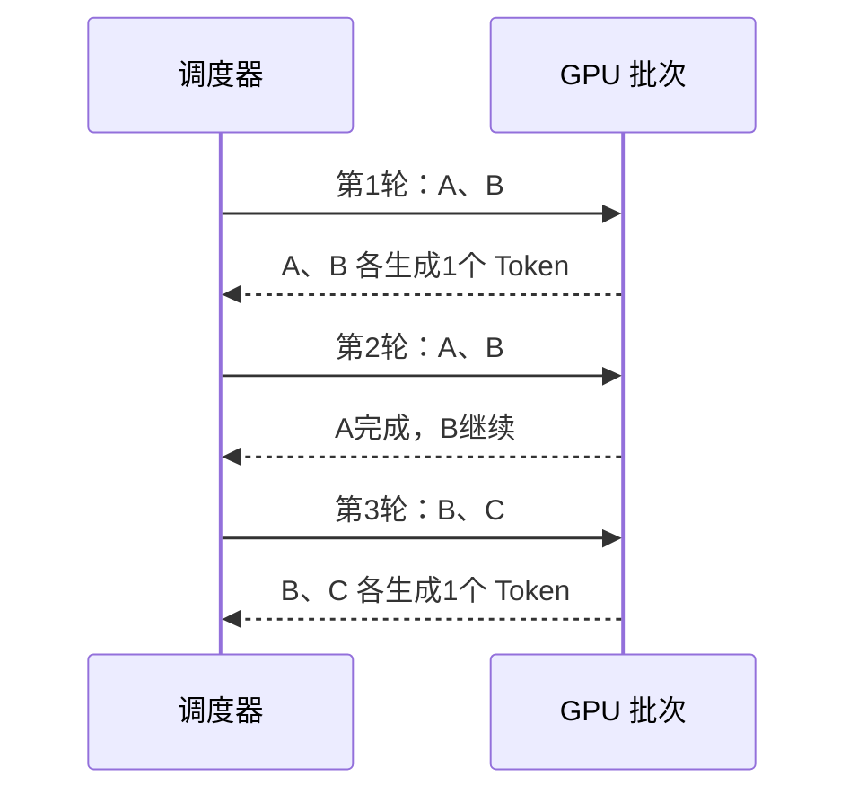
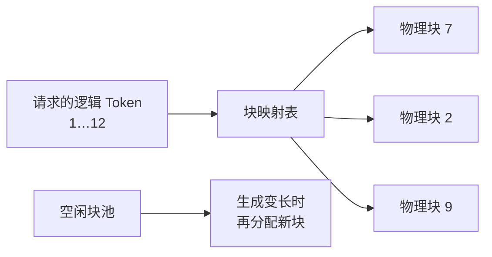
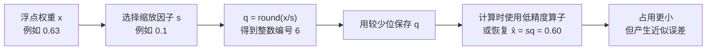

# D15：推理引擎怎样让更多请求更快完成？

D14 解释了单个请求：Prefill 处理输入，Decode 逐 Token 生成，KV Cache 持续占用显存。但线上服务同时面对长短不同的许多请求。如果每个请求独占 GPU，算力会在等待和小规模计算中浪费；如果把请求粗暴地捆成固定批次，短请求又会等待最长请求。**推理引擎（Inference Engine）**的任务，就是在模型计算语义不变的前提下管理请求、批处理和显存。

## 1. 为什么“来一条算一条”利用率不高？

单个 Decode 步骤只为每个请求生成一个 Token，工作规模可能不足以充分利用 GPU。把多个请求的当前步骤合在一次计算中，可以扩大并行工作量，这叫**批处理（Batching）**。但传统固定批次通常等整组请求到齐，并让它们一起运行到结束；生成长度不同时，已经结束的位置会空出来。

问题不在批处理本身，而在批次成员长期固定。生成请求长度难以提前准确知道，因此需要更细粒度的调度。

## 2. 连续批处理怎样填补空位？

**连续批处理（Continuous Batching）**在生成迭代之间重新安排批次。某请求完成后，新请求可以加入后续迭代，不必等待整个旧批次结束。Orca 提出的迭代级调度展示了按生成迭代安排请求的重要思路。[Orca 论文与介绍](https://www.usenix.org/conference/osdi22/presentation/yu)

连续批处理通常能提高吞吐和设备利用率，但调度器仍要在等待时间、批次大小、Prefill 与 Decode 争用以及显存容量之间取舍。让批次无限增大可能提高总吞吐，却让单个用户等待更久。

## 3. KV Cache 为什么需要专门的内存管理？

每个请求长度不同，KV Cache 会随生成动态增长。如果为每个请求预留最大连续空间，会浪费大量未使用容量；若频繁搬移和寻找连续空间，又会产生碎片与管理成本。

PagedAttention 的思路是把每个请求的 KV Cache 划分为固定大小的块，并通过映射让逻辑上连续的 Token 使用物理上不连续的显存块，类似操作系统分页。这样缓存可以按需增长，空闲块也更容易复用。该机制是 vLLM 工作的核心之一。[PagedAttention 论文](https://arxiv.org/abs/2309.06180)

PagedAttention 不会消除历史 Token 参与注意力的计算，也不等于量化；它主要改善 KV Cache 的分配、共享和碎片问题，从而让有限显存承载更有效的请求集合。**内存利用率提高与单个 Token 的理论计算量下降是两件事。**

## 4. 重复前缀为什么可以复用？

许多请求共享相同的系统提示词或长文档前缀。既然相同模型、相同 Token 前缀会产生相同的前缀 KV 表示，推理引擎可以缓存并复用这部分结果，这叫**前缀缓存（Prefix Caching）**。它减少重复 Prefill，但只有完全匹配且满足缓存条件的前缀才能直接复用；用户问题不同的后半段仍需计算。

前缀缓存主要改善重复输入的计算，并不能让首次出现的长 Prompt 免费，也不能减少之后每个新 Token 的 Decode。缓存本身还占显存，需要淘汰策略，因此是否有效取决于请求是否真的共享前缀。

## 5. 量化怎样影响权重、速度和质量？

D14 用“参数数量 × 每个参数的字节数”估算权重显存。假设一个权重原来用 FP16 保存，需要 16 个二进制位，也就是 2 字节；70 亿个权重仅原始数据就约需 14 GB。若显存放不下，最直接的想法是：**这些权重是否必须保留如此多的数值精度？**

训练后的权重是许多浮点数，例如 `0.63`、`−0.26`、`0.04`。模型未必需要区分非常接近的每一个浮点值，可以把一段连续数值映射到数量更少的离散格子，再用更少的位保存格子编号。这个“用较少的离散值近似原数值”的过程叫**量化（Quantization）**。

先看一个简化的对称量化例子。设缩放因子 s=0.1；s 表示相邻两个可表示数值之间的间隔。对原权重 x，先计算整数编号 q=round(x/s)，其中 round 表示取最近整数；使用时再用 x̂=sq 得到近似值，x̂ 表示量化后恢复出的权重。

| 原权重 x | x/s | 整数编号 q | 恢复值 x̂=sq | 误差 x̂−x |
| ---: | ---: | ---: | ---: | ---: |
| 0.63 | 6.3 | 6 | 0.60 | −0.03 |
| −0.26 | −2.6 | −3 | −0.30 | −0.04 |
| 0.04 | 0.4 | 0 | 0.00 | −0.04 |

这一步的目的，是把原本种类极多的浮点值变成少量整数编号。代价也直接出现在表中：恢复值只是近似值，原来的小数信息有一部分被舍弃，这叫**量化误差（Quantization Error）**。

位宽决定最多能区分多少个编号：8 位有 2⁸=256 种编码，4 位有 2⁴=16 种编码。教学上忽略额外元数据时，70 亿参数从每参数 2 字节的 FP16 改为每参数 1 字节的 8 位表示，原始权重约从 14 GB 降到 7 GB；4 位约为 3.5 GB。实际模型还需要保存缩放因子、分组信息和运行时数据，所以不能把这些理论值当作完整显存占用。

最常见的入门情形是只量化**权重**；其他方案还会量化计算中的激活或 KV Cache。它们节省的对象不同，误差和硬件要求也不同，本轮先不展开具体算法。只需要抓住共同机制：**减少可表示数值的数量，用更小存储和数据搬运换取一定近似误差。**

量化也不保证速度按位宽同比提升。若硬件和推理算子能直接高效处理这种低位格式，读取权重更少，速度可能提高；若计算前需要频繁恢复成高精度，或者原瓶颈不在权重读取，收益可能很小。最终需要分别验证模型能否装下、任务质量、首 Token 延迟、生成速度和吞吐。量化是资源、速度与质量的取舍，不只是压缩模型文件。

## 6. 延迟和吞吐为什么会互相牵制？

推理服务常观察三个不同问题：用户多久看到首个 Token，之后 Token 出得多快，单位时间系统共完成多少工作。它们通常分别用**首 Token 延迟（Time to First Token，TTFT）**、**每输出 Token 时间（Time per Output Token，TPOT）**和**吞吐（Throughput）**描述。

| 优化动作 | 可能收益 | 可能代价 |
| --- | --- | --- |
| 等待更多请求组成大批次 | 提高吞吐 | 增加排队和 TTFT |
| 限制上下文或输出长度 | 降低资源压力 | 不能满足部分长请求 |
| 连续批处理 | 减少批次空洞 | 调度更复杂，仍需公平控制 |
| 前缀缓存 | 降低重复 Prefill | 占用缓存空间，只对重复前缀有效 |
| 量化 | 减少权重或缓存占用 | 可能影响质量，速度收益依赖实现 |

**吞吐高不代表每个用户都快，单请求低延迟也不代表系统能承受高并发。**必须在目标流量和服务等级下衡量。

## 7. 遇到慢请求，应先调整哪个旋钮？

假设用户发出请求后，等了 3 秒才看到第一个 Token。仅凭“3 秒”还不能决定该调什么，因为这段时间不只包含模型计算：请求可能先等待检索或网络，进入推理引擎后可能继续排队，随后模型才执行 Prefill。首 Token 出现之后，模型还要逐个执行 Decode，直到回答结束。

因此，第一步不是立即打开量化或增大批次，而是**把端到端时间按阶段拆开**。其中占用主要时间，或者最先耗尽关键资源、限制整体性能的阶段，称为**瓶颈（bottleneck）**。例如同样是 TTFT=3.0 秒，下面两种情况的处理方向完全不同。

- **情况 A：检索 0.2 秒，排队 2.2 秒，Prefill 0.6 秒。**主要时间花在排队，瓶颈更可能是服务容量或调度。此时应先检查并发是否超出容量、连续批处理是否有效、是否有长请求长期占用批次。即使把 Prompt 略微缩短，也只能影响 0.6 秒的 Prefill，无法直接消除 2.2 秒的排队。
- **情况 B：检索 0.2 秒，排队 0.1 秒，Prefill 2.7 秒。**主要时间花在处理输入，应先检查 Prompt 是否包含无关的长上下文；若多个请求具有相同长前缀，再考虑前缀缓存。此时单纯调整排队策略不会解决主要问题。

首 Token 很快出现，也不表示整个请求一定快。如果首 Token 后输出明显停顿，或者 TPOT 很高，瓶颈位于 **Decode** 的可能性更大。此时才应检查 Decode 阶段的批次调度、模型规模、低比特计算内核、显存带宽和 KV Cache 访问。反过来，如果低并发时正常、高并发时却频繁显存不足，应优先检查 KV Cache 容量、碎片和长度限制；只压缩模型权重不一定够，因为不断增长的 KV Cache 仍会占用显存。

| 观察到的现象 | 需要确认的证据 | 优先检查的方向 |
| --- | --- | --- |
| 首 Token 慢，排队时间占大头 | 调度前等待明显长于 Prefill | 服务容量、连续批处理、准入与公平调度 |
| 首 Token 慢，Prefill 占大头 | 输入很长，Prefill 时间明显增长 | 删除无关上下文、复用公共前缀、模型与硬件 |
| 首 Token 快，后续生成慢 | TPOT 高或流式输出停顿 | Decode 调度、模型规模、计算内核、显存带宽 |
| 并发升高后显存不足 | KV Cache 随请求数和序列长度增长 | PagedAttention、长度策略、缓存容量 |

这里的“旋钮”就是可以调整的配置或策略，但**定位瓶颈之后才知道应该转动哪个旋钮**。聊天、离线批量生成和多步骤 Agent 的输入长度、输出长度与请求到达方式不同，不存在对所有负载都最优的配置。D15 到这里解决的是“应该优化哪里”；D16 将继续解决“怎样用一致的条件证明这次优化真的有效”。

本章的核心链条是：**调度器持续组合可运行请求 → 连续批处理填补生成空位 → 分块管理 KV Cache 降低浪费 → 前缀缓存减少重复 Prefill → 量化与服务目标共同决定质量、延迟和吞吐取舍。**

## 助记卡片

**卡片 1：批处理为什么能提高 GPU 利用率？**

> **答案：** 它把多个请求的计算合并，扩大一次并行工作的规模。

**卡片 2：固定批处理的问题是什么？**

> **答案：** 长短请求被长期绑在一起，短请求结束后的空位难以被新请求及时利用。

**卡片 3：连续批处理做了什么？**

> **答案：** 它在生成迭代之间重新安排批次，让已完成请求退出、新请求及时加入。

**卡片 4：PagedAttention 主要解决什么？**

> **答案：** 它用分块和映射管理动态增长的 KV Cache，减少预留浪费和连续空间碎片。

**卡片 5：前缀缓存减少哪个阶段的工作？**

> **答案：** 它复用相同前缀的计算结果，主要减少重复 Prefill。

**卡片 6：量化是什么意思，为什么会产生误差？**

> **答案：** 量化用较少的离散编号近似原浮点数；多个原数值可能落到同一格子，因此恢复值与原值之间会有误差。

**卡片 7：定位慢请求的第一步是什么？**

> **答案：** 把端到端时间拆成检索或网络、排队、Prefill 和 Decode 等阶段，先找出占用主要时间或限制资源的瓶颈，再选择优化手段。

**卡片 8：为什么吞吐高不等于单个请求快？**

> **答案：** 系统可能通过等待更大批次提高总处理量，却增加单个请求的排队时间。

## 自测题

1. 为什么固定批次在生成长度不同时会浪费计算机会？
2. 连续批处理怎样让稍晚到达的请求更早进入计算？
3. 为每个请求预留最大连续 KV Cache 空间有什么问题？PagedAttention 的基本思路是什么？
4. 两个请求共享相同系统提示词但用户问题不同，前缀缓存能复用哪部分，不能省掉哪部分？
5. 用 s=0.1 量化权重 x=0.27：计算整数编号 q 和恢复值 x̂，并说明为什么量化后仍需重新测质量和速度。
6. 某优化使系统吞吐提高，但 TTFT 明显上升。怎样解释这种结果？
7. 某请求的 TTFT 为 3.0 秒，其中检索耗时 0.2 秒、排队 2.2 秒、Prefill 0.6 秒。瓶颈更可能在哪里？为什么不应先靠缩短 Prompt 解决？如果 TTFT 正常但 TPOT 很高，又应检查哪个阶段？

完成后再看[参考答案](quiz-answers.md)。返回[知识地图](../../../knowledge-map.md)，或回顾[D14](../d14-inference-memory/README.md)。
