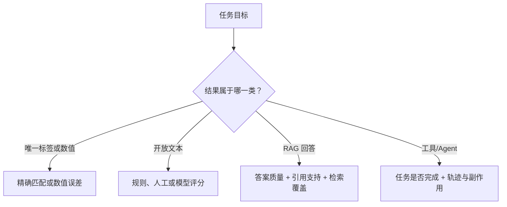
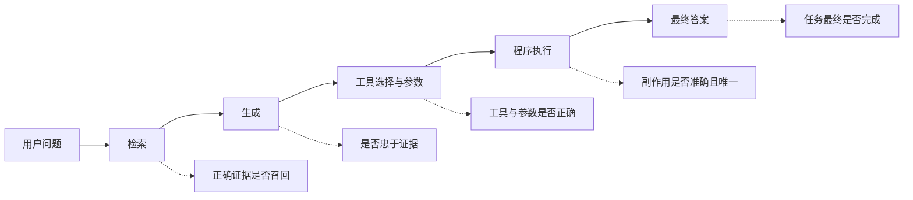
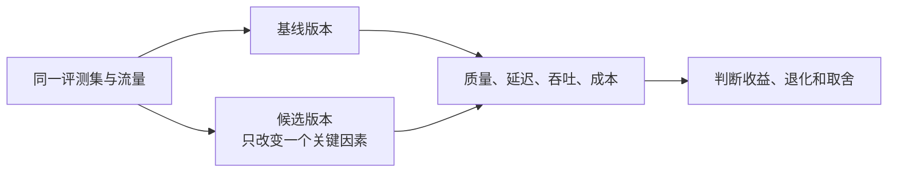

# D16：怎样知道回答和服务真的变好了？

D15 介绍了批处理、缓存和量化，但“吞吐提高”不代表回答仍然正确；D11 改进检索后，某几个示例答对也不代表真实用户普遍受益。大模型系统同时包含模型、RAG、工具、Agent 和推理服务，只看一次演示很容易把偶然结果当成改进。要做可靠判断，需要固定问题、预期和测量方法，这就是**评测（Evaluation）**。

## 1. 为什么凭感觉比较两个版本不可靠？

假设旧系统回答“出差申请需要哪些材料”正确，新系统对同一个问题也正确，但这无法说明它们在日期歧义、过期制度、权限不足、工具超时和高并发下的表现。随机换几道题又会让两个版本面对不同难度，结果不可比较。

因此首先要建立一组代表真实需求的输入，并说明每条输入期待什么结果。这组固定案例称为**评测集（Evaluation Set）**。它不只包含正常情况，还应覆盖重要边界与历史故障。

| 案例类别 | 输入示例 | 预期检查 |
| --- | --- | --- |
| 常见问题 | 出差需要哪些材料？ | 内容是否被现行制度支持 |
| 歧义输入 | 帮我订下周的票 | 是否补问日期与目的地 |
| 权限边界 | 替同事提交申请 | 是否拒绝或要求合法授权 |
| 工具失败 | 审批服务超时 | 是否如实报告并安全停止 |
| 历史回归 | 曾经重复创建的请求 | 是否只产生一次副作用 |

评测集应与真实使用分布相关，并保留独立测试部分。若一边看测试结果一边不断修改系统，系统会逐渐只适合这批题，形成另一种过拟合。

## 2. “回答正确”应该怎样变成可检查标准？

不同任务的正确含义不同。分类题可以直接比较标签；开放问答可能有多种合理表达；RAG 还要检查回答是否被资料支持；工具任务则要检查真实状态是否改变。

开放文本常需要**评分标准（Rubric）**，例如分别检查事实正确、完整、简洁和是否承认资料不足。人工评分能处理复杂语义，但成本较高且需统一尺度；模型评分效率更高，却可能受提示、模型偏好和位置顺序影响。使用模型作为裁判时，应先用人工样本校准，并保留原始输入、输出和评分理由，不能把评分模型的分数当成绝对真相。

HELM 强调在统一场景和多种指标下进行更全面、透明的模型评测，说明单一任务或单一指标难以概括模型表现。[HELM 论文](https://arxiv.org/abs/2211.09110)

## 3. RAG、工具和 Agent 应该只看最终答案吗？

最终答案能告诉我们用户是否得到结果，却不能解释为什么失败。D11 已区分源数据、检索、上下文选择和生成错误；D12、D13 又增加了工具调用与执行轨迹。因此既要做**端到端评测**，也要做**分组件评测**。

例如最终没有创建申请，可能是正确制度未召回、模型漏填参数、权限校验正确拒绝，或外部服务故障。前三者的改进方向完全不同。对于 Agent，还应检查步骤是否必要、结果是否写回状态、是否在风险动作前确认、是否按停止条件结束。

## 4. 怎样把 D15 的性能指标变成可比较证据？

D15 已说明端到端延迟、TTFT、TPOT 和吞吐分别回答不同问题；D16 不再重新定义它们，而是关注**怎样公平测量**。如果候选版本使用更短输入、更少并发或不同硬件，即使数字更好，也不能证明软件改动有效。

| 比较时要固定或记录 | 为什么 |
| --- | --- |
| 输入与输出长度分布 | 长 Prompt 和长回答的成本不同 |
| 并发与请求到达方式 | 会改变排队、批次和缓存压力 |
| 模型、精度、硬件与引擎配置 | 会直接改变计算和显存条件 |
| 成功率与回答质量 | 不能用拒答或截断换取表面低延迟 |
| 预热状态与测试时段 | 冷启动和共享负载可能扭曲结果 |

只报告平均值还会掩盖少数很慢的请求。把耗时从小到大排列后，**P50** 表示约一半请求不超过该值，**P95** 表示约 95% 请求不超过该值。评测报告应同时给出分位数和测试条件，并按输入长度、并发或场景切分，才能判断尾部延迟来自哪类请求。

## 5. 怎样确认改动导致了提升？

若同时更换模型、改 Prompt、重建索引并调整批处理，即使结果变好，也不知道哪个改动起作用。较可靠的方式是做**对照实验**：保持评测集、硬件和其他条件尽量一致，只改变一个因素，然后重复测量质量与性能。

生成具有随机性，服务负载也会波动，因此重要测试应运行足够样本和必要重复，并报告条件和分布，而不是只挑最好的一次。上线前的离线评测便于可重复比较；上线后的观察能看到真实流量，但要设置安全门槛，并区分用户选择偏差和系统变化。

## 6. 为什么每次修改都要做回归测试？

候选版本可能修复过期引用，却破坏工具参数；量化可能提高吞吐，却让某类问答质量下降。把过去已经通过的重要案例持续重跑，这叫**回归测试（Regression Testing）**。历史事故尤其适合加入回归集，防止同类问题再次出现。

评测结果不应只剩一个总分。按场景、语言、输入长度、工具类型和错误类别切分，才能发现“总体提高但长上下文明显退化”。发布门槛也应对应真实风险，例如不允许越权调用和重复付款，即使总体任务成功率上升也不能放行。成本比较也必须建立在相近任务质量和成功率上；一个因为大量拒答而显得便宜的版本，不能算有效优化。

## 7. 一份可信评测结论至少包含什么？

可信结论应说明：评测目标、数据来源与覆盖范围、模型和系统版本、Prompt 与检索配置、硬件与负载、指标定义、样本量、结果分布、失败案例和已知限制。公开排行榜可以提供参考，但它的任务分布、提示方式和硬件不一定匹配自己的系统，不能代替本地业务评测。

D16 告诉我们怎样发现哪项指标变好或变坏，最后还差一步：看到问题后，究竟该改模型、Prompt、RAG、工具、Agent 还是推理服务？D17 将把整套课程压缩成一张分层诊断与方案选择图。

本章的核心链条是：**用代表性评测集固定问题 → 为不同任务定义可检查标准 → 同时测端到端结果和组件 → 在一致条件下比较质量、延迟、吞吐与成本 → 用回归集守住已有能力。**

## 助记卡片

**卡片 1：为什么几个演示成功不能证明系统变好？**

> **答案：** 样本太少且可能被挑选，无法覆盖真实分布、边界和历史故障。

**卡片 2：评测集应包含什么？**

> **答案：** 代表真实需求的常见案例、重要边界、失败场景和历史回归案例。

**卡片 3：为什么开放问答不能总用精确匹配？**

> **答案：** 同一正确含义可能有多种表达，需要评分标准、人工或经过校准的模型评分。

**卡片 4：端到端评测与组件评测有什么区别？**

> **答案：** 前者判断最终任务是否成功，后者定位检索、生成、工具或执行中的具体问题。

**卡片 5：P95 延迟说明什么？**

> **答案：** 约 95% 请求不超过该延迟，可观察平均值掩盖的尾部慢请求。

**卡片 6：为什么吞吐和 TTFT 都要测？**

> **答案：** 吞吐反映系统总处理能力，TTFT反映单个用户看到首 Token 前的等待，两者可能互相取舍。

**卡片 7：什么是对照实验？**

> **答案：** 保持其他条件尽量一致，只改变一个关键因素并比较结果。

**卡片 8：什么是回归测试？**

> **答案：** 持续重跑过去已通过的重要案例，确认新修改没有破坏已有能力。

## 自测题

1. 为什么只用“出差材料”一道题比较两个系统不够？评测集还应增加哪些类型？
2. 对开放式制度问答，为什么精确字符串匹配可能误判？可以怎样评分？
3. 最终申请失败时，为什么还要分别评测检索、工具参数和真实副作用？
4. 平均延迟下降但 P95 上升，说明可能发生了什么？
5. 吞吐提高而 TTFT 变差，能否直接宣布优化成功？为什么？
6. 同时更换模型、Prompt、索引和推理配置后分数提高，为什么仍难以得出改进原因？
7. 为什么历史上的“重复创建申请”事故应该加入回归集，并设置独立门槛？
8. 引用公共排行榜选择模型时，还必须补充哪些本地评测条件？

完成后再看[参考答案](quiz-answers.md)。返回[知识地图](../../../knowledge-map.md)，或回顾[D15](../d15-serving-engine/README.md)。
