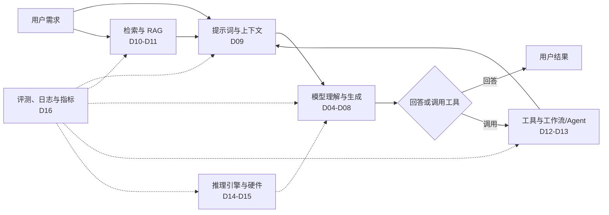
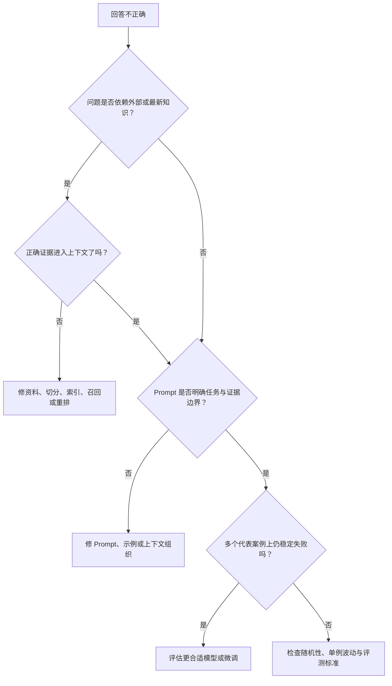
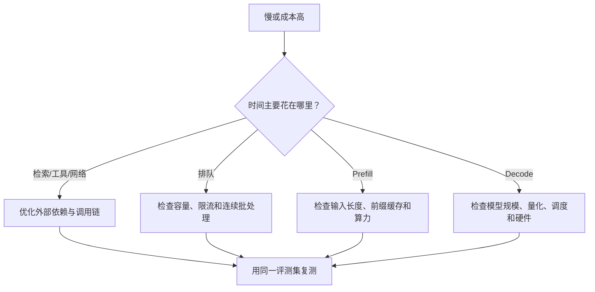
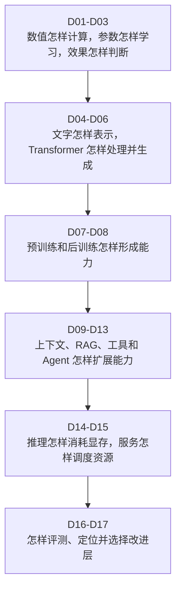

# D17：遇到问题时，应该改模型还是改系统？

D01～D16 已经分别解释模型怎样计算、学习、生成，怎样接入知识和工具，以及怎样部署和评测。真实项目中的困难是：用户只会说“回答不对”“没有执行”“系统太慢”，而原因可能散落在完全不同的层。最后一章不再增加一套新技术，而是建立一条**先定位、再选方案**的决策路径。

## 1. 为什么“换更大的模型”常常不是第一步？

假设出差助手引用旧制度、重复创建申请，并在高峰期首 Token 很慢。这三个现象分别可能来自索引版本、幂等控制和服务排队。换大模型不仅未必修复，还可能增加显存与延迟。

因此先问：**系统在哪一步第一次偏离了预期？**如果正确资料根本没进入上下文，生成模型没有机会回答对；如果工具已经成功而状态未记录，问题也不在模型知识。D16 的日志、轨迹和分组件评测正是定位证据。

## 2. 一次请求可以分成哪些诊断层？

下面这张图把前面章节重新接回一次真实请求。箭头表示信息流，虚线表示贯穿各层的评测与观测。

模型层决定理解和生成能力，RAG 层提供外部知识，工具层负责真实动作，服务层承载计算。**同一个用户现象可能跨层传播，但修复应尽量落在最早出错且最直接的层。**

## 3. 回答内容不对时怎样逐层排除？

先固定一个失败案例，保存实际输入、检索片段、模型输出和配置，再沿信息进入模型的顺序检查。

这不是机械规则：Prompt 无法给模型补充不存在的知识，RAG 也无法稳定改变输出风格；微调可以改变行为，却不适合频繁同步制度事实。选择方案要匹配问题来源。

| 主要问题 | 优先方案 | 不应首先依赖 |
| --- | --- | --- |
| 一次请求的要求不清 | 改 Prompt 和上下文 | 重新预训练 |
| 大量且常更新的私有知识缺失 | RAG | 把所有事实写进微调参数 |
| 稳定任务行为或格式长期不佳 | 更合适模型、SFT或微调 | 每次无限堆 Prompt |
| 需要实时数据或真实动作 | 工具调用 | 让模型凭文字假装执行 |

## 4. “没有完成任务”时应该看哪里？

工具类任务先区分模型是否提出了正确调用、程序是否通过校验、外部系统是否成功、状态是否正确写回，以及工作流是否在适当时机停止。

| 失败证据 | 优先检查层 | 典型修复 |
| --- | --- | --- |
| 选择了错误工具 | 模型决策与工具说明 | 改清工具边界，增加对比案例或换模型 |
| 参数缺失或类型错误 | Schema、Prompt与参数校验 | 明确必填字段并补问 |
| 无权限仍执行 | 程序安全控制 | 在模型外实施授权与拒绝 |
| 成功调用被重复执行 | 状态与幂等 | 请求标识、状态查询和去重 |
| 反复失败仍循环 | Agent 控制 | 重试上限、预算和人工接管 |
| 工具成功但回复失败 | 结果反馈与生成 | 规范返回结构并检查结果理解 |

高风险动作的安全控制必须位于可信程序中。即使更强模型减少误调用，也不能替代权限、确认、审计和幂等。

## 5. 系统慢或贵时怎样选择优化层？

先把端到端耗时拆成检索、工具、排队、Prefill 和 Decode。不同瓶颈对应不同方案：检索慢应优化索引或查询；排队高要看容量和调度；长 Prompt 导致 Prefill 高可精简上下文或复用前缀；Decode 慢可评估模型规模、量化、批处理和硬件。

任何性能优化都要回到 D16 同时验证质量和风险。减少检索片段能降低 Prefill，却可能漏掉证据；量化能减少显存，却可能影响任务质量；扩大批次能提高吞吐，却可能恶化 TTFT。

## 6. 怎样形成可重复的问题处理流程？

遇到问题时，可以按下面六步推进：

1. **复现现象：** 固定输入、版本、配置和环境，确认问题可以重现。
2. **定义预期：** 写清正确输出、允许范围和不能发生的风险。
3. **找到首次偏离：** 检查资料、检索、上下文、生成、工具、状态和服务指标，找到最早异常证据。
4. **选择最小改动：** 在直接负责该问题的层修改，避免同时改多个变量。
5. **对照验证：** 在原失败案例和代表性评测集上比较质量、性能与成本。
6. **加入回归：** 把重要失败案例保留下来，防止后续版本复发。

这个流程的重点不是永远只改一个文件，而是让“问题—证据—改动—结果”可追踪。若一次改动必须跨层，也应分别说明每层解决什么，并分阶段验证。

## 7. 第一轮知识脉络最终拼成什么？

第一轮的目标不是记住全部术语，而是看到一个问题时能指出它属于哪条链：训练是否改变参数，请求如何进入上下文，外部知识怎样检索，动作由谁执行，Token 怎样生成，显存和时间花在哪里，以及用什么证据判断改进。后续深入 AI Infra / 推理工程时，可以从 D14～D16 继续进入 GPU 架构、推理引擎实操、压测、量化、多卡和平台治理；这些属于下一阶段，不在当前速成主线中加入实验。

本章也是整轮课程的最终判断：**先用评测与轨迹找到最早出错的层，再选择 Prompt、RAG、工具控制、模型或推理服务中最直接的方案，最后用同一标准验证并加入回归。**

## 助记卡片

**卡片 1：为什么不应遇到问题就先换大模型？**

> **答案：** 错误可能来自资料、检索、工具、状态或服务，换模型既不直接修复，还可能增加成本。

**卡片 2：修复应优先落在哪里？**

> **答案：** 落在有证据显示最早偏离预期、且直接负责该问题的层。

**卡片 3：正确证据已经进入上下文，但格式仍长期不稳定，应怎样推进？**

> **答案：** 先明确 Prompt 和示例；若在代表性案例上仍稳定失败，再评估更合适模型或微调，而不是继续改 RAG。

**卡片 4：最新制度未进入模型上下文，应优先改哪里？**

> **答案：** 先检查源文档、版本、索引、召回和上下文选择，不先更换生成模型。

**卡片 5：模型选对工具却重复创建记录，应优先改哪里？**

> **答案：** 修复执行端的状态记录和幂等控制，而不是只调整模型提示词。

**卡片 6：工具安全为什么不能只靠更强模型？**

> **答案：** 权限、确认、审计和幂等必须由可信程序强制执行，模型输出不能作为安全边界。

**卡片 7：性能优化前为什么要拆分端到端耗时？**

> **答案：** 外部依赖、排队、Prefill 和 Decode 的修复手段不同，未定位就调参可能没有效果。

**卡片 8：修复后为什么要加入回归？**

> **答案：** 保留失败案例能检查后续改动是否让同类问题重新出现。

## 自测题

1. 助手引用了过期制度。为什么“换更大模型”不是最直接方案？应先检查什么？
2. 正确资料已经进入上下文，但模型始终不按指定格式回答。Prompt、微调和 RAG 中应优先考虑哪些，为什么？
3. 模型正确生成创建申请的调用，但同一申请产生了两份。问题主要在哪层？怎样修复？
4. 高峰期 TTFT 很高，而实际 Prefill 时间没有明显变化。应优先检查哪一层？
5. 为降低 Prefill 删除一半检索片段后速度提高。为什么还不能直接上线？
6. 请把“复现—预期—定位—改动—验证—回归”六步应用到一次工具超时后模型误报成功的问题。
7. 面对“回答不知道最新价格”“输出风格长期不稳定”“需要真的发送邮件”三个需求，分别优先选择哪类方案？
8. 用自己的话串起 D01～D17：模型能力、外部知识、真实动作、推理服务和评测分别处于什么位置？

完成后再看[参考答案](quiz-answers.md)。返回[知识地图](../../../knowledge-map.md)，或回顾[D16](../d16-evaluation/README.md)。
