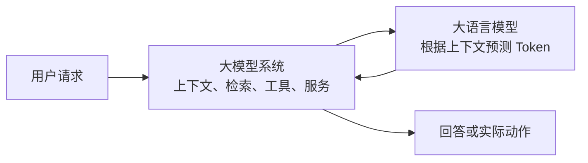
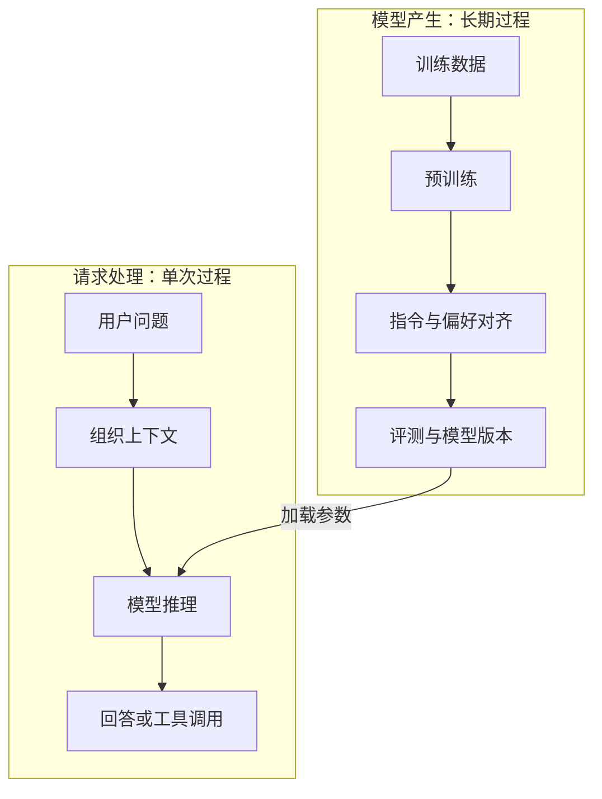
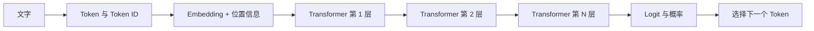
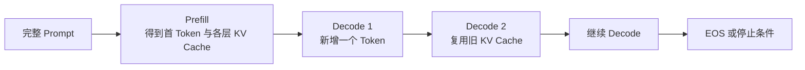
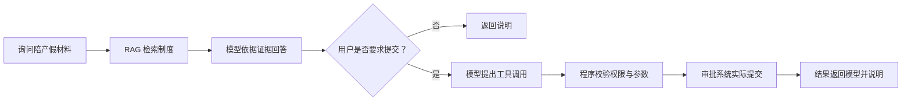
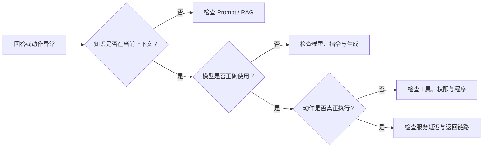

# D01～D17 阶段总结：一个大模型系统怎样从数据走到回答？

D01～D17 分别解释了计算、训练、生成、外部知识、工具和推理服务。阶段总结不再逐章重讲，而是回答一个更大的问题：**这些机制怎样组合成一个能回答问题、执行动作并持续改进的大模型系统？**

## 1. 先把“模型”和“系统”分开

用户输入“陪产假需要哪些材料”，最终看到的是一段自然语言回答，但背后至少有两层。**大语言模型**保存训练得到的参数，根据当前上下文预测下一个 Token；**大模型系统**还负责组织 Prompt、检索公司制度、执行工具、调度 GPU、记录指标并判断结果是否可靠。

因此，“模型会回答”不能推出“系统知道最新制度”，也不能推出“系统真的提交了请假申请”。知识是否最新、动作是否发生、请求是否及时完成，分别依赖不同组件。

## 2. 系统有两条不同的时间线

第一条是**模型产生过程**：先用大量文本预训练，让参数学会语言与知识规律；再通过指令微调和偏好优化，使模型更愿意遵循任务与人类偏好；经过评测后，某个模型版本才被部署。这里的训练会改变参数。

第二条是**一次请求处理过程**：用户请求到来后，系统组织本次上下文，按需检索资料或调用工具，再使用已经训练好的参数生成回答。普通推理只使用参数，不会因为用户纠正一句话就立即完成训练。

这一区分是整个阶段最重要的边界：**训练改变长期参数；Prompt、RAG 和工具主要改变当前请求能利用的信息与能力。**

## 3. 模型内部始终在处理数值，不是在传递原句

文字先被 Tokenizer 切成 Token，再映射为 Token ID。模型不会直接计算“陪产假”这几个汉字，而是通过 Embedding 把 Token ID 变成隐藏向量，并加入位置信息。隐藏向量进入多层 Transformer 后不断变化，但序列位置仍与原 Token 位置对应。

每层的 Attention 让当前位置根据 Query 与各历史位置的 Key 匹配程度，对对应 Value 做加权汇总；前馈网络再对每个位置的表示进行非线性变换。残差连接保留旧表示的通路，层归一化帮助数值保持稳定。经过所有层后，最后一个位置的隐藏向量被转换为每个候选 Token 的 Logit，再经 Softmax 得到概率。

隐藏向量不是原文字的副本，而是模型为当前预测逐层形成的数值表示。**Token 身份没有在网络中被改写；改变的是与每个位置对应的隐藏向量。**

## 4. 一个回答为什么要循环生成？

Transformer 一次前向计算得到的是“下一个 Token”的概率，而不是直接得到完整答案。系统按贪心或采样策略选出一个 Token，把它追加到序列，再预测下一个，直到遇到 EOS、长度上限或其他停止条件。这就是**自回归生成**。

首次处理完整 Prompt 的阶段称为 **Prefill**。它同时计算输入位置，并为每层留下 Key 和 Value；后续每次只加入一个新 Token 的阶段称为 **Decode**。Decode 仍要经过所有 Transformer 层，但可以读取历史位置的 **KV Cache**，避免反复计算旧 Token 的 K/V。

KV Cache 是每个请求、每一层的历史注意力状态，不是下一层的输入。层与层之间传递的是隐藏向量；KV Cache 留在本层，供该层后续 Decode 使用。

## 5. 模型能力可以从三个位置补充

当模型回答不好时，不能条件反射地“重新训练”。先判断缺少的是长期行为、当前信息还是外部动作。

| 缺口 | 主要机制 | 改变什么 | 适合解决什么 |
| --- | --- | --- | --- |
| 长期能力或行为不合适 | 预训练、SFT、偏好优化、LoRA | 模型参数 | 稳定任务模式、领域表达、行为偏好 |
| 本次回答缺少条件或资料 | Prompt、上下文、RAG | 当前输入 | 指令、示例、聊天历史、最新私有知识 |
| 需要查询实时状态或执行动作 | 工具调用 | 外部系统状态 | 查余额、下订单、提交审批、精确计算 |

以陪产假问题为例：公司最新制度不适合依赖模型训练记忆，应该由 RAG 检索制度文档并加入上下文；如果用户随后要求提交申请，模型只能生成结构化调用意图，真正的权限校验和提交必须由程序执行。

## 6. RAG、工具和 Agent 不是同一件事

**RAG**先从外部资料中找到与问题相关的片段，再把片段加入上下文，让模型依据证据生成。检索错误与生成错误需要分开：没找到正确制度是检索问题；资料正确却回答错了才主要是生成或上下文组织问题。

**工具调用**让模型提出“调用哪个工具以及传什么参数”，程序负责校验、授权和实际执行，再把结果返回模型。模型输出一段“已提交”并不能证明动作发生，只有工具执行结果才是外部状态改变的证据。

**Agent**把模型、工具、状态和循环组织成多步骤过程。它每一步根据当前状态选择下一动作，并在成功、失败、预算耗尽或达到步数上限时停止。固定步骤明确的任务优先使用工作流；只有确实需要动态决策时，才增加 Agent 的自由度。

## 7. 同一个模型为什么还会有不同的服务性能？

模型权重加载到 GPU 后，请求仍会经历排队、Prefill 和多轮 Decode。显存主要容纳权重、KV Cache、临时激活与运行时工作区；请求越多、上下文越长，KV Cache 压力越大。推理引擎通过连续批处理把不同请求当前需要处理的 Token 合并，通过 PagedAttention 分块管理 KV Cache，通过前缀缓存复用相同开头的计算结果。

量化用较少位数近似权重或缓存，首先减少存储和数据搬运，但是否加速还取决于硬件与 Kernel。等待更大的批次可能提高吞吐，却增加排队和 TTFT；限制批次可能降低单请求延迟，却减少总体容量。因此**延迟、吞吐、显存、质量和成本必须一起看。**

## 8. 评测必须覆盖整条链，而不是只看最终回答

如果系统回答错了，应沿请求路径定位：资料是否正确、检索是否召回、上下文是否组装合理、模型是否遵循证据、工具是否执行成功、服务是否超时。只给最终回答打一个总分，会把不同原因混在一起。

改进前后还要使用相同模型目标、测试集、输入输出条件和负载，分别观察质量、TTFT、TPOT、吞吐、错误率与成本。一个平均值变好不代表所有场景变好，还需关注失败类别和尾部请求。

## 9. 把 D01～D17 压缩成六个判断

| 知识块 | 对应章节 | 学完后应能做出的判断 |
| --- | --- | --- |
| 数值怎样学习 | D01～D03 | 区分前向计算、损失、梯度更新与验证泛化 |
| 文字怎样生成 | D04～D06 | 从 Token、隐藏向量、Attention 串到下一个 Token 概率 |
| 能力怎样形成 | D07～D08 | 区分预训练、指令微调、偏好优化与参数高效微调 |
| 当前请求怎样增强 | D09～D13 | 判断应使用 Prompt、RAG、工具、工作流还是 Agent |
| 模型怎样被服务 | D14～D15 | 解释 Prefill、Decode、KV Cache、批处理及显存—延迟取舍 |
| 系统怎样验证和改进 | D16～D17 | 沿组件定位错误，并选择改模型、数据还是系统 |

阶段一真正要形成的不是术语记忆，而是一条判断链：**先确认问题发生在哪个生命周期和组件，再选择改变参数、改变上下文、接入外部系统或优化推理服务。**D18 以后将在这条链上继续向 GPU 和推理引擎内部深入。

## 阶段助记卡片

**卡片 1：大语言模型与大模型系统的区别是什么？**

> **答案：** 模型根据上下文预测 Token；系统还负责上下文、检索、工具、服务和评测。

**卡片 2：训练与普通推理的核心区别是什么？**

> **答案：** 训练根据损失与梯度更新参数；普通推理使用已有参数完成当前请求。

**卡片 3：真正穿过 Transformer 多层的是什么？**

> **答案：** 与各 Token 位置对应的隐藏向量；Token ID 本身不会在每层之间流动。

**卡片 4：Attention 中 Q、K、V 分别承担什么作用？**

> **答案：** Query 表示当前位置要找什么，Key 表示各位置可被怎样匹配，Value 是匹配后实际汇总的信息。

**卡片 5：Prefill 与 Decode 怎样衔接？**

> **答案：** Prefill 处理完整输入并建立各层 KV Cache；Decode 每轮新增一个 Token，并复用历史缓存。

**卡片 6：RAG 与微调改变的对象有什么不同？**

> **答案：** RAG 把检索资料加入当前上下文；微调通过训练改变模型参数。

**卡片 7：工具调用为什么不能只相信模型文本？**

> **答案：** 模型只提出调用意图，外部动作必须由程序校验和执行，并以执行结果为准。

**卡片 8：工作流与 Agent 的主要区别是什么？**

> **答案：** 工作流的步骤和分支较固定；Agent 根据中间状态动态选择下一动作。

**卡片 9：量化为什么不保证一定加速？**

> **答案：** 它减少存储和搬运，但实际速度还取决于硬件、Kernel、额外转换和原瓶颈。

**卡片 10：系统出错时为什么要分层评测？**

> **答案：** 检索、上下文、生成、工具和服务可能产生不同错误，只有分层才能选择正确改进位置。

## 阶段自测题

1. 用户纠正模型一次后，为什么不能认为模型参数已经学会了这条知识？
2. 从文字 Prompt 到生成第一个 Token，按顺序说明模型内部的主要过程。
3. 隐藏向量经过多层后不断变化，为什么仍能说它与原 Token 位置一一对应？
4. 公司制度每月变化，应该优先微调模型还是使用 RAG？说明理由。
5. 模型输出“请假申请已提交”，为什么还不能据此认为提交成功？
6. 一个任务步骤固定，但团队仍使用高度自主 Agent，可能增加哪些风险？
7. 请求 TTFT 很高，为什么不能直接认定模型 Prefill 太慢？
8. 服务量化后显存下降，但 TPOT 没有改善，给出两个可能原因。
9. RAG 系统回答错误时，怎样区分检索问题和生成问题？
10. 面对“答案不准且响应慢”，请给出从问题拆分到选择改进层的诊断顺序。

完成后再看[阶段自测参考答案](quiz-answers.md)。接下来可进入[D18～D32 推理工程原理](../../02-inference/README.md)，或返回[知识地图](../../../knowledge-map.md)。
