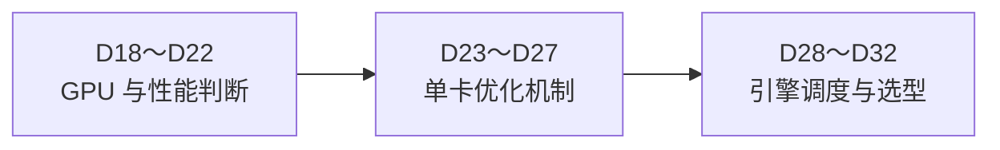

# 推理工程原理：D18～D32

本阶段承接 D14～D17 的推理概览，继续向下解释 GPU 执行、性能瓶颈、单卡优化和推理引擎调度。当前仍采用**正文与图示 → 助记卡片 → 自测题**，不安排环境、代码或部署实验。

## 第一部分：GPU 与性能判断

- [D18：一次模型推理怎样落到 GPU 上？](d18-gpu-execution/README.md)
- [D19：GPU 为什么需要多层存储？](d19-gpu-memory/README.md)
- [D20：怎样判断推理受计算还是数据搬运限制？](d20-compute-memory-bound/README.md)
- [D21：怎样估算模型推理需要多少显存？](d21-memory-estimation/README.md)
- [D22：怎样判断一次推理到底慢在哪里？](d22-performance-diagnosis/README.md)

## 第二部分：单卡优化机制

- [D23：量化怎样真正参与推理计算？](d23-quantization-execution/README.md)
- [D24：算子融合为什么可能提升速度？](d24-operator-fusion/README.md)
- [D25：FlashAttention 为什么能减少注意力的显存访问？](d25-flash-attention/README.md)
- [D26：KV Cache 可以怎样减少显存压力？](d26-kv-cache-optimization/README.md)
- [D27：推测解码为什么可能一次生成多个 Token？](d27-speculative-decoding/README.md)

## 第三部分：引擎调度与选型

- [D28：推理引擎怎样管理一个请求的完整生命周期？](d28-request-lifecycle/README.md)
- [D29：Prefill 和 Decode 怎样共享一张 GPU？](d29-mixed-scheduling/README.md)
- [D30：资源不够时，推理引擎应该先服务谁？](d30-preemption-fairness/README.md)
- [D31：为什么不同请求需要不同的推理配置？](d31-workload-aware-serving/README.md)
- [D32：vLLM、SGLang 与 TensorRT-LLM 应该怎样选择？](d32-engine-selection/README.md)

建议从 D18 顺序阅读。每天 4 小时时通常可安排两章，遇到显存公式、Roofline 或调度策略时可放慢；资料已生成不表示已经阅读或掌握。
