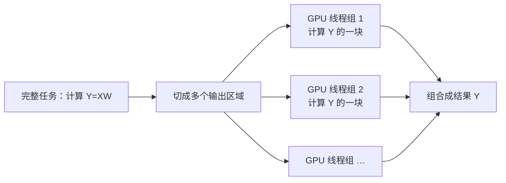

# D18：一次模型推理怎样落到 GPU 上？

D14 已经把推理分成 Prefill 和 Decode，但“GPU 在计算”仍然过于笼统：GPU 是一块硬件，它为什么知道该算矩阵乘法，又怎样把一个大矩阵分给许多计算单元？本章先看一个具体计算，再自然区分**算子、Kernel 和 GPU**。

## 1. GPU 是什么，为什么模型推理需要它？

GPU（Graphics Processing Unit，图形处理器）是一块擅长大规模规则并行计算的硬件。它有自己的计算单元和显存，但不会理解“北京是中国的”或“运行 Transformer”这样的语义；它只能按照程序指令，对显存中的数字执行加法、乘法、读取和写入等操作。

模型权重可以看成大量已经训练好的数字。服务启动时，程序把权重放入 GPU 显存；请求到达后，CPU 通常先把文字转成 Token ID，再把 Token ID 送到 GPU，通过 Embedding 查表得到输入向量。现在显存里虽然已经有输入和权重，GPU 仍然不知道下一步做什么，因为**数据不会自己触发计算，硬件还需要接收可执行的工作指令。**

GPU 与 CPU 都能计算，但组织方式不同。CPU 的少量强大核心适合复杂控制、分支和低延迟串行任务；GPU 拥有大量适合执行相同指令的并行计算单元。当模型需要完成大规模矩阵乘法时，许多结果元素可以同时计算，正好能利用 GPU 的并行能力。

## 2. 先看一个矩阵乘法怎样被并行计算

假设隐藏向量矩阵 X 和权重矩阵 W 都是 2×2：

```text
X = [1  2]    W = [5  6]
    [3  4]        [7  8]
```

模型需要得到 Y=XW。Y 有四个位置，每个位置都由 X 的一行与 W 的一列做向量点积：

```text
Y₁₁ = 1×5 + 2×7 = 19    Y₁₂ = 1×6 + 2×8 = 22
Y₂₁ = 3×5 + 4×7 = 43    Y₂₂ = 3×6 + 4×8 = 50
```

这四个位置都读取 X 和 W，但彼此不需要等待对方的最终结果，因此可以把它们分给不同计算单元同时处理。真实模型的矩阵远大于 2×2，不能简单做到“一个结果位置对应一个固定单元”，但核心直觉相同：**先把大计算切成许多小块，再让大量 GPU 线程并行处理。**



到这里还缺一个关键角色：谁规定输入是 X 和 W、结果必须是 XW，又是谁规定怎样分块、开多少线程、从哪里读取数据？这正是算子与 Kernel 的分工。

## 3. 算子、Kernel 和 GPU 分别是什么？

程序首先需要用一种与具体硬件无关的方式表达“要得到什么结果”。例如矩阵乘法只规定输入 X、W 和结果 Y=XW，这个具有明确输入、输出和数学规则的计算任务称为**算子（operator）**。Attention、Softmax、LayerNorm 和矩阵乘法都可以被表示为算子。

但是，“计算 Y=XW”还不是 GPU 可以直接执行的完整方案。不同 GPU 的计算单元、片上存储和支持的数据类型不同；同一个矩阵乘法也可能面对小矩阵、大矩阵、FP16 或 INT8 等不同情况。程序还需要决定怎样分块、怎样安排线程、何时读取 X/W、结果写到哪里。这个实际在 GPU 上运行的并行程序称为 **Kernel（内核）**。

最后，**GPU 是执行 Kernel 的物理硬件**。Kernel 运行时，GPU 中许多线程按方案读取 X 和 W、完成乘加并把 Y 写回显存。三者可以用下面的对应关系区分。

| 层级 | 它回答的问题 | 矩阵乘法中的例子 |
| --- | --- | --- |
| 算子 | 数学上要算什么？ | 输入 X、W，输出 Y=XW |
| Kernel | 在这种 GPU 上具体怎样算？ | 怎样分块、分配线程、读取数据和写回结果 |
| GPU | 谁真正执行这些指令？ | 运行 Kernel 的计算单元、显存及相关硬件 |


算子与 Kernel 并不保证严格一一对应。后端可能用多个 Kernel 完成一个复杂算子，也可能把几个相邻算子融合成一个 Kernel。但在当前阶段可以先记住：**算子描述计算语义，Kernel 是硬件执行方案，GPU 是执行方案的设备。**

同一个算子可以有多个 Kernel 实现。面对不同矩阵形状或 GPU，后端会选择更合适的实现；这就是为什么模型结构相同，换一个推理后端或硬件后速度仍可能不同。

## 4. Transformer 为什么会连续启动许多 Kernel？

理解三者后，再看 Transformer 就不会只剩术语。一个 Transformer 层包含 Q/K/V 投影、注意力、输出投影、前馈网络、归一化等算子。推理后端为这些算子选择或生成 Kernel；GPU 按依赖顺序执行它们。前一步产生的隐藏向量通常是后一步的输入，因此不能把所有 Kernel 无条件同时运行。模型有几十层时，一次前向计算就会形成一条很长的 Kernel 序列。

Kernel 每次启动和读写中间结果都有开销。后续会看到，**算子融合**试图减少启动次数和中间数据往返；CUDA Graph 等机制试图减少重复提交相同工作时的 CPU 调度开销。现在只需要记住：模型结构描述逻辑计算，推理后端把它转换为适合目标 GPU 的执行方式。

## 5. Prefill 与 Decode 在 GPU 上有什么不同？

Prefill 一次处理 Prompt 中的许多 Token，矩阵通常较大，容易形成充分并行的计算。Decode 每一步对每个请求只新增一个 Token，虽然仍要走过所有层，但单步工作较小，还要读取此前积累的 KV Cache。于是两者调用相似的模型结构，却可能受到不同资源限制。

**一次推理不是“GPU 运行一次模型就结束”，而是 Prefill 执行一轮大规模前向计算，随后 Decode 为每个新 Token 重复执行一轮前向计算。**推理引擎通过批处理，把多个请求当前需要处理的 Token 合在一起，增大每轮 GPU 工作规模。

## 6. 接回推理工程主线

从程序到结果的链条现在可以写成：模型结构规定一串算子，推理后端为算子选择 Kernel，GPU 执行 Kernel，从显存读取输入和权重，完成运算后写回新的隐藏向量。性能问题因此可能来自工作太少、计算太多、数据搬运太多或启动调度过多。D19 将进一步解释 GPU 内部为什么存在多层存储，以及“数据放在哪里”怎样影响速度。

## 助记卡片

**卡片 1：GPU 是什么？**

> **答案：** GPU 是擅长大规模规则并行计算的硬件，按照 Kernel 指令读取数字、执行运算并写回结果。

**卡片 2：算子描述什么？**

> **答案：** 算子描述输入、输出及数学计算规则，也就是“要算什么”。

**卡片 3：Kernel 描述什么？**

> **答案：** Kernel 是在 GPU 上运行的具体并行程序，规定怎样分块、安排线程、读取数据和写回结果。

**卡片 4：为什么同一个算子可以有不同 Kernel？**

> **答案：** 矩阵形状、数据类型和 GPU 结构不同，最高效的分块、线程与数据访问方案也不同。

**卡片 5：GPU 为什么适合 Transformer 的矩阵运算？**

> **答案：** 矩阵中大量同类乘加可以并行执行，GPU 有大量适合这种规则并行工作的计算单元。

**卡片 6：为什么 Transformer 会启动许多 Kernel？**

> **答案：** 多层中的投影、注意力、归一化和前馈网络具有前后依赖，需要按顺序完成多个运算。

**卡片 7：Prefill 与 Decode 的 GPU 工作规模有何不同？**

> **答案：** Prefill 同时处理许多输入 Token；Decode 每个请求每步通常只新增一个 Token，需要多次重复前向计算。

## 自测题

1. 用“要算什么—怎样算—谁执行”分别解释算子、Kernel 和 GPU。
2. 计算 Y=XW 时，为什么 Y 的不同区域可以交给多个 GPU 线程组并行处理？
3. 为什么同一个矩阵乘法算子在小矩阵、超大矩阵或不同 GPU 上可能选择不同 Kernel？
4. 为什么前后有数据依赖的两个 Kernel 不能随意同时运行？
5. Prefill 和 Decode 都经过 Transformer，为什么 GPU 上的工作规模仍可能不同？
6. 如果一个 Kernel 几乎不花时间计算，却频繁读写显存，增加更多计算单元一定有用吗？为什么？

完成后再看[参考答案](quiz-answers.md)。返回[推理工程路线](../../../roadmap.md)，或继续学习[D19](../d19-gpu-memory/README.md)。
