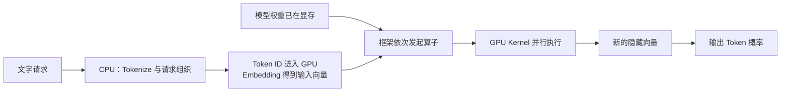
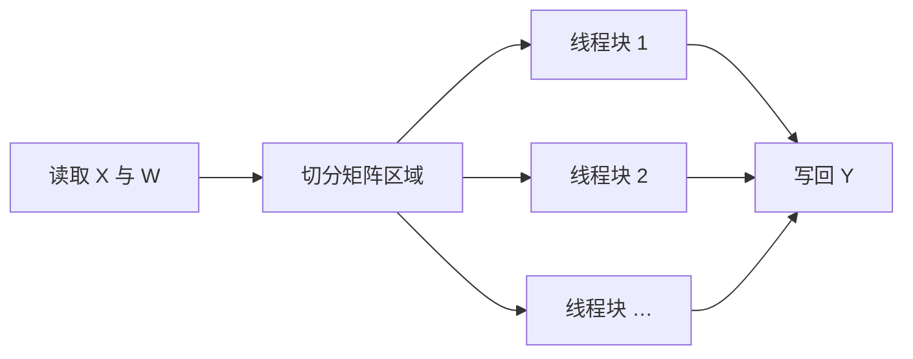

# D18：一次模型推理怎样落到 GPU 上？

D14 已经把推理分成 Prefill 和 Decode，但“GPU 在计算”仍然过于笼统。本章沿用“北京是中国的”这个请求，追踪隐藏向量怎样从程序中的数据，变成 GPU 真正执行的工作。

## 1. 模型文件本身不会自动计算

模型权重可以看成大量已经训练好的数字。服务启动时，程序读取这些数字并把它们放入 GPU 显存；请求到达后，Tokenizer 通常先在 CPU 一侧把文字变成 Token ID，再把 Token ID 送到 GPU，由 GPU 上的 Embedding 查表得到对应的输入向量。此时显存里虽然有权重和输入，却还没有产生答案，因为硬件还需要收到“对哪些数据执行什么运算”的指令。

模型框架会按 Transformer 的结构发起矩阵乘法、归一化、激活函数和注意力等运算。一个已经确定输入、输出和计算规则的运算单元通常称为**算子（operator）**；GPU 上实际并行执行某个算子的函数称为 **Kernel（内核）**。算子描述“要算什么”，Kernel 决定“怎样让这块硬件去算”。

## 2. GPU 为什么适合这些运算？

Transformer 的大量工作可以写成矩阵乘法。例如一批隐藏向量组成矩阵 X，与权重矩阵 W 相乘得到 Y=XW。Y 中不同位置的大量乘加运算可以同时计算。CPU 擅长复杂控制和低延迟的串行任务；GPU 拥有大量较简单的并行执行单元，适合把同一种乘加操作同时应用于许多数据。

这里的“并行”不是把请求混在一起。批次中的不同请求只是 X 的不同区域，共享权重 W，却保留各自的输出位置和注意力边界。GPU 同时算出多行结果，推理引擎再按照请求映射取回各自的结果。

## 3. 一个算子怎样成为一次 GPU 工作？

以 Y=XW 为例，框架不会逐个元素通知 GPU。它会准备输入地址、形状和数据类型，然后启动相应 Kernel。Kernel 把大问题切成许多小块，不同线程块处理不同区域，最后把结果写回显存。这个过程涉及三件不同的事：**从显存读取数据、在计算单元中运算、把结果写回显存**。

因此，一个算子耗时不只由乘法次数决定。如果数据搬运时间更长，增加计算单元也未必有效；如果问题规模太小，GPU 的大量执行单元又可能没有足够工作。这为 D19、D20 的显存层级和性能瓶颈留下了问题。

## 4. Transformer 为什么会连续启动许多 Kernel？

一个 Transformer 层包含 Q/K/V 投影、注意力、输出投影、前馈网络、归一化等步骤。前一步产生的隐藏向量通常是后一步的输入，因此层内和层间存在依赖，不能把所有步骤无条件同时执行。模型有几十层时，一次前向计算就会形成一条很长的 Kernel 序列。

Kernel 每次启动和读写中间结果都有开销。后续会看到，**算子融合**试图减少启动次数和中间数据往返；CUDA Graph 等机制试图减少重复提交相同工作时的 CPU 调度开销。现在只需要记住：模型结构描述逻辑计算，推理后端把它转换为适合目标 GPU 的执行方式。

## 5. Prefill 与 Decode 在 GPU 上有什么不同？

Prefill 一次处理 Prompt 中的许多 Token，矩阵通常较大，容易形成充分并行的计算。Decode 每一步对每个请求只新增一个 Token，虽然仍要走过所有层，但单步工作较小，还要读取此前积累的 KV Cache。于是两者调用相似的模型结构，却可能受到不同资源限制。

**一次推理不是“GPU 运行一次模型就结束”，而是 Prefill 执行一轮大规模前向计算，随后 Decode 为每个新 Token 重复执行一轮前向计算。**推理引擎通过批处理，把多个请求当前需要处理的 Token 合在一起，增大每轮 GPU 工作规模。

## 6. 接回推理工程主线

从程序到结果的链条现在可以写成：框架按模型结构发起算子，后端为硬件选择 Kernel，Kernel 从显存读取数据并行计算，再把新的隐藏向量写回。性能问题因此可能来自工作太少、计算太多、数据搬运太多或启动调度过多。D19 将进一步解释 GPU 内部为什么存在多层存储，以及“数据放在哪里”怎样影响速度。

## 助记卡片

**卡片 1：模型权重加载到显存后，为什么还不会自动产生答案？**

> **答案：** 权重只是数据，程序还要按模型结构发起算子，由 GPU Kernel 对输入和权重执行运算。

**卡片 2：算子与 Kernel 有什么区别？**

> **答案：** 算子描述逻辑上要完成的运算，Kernel 是该运算在 GPU 上的具体并行实现。

**卡片 3：GPU 为什么适合 Transformer 的矩阵运算？**

> **答案：** 矩阵中大量同类乘加可以并行执行，GPU 有大量适合这种规则并行工作的执行单元。

**卡片 4：批处理为什么不会把不同请求的结果混起来？**

> **答案：** 请求共享模型权重，但输入、中间结果、注意力边界和输出位置都有独立映射。

**卡片 5：一个 Kernel 的主要过程是什么？**

> **答案：** 从存储中读取数据，把任务切给并行线程执行，再将结果写回存储。

**卡片 6：为什么 Transformer 会启动许多 Kernel？**

> **答案：** 多层中的投影、注意力、归一化和前馈网络具有前后依赖，需要按顺序完成多个运算。

**卡片 7：Prefill 与 Decode 的 GPU 工作规模有何不同？**

> **答案：** Prefill 同时处理许多输入 Token；Decode 每个请求每步通常只新增一个 Token，需要多次重复前向计算。

## 自测题

1. 从文字请求到 GPU 产生新隐藏向量，中间至少经过哪些环节？
2. 为什么“模型有很多参数”不能单独说明 GPU 一定很忙？
3. 两个请求批量执行同一个矩阵乘法时，共享什么，什么仍然独立？
4. 为什么前后有数据依赖的两个算子不能随意同时运行？
5. Prefill 和 Decode 都经过 Transformer，为什么硬件利用特征仍可能不同？
6. 如果一个运算几乎不花时间计算，却频繁读写显存，增加更多计算单元一定有用吗？为什么？

完成后再看[参考答案](quiz-answers.md)。返回[推理工程路线](../../../roadmap.md)，或继续学习[D19](../d19-gpu-memory/README.md)。
