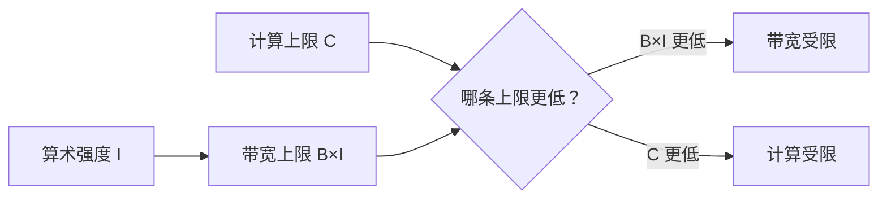

# D20：怎样判断推理受计算还是数据搬运限制？

D19 区分了计算与数据搬运，但一次算子两者都会发生。要决定该减少计算还是减少访存，需要比较“做这项工作需要多少运算”与“为它搬了多少数据”。

## 1. 两个工作量相同的算子可能完全不同

设想两个算子都完成 1000 次乘加。算子 A 只读取一次小数据块并反复使用；算子 B 每做少量运算就读取一批新数据。虽然计算次数相同，B 更可能等待显存。可见 FLOPs 只描述浮点运算数量，不能单独决定耗时。

为了把两者联系起来，可以计算**算术强度（Arithmetic Intensity）**：

算术强度 = 运算次数 ÷ 从较慢存储搬运的字节数

这里的运算次数通常用 FLOPs 表示，字节数必须说明针对哪一级存储。教学中通常先关注显存流量。算术强度高，表示每搬一份数据能做较多计算；算术强度低，表示大量时间可能花在搬数据上。

## 2. 硬件有两条不同上限

假设某设备峰值计算能力为 C FLOPs/s，显存带宽为 B byte/s。对于算术强度为 I FLOPs/byte 的算子，带宽最多能供给 B×I FLOPs/s 的工作，因此可达到的性能不会超过：

可达性能 ≤ min(C, B×I)

公式中的 min 表示取两者较小值，因为计算单元和带宽中先被耗尽的资源会形成上限。这种用两条上限判断瓶颈的方法称为 **Roofline 模型**。

Roofline 是分析模型，不是只看一次监控读数就能得到的绝对判决；实际还会受到 Kernel 效率、并行度、缓存命中和调度影响。

## 3. 用一个简化数字例子判断

假设 GPU 的计算上限 C=100，带宽 B=20。这里省略具体单位，只比较相同口径。

- 算子 A 的 I=2，则 B×I=40，可达上限为 min(100,40)=40，更可能**带宽受限**。
- 算子 B 的 I=10，则 B×I=200，可达上限为 min(100,200)=100，更可能**计算受限**。

把 A 的运算再优化一半不一定明显加速，因为它主要在等数据；减少数据读取或提高复用更直接。对 B 而言，提高带宽未必有用，减少运算或使用更高效的计算精度更可能有效。

## 4. Prefill 与 Decode 为什么常落在不同区域？

Prefill 同时处理许多 Token，大矩阵乘法能让权重数据服务于较多运算，算术强度通常较高，因此更容易接近计算限制。Decode 每步新增 Token 较少，每次仍要读取大量权重；单请求或小批次下复用不足，更容易受到显存带宽限制。

这是常见趋势而不是无条件定律。批次增大后，Decode 的权重可以被更多请求共同利用，算术强度会上升；长上下文注意力还会增加 KV Cache 访问。**阶段名称不能代替实际测量，负载形状会改变瓶颈。**

## 5. 不同瓶颈对应不同优化

| 判断 | 主要问题 | 更直接的优化方向 |
| --- | --- | --- |
| 计算受限 | 运算能力先到上限 | 更低精度计算、高效 Kernel、减少运算量、扩大有效并行 |
| 带宽受限 | 数据供给先到上限 | 减少字节数、提高复用、融合读写、压缩权重或 KV Cache |
| 并行度不足 | 两类资源都没吃满 | 批处理、改进任务切分、减少小 Kernel 与调度间隙 |

量化之所以可能同时影响容量和速度，是因为它减少数据字节数；但若硬件没有高效的低比特 Kernel，额外的转换或不理想的实现又可能抵消收益。后续 D23 会沿这条链展开。

## 6. 接回诊断流程

现在，推理变慢不再只是“GPU 不够快”。应先确定阶段，再观察主要算子的数据规模和资源使用，判断计算、带宽还是并行度更先受限。D21 将把这种判断落到显存估算上，先回答一个服务配置能否放得下、还能容纳多少请求。

## 助记卡片

**卡片 1：算术强度表示什么？**

> **答案：** 每搬运一个字节的数据能完成多少次运算，常写为 FLOPs/byte。

**卡片 2：Roofline 为什么取 min(C, B×I)？**

> **答案：** 计算上限和带宽供给上限中较小者会先限制可达性能。

**卡片 3：低算术强度通常意味着什么？**

> **答案：** 每份数据只做少量计算，更容易受到数据搬运带宽限制。

**卡片 4：计算受限时应优先减少什么？**

> **答案：** 优先减少运算量或使用更高效的计算 Kernel，而不是只增加存储带宽。

**卡片 5：带宽受限时应优先减少什么？**

> **答案：** 优先减少搬运字节数、提高数据复用或合并中间读写。

**卡片 6：为什么 Decode 不一定永远带宽受限？**

> **答案：** 批次、上下文长度、模型结构、缓存命中和 Kernel 会改变计算与搬运比例。

**卡片 7：GPU 两类资源都未充分使用可能说明什么？**

> **答案：** 工作规模或并行度不足，或者存在 Kernel 启动、同步和调度间隙。

## 自测题

1. 两个算子 FLOPs 相同，为什么耗时可能不同？
2. 某设备 C=120、B=30；算子算术强度 I=2。Roofline 给出的上限是多少，更可能受什么限制？
3. 同一设备上 I 提高到 6 后，理论限制怎样变化？
4. 为什么减少 FLOPs 对带宽受限算子可能帮助不大？
5. Prefill 为什么通常比小批次 Decode 更容易复用权重？
6. 某 Decode 任务计算和带宽利用都低，应继续只盯着带宽吗？还应检查什么？

完成后再看[参考答案](quiz-answers.md)。返回[D19](../d19-gpu-memory/README.md)，或继续学习[D21](../d21-memory-estimation/README.md)。
