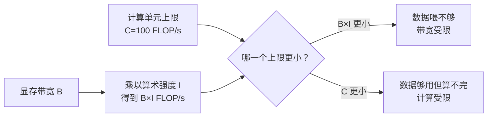

# D20：怎样判断推理受计算还是数据搬运限制？

D19 区分了计算与数据搬运，但一次算子两者都会发生。要决定该减少计算还是减少访存，需要比较“做这项工作需要多少运算”与“为它搬了多少数据”。

## 1. 两个工作量相同的算子可能完全不同

设想两个算子都完成 1000 次乘加。算子 A 只读取一次小数据块并反复使用；算子 B 每做少量运算就读取一批新数据。虽然计算次数相同，B 更可能等待显存。可见 FLOPs 只描述浮点运算数量，不能单独决定耗时。

为了把两者联系起来，可以计算**算术强度（Arithmetic Intensity）**：

算术强度 = 运算次数 ÷ 从较慢存储搬运的字节数

这里的运算次数通常用 FLOPs 表示，字节数必须说明针对哪一级存储。教学中通常先关注显存流量。算术强度高，表示每搬一份数据能做较多计算；算术强度低，表示大量时间可能花在搬数据上。

## 2. 硬件有两条不同上限

GPU 执行一个算子时，计算单元负责“算”，显存负责“提供数据”。因此速度同时受两个上限约束：

- **计算上限**：计算单元每秒最多完成多少次浮点运算。
- **数据供给上限**：显存每秒送来的数据，最多能支撑多少次浮点运算。

先看一台教学用 GPU。假设它的计算单元每秒最多完成 100 FLOP，记作计算上限 C=100 FLOP/s；显存每秒最多搬运 20 byte，记作带宽 B=20 byte/s。这里的数字刻意设得很小，只为看清关系。

现在运行算术强度 I=2 FLOP/byte 的算子。I=2 表示显存每提供 1 byte 数据，算子就能做 2 FLOP。那么在 1 秒内：

```text
显存最多提供 20 byte
每 1 byte 支撑 2 FLOP
所以这些数据最多支撑 20×2=40 FLOP
```

虽然计算单元本来每秒能完成 100 FLOP，但数据只够它完成 40 FLOP。剩余计算能力没有原料可算，只能等待。因此这个算子的实际性能不可能超过 40 FLOP/s，更可能受到**显存带宽限制**。

为什么数据供给上限写成 B×I，可以直接从单位看出来：

```text
B×I = 20 byte/s × 2 FLOP/byte
    = 40 FLOP/s
```

相乘后，分子和分母中的 byte 抵消，留下 FLOP/s，正好表示“显存供给的数据每秒能支撑多少计算”。

但数据供给也可能超过计算能力。如果同一 GPU 运行 I=10 FLOP/byte 的算子，显存每秒提供的 20 byte 可以支撑 20×10=200 FLOP，而计算单元每秒最多只能完成 100 FLOP。此时数据已经足够，先到上限的是计算能力，所以实际性能不可能超过 100 FLOP/s，更可能受到**计算限制**。



因此，算子的可达性能不会超过两条上限中较小的一条：

可达性能 ≤ min(C, B×I)

这里 C 表示计算上限，B 表示显存带宽，I 表示算术强度，min 表示取较小值。**较小的一边先卡住整个过程，就像做菜速度同时受“厨师每秒能处理多少”和“食材每秒能送来多少”限制。**

## 3. Roofline 模型在判断什么？

把计算上限 C 和数据供给上限 B×I 放在一起比较，这种分析方法称为 **Roofline 模型**。它不是说算子一定达到较小上限，而是先回答：“即使其他条件理想，哪类资源最先限制性能？”

继续使用 C=100 FLOP/s、B=20 byte/s 的教学 GPU，可以得到：

| 算术强度 I | 数据供给上限 B×I | 与计算上限 C 比较 | 更可能的限制 |
| ---: | ---: | --- | --- |
| 2 FLOP/byte | 40 FLOP/s | 40 小于 100 | 显存带宽 |
| 5 FLOP/byte | 100 FLOP/s | 两条上限相等 | 两者交界 |
| 10 FLOP/byte | 200 FLOP/s | 100 小于 200 | 计算能力 |

两条上限相等时，算术强度为 I=C÷B。在这个例子中 I=100÷20=5 FLOP/byte。低于 5 时，显存提供的数据不足以喂满计算单元；高于 5 时，数据足够，计算单元先忙满。这个交界值随 GPU 的计算能力和显存带宽变化，并不是所有设备都等于 5。

Roofline 是简化的上限模型，不代表实测一定达到 40 或 100 FLOP/s。Kernel 效率、并行度、缓存命中和调度都会让实际性能更低。它的价值在于指出优化方向：带宽受限时优先减少搬运或提高复用；计算受限时优先减少运算或提高计算效率。

## 4. Prefill 与 Decode 为什么常落在不同区域？

Prefill 同时处理许多 Token，大矩阵乘法能让权重数据服务于较多运算，算术强度通常较高，因此更容易接近计算限制。Decode 每步新增 Token 较少，每次仍要读取大量权重；单请求或小批次下复用不足，更容易受到显存带宽限制。

这是常见趋势而不是无条件定律。批次增大后，Decode 的权重可以被更多请求共同利用，算术强度会上升；长上下文注意力还会增加 KV Cache 访问。**阶段名称不能代替实际测量，负载形状会改变瓶颈。**

## 5. 不同瓶颈对应不同优化

| 判断 | 主要问题 | 更直接的优化方向 |
| --- | --- | --- |
| 计算受限 | 运算能力先到上限 | 更低精度计算、高效 Kernel、减少运算量、扩大有效并行 |
| 带宽受限 | 数据供给先到上限 | 减少字节数、提高复用、融合读写、压缩权重或 KV Cache |
| 并行度不足 | 两类资源都没吃满 | 批处理、改进任务切分、减少小 Kernel 与调度间隙 |

量化之所以可能同时影响容量和速度，是因为它减少数据字节数；但若硬件没有高效的低比特 Kernel，额外的转换或不理想的实现又可能抵消收益。后续 D23 会沿这条链展开。

## 6. 接回诊断流程

现在，推理变慢不再只是“GPU 不够快”。应先确定阶段，再观察主要算子的数据规模和资源使用，判断计算、带宽还是并行度更先受限。D21 将把这种判断落到显存估算上，先回答一个服务配置能否放得下、还能容纳多少请求。

## 助记卡片

**卡片 1：算术强度表示什么？**

> **答案：** 每搬运一个字节的数据能完成多少次运算，常写为 FLOPs/byte。

**卡片 2：Roofline 为什么取 min(C, B×I)？**

> **答案：** C 是计算单元每秒最多能算的 FLOP，B×I 是显存每秒提供的数据最多能支撑的 FLOP；较小者会先卡住整个过程。

**卡片 3：低算术强度通常意味着什么？**

> **答案：** 每份数据只做少量计算，更容易受到数据搬运带宽限制。

**卡片 4：计算受限时应优先减少什么？**

> **答案：** 优先减少运算量或使用更高效的计算 Kernel，而不是只增加存储带宽。

**卡片 5：带宽受限时应优先减少什么？**

> **答案：** 优先减少搬运字节数、提高数据复用或合并中间读写。

**卡片 6：为什么 Decode 不一定永远带宽受限？**

> **答案：** 批次、上下文长度、模型结构、缓存命中和 Kernel 会改变计算与搬运比例。

**卡片 7：GPU 两类资源都未充分使用可能说明什么？**

> **答案：** 工作规模或并行度不足，或者存在 Kernel 启动、同步和调度间隙。

## 自测题

1. 两个算子 FLOPs 相同，为什么耗时可能不同？
2. 某设备的计算上限 C=120 FLOP/s、显存带宽 B=30 byte/s；算子算术强度 I=2 FLOP/byte。Roofline 给出的上限是多少，更可能受什么限制？
3. 同一设备上，算术强度 I 提高到 6 FLOP/byte 后，理论限制怎样变化？
4. 为什么减少 FLOPs 对带宽受限算子可能帮助不大？
5. Prefill 为什么通常比小批次 Decode 更容易复用权重？
6. 某 Decode 任务计算和带宽利用都低，应继续只盯着带宽吗？还应检查什么？

完成后再看[参考答案](quiz-answers.md)。返回[D19](../d19-gpu-memory/README.md)，或继续学习[D21](../d21-memory-estimation/README.md)。
