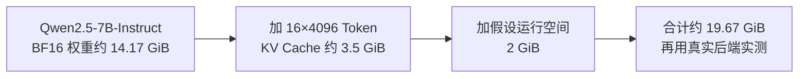
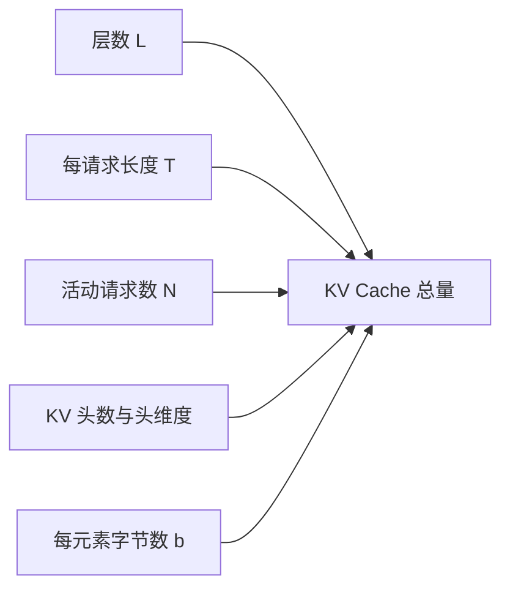
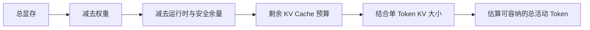

# D21：怎样估算模型推理需要多少显存？

D19 说明显存里不只有权重。真正部署前，需要把参数精度、KV Cache 和运行时余量转化为近似数字，判断模型能否加载，以及并发和上下文还能增长多少。

## 1. 先估算固定存在的权重

若模型有 P 个参数，每个参数占 b 字节，权重显存近似为：

权重字节数 ≈ P×b

P 表示参数数量；b 表示每个参数的平均存储字节数。例如 7B 表示约 70 亿参数。若按 FP16/BF16 的 2 字节粗略计算，权重约为 14 GB；若真正以 8 位形式存储，主体约为 7 GB；4 位主体约为 3.5 GB。这里是十进制近似，实际还会有量化尺度、元数据、对齐、未量化层和运行时副本。

**低比特名称不能直接当成最终显存数字。**它只能给出权重主体的数量级，部署仍需为其他内容留空间。

## 2. KV Cache 为什么与请求共同增长？

每个 Transformer 层要为历史 Token 保存 K 和 V。对一个请求，KV Cache 的近似字节数可以写成：

KV 字节数 ≈ L×T×2×Hₖᵥ×D×b

其中 L 是层数，T 是当前序列 Token 数；乘以 2 是同时保存 K 和 V；Hₖᵥ 是 KV 头数；D 是每个头的维度；b 是每个缓存元素的字节数。若同时有 N 个长度相近的请求，再近似乘以 N。

这个公式说明四条直接关系：层数翻倍，缓存约翻倍；序列长度翻倍，缓存约翻倍；并发请求数翻倍，总缓存约翻倍；缓存从 2 字节降到 1 字节，主体约减半。

## 3. 实算 Qwen2.5-7B-Instruct

现在用真实模型 **Qwen2.5-7B-Instruct** 估算。其官方模型卡给出的参数量是 7.61B，配置文件给出 28 层、28 个 Query 头、4 个 KV 头，隐藏向量维度为 3584。每个注意力头的维度因此是 D=3584÷28=128。下面统一假设权重和 KV Cache 都使用 BF16，每个数占 2 字节；这是一份容量估算，不是某个推理后端的实测值。

先算权重主体：

7.61×10⁹×2 字节 = 15.22 GB ≈ 14.17 GiB

GB 是十进制单位，1 GB=10⁹ 字节；GiB 是二进制单位，1 GiB=2³⁰ 字节。两种写法描述的是同一批字节，不能直接把 15.22 和 14.17 当成两份显存。

再算一个 Token 在所有层产生的 KV Cache。把 L=28、Hₖᵥ=4、D=128、b=2 代入公式：

28×1×2×4×128×2 = 57,344 字节 = 56 KiB

因此，一个请求当前共有 4096 个 Token 时，它的 KV Cache 约为：

4096×56 KiB = 224 MiB

如果同时保留 16 个这样的请求，总 KV Cache 约为 16×224 MiB=3.5 GiB；32 个请求则约为 7 GiB。这里的 4096 个 Token 指 **Prompt Token 与已经生成的 Token 之和**，因为两者都已成为后续生成要回看的历史。

把这些数字放进一张假设有 24 GiB 可用显存的卡中，可以得到下面的预算。为了展示运行空间，暂时人为预留 2 GiB；这个数不是通用标准，实际值必须由目标引擎测量。

| 项目 | 16 个请求，每个 4096 Token | 32 个请求，每个 4096 Token |
| --- | ---: | ---: |
| BF16 权重主体 | 约 14.17 GiB | 约 14.17 GiB |
| BF16 KV Cache | 约 3.5 GiB | 约 7 GiB |
| 假设的运行空间 | 2 GiB | 2 GiB |
| 合计 | 约 19.67 GiB | 约 23.17 GiB |
| 24 GiB 中尚未使用 | 约 4.33 GiB | 约 0.83 GiB |

这张表揭示了估算的真正用途：**BF16 权重能装下，不等于目标并发和上下文也能安全运行。**32 个请求的纸面结果虽未超过 24 GiB，但余量很小，运行时工作区稍大就可能内存不足；16 个请求更有调整空间，但仍需实测。

数据依据：Qwen 官方 [模型卡](https://huggingface.co/Qwen/Qwen2.5-7B-Instruct)与 [config.json](https://huggingface.co/Qwen/Qwen2.5-7B-Instruct/blob/main/config.json)，核对日期为 2026-09-17。模型配置可能更新，因此复算时应以准备部署的具体版本为准。

## 4. 为什么还必须保留运行空间？

权重与 KV Cache 之外，前向计算需要激活和临时工作区，通信库、内存池、CUDA Graph 等也可能保留空间。它们并不都能用一个简单公式精确计算，而且会随批次 Token 数、后端和 Kernel 变化。因此容量规划通常分两步：先用公式估数量级，再用目标引擎和真实配置测峰值。

不能把 GPU 标称显存全部承诺给 KV Cache。若没有余量，稍长的 Prompt、更大的瞬时批次或某个需要更大工作区的 Kernel 就可能触发内存不足。

## 5. 从显存预算反推容量

可以按以下顺序思考：

“总活动 Token”比只看请求数更准确：10 个短请求与 10 个超长请求需要的 KV Cache 完全不同。推理引擎通常通过块式分配管理这部分预算，并在预算耗尽时排队、抢占或拒绝新请求。

## 6. 估算的边界

公式适合解释变量关系和做初步规划，却不能替代实测。模型可能使用 MQA/GQA、滑动窗口、特殊注意力或混合层；量化格式有额外元数据；不同后端的工作区也不同。**正确做法是用公式排除明显不可行配置，再用目标软硬件测量最终容量。**D22 将把容量、延迟和吞吐放进同一个性能定位流程。

若目标是 MoE，权重主体仍按**总参数量**估算，不能按每 Token 的激活参数量估算；专家稀疏激活也不会让 Attention 的 KV Cache 按相同比例下降。完整区别见 [MoE 推理专题](../moe-special-topic/README.md)。

## 助记卡片

**卡片 1：权重显存怎样做数量级估算？**

> **答案：** 参数量乘以每个参数的平均存储字节数，并为量化元数据和运行时副本留余量。

**卡片 2：为什么 7B 的 FP16 权重主体约为 14 GB？**

> **答案：** 约 70 亿参数，每个参数约 2 字节，因此主体约 140 亿字节。

**卡片 3：KV Cache 为什么乘以 2？**

> **答案：** 每层需要同时保存历史 Token 的 Key 和 Value。

**卡片 4：总 KV Cache 主要随哪些量线性增长？**

> **答案：** 层数、活动 Token 总数、KV 头数、头维度和每元素字节数。

**卡片 5：为什么请求数不足以描述 KV Cache 压力？**

> **答案：** 不同请求的序列长度可能相差很大，缓存更接近按活动 Token 总数增长。

**卡片 6：为什么不能把全部显存都分给权重和 KV Cache？**

> **答案：** 激活、Kernel 工作区、内存池、通信和运行时还需要空间，并会有瞬时峰值。

**卡片 7：公式估算后为什么还要实测？**

> **答案：** 模型结构、量化格式、后端和 Kernel 工作区会让实际占用偏离简化公式。

**卡片 8：Qwen2.5-7B-Instruct 的 BF16 KV Cache 为什么约为每 Token 56 KiB？**

> **答案：** 28 层×K/V 两份×4 个 KV 头×每头 128 个数×每数 2 字节，共 57,344 字节，即 56 KiB。

## 自测题

1. 一个 10B 参数模型的权重若平均每参数 2 字节，主体约多少 GB？
2. 其他条件不变，序列长度从 2000 增到 8000，单请求 KV Cache 约变为几倍？
3. 其他条件不变，KV Cache 从 2 字节元素改为 1 字节元素，主体怎样变化？
4. 为什么 4 位量化模型的实际总显存不会简单等于参数量乘以 0.5 字节？
5. 估算并发能力时，为什么“总活动 Token”比“请求数”更有解释力？
6. 一个配置按公式刚好填满全部显存，为什么仍不适合直接上线？
7. 按本章假设，Qwen2.5-7B-Instruct 同时保留 8 个长度均为 4096 Token 的请求，KV Cache 约占多少 GiB？

完成后再看[参考答案](quiz-answers.md)。返回[D20](../d20-compute-memory-bound/README.md)，或继续学习[D22](../d22-performance-diagnosis/README.md)。
