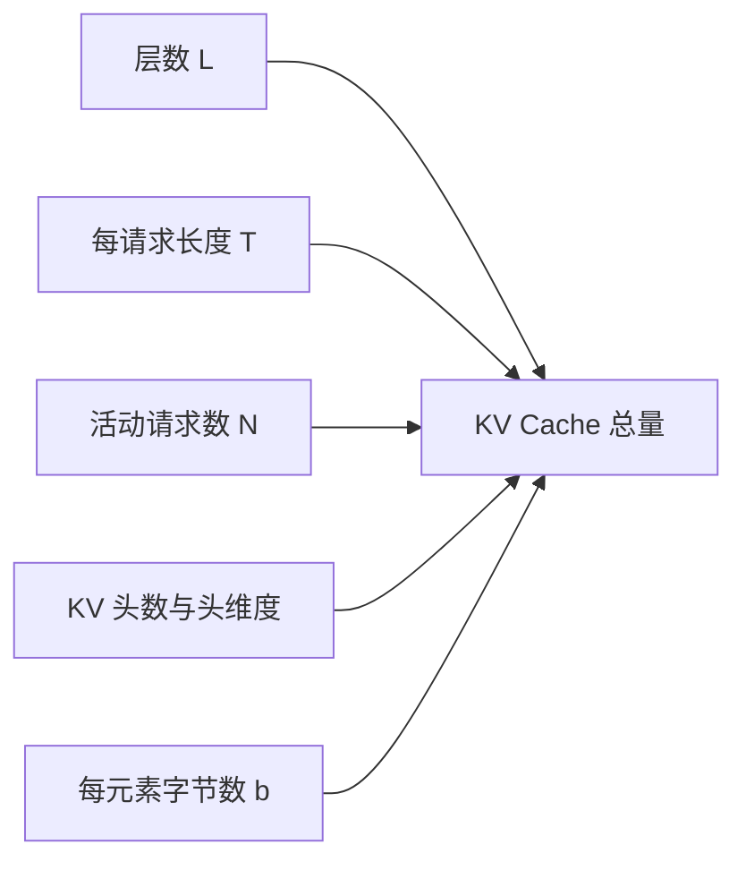
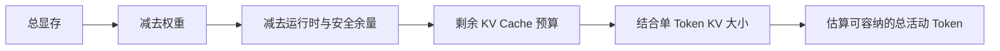

# D21：怎样估算模型推理需要多少显存？

D19 说明显存里不只有权重。真正部署前，需要把参数精度、KV Cache 和运行时余量转化为近似数字，判断模型能否加载，以及并发和上下文还能增长多少。

## 1. 先估算固定存在的权重

若模型有 P 个参数，每个参数占 b 字节，权重显存近似为：

权重字节数 ≈ P×b

P 表示参数数量；b 表示每个参数的平均存储字节数。例如 7B 表示约 70 亿参数。若按 FP16/BF16 的 2 字节粗略计算，权重约为 14 GB；若真正以 8 位形式存储，主体约为 7 GB；4 位主体约为 3.5 GB。这里是十进制近似，实际还会有量化尺度、元数据、对齐、未量化层和运行时副本。

**低比特名称不能直接当成最终显存数字。**它只能给出权重主体的数量级，部署仍需为其他内容留空间。

## 2. KV Cache 为什么与请求共同增长？

每个 Transformer 层要为历史 Token 保存 K 和 V。对一个请求，KV Cache 的近似字节数可以写成：

KV 字节数 ≈ L×T×2×Hₖᵥ×D×b

其中 L 是层数，T 是当前序列 Token 数；乘以 2 是同时保存 K 和 V；Hₖᵥ 是 KV 头数；D 是每个头的维度；b 是每个缓存元素的字节数。若同时有 N 个长度相近的请求，再近似乘以 N。

这个公式说明四条直接关系：层数翻倍，缓存约翻倍；序列长度翻倍，缓存约翻倍；并发请求数翻倍，总缓存约翻倍；缓存从 2 字节降到 1 字节，主体约减半。

## 3. 用一个小例子看增长速度

假设教学模型有 L=4 层、Hₖᵥ=2 个 KV 头、D=8，每个缓存元素 b=2 字节。一个长度 T=100 的请求需要：

4×100×2×2×8×2 = 25,600 字节

这个模型刻意很小，只为展示关系。若 10 个同长度请求同时存在，约为 256,000 字节；若每个请求继续生成 50 个 Token，T 从 100 增到 150，总 KV Cache 也增为原来的 1.5 倍。

## 4. 为什么还必须保留运行空间？

权重与 KV Cache 之外，前向计算需要激活和临时工作区，通信库、内存池、CUDA Graph 等也可能保留空间。它们并不都能用一个简单公式精确计算，而且会随批次 Token 数、后端和 Kernel 变化。因此容量规划通常分两步：先用公式估数量级，再用目标引擎和真实配置测峰值。

不能把 GPU 标称显存全部承诺给 KV Cache。若没有余量，稍长的 Prompt、更大的瞬时批次或某个需要更大工作区的 Kernel 就可能触发内存不足。

## 5. 从显存预算反推容量

可以按以下顺序思考：

“总活动 Token”比只看请求数更准确：10 个短请求与 10 个超长请求需要的 KV Cache 完全不同。推理引擎通常通过块式分配管理这部分预算，并在预算耗尽时排队、抢占或拒绝新请求。

## 6. 估算的边界

公式适合解释变量关系和做初步规划，却不能替代实测。模型可能使用 MQA/GQA、滑动窗口、特殊注意力或混合层；量化格式有额外元数据；不同后端的工作区也不同。**正确做法是用公式排除明显不可行配置，再用目标软硬件测量最终容量。**D22 将把容量、延迟和吞吐放进同一个性能定位流程。

## 助记卡片

**卡片 1：权重显存怎样做数量级估算？**

> **答案：** 参数量乘以每个参数的平均存储字节数，并为量化元数据和运行时副本留余量。

**卡片 2：为什么 7B 的 FP16 权重主体约为 14 GB？**

> **答案：** 约 70 亿参数，每个参数约 2 字节，因此主体约 140 亿字节。

**卡片 3：KV Cache 为什么乘以 2？**

> **答案：** 每层需要同时保存历史 Token 的 Key 和 Value。

**卡片 4：总 KV Cache 主要随哪些量线性增长？**

> **答案：** 层数、活动 Token 总数、KV 头数、头维度和每元素字节数。

**卡片 5：为什么请求数不足以描述 KV Cache 压力？**

> **答案：** 不同请求的序列长度可能相差很大，缓存更接近按活动 Token 总数增长。

**卡片 6：为什么不能把全部显存都分给权重和 KV Cache？**

> **答案：** 激活、Kernel 工作区、内存池、通信和运行时还需要空间，并会有瞬时峰值。

**卡片 7：公式估算后为什么还要实测？**

> **答案：** 模型结构、量化格式、后端和 Kernel 工作区会让实际占用偏离简化公式。

## 自测题

1. 一个 10B 参数模型的权重若平均每参数 2 字节，主体约多少 GB？
2. 其他条件不变，序列长度从 2000 增到 8000，单请求 KV Cache 约变为几倍？
3. 其他条件不变，KV Cache 从 2 字节元素改为 1 字节元素，主体怎样变化？
4. 为什么 4 位量化模型的实际总显存不会简单等于参数量乘以 0.5 字节？
5. 估算并发能力时，为什么“总活动 Token”比“请求数”更有解释力？
6. 一个配置按公式刚好填满全部显存，为什么仍不适合直接上线？

完成后再看[参考答案](quiz-answers.md)。返回[D20](../d20-compute-memory-bound/README.md)，或继续学习[D22](../d22-performance-diagnosis/README.md)。
