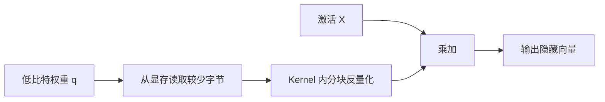

# D23：量化怎样真正参与推理计算？

D15 用“把连续数值放入有限格子”解释了量化，D20 又说明减少字节可能缓解带宽压力。本章继续追踪一个低比特权重：它怎样被保存、怎样进入矩阵乘法，以及为什么显存降低不保证速度提高。

## 1. 权重变小之后，计算仍要得到近似实数结果

设原权重为 x，量化尺度为 s。用 q=round(x÷s) 得到低比特整数编号 q，需要近似恢复时使用 x̂=s×q。x̂ 表示恢复后的近似权重。部署时通常保存 q 和尺度 s，而不是为每次请求永久恢复一份完整浮点权重，否则节省的显存会被抵消。

问题变成：矩阵乘法 Y=XW 中，输入 X 和权重 W 分别是什么精度，硬件又支持什么运算？根据被压缩的对象，可以先区分两类常见思路。

- **仅权重量化（weight-only）**：W 以低比特保存，X 通常仍是 FP16/BF16；Kernel 在计算过程中分块读取并反量化权重。
- **权重与激活量化**：W 和 X 都进入较低精度的整数或浮点计算路径，输出按需要缩放或转换。

## 2. 仅权重量化为什么可能加速？

Decode 常需要反复读取大量权重。如果 4 位权重让读取字节数明显下降，即使 Kernel 还要执行反量化，总耗时仍可能减少。关键比较不是“有没有额外反量化”，而是“减少的搬运时间是否大于新增的转换开销”。

若批次很大、矩阵乘法本来计算受限，反量化可能增加工作；若硬件和后端没有高效的 4 位 Kernel，也可能先转换成更高精度再算，速度收益便不明显。

## 3. 为什么需要很多尺度？

若一整块权重共用一个尺度，极端大值会拉大格子间距，使普通小值的近似误差增加。为了兼顾范围与精度，可以按张量、通道或更小的组分别设置尺度，这称为不同的**量化粒度（granularity）**。

粒度越细，通常越能适应局部数值范围，但必须保存更多尺度，并让 Kernel 处理更多分组。它体现了典型取舍：误差、元数据和执行复杂度不能只优化一项。

## 4. 校准数据在解决什么问题？

权重范围在模型文件中可直接观察，激活值却随输入变化。若要量化激活，需要用一组具有代表性的输入观察其范围，这个过程称为**校准（calibration）**。校准集过窄，部署时出现超出范围的激活就可能被截断；范围定得过宽，又会让有限格子变粗。

部分方法会调整或保留少数敏感权重与通道，以降低精度损失。当前快速阶段不展开算法名称，只需抓住因果：**位数越低，表示能力越有限；尺度和异常值处理决定有限格子怎样分配。**

## 5. 量化影响的不只有权重

| 对象 | 主要收益 | 主要风险或条件 |
| --- | --- | --- |
| 权重 | 减少模型显存与权重读取 | 需要高效低比特矩阵 Kernel |
| 激活 | 减少中间数据与低精度计算成本 | 输入相关，需要校准，误差传播更复杂 |
| KV Cache | 提高可容纳的活动 Token 数、减少读取字节 | 长上下文注意力可能更敏感，需要专用支持 |

权重量化不能自动缩小未量化的 KV Cache；KV Cache 量化也不会改变模型权重。部署报告必须明确量化了什么，不能只写“模型已量化”。

## 6. 怎样判断量化是否值得？

先确定目标：若模型放不下，首先看峰值显存；若 Decode 带宽受限，看 TPOT 和吞吐；若 Prefill 计算受限，看硬件是否支持对应低精度计算；所有情况都要重新评测输出质量。最终判断是四项联合结果：**能否运行、质量是否可接受、目标延迟是否改善、目标负载下吞吐是否提高。**

D24 将处理另一个常见浪费：即使精度不变，多个小算子之间反复读写中间结果也会消耗时间，算子融合会尝试把它们合并。

## 助记卡片

**卡片 1：部署时为什么不永久恢复完整浮点权重？**

> **答案：** 那会重新占用大量显存，抵消低比特存储的主要收益。

**卡片 2：仅权重量化怎样参与计算？**

> **答案：** 权重以低比特读取，Kernel 在分块计算中反量化或使用混合精度路径，与较高精度激活完成乘加。

**卡片 3：反量化有开销，为什么仍可能更快？**

> **答案：** 如果减少的显存读取时间超过转换开销，总耗时仍会下降。

**卡片 4：量化粒度变细有什么取舍？**

> **答案：** 通常能更贴合局部数值范围，但增加尺度元数据和 Kernel 处理复杂度。

**卡片 5：激活量化为什么需要校准？**

> **答案：** 激活范围随输入变化，需要代表性数据估计合理的缩放和截断范围。

**卡片 6：权重量化会自动缩小 KV Cache 吗？**

> **答案：** 不会；权重和 KV Cache 是不同对象，必须分别决定数据类型与支持方式。

**卡片 7：量化效果要同时看什么？**

> **答案：** 显存、质量、目标延迟、目标负载吞吐以及软硬件是否有高效实现。

## 自测题

1. 仅权重量化中，低比特权重从显存读取后通常还要经历什么？
2. 为什么 4 位权重比 8 位更小，却不保证更快？
3. 一个极端大权重为什么会影响整张量共用尺度时的小权重量化精度？
4. 校准数据与训练数据的作用有什么不同？
5. 某服务权重显存减半但高并发仍因 KV Cache OOM，原因是什么？
6. 怎样设计量化前后的公平比较？

完成后再看[参考答案](quiz-answers.md)。返回[D22](../d22-performance-diagnosis/README.md)，或继续学习[D24](../d24-operator-fusion/README.md)。
