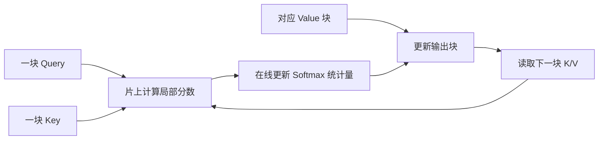

# D25：FlashAttention 为什么能减少注意力的显存访问？

D24 说明避免中间结果落入显存可以加速。注意力中最大的候选中间结果，是每个 Query 与所有 Key 点积形成的分数矩阵。序列变长时，它按 Token 数的平方增长。

## 1. 标准注意力为什么产生大矩阵？

设序列有 T 个 Token。每个 Query 都要与 T 个 Key 比较，因此分数矩阵有 T×T 个元素。标准过程可以概括为：计算分数 S=QKᵀ÷√d，按行做 Softmax，再计算 O=Softmax(S)V；其中 Q、K、V 分别是 Query、Key、Value 矩阵，d 是每个注意力头的维度，除以 √d 用于控制点积数值尺度。S 是中间结果，不是最终输出，却可能被完整写入显存并再次读取。

当 T 从 1000 增到 2000 时，T² 从 100 万增到 400 万，分数矩阵变为 4 倍。问题不仅是数学运算增加，中间矩阵的显存读写也迅速增加。

## 2. 能不能不保存完整分数矩阵？

最终只需要每一行 Softmax 加权后的 Value 总和，并不需要长期保存所有分数。于是可以把 Q、K、V 分块搬入片上存储，一块一块计算局部分数，并逐步更新最终输出。这种面向输入输出访问效率的精确注意力算法称为 **FlashAttention**。

“Flash”不是近似跳过注意力关系。它通过改变分块和计算顺序，在可接受的浮点误差下得到与标准注意力相同定义的结果。

## 3. Softmax 为什么可以分块更新？

一行 Softmax 需要全行最大值和指数和。直接分块时，后面块可能出现更大分数，使前面计算使用的基准发生变化。FlashAttention 会维护到当前为止的最大值、归一化和与加权输出；发现新的最大值时，对旧累计量重新缩放，再合并新块。

这里不展开完整公式，只需要理解：它保留了合并下一块所需的少量统计量，而不是保留整行所有分数。**用少量可更新状态替代巨大中间矩阵**，是算法能够分块且保持精确语义的关键。

## 4. 它减少了什么，没有减少什么？

FlashAttention 主要减少显存与片上存储之间的往返，并降低显式保存 T×T 分数矩阵的空间压力。它没有把所有 Query-Key 比较凭空删除，因此标准全注意力的核心计算量仍随 T² 增长。长序列依旧昂贵，只是数据移动更高效。

此外，实际收益取决于序列长度、头维度、数据类型、GPU 架构、因果遮罩以及所用实现。对于很短序列或已有其他瓶颈的任务，收益比例可能较小。

## 5. Prefill 与 Decode 中的意义有何不同？

Prefill 要处理多个 Query，注意力分数矩阵大，避免中间矩阵写回尤其重要。Decode 每步通常只有新 Token 的 Query，它读取历史 K/V，不再形成同样形状的完整 T×T 新矩阵；此时重点更偏向高效读取分页 KV Cache、适应小批次和长上下文。

所以“使用 FlashAttention”不能替代对阶段的判断。推理后端往往为 Prefill 和 Decode 选择不同的注意力 Kernel，即使它们都服务同一个模型。

## 6. 接到 KV Cache 优化

FlashAttention 优化当前注意力计算中的数据移动，而 Decode 还会长期保存并反复读取历史 K/V。上下文和并发增长后，KV Cache 容量本身成为限制。D26 将比较减少 KV 头、降低缓存精度、限制窗口和分页管理分别改变了什么。

## 助记卡片

**卡片 1：标准注意力的大型中间结果是什么？**

> **答案：** 每个 Query 与所有 Key 点积形成的 T×T 分数矩阵。

**卡片 2：FlashAttention 的核心思路是什么？**

> **答案：** 分块读取 Q/K/V，在片上逐块计算并在线更新 Softmax 和输出，避免完整分数矩阵往返显存。

**卡片 3：它为什么不需要保存整行分数？**

> **答案：** 只维护可合并后续分块所需的最大值、归一化和及加权输出等少量状态。

**卡片 4：FlashAttention 是近似注意力吗？**

> **答案：** 不是；它主要重排精确注意力的计算和数据访问，浮点舍入可能有细小差异。

**卡片 5：它是否消除了 T² 级的全部比较？**

> **答案：** 没有；它主要减少中间存储和显存访问，标准全注意力的主要比较仍存在。

**卡片 6：为什么 Prefill 通常更直接受益？**

> **答案：** Prefill 同时处理多个 Query，更容易产生很大的注意力中间矩阵。

**卡片 7：Decode 注意力更关注什么？**

> **答案：** 高效读取历史 KV Cache、适应小批次和不断增长的上下文。

## 自测题

1. Token 数从 1000 增到 3000，注意力分数元素数量约变为几倍？
2. FlashAttention 为什么必须维护在线 Softmax 统计量？
3. 它减少显存访问后，为什么长序列仍然昂贵？
4. “FlashAttention 通过删除不重要的注意力分数实现近似加速”是否正确？
5. 为什么 Prefill 和 Decode 可能选择不同注意力 Kernel？
6. FlashAttention 与算子融合有什么共同思路？

完成后再看[参考答案](quiz-answers.md)。返回[D24](../d24-operator-fusion/README.md)，或继续学习[D26](../d26-kv-cache-optimization/README.md)。
