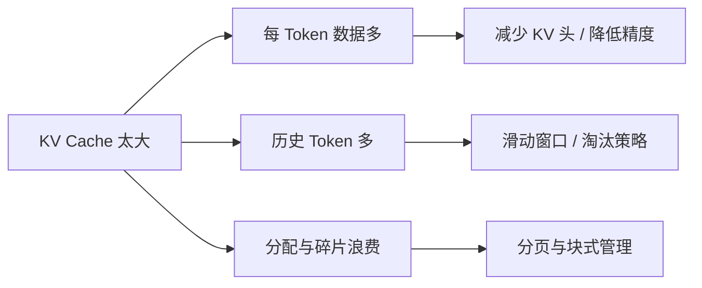

# D26：KV Cache 可以怎样减少显存压力？

D14 已说明每层为每个历史 Token 保存 K 和 V；D21 给出了容量关系。本章不再解释缓存是什么，而是比较四类优化分别减少“每个 Token 的缓存”“保留的 Token 数”还是“空间浪费”。

## 1. 先区分三个不同问题

KV Cache 压力可能来自：每个 Token 保存的数据太多、保留的历史 Token 太多，或者分配方式浪费空间。三种原因需要不同机制，不能都笼统称为“压缩缓存”。

为了让后面的区别落到同一组数字上，假设某个请求的 KV Cache 主体为 **8 GiB**，其中每个 Token 的 K/V 占用、已经保留的历史 Token 数和实际分配方式共同决定最终占用。下面的数字只用于比较机制，不代表所有模型都能得到同样比例的收益。

| 优化方式 | 直接改变什么 | 在这个例子中的直觉结果 |
| --- | --- | --- |
| K/V 头数减半 | 每个 Token 保存的 K/V 组数 | 缓存主体可接近 4 GiB |
| 每个 K/V 元素由 2 字节降为 1 字节 | 每个数值的字节数 | 缓存主体可接近 4 GiB |
| 只保留一半历史位置 | 保留的 Token 数 | 缓存主体可接近 4 GiB |
| 分页管理 | 分配和预留造成的浪费 | 8 GiB 的有效内容不变，只减少额外浪费 |

前三种都可能让占用下降，却修改了公式中的不同因素；分页管理则不压缩有效内容。实际系统还会有量化比例因子、对齐和块尾空位等额外开销，因此“接近减半”不等于总显存严格减半。

## 2. 减少 KV 头改变了什么？

标准多头注意力中，不同 Query 头各有对应 K/V 头。**Multi-Query Attention（MQA）**让多个 Query 头共享一组 K/V；**Grouped-Query Attention（GQA）**让一组 Query 头共享一组 K/V。KV 头数减少后，每个历史 Token 保存的 K/V 数量下降，缓存和读取量也下降。

这通常是模型结构的一部分，不是服务端随意打开的无损开关。把已有模型从 MHA 改成 GQA/MQA 往往需要模型在训练或转换时具备相应参数与质量验证。

## 3. 降低 KV 精度改变了什么？

若 K/V 元素从 2 字节降到 1 字节，缓存主体和读取字节数近似减半。但量化通常还要保存比例因子等元数据，所以总占用不一定严格减半。每层新 K/V 写入缓存时需要量化，注意力读取时需要对应的低精度 Kernel 或反量化。误差会影响后续每一步注意力，因此必须用长上下文和目标任务评测质量。

权重量化与 KV Cache 量化相互独立：前者缩小长期固定的模型参数，后者缩小随请求增长的状态。在高并发、长上下文场景，后者可能更直接影响可容纳的活动 Token 数。

## 4. 只保留最近窗口会付出什么？

若模型的注意力机制支持**滑动窗口（sliding window）**，每个新 Token 只关注最近 W 个历史位置，早于窗口的 K/V 可以覆盖或释放。缓存从随总长度增长，变为主要随窗口 W 增长。

代价是窗口外信息不能再被普通注意力直接访问。它是否可用取决于模型结构和任务；对需要引用很早信息的长文任务，简单丢弃历史可能损害质量。服务端不能在模型不支持时假定删除旧缓存仍保持原语义。

## 5. 分页为什么不等于压缩内容？

PagedAttention 把 KV Cache 分成固定大小的块，按请求实际增长分配，并通过映射找到各块。它减少连续预留和碎片浪费，却不必改变每个 K/V 数值，也不减少模型按定义需要关注的 Token 数。

因此，分页解决“怎么放”，量化解决“每个值多大”，MQA/GQA 解决“保存多少组 K/V”，滑动窗口解决“保留多少历史位置”。这些机制可以组合，但收益不能重复计算。

## 6. 如何选择优化顺序？

先用 D21 估算主要来源。如果权重已经很小但活动 Token 容量不足，检查 KV 数据类型、KV 头数和长度策略；如果已分配空间远大于实际使用，检查分页与块大小；如果质量必须完整保留长程上下文，就不能仅为省显存随意丢弃旧 Token。

D27 将处理不同方向的优化：不再缩小每一步，而是尝试让较小模型一次猜出多个 Token，再由目标模型批量验证。

## 助记卡片

**卡片 1：KV Cache 压力的三类来源是什么？**

> **答案：** 每个 Token 数据多、保留的 Token 多，以及分配预留或碎片造成的浪费。

**卡片 2：GQA/MQA 主要减少什么？**

> **答案：** 减少 K/V 头数量，使每个历史 Token 需要保存和读取的 K/V 更少。

**卡片 3：KV Cache 量化主要减少什么？**

> **答案：** 每个 K/V 元素的字节数，从而减少缓存容量和读取流量。

**卡片 4：滑动窗口主要减少什么？**

> **答案：** 模型保留并直接关注的历史 Token 数量。

**卡片 5：PagedAttention 主要减少什么？**

> **答案：** 连续预留和内存碎片导致的空间浪费，而不是改变 K/V 数值语义。

**卡片 6：权重量化为何不能替代 KV 量化？**

> **答案：** 权重与请求 KV 状态是不同显存对象，后者仍会随并发和长度增长。

**卡片 7：为什么不能任意删除旧 KV？**

> **答案：** 后续 Token 可能需要关注早期信息，删除会改变模型可访问的上下文和输出质量。

## 自测题

1. MQA/GQA、KV 量化和滑动窗口分别改变公式中的哪类因素？
2. 为什么 PagedAttention 不应被描述为“把 KV 数值压缩了”？
3. 一个模型权重很小，高并发长上下文仍 OOM，优先分析什么？
4. KV 元素从 2 字节降至 1 字节，其他条件不变时主体容量怎样变化？还需验证什么？
5. 为什么 GQA 通常不是对任意已训练模型打开一个服务参数就能得到？
6. 什么时候滑动窗口可能不适合？

完成后再看[参考答案](quiz-answers.md)。返回[D25](../d25-flash-attention/README.md)，或继续学习[D27](../d27-speculative-decoding/README.md)。
