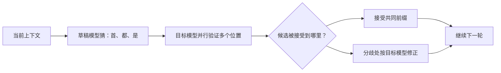

# D27：推测解码为什么可能一次生成多个 Token？

普通 Decode 每轮由大模型产生一个新 Token，再把它送回模型执行下一轮。即使每轮只决定一个 Token，也必须读取大模型权重。若能让一次大模型前向验证多个候选，就可能减少串行轮数。

## 1. 谁来提出多个候选？

引入一个更便宜的**草稿模型（draft model）**，先连续猜出若干候选 Token，例如“首都”。目标大模型随后在一次并行前向中检查这些位置是否符合自己的条件概率。这个机制称为**推测解码（speculative decoding）**。

草稿模型只负责提出建议，最终输出分布仍由目标模型的验证规则控制。严谨算法不只是比较贪心 Token，还会按概率校正；本章聚焦系统直觉，不展开证明。

## 2. 为什么目标模型能并行验证？

草稿已经提供了多个连续 Token，目标模型可以像处理一小段 Prefill 一样，同时计算这些位置的预测。若前几个候选都能接受，一次目标模型调用就向前推进多个 Token，减少逐 Token 串行启动和反复读取权重的次数。

但验证仍要计算这些候选，草稿模型本身也有成本。只有“减少的目标模型串行轮数”大于“草稿生成与验证的额外工作”，才会获得加速。

## 3. 接受率为什么决定收益？

若草稿模型经常与目标模型一致，一轮猜 4 个可能接受 3～4 个；若经常在第一个就分歧，后面的候选不能直接沿用，额外工作被浪费。平均每轮被接受的候选数可用**接受长度**描述，它与草稿质量、任务、采样参数和候选长度有关。

草稿并不是越大越好。更大的草稿通常更准，却也更慢；更小的草稿便宜，却可能接受率低。优化目标是总成本最小，而不是草稿准确率最高。

## 4. 为什么不是所有请求都适合？

高随机性的采样可能降低候选一致性；目标模型较小或批次已经很大时，草稿开销占比会提高；高并发吞吐场景中，额外的调度和验证可能与普通批处理竞争资源。相反，大模型、小批次、低延迟生成且候选容易预测时，减少串行轮数更有吸引力。

除了独立草稿模型，还可以使用目标模型的额外预测头、历史 n-gram 或其他候选来源。它们都遵循同一框架：便宜地产生候选，由目标模型决定接受结果。

## 5. 它优化的指标是什么？

推测解码主要希望降低生成阶段的端到端时间或 TPOT。它通常不会消除初始 Prefill，也可能增加总计算量；因此 Token/s、单请求延迟和每卡吞吐可能出现不同变化。评测时还要确认输出分布或质量符合所用算法的保证。

一个完整记录至少包括候选来源、每轮候选数、接受长度、目标负载、TPOT、吞吐和质量。只报告“接受率很高”不能说明总服务更快。

## 6. 从单项优化走向推理引擎

D23～D27 分别改变数值表示、算子组织、注意力访存、缓存大小和串行生成轮数。真实服务需要在请求不断到达时组合这些机制，并管理每个请求的状态。D28 将从一个请求进入队列开始，追踪推理引擎怎样推动它直到结束。

## 助记卡片

**卡片 1：推测解码要解决什么串行问题？**

> **答案：** 普通 Decode 每次目标模型调用通常只推进一个 Token，需要反复串行执行大模型。

**卡片 2：草稿模型负责什么？**

> **答案：** 以较低成本提出多个候选 Token，不单独决定最终输出。

**卡片 3：目标模型负责什么？**

> **答案：** 并行验证候选，并按目标分布接受共同前缀或在分歧处修正。

**卡片 4：为什么可能一次推进多个 Token？**

> **答案：** 已有候选使目标模型能并行计算多个位置，接受后减少目标模型串行轮数。

**卡片 5：接受长度为什么重要？**

> **答案：** 它表示每次昂贵验证平均能推进多少候选，直接影响额外工作是否值得。

**卡片 6：草稿模型为什么不是越大越好？**

> **答案：** 更大可能提高接受率，却增加草稿生成成本，需要比较总延迟。

**卡片 7：推测解码一定减少总计算量吗？**

> **答案：** 不一定；它可能增加草稿和验证计算，主要收益来自减少昂贵的串行目标模型轮次。

## 自测题

1. 普通 Decode 与推测解码每轮推进 Token 的方式有什么不同？
2. 为什么目标模型仍然掌握最终输出，而不是草稿模型替它回答？
3. 一轮猜 4 个但经常第一个就被拒绝，会怎样影响收益？
4. 为什么更准确但更慢的草稿模型未必更好？
5. 推测解码可能改善 TPOT，却不改善哪一段初始工作？
6. 评测推测解码时，为什么不能只看接受率？

完成后再看[参考答案](quiz-answers.md)。返回[D26](../d26-kv-cache-optimization/README.md)，或继续学习[D28](../d28-request-lifecycle/README.md)。
