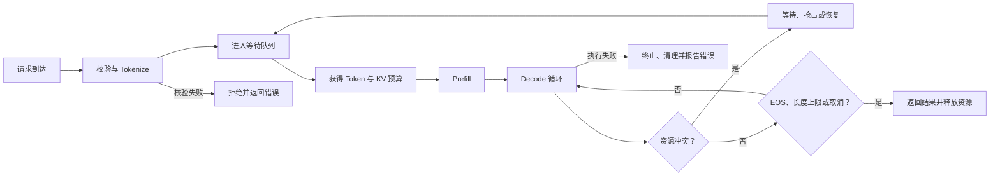

# D28：推理引擎怎样管理一个请求的完整生命周期？

D15 从系统层看过推理引擎怎样同时服务多个请求，现在进一步跟踪其中一个请求：它到达以后为什么不能立刻计算，什么时候进入 GPU，生成过程中保存什么，结束时又释放什么。沿着这条时间线走完之后，后面出现的组件就能对应到一个具体问题，而不是一组孤立名词。

## 1. 请求到达后不能立即进入模型

一个请求至少携带 Prompt、生成长度上限、采样参数和标识。引擎先做**确定性校验**：参数是否合法、输入是否超过服务上限、目标模型是否支持该请求；校验通过后再将文字转换成 Token ID，并放进等待队列。

进入队列不代表已经获得 GPU 资源。此时只能确定“请求可以被服务”，还不能确定“请求现在就能运行”，因为前面的请求可能仍占用计算能力和 KV Cache。不同引擎内部顺序可能不同，但**请求是否合法**和**当前是否有资源运行**是两个不同判断。

引擎随后为请求建立状态，例如已处理到哪个位置、分配了哪些 KV 块、已经生成哪些 Token、是否取消或结束。这些状态与模型权重不同：权重由请求共享，请求状态必须隔离。

## 2. 多个请求都在等待，谁先进入 GPU？

假设队列里现在有三个请求：A 已完成 Prefill，正在等待生成下一个 Token；B 带着一段长 Prompt，尚未开始 Prefill；C 刚刚到达。GPU 本轮能处理的 Token 数量和可分配的 KV Cache 都有限，因此三个请求不能不加选择地同时进入模型。如果只让 A 一直运行到结束，B 和 C 会长时间等待；如果立刻处理 B 的整段长 Prompt，A 的流式输出又可能停顿。

因此，每一轮计算开始前，引擎都需要先回答：A、B、C 中选择哪些请求，每个请求本轮处理哪些 Token。**负责反复做这个选择的组件，才称为调度器（scheduler）**。它可能选择 A 的一个 Decode Token，再选择 B 的一部分 Prefill Token，而让 C 继续等待；下一轮资源和请求状态变化后，再重新选择。

调度器做选择时必须同时满足若干约束：本轮选择的 Token 总数不能超过可执行规模；加入请求后 KV Cache 必须有空间；所选工作必须能被当前后端执行；优先级和等待时间还要符合服务策略。它输出的不是文本答案，而是一份**本轮工作清单**：“哪些请求的哪些 Token 进入模型”。至此，队列中的请求已经被选中，但选择本身不会完成神经网络计算，于是还需要下一个组件。

## 3. 工作已经选好，谁真正完成计算？

调度器只生成本轮工作清单，不会亲自执行神经网络。接过这份清单、在一个或多个设备上真正完成前向计算的组件，称为**模型执行器（model executor）**。执行器整理输入张量和位置、找到 A 和 B 各自的 KV 块、调用相应 Kernel，最后返回各请求目标位置的 Logit。

执行器返回的 Logit 只是词表中各候选 Token 的分数，还不是最终要发送的文字。必须再依据请求指定的温度、top-p 等规则选出一个 Token；负责这一步的部分称为**采样器（sampler）**。新 Token 写回请求状态，并在下一轮成为输入。如果产生 EOS、达到长度限制、被用户取消或发生不可恢复错误，请求进入完成状态，相关 KV 块被回收。

## 4. 流式输出为什么不等于计算结束？

服务可以在每个 Token 产生后立即向客户端发送，因此用户看到输出时，请求仍处于 Decode 循环。网络发送、客户端断开和 GPU 计算是不同事件。若客户端取消，引擎需要及时标记请求，并在安全的调度边界停止后续工作、释放缓存。

如果取消信号传得太慢，GPU 可能继续为无人接收的请求生成；如果资源提前释放而仍有 Kernel 使用它，又会造成错误。生产引擎因此需要明确的状态转换，而不只是一个生成函数。

## 5. 一次失败发生在哪一层？

| 位置 | 例子 | 主要处理者 |
| --- | --- | --- |
| 入口 | 参数非法、输入超长 | API 层或请求管理器拒绝 |
| 等待阶段 | 队列过长、超时 | 准入与调度策略 |
| 资源分配 | KV Cache 不足 | 缓存管理器、抢占或排队 |
| 模型执行 | Kernel、设备或通信错误 | 执行器与运行时 |
| 输出阶段 | 客户端断开 | 流式传输与取消传播 |

只有区分失败位置，才能决定是重试、拒绝、降级还是释放资源。对非幂等的上层工具调用，模型推理重试还不能自动等同于业务动作重试；这是应用层需要继续控制的边界。

## 6. 生命周期怎样连接后续章节？

请求管理器维护状态，调度器选择本轮 Token，缓存管理器分配 KV 块，执行器运行模型，采样器选择输出，输出层发送结果。D29 将重点解释同一轮里如何同时安排 Prefill 和 Decode，以及为什么要把长 Prompt 切块。

## 助记卡片

**卡片 1：请求状态与模型权重有什么区别？**

> **答案：** 权重由请求共享且推理时通常固定；Token 进度、采样参数和 KV Cache 属于每个请求的独立状态。

**卡片 2：调度器每轮输出什么决定？**

> **答案：** 决定哪些请求的哪些 Token 在本轮进入模型执行。

**卡片 3：模型执行器负责什么？**

> **答案：** 组织张量和缓存映射，在设备上完成前向计算并返回各请求的 Logit。

**卡片 4：采样后为什么还要回到调度循环？**

> **答案：** 新 Token 成为下一轮输入，Decode 要重复执行直到停止条件成立。

**卡片 5：流式输出时请求为何仍占资源？**

> **答案：** 已发送的只是当前 Token，后续 Decode 尚未完成，KV Cache 和请求状态仍需保留。

**卡片 6：请求结束后必须做什么？**

> **答案：** 标记完成，停止调度后续 Token，并回收对应 KV Cache 和运行时状态。

**卡片 7：为什么需要取消传播？**

> **答案：** 客户端离开后应尽快停止无用生成，同时要在安全边界释放仍可能被执行器使用的资源。

## 自测题

1. 请求的确定性校验与进入队列后的动态资源判断分别确认什么？
2. 为什么调度器不能只按“先到先执行完”让一个请求独占 GPU？
3. 调度器、执行器和采样器分别产生什么结果？
4. 用户已经看到首 Token，为什么 KV Cache 还不能释放？
5. 客户端取消与模型生成 EOS 有什么共同结果，又有什么触发差异？
6. KV Cache 分配失败与输入参数非法为什么不应作为同一种错误处理？

完成后再看[参考答案](quiz-answers.md)。返回[D27](../d27-speculative-decoding/README.md)，或继续学习[D29](../d29-mixed-scheduling/README.md)。
