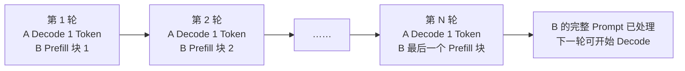

# D29：Prefill 和 Decode 怎样共享一张 GPU？

D28 中，调度器一轮可能同时面对长 Prompt 和正在生成的请求。若整段长 Prefill 一次占用 GPU，已有请求的下一个 Token 会等待；若永远优先 Decode，新请求又迟迟看不到首 Token。

## 1. 为什么完整 Prefill 会阻塞 Decode？

假设请求 A 正在 Decode，每隔一轮应产生一个 Token；此时请求 B 携带 8000 Token 的 Prompt 到达。若引擎一次完成 B 的全部 Prefill，这次 GPU 工作很长，A 在此期间无法得到下一 Token，流式输出出现停顿。这种现象常被称为 Prefill 对 Decode 的干扰。

固定地“先 Prefill 后 Decode”或“先 Decode 后 Prefill”都无法兼顾两类目标。引擎需要把本轮资源按 Token 而不只是按请求进行分配。

## 2. 把长 Prompt 切成块

**Chunked Prefill（分块预填充）**把长 Prompt 拆成多个 Token 块，每轮只处理其中一块，并在块之间穿插运行中的 Decode。请求 B 完成所有块后才获得完整 Prompt 的 KV Cache，并进入正常生成。

每轮处理 B 的一个块时，都会为这个块逐步写入 KV Cache；并不是等到最后一块才一次性创建全部缓存。只有第 N 轮处理完整个 Prompt 后，B 才能根据完整输入生成第一个输出 Token。图中把 A 和 B 写在同一个轮次框内，表示它们属于同一轮活动集合，不表示底层一定先运行 A 或先运行 B；推理后端可能打包执行，也可能按 Kernel 和数据布局拆分。

## 3. Token 预算怎样控制一轮工作？

调度器通常设置一轮最多处理的总 Token 数。用一组便于心算的数字说明：假设本轮预算为 2048 个 Token，已有 16 个请求各执行一步 Decode，那么它们共占 16 个 Token；若当前策略优先保证这些运行请求，剩余 2032 个 Token 可以分给一个或多个 Prefill 块。下一轮会重新计算活动集合，已经结束的请求退出，新请求或后续 Prefill 块再进入。

这个例子描述的是一种常见策略，不表示所有引擎都固定让 Decode 优先。Token 预算也只是控制一轮工作量的代理：相同数量的 Prefill Token 和 Decode Token 具有不同的张量形状、访存方式与批处理效率，实际耗时未必相同。预算太大，单轮执行时间可能变长并造成 Decode 抖动；预算太小，GPU 工作规模可能不足，长 Prompt 完成 Prefill 的轮数也会增多。

因此块大小不是越小越公平、也不是越大越高效。它要在 **Decode 连续性、Prefill TTFT、总体吞吐和 Kernel 效率**之间取舍。

## 4. Continuous Batching 在这里做了什么？

分块解决了 B 一次占用 GPU 太久的问题，但还没有解决另一个浪费。假设上一轮还有请求 C，这一轮开始前 C 已经生成完毕；与此同时，请求 D 刚进入队列。如果批次从建立后就固定不变，C 留下的位置只能空着，D 必须等整个旧批次结束才能加入。

为了立即利用这个空位，引擎需要在每轮开始前重新检查请求状态：移除已经完成的 C，保留仍在运行的 A 和 B，再把等待中的 D 加入本轮。**这种随着请求完成和到达而逐轮重组活动请求集合的机制，称为连续批处理（Continuous Batching）**。本轮集合里可以同时有新请求的 Prefill Token、B 的后续 Prefill 块，以及 A 的单步 Decode Token；底层通过请求 ID、位置和 KV 块映射保证它们互不干扰。

连续批处理回答“哪些请求进入本轮”，Chunked Prefill 回答“一个长 Prompt 本轮只进入多少 Token”。两者结合才能避免长 Prefill 长时间独占，同时维持较大的 GPU 工作批次。

## 5. 混合调度有哪些边界？

Prefill 与 Decode 的计算形状不同，混在一轮需要后端支持相应的打包和 Kernel。Prefill 太多会增加运行请求的 Token 间延迟；Decode 太多会让新请求排队。KV Cache 接近满时，即使 Token 预算有空位，也可能无法接纳新 Prompt。

这说明调度至少受两类预算约束：本轮计算 Token 预算与跨轮保留的 KV Cache 预算。只增大前者不一定增加可并发请求数，只增大缓存也不保证每轮能及时计算。

## 6. 下一步为什么需要抢占与公平性？

当所有请求都能逐轮推进时，混合调度已足够；但缓存耗尽或高优先级请求到来时，引擎必须决定谁等待、谁暂停、谁释放部分状态。D30 将解释抢占、优先级和公平性如何处理这种资源冲突。

## 助记卡片

**卡片 1：长 Prefill 为什么会影响正在 Decode 的请求？**

> **答案：** 一次完整 Prefill 可能形成很长的 GPU 工作，使运行请求等待下一次 Decode。

**卡片 2：Chunked Prefill 做了什么？**

> **答案：** 把长 Prompt 分成多个 Token 块，在多轮中处理，并允许其间穿插 Decode。

**卡片 3：一轮 Token 预算控制什么？**

> **答案：** 控制本轮所有 Prefill 与 Decode 合计最多处理多少 Token。

**卡片 4：块太大有什么风险？**

> **答案：** 单轮时间变长，运行请求的后续 Token 可能停顿。

**卡片 5：块太小有什么风险？**

> **答案：** GPU 工作规模不足，调度轮次增加，长 Prompt 完成 Prefill 更慢。

**卡片 6：Continuous Batching 与 Chunked Prefill 的区别是什么？**

> **答案：** 前者动态选择本轮活动请求，后者限制长 Prompt 每轮处理的 Token 数。

**卡片 7：调度为什么同时受计算与缓存预算限制？**

> **答案：** Token 预算决定本轮算多少，KV 预算决定跨轮能保留多少活动请求状态。

## 自测题

1. 正在生成的 A 遇到 8000 Token 的新 Prompt B，完整 Prefill B 可能造成什么体验？
2. Chunked Prefill 为什么不会让 B 在第一块完成后立即开始生成？
3. 为什么将块无限缩小不是最佳方案？
4. 一轮 Token 预算有剩余，为什么新请求仍可能无法加入？
5. Continuous Batching 与固定批处理相比，调度决定发生在什么粒度？
6. 若目标是降低运行请求的 Token 间抖动，调整 Prefill 预算时应关注什么代价？

完成后再看[参考答案](quiz-answers.md)。返回[D28](../d28-request-lifecycle/README.md)，或继续学习[D30](../d30-preemption-fairness/README.md)。
