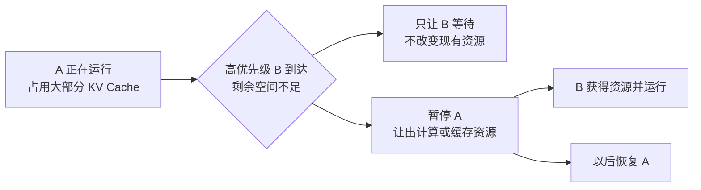
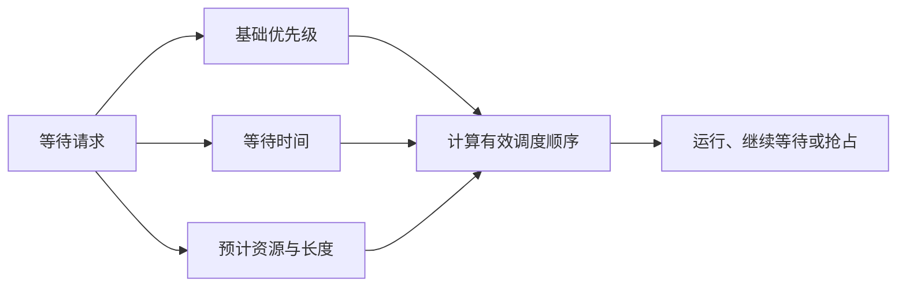

# D30：资源不够时，推理引擎应该先服务谁？

D29 假设请求都能保留 KV Cache 并逐轮推进。高负载时，这个前提会失效：长请求可能占据大量缓存，新请求持续到达，不可能让所有请求同时运行。调度器必须把服务目标转化为取舍规则。

## 1. 先到先服务为什么仍可能不公平？

**先到先服务（FCFS）**容易理解，但一个很长的早到请求可能长期占用大量 KV Cache 和计算轮次，使许多短请求排队。若改成永远优先短请求，长请求又可能不断被插队，始终无法完成，这称为**饥饿（starvation）**。

公平不等于每个请求获得完全相同资源。生产系统可能按租户、优先级或服务等级分配份额，但必须防止某类请求无限等待，并限制单个请求对其他请求的影响。

## 2. 什么是抢占？

现在把冲突放到正在运行的请求上：A 已经完成 Prefill，正在逐 Token 生成，并占用了大部分 KV Cache；此时高优先级请求 B 到达，但剩余显存不足以容纳 B。只调整等待队列没有用，因为资源仍被运行中的 A 占着；如果系统希望 B 立即推进，就必须先暂停 A，并决定怎样处理 A 的缓存。

这种**暂停已经运行的请求，把资源让给其他请求的机制，称为抢占（preemption）**。它不同于普通的队列排序：队列排序只改变尚未运行的请求谁先开始，抢占会影响已经开始并持有状态的请求。暂停分配计算时间本身不难，真正的取舍是是否还要释放 A 已经占用的 KV Cache。

继续把例子具体化：假设 A 已占用 6 GiB KV Cache，请求 B、C 到来后 GPU 空间不足。调度器暂停 A 时有三种不同选择：

| 暂停 A 的方式 | 是否释放 GPU KV 空间 | A 恢复时的主要代价 |
| --- | --- | --- |
| KV 继续驻留在 GPU | 否 | 几乎不用恢复，但只能让出计算时间，不能解决 KV 显存不足 |
| KV 换出到 CPU 内存 | 是 | 需要额外 CPU 空间，并把 KV 传回 GPU |
| 释放 KV，稍后重算 | 是 | 需要重新 Prefill 被释放的上下文 |

因此，只有后两种方式能为 B、C 释放 GPU KV 空间。换出保存了已有计算结果，却增加存储和传输；重算不保存这些结果，却把代价推迟到恢复阶段。具体引擎可能只支持其中部分方式，也可能按请求状态选择不同策略。选择取决于状态大小、互连速度、暂停时长和恢复成本，没有免费方案。

## 3. 优先级怎样避免变成永久插队？

静态高优先级请求若持续到达，普通请求可能饥饿。一个常见思想是**老化（aging）**：等待越久，有效优先级逐渐提高。也可以为不同队列设置配额或加权份额，既承认重要请求的优先权，又保证其他请求有最低进展。

预计长度可能不准确，因此策略还需防止用户通过虚报参数获得不合理优势。

## 4. 准入控制为什么比塞满 GPU 更重要？

若请求到达速度长期高于服务速度，队列会不断增长。任何调度算法都不能凭空创造容量；继续无限接收只会让超时和尾部延迟恶化。**准入控制（admission control）**会在队列、KV Cache 或延迟风险超过边界时限制新请求，选择排队、拒绝、降级或路由到其他副本。

这不是浪费 GPU，而是在过载时保护已经承诺的服务。可持续系统关心长期到达率与处理率的平衡，而不是瞬间把显存填满。

## 5. 如何判断策略是否合理？

除了总吞吐，还要按请求类型和租户观察 TTFT、TPOT、完成率、超时率与抢占次数。平均值正常但低优先级请求频繁超时，说明策略并不公平；高优先级延迟很好但大量重算拖低总吞吐，说明抢占成本过高。

策略必须用真实长度分布和突发流量测试。短请求占多数、长请求占多数、周期性突发和多租户配额会得到不同结果。

## 6. 接到工作负载设计

至此可以看到，引擎配置没有脱离负载的“最优值”。D31 将把聊天、离线批量、长上下文和 Agent 请求放在一起，说明输入长度、输出长度、共享前缀和到达方式怎样决定调度重点。

## 助记卡片

**卡片 1：FCFS 为什么可能让短请求等待很久？**

> **答案：** 早到的长请求可能长期占用大量缓存和计算资源。

**卡片 2：什么是饥饿？**

> **答案：** 某类请求持续被其他请求插队，长时间得不到运行机会。

**卡片 3：抢占解决什么问题？**

> **答案：** 在资源冲突时暂停部分运行请求，把计算或缓存资源让给更应先推进的请求。

**卡片 4：释放 KV 后重算的代价是什么？**

> **答案：** 恢复请求时需要重新 Prefill 被丢弃的上下文，增加计算和延迟。

**卡片 5：老化怎样减少饥饿？**

> **答案：** 请求等待越久，有效优先级越高，最终获得执行机会。

**卡片 6：准入控制为什么必要？**

> **答案：** 到达率长期超过处理能力时，调度无法阻止队列无限增长，必须限制进入系统的负载。

**卡片 7：公平性为什么不能只看总平均延迟？**

> **答案：** 平均值可能掩盖某类请求或租户长期等待、频繁超时的问题。

## 自测题

1. FCFS 与永远优先短请求分别可能造成什么问题？
2. 暂停后让 KV 驻留 GPU、换出到 CPU 和释放后重算，分别能否释放 GPU KV 空间？恢复代价是什么？
3. 为什么静态优先级需要老化或配额机制配合？
4. 到达率持续高于处理率时，只优化调度顺序能否解决队列增长？
5. 某系统总吞吐提高，但普通租户 P99 急剧恶化，应怎样评价？
6. 为什么预测请求长度的策略还要防止参数虚报？

完成后再看[参考答案](quiz-answers.md)。返回[D29](../d29-mixed-scheduling/README.md)，或继续学习[D31](../d31-workload-aware-serving/README.md)。
