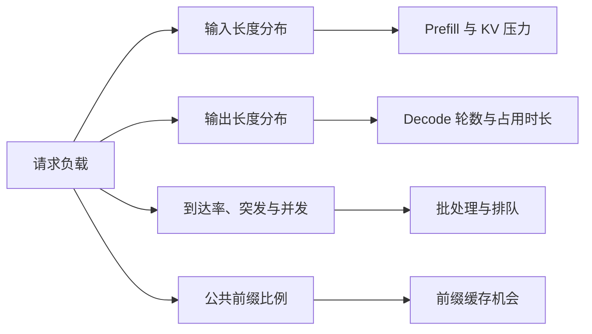
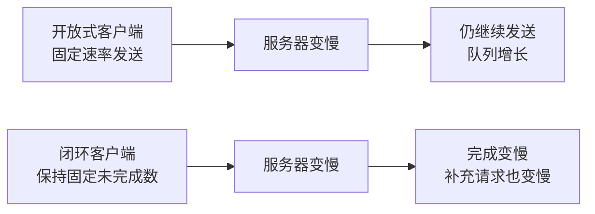

# D31：为什么不同请求需要不同的推理配置？

D30 说明调度取舍依赖请求类型。本章把“类型”具体化为四个负载特征：输入长度、输出长度、到达方式和前缀复用。它们共同决定 Prefill、Decode、KV Cache 与排队谁更重要。

## 1. 不要先按应用名称猜瓶颈

“聊天”和“Agent”只是业务名称。真正影响引擎的是 Token 和到达模式：一个聊天请求可能带很长历史但只回答一句；另一个可能输入很短却生成长文。应先把请求描述成可测的工作负载，再选择配置。

## 2. 四类典型负载怎样不同？

| 负载形态 | 主要特征 | 常见关注点 |
| --- | --- | --- |
| 交互聊天 | 请求零散，要求首 Token 快 | TTFT、流式稳定、避免长 Prefill 干扰 |
| 离线批量生成 | 可积累大批次，完成时间优先 | 总吞吐、GPU 利用、单位 Token 成本 |
| 长文档问答 | 输入长、输出可能较短 | Prefill、Chunked Prefill、KV 容量与长上下文注意力 |
| 多步骤 Agent | 多轮短生成，系统提示和历史可能重复 | 前缀缓存、频繁到达、尾延迟与状态增长 |

这些只是帮助建立直觉，最终仍要用实际分布验证。例如离线任务若设有严格截止时间，也不能只追求吞吐。

## 3. 为什么平均长度不够？

一半请求输入 100 Token、另一半输入 7900 Token，平均是 4000，但这与所有请求都为 4000 的调度行为不同。前者会产生长短混合、尾部阻塞和缓存不均，后者更规则。输出长度同样影响请求占用 Decode 批次的时间。

因此应观察长度分布和相关性，例如长输入是否也对应长输出、共享前缀是否集中在某些租户、突发流量是否恰好伴随长请求。P50、P95 等分位数比单一平均值更能描述形状。

到达方式也不能只看“平均每秒多少请求”。每秒稳定到达 10 个请求，与平时几乎为空、某一秒突然到达 100 个再长时间空闲，即使长期平均值接近，后者也更容易形成排队和 TTFT 尖峰。

压测工具怎样发送请求也会改变观察结果。一种方式是不管服务器是否变慢，都按固定速率继续发送；如果发送速度超过处理速度，队列会持续增长。另一种方式是始终只保持固定数量的未完成请求，完成一个才补充一个；服务器变慢时，客户端补充请求的速度也会自动下降，因此可能看不到真实外部流量下的队列增长。前者称为**开放式负载（open-loop workload）**，后者称为**闭环并发负载（closed-loop workload）**。

两种方式回答的问题不同：开放式负载更接近“外部请求按某个速率到达时系统能否承受”，闭环负载更接近“固定并发客户端能达到多少吞吐”。测试报告必须记录使用哪一种，结果不能直接混用。

## 4. 配置应该怎样从目标反推？

若交互服务要求低 TTFT，应限制排队与过大的 Prefill 块，并为突发留容量；若离线批量允许等待，可以积累更大批次换吞吐；若长上下文为主，应优先估算 KV Cache 和 Prefill 预算；若公共系统提示很长且重复率高，前缀缓存价值更大。

这里的“相同前缀”通常指 **Token ID 序列从开头起完全相同**，不是两段文字语义相似。哪怕只修改系统提示中的一个词，后续 Token 序列也可能发生变化，只能复用分歧点之前的部分。多租户服务还要建立缓存隔离或可信共享边界，不能为了命中率把不同用户的私有上下文任意复用。

配置项之间会互相影响。提高最大并发可能增大吞吐，也可能耗尽 KV Cache；增大 Token 预算可能提高 GPU 效率，也可能让单轮时间过长；缓存更多前缀能省 Prefill，却挤占活动请求缓存空间。

## 5. 为什么需要负载分流？

若短交互请求与超长离线请求共用一个队列和配置，任何折中都可能让两边不满意。可以按延迟目标、长度或模型版本将负载路由到不同实例池，让每个池使用更合适的批次、缓存和优先级策略。这称为**负载分流**，但会降低资源共享并增加容量管理复杂度。

分流不是默认答案。流量很小时拆成多个池可能让每个 GPU 都吃不满；只有隔离收益超过碎片化成本时才值得。

## 6. 从配置走向引擎选型

到这里，选型问题已经清楚：不是寻找抽象意义上“最快”的引擎，而是寻找支持目标模型、硬件、优化机制和运维边界，并在目标负载上满足质量、延迟与吞吐的实现。D32 将用这一框架比较几类主流推理引擎，而不做脱离版本的排行榜。

## 助记卡片

**卡片 1：描述工作负载的四个核心特征是什么？**

> **答案：** 输入长度、输出长度、请求到达方式以及公共前缀复用程度。

**卡片 2：交互聊天通常更关注什么？**

> **答案：** TTFT、流式输出稳定和尾部延迟，而不是只追求最大离线吞吐。

**卡片 3：离线批量为什么能使用更大批次？**

> **答案：** 通常允许积累请求，以等待时间换取更高 GPU 利用率和总吞吐。

**卡片 4：平均长度为什么可能误导调度判断？**

> **答案：** 相同平均值可能来自完全不同的长短分布，导致阻塞、缓存和尾延迟行为不同。

**卡片 5：共享长前缀较多时什么机制更有价值？**

> **答案：** 前缀缓存可以复用完全相同的公共 Token 前缀已经生成的 KV Cache，减少重复 Prefill。

**卡片 6：负载分流解决什么冲突？**

> **答案：** 将延迟目标或长度差异很大的请求分到不同实例池，避免一套配置互相妥协。

**卡片 7：分流的代价是什么？**

> **答案：** 资源池碎片化、低流量时利用率下降，以及路由和容量管理变复杂。

## 自测题

1. 为什么只知道“这是聊天应用”还不足以配置引擎？
2. 两组请求平均输入都是 4000 Token，为什么性能行为可能不同？
3. 交互请求和离线生成共用一套大批次策略，可能分别得到什么影响？
4. 多步骤 Agent 为什么可能受益于前缀缓存？
5. 哪些情况下负载分流可能得不偿失？
6. 选择最大并发时为什么必须同时考虑输出长度？
7. 为什么“语义相似的系统提示”不一定能够命中同一份前缀缓存？
8. 服务器变慢时，开放式负载与闭环负载的实际请求到达速度会怎样变化？

完成后再看[参考答案](quiz-answers.md)。返回[D30](../d30-preemption-fairness/README.md)，或继续学习[D32](../d32-engine-selection/README.md)。
