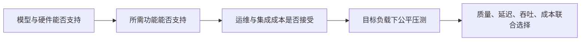

# D32：vLLM、SGLang 与 TensorRT-LLM 应该怎样选择？

D31 已经确定选型必须从模型、硬件、负载和服务目标出发。本章不做永久排行榜，因为引擎功能与性能快速变化；这里只建立稳定的选型方法，并用截至 **2026-09-21** 的官方文档说明三者当前定位。

## 1. 先排除“哪个引擎最快”这个问题

一个引擎可能在特定 GPU、模型、精度、输入输出长度和并发下领先，换一个条件结论就会改变。若目标模型不受支持、部署硬件不同或缺少所需功能，公开榜单上的峰值没有决策意义。

更可靠的顺序是：先检查硬约束，再比较目标负载。

## 2. 先固定一个要解决的服务需求

用同一个案例贯穿后面的选择：团队准备在单张 NVIDIA GPU 上部署一个受三个候选支持的 7B 稠密模型，快速提供 OpenAI 兼容的聊天接口。请求没有大量公共前缀，也没有强制 JSON 等结构化输出要求；模型可能继续更换，团队暂时不准备维护复杂的模型构建和专项调优流程。

这组条件已经给出选择重点：模型和单卡必须能运行；通用 API 与快速迭代比专项功能更重要；即使某个引擎峰值更高，只要接入和维护成本不符合当前团队，也不一定优先。后面每介绍一个引擎，都只问它怎样满足这组需求，以及需求发生什么变化时应重新比较。

## 3. 三类定位怎样理解？

根据当前官方文档，可以先形成以下定位，而不是把它当成绝对边界。

| 引擎 | 当前定位重点 | 放进案例后优先确认什么 |
| --- | --- | --- |
| vLLM | 通用模型服务、较广的模型与硬件支持，以及多种常用推理优化 | 能否快速建立可用基线，目标模型、API 与单卡配置是否受支持 |
| SGLang | 高性能模型服务，并关注前缀复用、结构化生成和复杂生成工作负载 | 如果以后出现大量共享前缀或强结构化输出，能否获得实际收益 |
| TensorRT-LLM | 面向 NVIDIA GPU 的深度优化库与运行时 | 固定模型和硬件后，专项优化收益是否值得更高的构建与维护成本 |

三者都在快速吸收连续批处理、量化、推测解码和分布式推理等相似能力。因此这张表描述的是当前选型关注点，不表示某项功能永远只属于一个引擎；最终仍要核对目标版本的官方支持矩阵。

## 4. 为什么案例中先用 vLLM 建立基线？

vLLM 当前提供常见 API 服务能力，并覆盖 PagedAttention、连续批处理、Chunked Prefill、前缀缓存、量化、推测解码和多种并行方式。案例当前最需要的是快速接入一个可能继续更换的模型，而不是围绕固定模型做专项构建，因此可以先用 vLLM 建立通用服务基线。

“先建立基线”不等于已经选定最终引擎，也不表示 vLLM 在任何条件下最快。即使官方写着支持某种量化，也仍要核对目标模型、GPU 和并行配置的组合，并测量自己的负载。基线的作用是先得到可比较的质量、延迟、吞吐和显存结果。

## 5. 什么变化会让 SGLang 值得重点比较？

假设业务后来加入两个条件：大量请求重复同一段长系统提示，而且输出必须满足指定 JSON 结构。前者使前缀缓存可能减少重复 Prefill；后者要求引擎在生成过程中约束可选 Token，使结果符合 JSON、语法或字段规则，这类能力统称为**结构化生成（structured generation）**。此时 SGLang 相关能力是否能在目标模型上降低延迟并稳定输出，就成为值得验证的新问题。

有些官方资料还会提到 **Prefill/Decode 解耦**，它是把计算特征不同的 Prefill 与 Decode 阶段安排到不同服务单元或资源上的部署方式。当前单卡案例并不需要靠这个术语作出选择，因此只在未来进入多实例或大规模服务时再单独评估。也不能仅凭“Agent 更适合 SGLang”下结论：如果共享前缀很少、没有结构化约束，相关能力未必带来足以覆盖迁移成本的收益。

## 6. 什么变化会让 TensorRT-LLM 值得重点比较？

再假设模型和 NVIDIA GPU 型号长期固定，而且 vLLM 基线已经证明延迟或吞吐仍不满足目标，团队也愿意承担更深入的构建和调优。此时 TensorRT-LLM 针对 NVIDIA 架构的量化、批处理、缓存和多 GPU 优化路径就值得重点评估。

官方资料中的 **in-flight batching** 可以先理解为与 D29 连续批处理同类的思想：请求完成后，运行时继续调整活动批次，而不是等整个固定批次一起结束。**Chunked Context** 则与 D29 的分块 Prefill 思路相关：把长上下文分块处理，以便与生成任务共同安排。名称和具体实现可能不同，选型时应比较目标版本的行为与限制，而不是因为术语不同就把它们当成完全无关的机制。

更深优化的代价是选型更依赖 GPU 架构、模型—功能支持矩阵、构建产物和调优流程。若团队仍要频繁切换模型，这些集成成本可能超过专项性能收益。

## 7. 怎样做最终对比？

案例当前可以先用 vLLM 建立基线；如果负载出现共享长前缀或结构化生成需求，再加入 SGLang 比较；如果模型与 NVIDIA 硬件固定并需要深度优化，再加入 TensorRT-LLM。**这是由条件变化推导出的候选顺序，不是三种引擎的永久排名。**

真正比较时，为候选使用相同模型与 tokenizer 版本、chat template、精度、硬件、输入输出分布、到达率、采样参数和停止条件；统一最大上下文配置、预热方式，以及前缀缓存是否启用和测试开始时的缓存状态。先验证输出质量与功能正确，再比较 P50/P95/P99 TTFT、TPOT、完成率、可持续吞吐、峰值显存和单位请求成本。若配置不等价，例如一个启用了量化、另一个使用全精度，结论必须明确写出差异。

还要记录非性能条件：部署和升级复杂度、故障诊断、监控指标、社区与供应商支持、许可证及团队熟悉度。**最佳引擎不是某项峰值最高者，而是在目标约束下总体风险和成本最合适者。**

如果目标模型是 MoE，还要额外核对具体专家架构、专家并行、量化 Kernel 和跨卡通信支持。能加载模型不等于能高效执行专家路由；总参数、激活参数和 All-to-All 通信的关系见 [MoE 推理专题](../moe-special-topic/README.md)。

官方资料入口（核对日期：2026-09-21）：[vLLM 文档](https://docs.vllm.ai/en/stable/)、[SGLang 文档](https://docs.sglang.ai/)、[TensorRT-LLM 文档](https://nvidia.github.io/TensorRT-LLM/)。这些链接用于核对易变支持情况，正文已经给出完整选型逻辑。

## 8. 推理原理阶段怎样收束？

D18～D22 建立 GPU 与性能诊断，D23～D27 解释单项优化，D28～D31 说明引擎怎样管理请求。D32 将它们合成一个选择原则：先明确负载与约束，再检查支持，最后用公平测试决定。主线下一阶段是 D33 推理实操，用一个固定模型建立基线、部署候选引擎并验证这些判断；如果希望先补齐稀疏模型推理，可在实操前阅读可选的 [MoE 推理专题](../moe-special-topic/README.md)。

## 助记卡片

**卡片 1：为什么不能直接问哪个引擎最快？**

> **答案：** 性能依赖模型、硬件、精度、长度、并发和配置，脱离条件的排名无法用于具体决策。

**卡片 2：引擎选型的第一个门槛是什么？**

> **答案：** 目标模型、硬件、精度和必要功能的组合是否受支持。

**卡片 3：vLLM 的常见定位是什么？**

> **答案：** 面向广泛模型和硬件的通用高吞吐推理与服务，并提供分页缓存、连续批处理等能力。

**卡片 4：SGLang 选型时常重点验证什么？**

> **答案：** 共享前缀、复杂或结构化生成、Agent 工作负载及相关优化在目标模型上的实际收益。

**卡片 5：TensorRT-LLM 的硬件边界是什么？**

> **答案：** 它面向 NVIDIA GPU 做深度优化，选型需核对具体 GPU、模型、精度和功能支持矩阵。

**卡片 6：公平压测需要保持哪些条件一致？**

> **答案：** 模型、tokenizer、模板与精度，硬件、负载、采样与停止条件，以及预热和缓存状态都应保持等价。

**卡片 7：为什么还要比较非性能条件？**

> **答案：** 部署升级、监控诊断、兼容性和团队维护成本会决定生产系统的总体风险。

**卡片 8：最终选择原则是什么？**

> **答案：** 在满足功能和质量的前提下，以目标负载的延迟、吞吐、显存、成本与运维风险联合选择。

## 自测题

1. 一个引擎在公开榜单领先，为什么仍可能不适合你的服务？
2. 选型时为什么先查支持矩阵，再跑性能测试？
3. 大量请求共享长系统提示时，应重点验证哪类能力？
4. 团队使用 NVIDIA GPU 并追求固定模型的深度优化，为什么可以重点评估 TensorRT-LLM？还要考虑什么代价？
5. 比较两个引擎时，一个用 4 位权重、另一个用 FP16，能否把速度差全部归因于引擎？
6. 除 TTFT、TPOT 和吞吐外，生产选型还应记录什么？
7. D18～D32 形成的完整性能判断链是什么？

完成后再看[参考答案](quiz-answers.md)。返回[D31](../d31-workload-aware-serving/README.md)，或回到[推理工程路线](../../../roadmap.md)。
