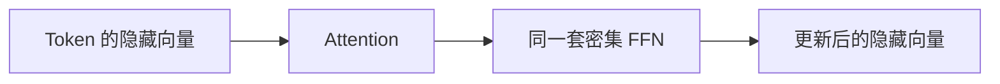
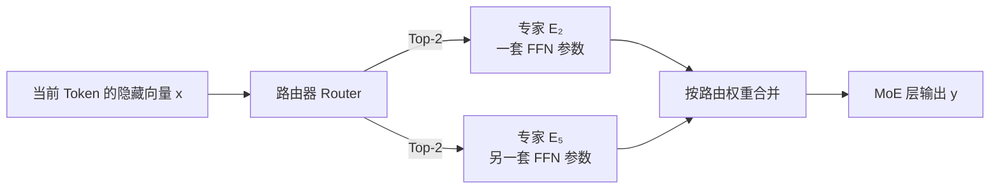
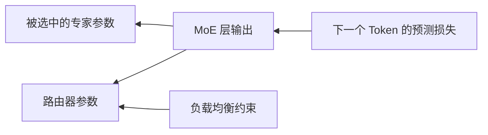
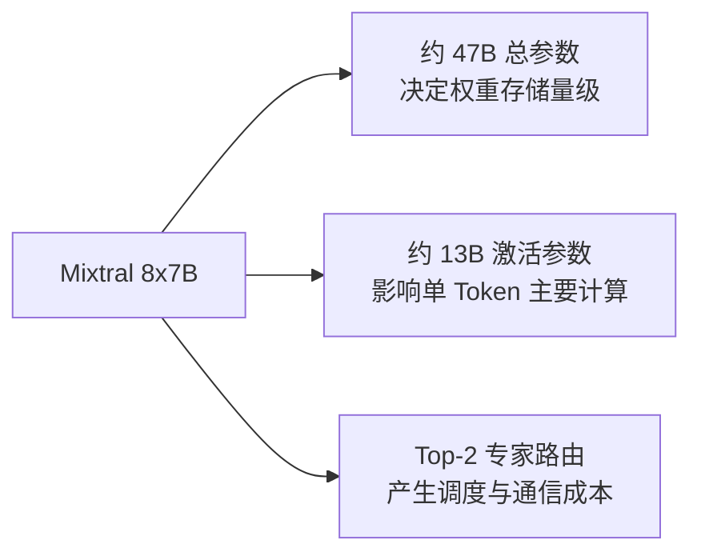
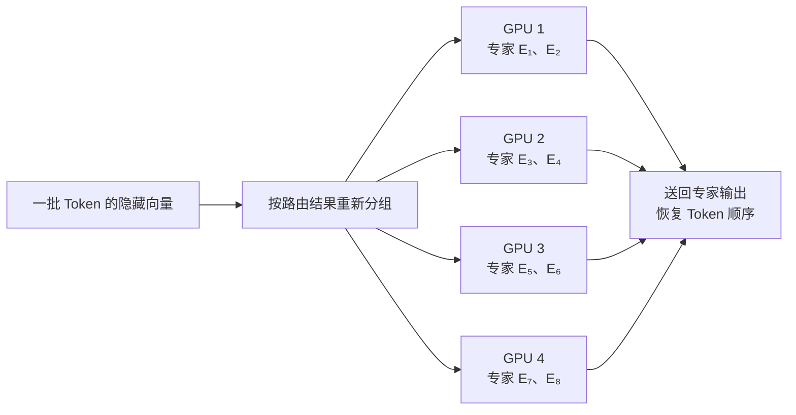

# MoE 推理专题：为什么参数很多，却只计算一部分？

## 开篇总结

密集模型处理每个 Token 时，基本使用每层相同的一套参数；**混合专家模型（Mixture of Experts，MoE）**则把部分 FFN 替换成多个专家，并由路由器为每个 Token 选择少数专家。这样可以扩大模型的总参数容量，而不让单 Token 计算量按总参数量同比增长。

理解 MoE 必须始终分开三个数字：**总参数量决定权重存储的数量级，激活参数量影响单 Token 的主要专家计算量，专家分布决定路由与跨卡通信成本。**MoE 不是删掉参数，也不是免费加速；它用更复杂的训练、调度和通信换取条件计算。

## 1. 密集 FFN 遇到了什么限制？

D05 已经讲过，每个 Transformer 层通常包含 Attention 和前馈网络（Feed-Forward Network，FFN）。FFN 中有大量参数，密集模型的每个 Token 都经过同一套 FFN。若不断扩大 FFN，模型容量增加了，但每个 Token 的矩阵计算也随之增加。



这里的矛盾是：希望模型拥有更多参数来容纳更多模式，却不希望每个 Token 都使用全部新增参数。要做到这一点，模型需要根据当前输入只调用一部分参数，这种做法叫作**条件计算（Conditional Computation）**。MoE 是条件计算的一种典型实现。

## 2. MoE 改变的是 FFN，而不是整个 Transformer

一个常见 MoE Transformer 仍然保留 Attention、残差连接和归一化，只把某些层里的单个密集 FFN 替换为多个独立 FFN。这些独立 FFN 就是**专家（Expert）**。

假设某个 MoE 层有 8 个专家，每个 Token 只选择 2 个。Token 的隐藏向量 x 先经过路由器，路由器选出专家 E₂ 和 E₅；两个专家各自处理完整的 x，再把结果合并。



**专家不是完整大模型，也不是独立回答问题的 Agent。**它通常只是 Transformer 某一层中的一套 FFN 参数。Attention 仍负责让 Token 汇集上下文信息；专家根据已经包含上下文的隐藏向量，执行不同的非线性变换。

## 3. 路由器怎样选择专家？

路由器是 MoE 层中的一个小型可训练网络。为了给当前隐藏向量 x 的 8 个候选专家打分，它使用路由矩阵 Wᵣ 计算：

s = xWᵣ

x 表示当前 Token 在这一层的隐藏向量；Wᵣ 是训练得到的路由器参数；s 是 8 个专家分数组成的向量，sᵢ 表示第 i 个专家与当前隐藏状态的匹配分数。路由器通常再把分数转成权重，并选取得分最高的 k 个专家，这就是 **Top-k 路由**。

假设 8 个专家的得分如下：

| 专家 | E₁ | E₂ | E₃ | E₄ | E₅ | E₆ | E₇ | E₈ |
| --- | ---: | ---: | ---: | ---: | ---: | ---: | ---: | ---: |
| 路由得分 | 0.2 | 2.8 | 0.1 | 0.5 | 2.1 | 0.3 | 0.7 | 0.4 |

Top-2 会选择 E₂ 和 E₅。若归一化后的权重分别是 0.67 和 0.33，MoE 输出可简化写成：

y = 0.67E₂(x) + 0.33E₅(x)

E₂(x) 和 E₅(x) 分别表示两个专家处理同一个隐藏向量 x 的结果。这个公式的重点不是手算权重，而是理解：**路由器决定调用谁，专家负责实际变换，最后按路由权重合并。**

路由器看到的是包含上下文的隐藏向量，而不是孤立的 Token ID。因此“苹果公司”和“吃苹果”中的“苹果”可能选择不同专家；同一个 Token 到达下一层时隐藏向量已经变化，也可能重新选择另一组专家。

## 4. 路由器和专家怎样学会分工？

训练开始时，路由器和专家都没有预先规定的职责。模型完成下一个 Token 预测后，预测损失沿被选中的计算路径反向传播，被选择的专家和路由器参数都会更新。反复训练后，路由器逐渐学习哪些隐藏状态适合送给哪些专家，专家也在收到的数据上形成不同的处理倾向。



只优化预测损失可能出现一个问题：路由器早期发现某个专家稍好，就把越来越多 Token 送给它；这个专家获得更多训练，其他专家越来越少被使用，最终形成**专家坍缩（Expert Collapse）**。因此很多 MoE 训练方法会加入负载均衡约束，鼓励 Token 不要长期挤在少数专家上。

可以把训练目标概括为：

总损失 = 预测损失 + λ×负载均衡损失

λ 表示负载均衡项的权重。它不是要求每个专家永远收到完全相同的 Token，而是在允许专家分工的同时，防止严重失衡。不同 MoE 架构会采用不同路由和均衡方法，所以“Top-2 加辅助损失”是常见方案，不是所有 MoE 的唯一实现。

## 5. 为什么只激活部分专家不等于删除参数？

假设每层有 8 个专家，每个专家有 5B 参数，当前 Token 只选择 2 个专家：专家总参数量是 8×5B=40B；当前 Token 激活的专家参数量是 2×5B=10B；没被选中的 30B 参数仍保存在模型中，只是没有参与当前 Token 的这一层计算。

下一个 Token 可能选择其他专家，因此部署时不能只保存当前激活的专家。需要同时区分：

| 数量 | 它回答的问题 | 主要影响 |
| --- | --- | --- |
| 总参数量 | 模型一共保存多少参数？ | 模型文件、权重显存、加载与多卡分片 |
| 激活参数量 | 一个 Token 本次经过多少参数？ | 单 Token 的主要参数计算量 |
| 专家数与 Top-k | 参数怎样被选择和分布？ | 路由、批处理、负载均衡与通信 |

因此，“100B 总参数、20B 激活参数”不是 20B 模型。它仍拥有并需要存储 100B 参数，只是每个 Token 的主要参数计算没有遍历全部 100B。

## 6. 用 Mixtral 8x7B 算一次显存与计算

Mistral 官方资料将 Mixtral 8x7B 记为约 **47B 总参数、13B 激活参数**，每个 Token 在每个 MoE 层从 8 个专家中选择 2 个。名称中的“8x7B”不能直接算成 56B，因为模型还有共享部分，专家结构也不能用整个 7B 密集模型简单相加；容量规划应采用官方给出的总参数量。

若按 BF16 每个参数 2 字节估算，权重主体约为：

47B×2 字节 = 94GB ≈ 87.5GiB

这与官方给出的约 94GB BF16 GPU RAM 数量级一致。它明显不能因为每 Token 只激活约 13B 参数，就按 13B×2=26GB 估算全部权重。

另一方面，主要专家计算更接近 13B 激活参数的数量级，而不是让每个 Token 都执行完整 47B 参数的计算。但它也不能直接等同于 13B 密集模型，因为还存在共享层、路由器、Token 重排和可能的跨卡通信。



这个真实例子说明，不能只问“模型是多少 B”，还要追问这个数字是总参数还是激活参数，以及它是密集模型还是 MoE。

## 7. KV Cache 会因为稀疏激活而同比减少吗？

通常不会。D21 的 KV Cache 公式主要由层数、活动 Token 数、KV 头数、头维度和缓存精度决定。MoE 通常替换的是 FFN，而 K、V 来自 Attention。因此专家从 8 个选 2 个，并不意味着 KV Cache 也自动降为四分之一。

MoE 可能通过具体模型结构间接改变层数、隐藏维度或注意力配置，但容量估算仍应分别计算：

```text
权重：主要看总参数量与权重精度
KV Cache：看 Attention 配置、Token 数与缓存精度
计算：看激活路径、共享层以及实际 Kernel
通信：看专家放置、路由分布和设备互联
```

把激活比例同时套到权重和 KV Cache 上，是部署 MoE 时最常见的错误之一。

## 8. 为什么 MoE 特别依赖多卡通信？

当全部专家无法放入一张 GPU 时，可以把不同专家放到不同 GPU，这叫**专家并行（Expert Parallelism，EP）**。路由器选中专家后，Token 的隐藏向量必须被发送到专家所在的 GPU；计算完成后，结果还要返回原来的序列处理流程。



许多 GPU 同时互相发送不同 Token 的过程通常形成 **All-to-All 通信**。MoE 即使减少了专家矩阵计算，也可能受以下因素限制：GPU 互联带宽不足、某些专家收到过多 Token、每个专家分到的批次太小、Token 重排与 Kernel 启动开销过高。

因此 MoE 的性能问题不能只套用“激活参数少，所以一定快”。在小批量 Decode 中，每个专家可能只收到很少 Token，矩阵乘法不够大，GPU 利用率反而较低；在多卡场景中，通信还可能超过节省的计算时间。

## 9. MoE 会不会因为少用参数而变笨？

不一定。MoE 的目标是让不同输入使用不同参数子集：两个 Token 都激活约 13B 参数，但选择的 13B 子集可能不同，所以整个模型仍能利用比 13B 密集模型更大的总容量。合适的路由和充分训练可以让专家形成互补能力。

但 MoE 也不保证仅凭总参数更大就一定更强。路由选错、专家训练不足、负载严重失衡、专家容量溢出或通信实现低效，都会降低质量或速度。模型质量最终仍需在目标任务上评测，不能用总参数量或激活参数量单独替代评测结果。

比较密集模型和 MoE 时，至少同时记录模型版本、总参数量、激活参数量、精度、目标任务质量、GPU 数量与互联、输入输出长度和并发条件。否则“更聪明”或“更快”都缺少可比较的前提。

## 10. 推理工程中怎样判断 MoE 是否合适？

选用 MoE 前，应按下面的顺序判断：

1. **质量是否满足任务。**先用目标评测集判断输出，而不是根据参数标签猜测能力。
2. **全部权重能否存放。**按总参数量、精度和量化元数据估算，而不是按激活参数量。
3. **引擎是否支持具体架构。**不仅要能加载模型，还要确认目标精度、专家并行与对应 Kernel。
4. **设备互联是否匹配。**专家跨卡时，PCIe、NVLink 或网络带宽会影响 All-to-All 通信。
5. **目标负载是否能形成有效批次。**低并发、小批量可能无法充分利用每个专家。
6. **用真实负载复测。**同时观察质量、TTFT、TPOT、吞吐、显存、GPU 利用率和通信时间。

这条判断链与 D32 的引擎选型一致，但 MoE 新增了专家放置、路由分布和 All-to-All 通信三个必须检查的变量。后续 D33～D47 先用密集模型建立容易诊断的基线；具备多卡资源后，再把 MoE 作为对照实验，而不是把所有复杂度一次引入。

## 结尾总结

MoE 在 Transformer 的部分层中，用多个专家 FFN 替代一个密集 FFN。每个 Token 的隐藏向量先经过路由器，路由器计算专家分数并选择 Top-k 专家，专家完成变换后再合并结果。

必须记住四条边界：**总参数量没有因为稀疏激活而消失；激活参数量只描述当前 Token 使用的部分路径；KV Cache 不按专家激活比例自动减少；多卡 MoE 会新增专家负载与 All-to-All 通信。**MoE 是否更强或更快，最终要由目标质量和真实部署数据决定。

资料依据（核对日期：2026-09-18）：Mistral 官方 [Mixtral 8x7B 模型页](https://docs.mistral.ai/models/mixtral-8x7b-0-1)、[Mixtral 官方模型卡](https://huggingface.co/mistralai/Mixtral-8x7B-v0.1)、[Switch Transformer 论文](https://arxiv.org/abs/2101.03961)与 [GShard 论文](https://arxiv.org/abs/2006.16668)。

## 助记卡片

**卡片 1：MoE 主要替换 Transformer 中的哪一部分？**

> **答案：** 通常把部分层中的密集 FFN 替换为多个专家 FFN；Attention 等主干结构仍然存在。

**卡片 2：谁决定一个 Token 使用哪些专家？**

> **答案：** 每个 MoE 层的路由器根据当前 Token 的隐藏向量计算专家分数，并选择 Top-k 专家。

**卡片 3：专家是完整模型吗？**

> **答案：** 通常不是。一个专家一般是 MoE 层中的一套 FFN 参数，不是能独立完成对话的完整模型。

**卡片 4：总参数量和激活参数量分别影响什么？**

> **答案：** 总参数量主要影响权重存储；激活参数量更接近单 Token 的主要专家计算量。

**卡片 5：为什么未被选中的专家仍需保存？**

> **答案：** 它们只是没有处理当前 Token，其他 Token 或其他层仍可能选择它们。

**卡片 6：MoE 的 KV Cache 会按专家激活比例下降吗？**

> **答案：** 通常不会。KV Cache 主要由 Attention 配置、活动 Token 数和缓存精度决定。

**卡片 7：什么是专家并行？**

> **答案：** 把不同专家放在不同设备上，按路由结果把 Token 隐藏向量发送到对应设备计算。

**卡片 8：All-to-All 通信为什么会出现？**

> **答案：** 一批 Token 可能选择分布在不同 GPU 上的专家，各 GPU 需要互相发送隐藏向量并收回专家输出。

**卡片 9：为什么需要负载均衡机制？**

> **答案：** 防止大量 Token 长期集中到少数专家，导致其他专家训练不足、热点专家拥堵。

**卡片 10：MoE 为什么不一定比密集模型更快？**

> **答案：** 路由、Token 重排、小专家批次和跨卡通信可能抵消部分计算节省。

## 自测题

1. 为什么 MoE 被称为条件计算？
2. 一个 MoE 层有 8 个各含 5B 参数的专家，每个 Token 选择 2 个。专家总参数量和单 Token 激活的专家参数量分别是多少？
3. 为什么“100B 总参数、20B 激活参数”的 MoE 不能按 20B 模型估算权重显存？
4. 同一个词在两个不同上下文中，为什么可能选择不同专家？
5. Mixtral 8x7B 约有 47B 总参数、13B 激活参数。按 BF16 粗估，为什么权重主体约为 94GB，而不是 26GB？
6. 为什么专家从 8 个选 2 个，KV Cache 也不会自动变成四分之一？
7. 多卡 MoE 在矩阵计算减少后，仍可能慢在哪里？
8. 比较一个密集模型和一个 MoE 时，为什么不能只比较总参数量？

完成后再看[参考答案](quiz-answers.md)。需要复习显存计算时返回 [D21](../d21-memory-estimation/README.md)，需要判断引擎时返回 [D32](../d32-engine-selection/README.md)，随后进入 [D33 实战环境盘点](../../03-inference-practice/d33-environment/README.md)。
