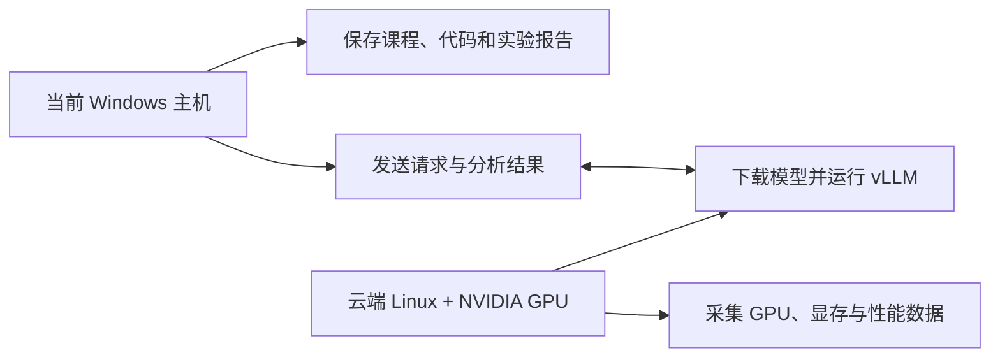

# D33：当前环境能否完成推理工程实战？

D32 已经说明引擎选型必须服从模型、硬件和负载。真正开始部署时，如果先照着命令安装，最后才发现没有受支持的 GPU、显存装不下模型或操作系统不兼容，前面的配置都会变成无效工作。因此实战第一步不是安装 vLLM，而是先回答：**现有资源能完成哪些实验，还缺少什么？**

## 1. 环境不是一张显卡

模型推理会同时依赖计算设备、内存、存储和软件栈。显存决定模型权重、KV Cache 与运行空间能否同时容纳；GPU 架构决定某些数据类型和 Kernel 能否执行；驱动让操作系统控制 GPU；推理框架再通过 CUDA 等运行时调用 GPU。磁盘负责保存模型文件，系统内存则承接下载、加载和数据准备。


这条链上任意一层不满足要求，服务都可能无法启动。例如磁盘空间足够只能说明模型文件放得下，不能说明 GPU 显存足够；安装了 CUDA 工具包也不能凭空得到 NVIDIA GPU。

## 2. 先盘点不会随安装改变的硬件

在 PowerShell 中执行下列命令，可以分别查看 CPU、系统内存、显示设备、NVIDIA GPU 和磁盘。仓库已经提供可重复运行的[环境采集脚本](scripts/collect-environment.ps1)，本节先解释每项结果为什么重要。

```powershell
Get-CimInstance Win32_Processor |
  Select-Object Name, NumberOfCores, NumberOfLogicalProcessors

Get-CimInstance Win32_ComputerSystem |
  Select-Object @{N='TotalMemoryGiB';E={[math]::Round($_.TotalPhysicalMemory/1GB,2)}}

Get-CimInstance Win32_VideoController |
  Select-Object Name, DriverVersion

nvidia-smi --query-gpu=name,driver_version,memory.total,compute_cap --format=csv,noheader

Get-PSDrive -PSProvider FileSystem |
  Select-Object Name, Used, Free
```

其中 `nvidia-smi` 最关键：它由 NVIDIA 驱动提供，能报告 GPU 型号、驱动版本、总显存和计算能力（Compute Capability）。如果命令不存在，并且 Windows 设备列表也没有 NVIDIA GPU，问题不是“缺少 Python 包”，而是当前主机没有可供 CUDA 使用的 NVIDIA GPU。

Windows 的 `AdapterRAM` 字段可能截断或错误报告大显存，因此只把设备管理信息用于识别显卡名称；NVIDIA 显存优先以 `nvidia-smi` 为准。磁盘还要为模型权重、容器镜像和下载缓存同时留空间，不能只按一个权重文件估算。

## 3. 再检查会随配置改变的软件层

硬件合格之后，才需要确认操作系统、Linux 环境、容器服务和 Python。下面的命令只读取状态，不会安装软件：

```powershell
Get-ComputerInfo |
  Select-Object WindowsProductName, WindowsVersion, OsBuildNumber, OsArchitecture

wsl --status
wsl -l -v

docker version
python --version
```

`wsl -l -v` 中出现 `docker-desktop`，只说明 Docker Desktop 创建过自己的 WSL 发行版，**不等于已经有供学习使用的 Ubuntu 环境**。同理，能执行 Docker 客户端不等于 Docker 后台服务正在运行；`docker version` 同时返回 Client 和 Server 信息，才说明两端都可用。

截至 2026-09-17，vLLM 官方 GPU 安装文档把 Linux 作为主要运行环境，并说明 Windows 不能原生运行 vLLM，可使用带兼容 Linux 发行版的 WSL。其 NVIDIA 路线要求 GPU 计算能力不低于 7.5。这个要求会随版本变化，真正安装前仍要重新核对[官方 GPU 安装文档](https://docs.vllm.ai/en/stable/getting_started/installation/gpu/)。

## 4. 本机盘点得出了什么结论？

本次只读检查的完整记录保存在[环境报告](records/environment-report.md)。最重要的结果如下：

| 项目 | 2026-09-17 检测结果 | 对后续实验的影响 |
| --- | --- | --- |
| CPU | Intel Core i7-12700，12 核 20 线程 | 足够承担客户端、脚本、结果整理和轻量 CPU 验证 |
| 系统内存 | 约 31.71 GiB | 足够完成课程资料与常规客户端工作，但不是 GPU 显存 |
| GPU | Intel UHD Graphics 770；未检测到 NVIDIA GPU | 不能在当前主机走 CUDA/vLLM NVIDIA 主线 |
| `nvidia-smi` | 命令不存在 | 当前没有可验证的 NVIDIA 驱动与 CUDA GPU |
| WSL2 | 仅发现停止状态的 `docker-desktop` | 尚无已确认的普通 Linux 学习发行版 |
| Docker | 客户端 29.7.2，后台服务未运行 | 当前不能直接启动容器，但这不是最主要阻塞项 |
| Python | 3.12.10 | 版本本身可用于辅助脚本；不代表 vLLM 已安装或可运行 |
| C 盘可用空间 | 约 723.6 GiB | 本地保存模型、数据和实验结果的空间充足 |

由这些结果可以排除“直接在当前 Windows 主机上做 NVIDIA GPU 推理实验”。虽然 vLLM 也在发展 Intel GPU 和 CPU 后端，但 UHD 770 是集成显卡，不适合作为本课程后续 GPU 性能、显存和多卡实验的主环境。强行改走 CPU 会让课程测到另一类瓶颈，也无法验证 D18～D32 中的大部分 GPU 机制。

## 5. 后续应该选择哪条路线？

为了让 D34～D47 的数据能连续比较，建议采用以下分工：



**推荐主路线是云端 Linux 加单张至少 24 GiB 的 NVIDIA GPU**，继续使用 D21 的 Qwen2.5-7B-Instruct 作为贯穿模型。24 GiB 不是 vLLM 的通用最低要求，而是结合该模型 BF16 权重约 14.17 GiB、KV Cache、工作区和后续并发实验给出的课程配置。显存更小时可以改用量化权重或更小模型，但后续所有基线必须随之统一，不能中途换模型后继续比较旧数据。

选择具体 GPU 时至少核对四项：显存是否满足实验、计算能力是否被目标 vLLM 版本支持、云端镜像中的驱动与运行时是否匹配、租用时长和数据持久化方式是否可接受。**D33 只确定资源规格，不注册平台、不购买算力，也不安装环境。**正式创建云资源时再根据可用区域和当日价格选择供应商。

## 6. 怎样判断 D33 已完成？

请完成[环境盘点任务](lab.md)，并把结果写入自己的环境报告。验收时不要求成功运行模型，只需要能根据证据说明：当前主机为何不适合 CUDA 推理、后续准备使用什么环境、目标 GPU 至少需要多少显存，以及选择这个数字的依据。环境路线确认后，D34 才会固定模型版本、权重精度和模型文件清单。

## 助记卡片

**卡片 1：为什么实战不能从安装 vLLM 开始？**

> **答案：** 安装不能改变 GPU 型号和显存；应先确认硬件与系统是否满足目标引擎和模型的要求。

**卡片 2：系统内存和 GPU 显存能否互相替代？**

> **答案：** 不能直接替代。模型在 GPU 上执行时，权重、KV Cache 和工作区主要受 GPU 显存限制。

**卡片 3：`nvidia-smi` 提供什么关键证据？**

> **答案：** 它报告 NVIDIA GPU、驱动、显存和计算能力，是判断 CUDA GPU 路线是否可用的核心入口。

**卡片 4：为什么看到 `docker-desktop` 不能说明 Ubuntu 已准备好？**

> **答案：** 它是 Docker Desktop 使用的内部 WSL 发行版，不等于独立的日常 Linux 学习环境。

**卡片 5：为什么 Docker Client 存在仍可能不能运行容器？**

> **答案：** 客户端还需要连接正在运行的 Docker Server；只有客户端版本不足以证明后台服务可用。

**卡片 6：为什么推荐至少 24 GiB 显存？**

> **答案：** 这是为 7.61B 模型的 BF16 权重、KV Cache、工作区及并发实验共同留出的课程预算，不是所有模型的统一门槛。

**卡片 7：当前主机在后续实验中还有什么用途？**

> **答案：** 保存资料与代码、发送 API 请求、分析数据和整理实验报告；GPU 推理由远端环境承担。

## 自测题

1. 一台电脑有 32 GiB 系统内存，但没有 NVIDIA GPU，能否据此判断它可以完成 CUDA/vLLM GPU 实验？为什么？
2. `nvidia-smi` 命令不存在时，为什么不能立刻断言只是少装了一个 Python 包？
3. WSL 列表中只有 `docker-desktop`，这能证明已经准备好课程所需的 Ubuntu 环境吗？
4. 为什么本课程不选择 Intel UHD 770 作为后续 GPU 性能实验主环境？
5. 如果云端只有 16 GiB 显存，应该直接沿用 Qwen2.5-7B-Instruct BF16 基线吗？应怎样处理？
6. 为什么 D33 不立即选择价格最低的云 GPU？
7. D33 完成后，哪些条件必须固定，才能让后续优化结果可比较？

完成后再看[参考答案](quiz-answers.md)。下一步是 D34：确认模型配置、Tokenizer、权重分片和精度如何共同组成一个可加载模型。
