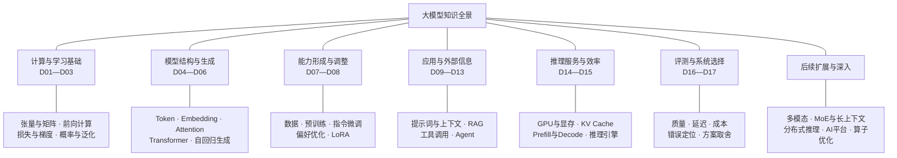
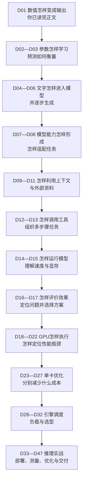
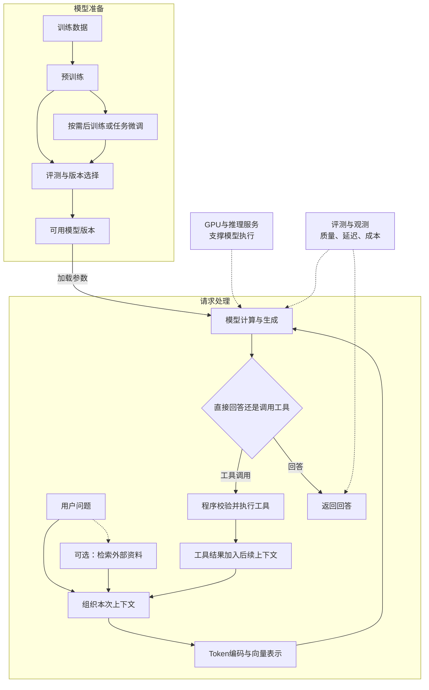

# 大模型学习知识脉络

**先看领域全景，再沿章节逐步补全。** D01～D17 建立大模型全貌，D18～D32 深入推理工程原理；你已反馈读完 D32，下一阶段由 D33～D47 将原理落实为部署、压测、优化和交付。读完、完成实验和通过验收分别记录在[学习进度](progress.md)。

## 一、整个领域由哪些部分组成

下面是**知识分类图**，连线表示包含关系，不表示运行顺序。第一轮围绕文本大模型，扩展方向先认识位置。

这几部分回答不同问题：**基础**解释模型怎样计算与学习，**结构**解释文字怎样被处理，**训练**解释能力从哪里来，**应用**解释如何接入知识和工具，**服务**解释如何运行，**评测**解释是否有效。GPU 支撑计算，RAG 提供外部知识；两者属于不同层面。

## 二、按什么顺序学习

下面是**课程顺序图**。箭头表示下一段学习内容，不表示每次请求必须依次经历这些技术。

每章对应一个问题。**D01～D17 的正文、助记卡、自测与参考答案均已生成；资料已生成不代表已经阅读或掌握。**

| 章节 | 本章回答的问题 | 要连起来的概念 |
| --- | --- | --- |
| [**D01**](courses/00-foundations/d01-tensors/README.md) | 模型内部究竟在计算什么？ | 输入与参数 → 加权求和 → 矩阵与张量 → 前向计算 |
| [**D02**](courses/00-foundations/d02-learning/README.md) | 参数怎样从数据中学出来？ | 预测与目标 → 损失 → 梯度与反向传播 → 参数更新 |
| [**D03**](courses/00-foundations/d03-probability-generalization/README.md) | 怎样判断模型有没有学好？ | 概率与 Softmax → 交叉熵 → 训练/验证 → 过拟合与泛化 |
| [**D04**](courses/01-llm-overview/d04-text-input/README.md) | 文字怎样变成模型的输入？ | Token → Token ID → Embedding → 位置信息 |
| [**D05**](courses/01-llm-overview/d05-attention-transformer/README.md) | 模型怎样结合上下文处理信息？ | Q/K/V 与 Attention → 多头注意力 → Transformer 层 |
| [**D06**](courses/01-llm-overview/d06-autoregressive-generation/README.md) | 模型怎样一个接一个生成 Token？ | 因果遮罩 → 输出分数 → 概率与采样 → 自回归循环 → 停止条件 |
| [**D07**](courses/01-llm-overview/d07-pretraining/README.md) | 基础模型的能力从哪里来？ | 数据准备 → 预训练目标 → 训练过程 → 基础能力及局限 |
| [**D08**](courses/01-llm-overview/d08-post-training/README.md) | 怎样让模型更适合指令和任务？ | SFT → 偏好优化与强化学习概览 → LoRA → 微调边界 |
| [**D09**](courses/01-llm-overview/d09-prompt-context/README.md) | 不改参数，怎样影响这次回答？ | 提示词 → 示例与角色 → 历史消息 → 上下文窗口 |
| [**D10**](courses/01-llm-overview/d10-retrieval/README.md) | 怎样从大量资料中找到相关内容？ | 文档切分 → 检索表示与索引 → 召回 → 重排 |
| [**D11**](courses/01-llm-overview/d11-rag/README.md) | 检索到资料后，模型怎样生成答案？ | RAG 请求过程 → 上下文组装 → 引用 → 分层诊断 → 与微调的取舍 |
| [**D12**](courses/01-llm-overview/d12-tool-calling/README.md) | 模型怎样使用外部工具完成动作？ | 调用信息 → 参数校验 → 程序执行 → 结果反馈 |
| [**D13**](courses/01-llm-overview/d13-agent-workflow/README.md) | 多步骤任务怎样组织和停止？ | 工作流与 Agent → 状态与反馈 → 循环与停止 → 失败处理 |
| [**D14**](courses/01-llm-overview/d14-inference-memory/README.md) | 模型推理为什么占显存，响应为什么会变慢？ | 权重与缓存 → GPU 计算 → Prefill/Decode → KV Cache |
| [**D15**](courses/01-llm-overview/d15-serving-engine/README.md) | 推理引擎怎样让更多请求更快完成？ | 批处理与调度 → 缓存复用 → 量化概览 → 延迟与吞吐 |
| [**D16**](courses/01-llm-overview/d16-evaluation/README.md) | 怎样知道回答和服务真的变好了？ | 评测集 → 质量评价 → 延迟/吞吐/成本 → 对照与回归 |
| [**D17**](courses/01-llm-overview/d17-system-diagnosis/README.md) | 遇到问题时，应该改模型还是改系统？ | 模型、提示词、RAG、工具、推理服务的方案判断与全景复述 |

**关键的跨章连接：**D02 学到的参数更新支撑 D07/D08 的训练；D03 的概率帮助理解 D06 的生成；D06 的生成过程是 D14/D15 推理优化的对象；D16/D17 把各层重新串起来；D18～D22 将“慢与占显存”落到 GPU 资源，D23～D27解释优化机制，D28～D32再把它们组织成引擎决策。

## 三、推理工程原理的章节拼图

| 章节 | 本章回答的问题 | 要连起来的概念 |
| --- | --- | --- |
| [**D18**](courses/02-inference/d18-gpu-execution/README.md) | 一次模型推理怎样落到 GPU 上？ | 模型权重 → 算子 → Kernel → 隐藏向量 |
| [**D19**](courses/02-inference/d19-gpu-memory/README.md) | GPU 为什么需要多层存储？ | 容量 → 带宽 → 缓存 → 数据复用 |
| [**D20**](courses/02-inference/d20-compute-memory-bound/README.md) | 怎样判断受计算还是搬运限制？ | 算术强度 → Roofline → 计算/带宽瓶颈 |
| [**D21**](courses/02-inference/d21-memory-estimation/README.md) | 怎样估算推理显存？ | 权重 → KV Cache → 工作区 → 活动 Token 容量 |
| [**D22**](courses/02-inference/d22-performance-diagnosis/README.md) | 怎样判断推理到底慢在哪里？ | 阶段 → 负载 → 资源 → 可证伪假设 |
| [**D23**](courses/02-inference/d23-quantization-execution/README.md) | 量化怎样参与推理计算？ | 低比特读取 → 反量化/低精度 Kernel → 质量与速度 |
| [**D24**](courses/02-inference/d24-operator-fusion/README.md) | 算子融合为什么可能加速？ | Kernel 启动 → 中间张量 → 片上复用 |
| [**D25**](courses/02-inference/d25-flash-attention/README.md) | FlashAttention 为什么减少显存访问？ | 注意力分块 → 在线 Softmax → 避免大型中间矩阵 |
| [**D26**](courses/02-inference/d26-kv-cache-optimization/README.md) | KV Cache 可以怎样优化？ | KV 头 → 精度 → 窗口 → 分页管理 |
| [**D27**](courses/02-inference/d27-speculative-decoding/README.md) | 为什么可能一次推进多个 Token？ | 草稿候选 → 目标模型验证 → 接受长度 |
| [**D28**](courses/02-inference/d28-request-lifecycle/README.md) | 引擎怎样管理请求生命周期？ | 请求状态 → 调度 → 执行 → 采样 → 回收 |
| [**D29**](courses/02-inference/d29-mixed-scheduling/README.md) | Prefill 与 Decode 怎样共享 GPU？ | 连续批处理 → Chunked Prefill → 双重预算 |
| [**D30**](courses/02-inference/d30-preemption-fairness/README.md) | 资源不够时先服务谁？ | 抢占 → 老化 → 公平性 → 准入控制 |
| [**D31**](courses/02-inference/d31-workload-aware-serving/README.md) | 为什么不同负载需要不同配置？ | 长度分布 → 到达方式 → 前缀复用 → 分流 |
| [**D32**](courses/02-inference/d32-engine-selection/README.md) | 主流推理引擎怎样选择？ | 硬约束 → 官方支持 → 公平压测 → 运维成本 |

## 四、这些知识怎样组成一个实际系统

下面是**工作流程图**，与课程顺序不同。上半部是模型准备，下半部是一次请求。RAG 和工具调用是可选分支；推理服务支撑模型执行，并不是模型回答后才发生的一步。

**训练改变参数，普通请求主要使用已有参数。** 常见 RAG 应用把检索资料加入输入；工具调用让外部程序实际执行操作，并把结果送回模型。图中训练、后训练与工具分支均为教学概括，具体系统的组合和循环会有差异。预训练与微调参见 [Hugging Face 课程](https://huggingface.co/learn/llm-course/chapter1/4)，检索与生成结合参见 [RAG 论文](https://arxiv.org/abs/2005.11401)，模型与行动循环的一种方案参见 [ReAct 论文](https://arxiv.org/abs/2210.03629)。

## 五、D32 之后往哪里深入

D32 已完成推理原理主线。下一步进入 [D33～D47 推理工程实战](courses/03-inference-practice/README.md)，用固定模型完成基线、服务、压测、诊断、单项优化、多卡设计和综合交付。

| 方向 | 后续知识链 |
| --- | --- |
| 模型扩展 | 多模态编码与生成、MoE、长上下文机制 |
| 推理工程 | 推理引擎 → 压测与分析 → 量化/缓存/调度优化 → 多卡与通信 |
| AI 平台 | 容器与 Kubernetes → GPU资源管理 → 模型部署与版本 → 监控及多租户 |
| 底层性能 | GPU架构 → 性能分析 → CUDA/Triton → 算子与通信优化 |

**D01～D32 的资料已生成，用户已反馈读完 D32；这只代表完成阅读，不自动代表通过自测或掌握。** 当前下一步是 D33 环境与资源盘点；章节规划见[推理工程实战规划](courses/03-inference-practice/README.md)，完成情况见[学习进度](progress.md)。
