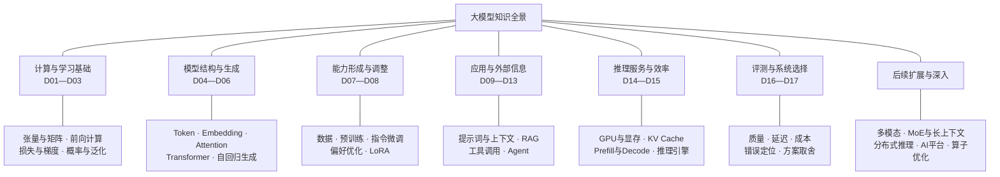
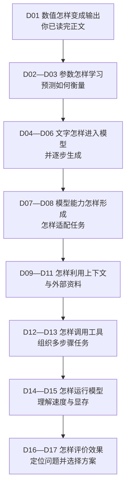
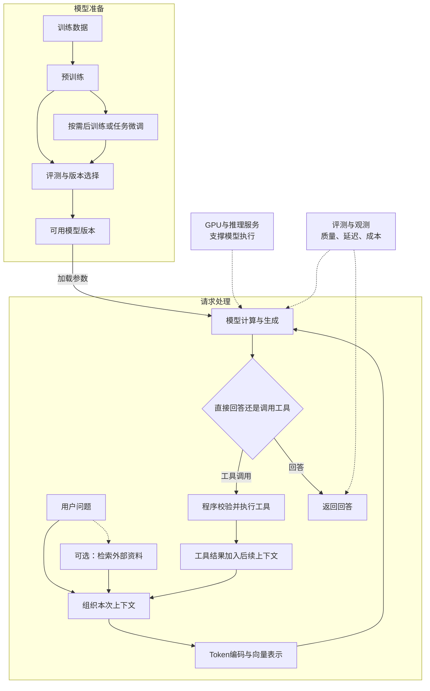

# 大模型学习知识脉络

**先看领域全景，再沿章节逐步补全。** 当前采用“正文与图示 → 助记卡片 → 自测题”，不做实验。D01～D17 是章节编号；每天约两章，第一轮暂按 8～10 个学习日安排。你已读完 D01 正文，D02 自测尚未提交，当前可阅读 D03；读完和通过自测分别记录在[学习进度](progress.md)。

## 一、整个领域由哪些部分组成

下面是**知识分类图**，连线表示包含关系，不表示运行顺序。第一轮围绕文本大模型，扩展方向先认识位置。

这几部分回答不同问题：**基础**解释模型怎样计算与学习，**结构**解释文字怎样被处理，**训练**解释能力从哪里来，**应用**解释如何接入知识和工具，**服务**解释如何运行，**评测**解释是否有效。GPU 支撑计算，RAG 提供外部知识；两者属于不同层面。

## 二、按什么顺序学习

下面是**课程顺序图**。箭头表示下一段学习内容，不表示每次请求必须依次经历这些技术。

每章对应一个问题。**D01～D09 正文已生成；D10～D17 目前只是规划，尚未生成课程正文。**

| 章节 | 本章回答的问题 | 要连起来的概念 |
| --- | --- | --- |
| [**D01**](courses/00-foundations/d01-tensors/README.md) | 模型内部究竟在计算什么？ | 输入与参数 → 加权求和 → 矩阵与张量 → 前向计算 |
| [**D02**](courses/00-foundations/d02-learning/README.md) | 参数怎样从数据中学出来？ | 预测与目标 → 损失 → 梯度与反向传播 → 参数更新 |
| [**D03**](courses/00-foundations/d03-probability-generalization/README.md) | 怎样判断模型有没有学好？ | 概率与 Softmax → 交叉熵 → 训练/验证 → 过拟合与泛化 |
| [**D04**](courses/01-llm-overview/d04-text-input/README.md) | 文字怎样变成模型的输入？ | Token → Token ID → Embedding → 位置信息 |
| [**D05**](courses/01-llm-overview/d05-attention-transformer/README.md) | 模型怎样结合上下文处理信息？ | Q/K/V 与 Attention → 多头注意力 → Transformer 层 |
| [**D06**](courses/01-llm-overview/d06-autoregressive-generation/README.md) | 模型怎样一个接一个生成 Token？ | 因果遮罩 → 输出分数 → 概率与采样 → 自回归循环 → 停止条件 |
| [**D07**](courses/01-llm-overview/d07-pretraining/README.md) | 基础模型的能力从哪里来？ | 数据准备 → 预训练目标 → 训练过程 → 基础能力及局限 |
| [**D08**](courses/01-llm-overview/d08-post-training/README.md) | 怎样让模型更适合指令和任务？ | SFT → 偏好优化与强化学习概览 → LoRA → 微调边界 |
| [**D09**](courses/01-llm-overview/d09-prompt-context/README.md) | 不改参数，怎样影响这次回答？ | 提示词 → 示例与角色 → 历史消息 → 上下文窗口 |
| **D10** | 怎样从大量资料中找到相关内容？ | 文档切分 → 检索表示与索引 → 召回 → 重排 |
| **D11** | 检索怎样与生成结合？ | RAG 请求过程 → 引用 → 检索错误与生成错误 → 与微调的取舍 |
| **D12** | 模型如何使用外部工具？ | 调用信息 → 参数校验 → 程序执行 → 结果反馈 |
| **D13** | 多步骤任务怎样组织？ | 工作流与 Agent → 状态与反馈 → 循环与停止 → 失败处理 |
| **D14** | 为什么推理占显存、响应会变慢？ | 权重与缓存 → GPU计算 → Prefill/Decode → KV Cache |
| **D15** | 推理引擎怎样提高服务效率？ | 批处理与调度 → 缓存复用 → 量化概览 → 延迟与吞吐 |
| **D16** | 怎样知道回答和服务是否变好？ | 测试集 → 质量评价 → 延迟/吞吐/成本 → 对照与错误分类 |
| **D17** | 遇到问题应该改哪一层？ | 模型、提示词、RAG、工具、推理服务的方案判断与全景复述 |

**关键的跨章连接：**D02 学到的参数更新支撑 D07/D08 的训练；D03 的概率帮助理解 D06 的生成；D04 的文本表示与 D10 的检索表示有联系，但用途和模型不必相同；D06 的生成过程是 D14/D15 推理优化的对象；D16/D17 把各层重新串起来。

## 三、这些知识怎样组成一个实际系统

下面是**工作流程图**，与课程顺序不同。上半部是模型准备，下半部是一次请求。RAG 和工具调用是可选分支；推理服务支撑模型执行，并不是模型回答后才发生的一步。

**训练改变参数，普通请求主要使用已有参数。** 常见 RAG 应用把检索资料加入输入；工具调用让外部程序实际执行操作，并把结果送回模型。图中训练、后训练与工具分支均为教学概括，具体系统的组合和循环会有差异。预训练与微调参见 [Hugging Face 课程](https://huggingface.co/learn/llm-course/chapter1/4)，检索与生成结合参见 [RAG 论文](https://arxiv.org/abs/2005.11401)，模型与行动循环的一种方案参见 [ReAct 论文](https://arxiv.org/abs/2210.03629)。

## 四、第一轮结束后往哪里深入

第一轮先能解释上述关系。多模态、MoE、长上下文属于模型方面的扩展；部署、分布式与平台属于后续工程方向，**当前不加实验要求，也不把这些分支全部塞入 D01～D17。**

| 方向 | 后续知识链 |
| --- | --- |
| 模型扩展 | 多模态编码与生成、MoE、长上下文机制 |
| 推理工程 | 推理引擎 → 压测与分析 → 量化/缓存/调度优化 → 多卡与通信 |
| AI 平台 | 容器与 Kubernetes → GPU资源管理 → 模型部署与版本 → 监控及多租户 |
| 底层性能 | GPU架构 → 性能分析 → CUDA/Triton → 算子与通信优化 |

**当前拼图是 D09：模型参数保持不变时，解释提示词、示例、聊天历史和附带材料怎样组成当前上下文并影响这一次生成。** 章节学习方式见[学习路线](roadmap.md)，完成情况见[学习进度](progress.md)。
