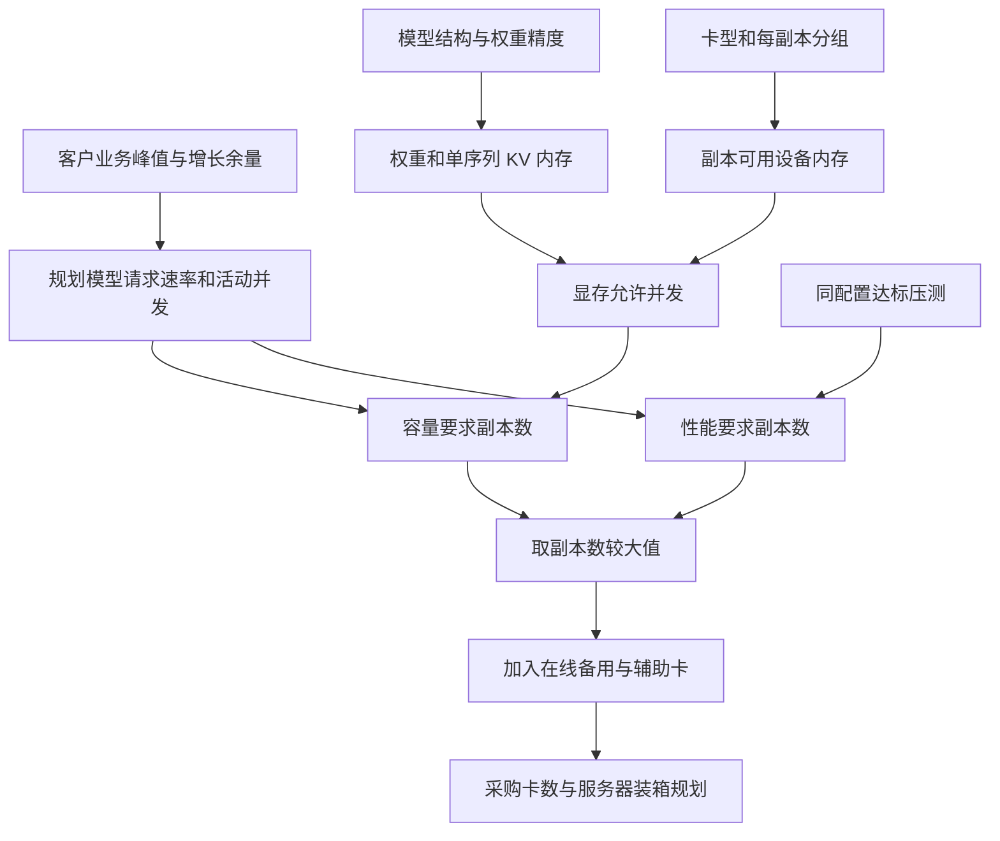

# 调压站智能体需要多少张华为计算卡：核算规则与算例

版本：1.1，核对日期：2026-10-09。本文对应 [Excel 自动核算表](调压站智能体-华为计算卡自动核算.xlsx) 的“填写与核算”工作表。下文的 B13、B55 等表示该工作表的单元格地址。所有算例均为**合成规划数据，不是客户需求、华为实测性能或采购推荐**。

## 为什么不能仅凭模型参数量决定卡数

调压站智能体收到一次告警诊断任务后，可能先分析告警，再调用工具读取工况，随后结合规程生成处理建议。这三个阶段可能各调用一次大模型。即使只有一个业务请求，模型也可能执行多次推理；如果同时出现多个告警，每次推理还会保存不同的上下文。核算因此需要同时回答两个问题：模型及这些上下文能否放进设备内存，以及请求能否在客户要求的时间内完成。

前一个问题决定**显存容量下限**，后一个问题决定**性能所需副本数**。一个副本（Replica）是一套能独立处理请求的模型服务实例，它可以使用一张物理卡，也可以由同一服务器内的多张卡协同完成推理。复制两套实例会复制两份模型权重，并提供两组可分配的服务容量。计算卡、卡内计算芯片、模型副本和服务器是四种不同的计数单位，不能互相替代。

本表先固定“每副本使用几张卡”，再计算需要多少个相同副本，最后加入备用与辅助服务用卡。它不会自动搜索所有卡型、精度与并行分组的最优组合，也没有按价格求最便宜方案。不同候选配置可以分别填写并比较结果。

以下流程把两条约束汇合到采购数量。图中的“性能压测”必须使用与容量核算相同的部署配置。

## 从业务请求换算成模型负载

客户通常知道告警诊断、知识问答、巡检报告等业务量，但计算卡实际承担的是模型调用。先令 q 表示峰值业务请求速率，单位为次/秒，对应 B13；a 表示每个业务请求平均调用本表主模型的次数，对应 B14；r 表示重试与额外调用系数，对应 B15，取值至少为 1；g 表示未来业务增长比例，对应 B19，20% 在表中保存为 0.2。规划模型请求速率为：

**Q = q × a × r × (1 + g)**，结果在 B55，单位为模型调用次/秒。

例如每秒到达 1 个业务请求，每个请求调用模型 3 次，没有额外重试，预留 20% 增长，则 Q = 1 × 3 × 1 × 1.2 = 3.6 次/秒。这里是整段时间内需要处理的调用量，不表示三个调用一定同时执行。若重试已经计入 a，就不要再通过 r 重复增加。

请求速率还不能直接表示同一时刻的内存占用。一个模型调用可能生成较长回答并持续占用缓存，因此需要另外填写峰值活动并发 c（B16），也就是同一时刻正在推理的模型序列数。规划活动并发为 **C = ⌈c × (1 + g)⌉**，结果在 B56；⌈x⌉ 表示向上取整，因为半个活动请求仍需完整资源。若 c = 8，预留 20% 后 C = ⌈9.6⌉ = 10 路。

注册用户数、站点数和在线连接数均不等于活动推理并发。多轮 Agent 的调用若依次发生，不应全部算成同时活动；多个分支并行调用时，则应分别计入活动序列。稳定负载下可以用“请求速率 × 平均驻留时间”辅助检查并发量级，但这不能可靠地替代告警突发峰值，本表也没有自动用平均值推定峰值。

多个业务共用同一个模型时，应先分别统计各业务的模型调用速率，再求和。如果各业务调用次数不同，用总调用速率除以总业务请求速率求加权平均 a，不能对不同业务的调用次数直接取简单平均。不同模型独立常驻时分别核算；辅助模型用卡最终汇总到 B43。

## 一个副本需要多少权重内存

模型要开始推理，首先需要把参数加载到设备。令 P 表示模型总参数量，单位为十亿参数，对应 B25，例如 7 表示约 70 亿参数；b 表示每个参数有效占用的字节数，对应 B26；u 表示权重额外内存比例，对应 B27。权重内存为：

**W = P × 10⁹ × b × (1 + u) / 2³⁰**，结果在 B57，单位为 GiB。

FP16/BF16 权重的基本存储是每参数 2 Byte，INT8 的理想打包值是 1 Byte，INT4 的理想打包值是 0.5 Byte。不过量化还可能保存尺度、零点，以及仍保持较高精度的部分参数，u 用于覆盖这些额外占用。量化方案与运行后端是否支持应由研发核对；填写 0.5 并不证明目标模型能在该卡上以 INT4 运行。若已从实际加载内存校准 b，就应避免通过 u 再重复计入相同开销。

以合成的 7B 模型为例，b = 2，u = 10%，W = 7 × 10⁹ × 2 × 1.1 / 2³⁰ ≈ 14.3424 GiB。混合专家模型（Mixture of Experts，MoE）即使每次只激活部分专家，常驻部署仍需保存全部已加载专家权重，所以这里填写总参数量。只填激活参数会低估权重内存。

本表核算的是推理，不计训练梯度或优化器状态。Diy-LLM 第三章的训练计算量与训练内存示例帮助建立资源核算方法，但不能把训练的 6 倍参数计算量或优化器内存直接套到推理采购上。[参考：Diy-LLM 第三章](https://datawhalechina.github.io/diy-llm/chapter3/chapter3_pytorch%E4%B8%8E%E8%B5%84%E6%BA%90%E6%A0%B8%E7%AE%97.html)

## 为什么并发和上下文会继续占用内存

加载权重只解决了模型本身的存放问题。生成回答时，新 Token 会继续参考前面的输入与已生成内容；如果每一步都重算此前内容，会增加重复工作。服务因此保存每层已有 Token 的键和值，形成**键值缓存（Key-Value Cache，KV Cache）**。各活动序列有各自的缓存，序列越长或同时生成的请求越多，缓存越大。

对于各层结构相同的标准多头注意力（Multi-Head Attention，MHA）或分组查询注意力（Grouped-Query Attention，GQA），令 L 表示注意力层数（B29），H 表示每层 KV 头数（B30），d 表示每个 KV 头维度（B31），v 表示 KV 每个元素的字节数（B32）。一个 Token 在整个模型中的标准 KV 存储量为：

**k = 2 × L × H × d × v**，结果在 B58，单位为 Byte/Token。系数 2 分别代表 K 与 V 两份张量。

这里 H 必须是 `num_key_value_heads`，不能直接使用 Query 头数。权重采用 INT4，也不意味着 KV 自动采用 INT4；KV 数据类型应独立填写。该公式由 K/V 张量元素数量推导，标准块缓存还需要按层、块、头数与头维度组织存储。[参考：CANN 9.1.0 缓存接口布局](https://www.hiascend.com/doc_center/source/zh/CANNCommunityEdition/910/acce/ascendtb/ascendtb_01_0241.html)

为估算一条最长规划请求的缓存，令 tᵢ 表示单次模型输入 Token 上限（B17），tₒ 表示输出 Token 上限（B18），f 表示分组内 KV 复制与开销系数（B34）。输入包含系统提示、对话历史、检索材料与工具结果；输出应包含已启用的思考 Token。单序列 KV 内存为：

**K = k × (tᵢ + tₒ) × f / 2³⁰**，结果在 B59，单位为 GiB/序列。

例如 L = 32、H = 8、d = 128、v = 2，则 k = 131,072 Byte/Token，即 128 KiB/Token。如果输入 2,048 Token、输出 1,024 Token、f = 1，K = 131,072 × 3,072 / 2³⁰ = 0.375 GiB/序列。按所有活动序列都达到这个长度规划，10 路并发需要约 3.75 GiB 的 KV 内存。

f = 1 表示没有额外复制的理想预算。KV 头不能均匀切分、缓存重复存储、块取整或元数据开销较大时，应提高 f。多头潜在注意力（Multi-head Latent Attention，MLA）、混合注意力、各层结构不同或 K/V 维度不同的模型，不能直接套上述标准公式：在 B28 选择“自定义”，把研发推导或测量的整个模型每 Token KV 字节数填到 B33。自定义值必须说明是否已包含某项开销，避免又被 f 重复放大。

本表没有提前扣除前缀共享、滑动窗口、缓存压缩或 CPU 卸载带来的节省。若部署依赖这些机制，应按实际配置重新核算并做长上下文验证，不能只修改参数让结果看起来能装下。

## 从单芯片内存算出一个副本能容纳多少并发

知道 W 与 K 后，还需要确定一个副本实际能使用多少设备内存。令 n 表示每副本物理卡数（B36），z 表示每张卡计算芯片数（B37），m 表示单芯片名义设备内存，单位为 GiB（B38），e 表示内存可用比例（B39），取值大于 0 且不超过 1。单副本可用设备内存为：

**M = n × z × m × e**，结果在 B60，单位为 GiB。

GiB 使用二进制单位，1 GiB = 2³⁰ Byte；如果供应商规格中的 GB 明确使用十进制，则 1 GB = 10⁹ Byte，需要转换为 GB × 10⁹ / 2³⁰ GiB。不能仅凭规格上的“64GB”就判断其确切字节数。e 用于扣除驱动、不可用容量及安全余量；若 m 已填写实测可用容量，则 e 只保留尚未包含的余量，避免重复扣减。

卡内有几个计算芯片也必须独立确认。华为官方参考实践说明 Atlas 300I Duo 96G 为单卡双芯片设计，并列出单芯片内存口径。整卡总容量不能直接视为一个芯片的连续可用容量，两个芯片之间是否能切分目标模型仍依赖软件与互联。[参考：华为 NPU 卡虚拟化硬切分参考实践](https://www.hiascend.com/developer/techArticles/20251212-1)

可用内存除了权重与 KV，还要容纳激活、算子工作区、通信缓冲和图缓存。令 x 表示每芯片运行时额外内存（B41），单位为 GiB，则真正留给 KV 的预算为 **F = M − W − x × n × z**，结果在 B61。这里 x 应按规划的输入长度、批处理与图执行配置留预算；短请求低并发时测出的工作区可能不足以覆盖峰值。

由于一条活动序列需要 K GiB，显存允许的单副本并发为 **Cₘ = max(0, ⌊F / K⌋)**，结果在 B62；⌊x⌋ 表示向下取整。若 Cₘ 小于 1，所选分组连一条规划长度的请求都放不下，表格不会继续给出采购数量。增加相同的小分组副本不能解决“每个副本都装不下”的问题，需要改变每副本分组、模型、精度或请求上限，再重新验证。

以合成配置 n = 1、z = 1、m = 64 GiB、e = 85%、x = 4 GiB 为例，M = 54.4 GiB，F ≈ 54.4 − 14.3424 − 4 = 36.0576 GiB，Cₘ = ⌊36.0576 / 0.375⌋ = 96 路。为承载前面的 C = 10 路，容量要求副本数为 **Nₘ = ⌈C / Cₘ⌉ = 1**，结果在 B63；容量下限物理卡数为 Nₘ × n，在 B6。

**这些结果以模型可以有效切分、各芯片峰值不超限为前提。** 总内存够大，不证明最忙的一个芯片也够大；权重复制、KV 头分配、Embedding 或输出层集中存放都可能造成不均衡。表格用总量预算提供规划，供应商必须在 B52 确认目标部署兼容性和单芯片峰值内存。

## 为什么还需要同配置性能压测

上例的 96 路只表示内存预算能容纳，并不表示 96 路能及时回答。推理还有输入处理（Prefill）、逐 Token 生成（Decode）、设备内存带宽、算子执行、调度和通信等耗时。卡的理论浮点运算吞吐 TFLOPS 无法直接换算成客户业务下的稳定请求吞吐，尤其不能混用不同精度或稀疏条件的理论值。

因此供应商需要提供同一次压测中的两个容量：单副本完成模型请求的达标吞吐 qₛ（B47），单位为次/秒，以及单副本能维持的达标活动并发 cₛ（B48），单位为路。“达标”要求压测的首 Token 延迟与单次模型完成延迟都满足客户目标。首 Token 延迟（Time to First Token，TTFT）包括到首次输出前的等待与处理；P95 表示该指标的第 95 百分位。完成延迟统计口径、是否包含排队，以及失败请求如何统计，应在报告中明确。

压测必须固定模型版本、权重与 KV 精度、卡型、每副本分组、运行后端、调度设置、输入输出长度与业务混合比例，使用接近规划并发的稳态负载。短输出条件下测出的高 QPS，不能套用到长报告生成。吞吐与并发也不能分别从不同的最优测试中取最大值后组合。表格仅检查填写值与两项 P95 目标，失败率、队列是否持续增长和报告是否覆盖真实业务需要另外审查。

性能要求副本数为：

**Nₚ = max(⌈Q / qₛ⌉, ⌈C / cₛ⌉)**，结果在 B64。

假设合成压测在同配置、同负载且延迟达标时，每副本可以完成 qₛ = 2 次/秒并维持 cₛ = 8 路，前面规划 Q = 3.6 次/秒、C = 10 路，则速率要求 ⌈3.6 / 2⌉ = 2 个副本，并发要求 ⌈10 / 8⌉ = 2 个副本，所以 Nₚ = 2。虽然显存只要求 1 个副本，性能却要求 2 个。

这里假设请求可均衡分配给相同副本，扩容能力近似相加。共享检索服务、网络或存储、负载不均、相关突发及多轮任务路由都可能破坏这个近似，最终应在完整副本规模上复测。多轮 Agent 的业务完成时间还包含工具、检索及多次模型调用；B21 只是单次模型完成目标，不能替代完整业务端到端验收。

## 从工作副本算到采购卡数与服务器

显存与性能约束必须同时满足，因此最终工作副本数为 **N = max(Nₘ, Nₚ)**，结果在 B66。令 s 表示在线备用副本数（B42），h 表示辅助服务额外物理卡数（B43），则工作卡数为 N × n（B67），在线备用卡数为 s × n（B68），采购物理卡总数为：

**T = (N + s) × n + h**，结果在 B69，并显示在 B7。

沿用上例，N = 2、n = 1、s = 1、h = 0，采购规划数量为 (2 + 1) × 1 + 0 = 3 张。在线备用也需要完整加载同一模型，因此按相同分组计卡；这与仓库里的离线备件不同。Embedding、Reranker、视觉、语音等服务如果独立占卡，先分别核算，再把额外卡数汇总到 h。默认 h = 0 只是待确认的规划假设，不代表它们不需要资源。

卡数确定后，服务器装箱还必须保持副本完整。令 S 表示每台服务器可安装的物理卡数（B40）。本表采用**一个副本完全位于一台服务器，主模型与辅助卡分开部署，两类服务器按相同插槽容量估算**的规则。每台可放完整主模型副本数为 p = ⌊S / n⌋，要求 n ≤ S；主模型服务器数为 ⌈(N + s) / p⌉，辅助服务器数为 ⌈h / S⌉。B8 显示二者之和。

例如每副本需要 3 张卡，共有 4 个含备用的副本，每台能装 4 张卡，则每台只能放 ⌊4 / 3⌋ = 1 个完整副本，需要 4 台。虽然共有 12 张卡，简单算 ⌈12 / 4⌉ = 3 台，却无法在 3 台内放下 4 个完整副本。未使用插槽不计入采购卡数。如果辅助卡采用不同机箱容量、允许混部或需要跨机并行，应按实际拓扑另做装箱方案，不能直接使用 B8。

上例的 3 张卡按 8 插槽机箱可以得到 1 台服务器，但这**不保证整机故障仍可服务**。若工作与备用都在同一台，整机故障会使所有副本同时退出。要保证丢失任意一台机器仍满足峰值，应安排故障域并检查最坏情况：剩余可用副本数 × qₛ ≥ Q，剩余可用副本数 × min(cₛ, Cₘ) ≥ C，同时确认路由与备用切换。B8 不执行这项容灾装箱，实际容灾方案可能增加台数、备用副本或卡数。

部分华为产品按集成模组或整机销售，表格的设备计数不能自动作为独立 PCIe 卡采购清单。报价时应对照物料清单（Bill of Materials，BOM）明确卡、模组与整机数量，并校验功耗、散热、PCIe 与卡间互联。华为官网的硬件规格入口用于核对 SKU，不能替代目标模型的压测。[参考：昇腾加速卡产品页](https://www.hiascend.com/hardware/accelerator-card)

## 缺少信息时，表格如何处理

容量参数检查位于 B54。必要数值缺失、误填文字、非正的参数量或内存、非整数的卡数或并发数、非法比例、每副本卡数超过单台卡容量等，都会停止容量计算。标准 KV 模式要求 B29～B32 有效，自定义模式要求 B33 为正数，且不要求填写标准结构项。0% 增长、0 GiB 额外运行时内存、0 个备用副本和 0 张辅助卡在数值上允许，但必须有实际规划依据。

性能证据检查位于 B65。模型版本 B24、硬件与部署配置 B44、两项延迟目标 B20～B21、压测容量与实测延迟 B47～B50、报告标识 B51、兼容性确认 B52 都会影响能否给出采购规划数量。实测 TTFT（B49）不得超过目标 B20，实测完成延迟（B50）不得超过目标 B21；没有证据时不把性能容量默认为 0，也不把显存下限直接显示为采购数量。

“容量下限”是本表在给定模型、分组、并发与预留条件下的估算，不是所有技术方案的全局最少卡数。当前工作表共用容量输入检查，B13、B14、B15 等调用量输入未填时，容量下限也会显示待填写；即使从数学上只计算显存不需要全部调用量，仍应按这张表的完整容量区填写。“兼容性已确认”表示填写者已获得证据，表格不会联网检查模型支持列表或报告内容。

本表的默认值包括 20% 增长、10% 权重额外占用、85% 内存可用比例、1 个在线备用副本、KV 复制系数 1，以及权重/KV 每元素 2 Byte。它们均可修改，且都不是华为统一标准或客户实测结论。设备内存扣减与运行时预算应各自覆盖不同项目，避免重复扣减，也不能漏掉峰值工作区。

## 完整算例与 Excel 对照

以下输入是可手算的合成场景。64 GiB 是本例自行设定的单芯片容量，不指向某个华为 SKU；吞吐及延迟也是人为设定，不可据此下采购单。

| 输入 | 本例值 | Excel 单元格 |
| --- | --- | --- |
| 业务峰值 / 每次模型调用 / 重试系数 | 1 次/秒 / 3 次 / 1 | B13 / B14 / B15 |
| 峰值活动并发 / 增长余量 | 8 路 / 20% | B16 / B19 |
| 输入 / 输出上限 | 2,048 / 1,024 Token | B17 / B18 |
| 模型总参数 / 权重字节 / 权重额外比例 | 7B / 2 Byte / 10% | B25 / B26 / B27 |
| 标准 KV：层数 / 头数 / 头维度 / 字节数 | 32 / 8 / 128 / 2 | B29～B32 |
| KV 复制系数 | 1 | B34 |
| 每副本卡数 / 每卡芯片数 / 单芯片内存 | 1 / 1 / 64 GiB | B36～B38 |
| 可用比例 / 每芯片运行时内存 | 85% / 4 GiB | B39 / B41 |
| 每台卡容量 / 备用副本 / 辅助卡 | 8 张 / 1 组 / 0 张 | B40 / B42 / B43 |
| TTFT / 完成延迟 P95 目标 | 2 秒 / 30 秒 | B20 / B21 |
| 同次达标吞吐 / 活动并发 | 2 次/秒 / 8 路 | B47 / B48 |
| 同次实测 TTFT / 完成延迟 P95 | 1 秒 / 20 秒 | B49 / B50 |

还需填写模型版本、硬件部署配置、报告标识，并将 B52 设为“已确认”，才会得到下表的采购规划结果。真实客户数据不能用本例的合成报告替代。

| 计算结果 | 本例值 | Excel 单元格 |
| --- | --- | --- |
| 规划模型请求速率 Q | 3.6 次/秒 | B55 |
| 规划活动并发 C | 10 路 | B56 |
| 单副本权重 W | 约 14.3424 GiB | B57 |
| 每 Token KV / 单序列 KV | 131,072 Byte / 0.375 GiB | B58 / B59 |
| 可用内存 M / KV 预算 F | 54.4 GiB / 约 36.0576 GiB | B60 / B61 |
| 显存允许单副本并发 Cₘ | 96 路 | B62 |
| 容量要求 / 性能要求工作副本 | 1 组 / 2 组 | B63 / B64 |
| 最终工作副本 N | 2 组 | B66 |
| 工作卡 / 在线备用卡 / 采购总卡 T | 2 张 / 1 张 / 3 张 | B67 / B68 / B69 |
| 分开部署的服务器装箱规划 | 1 台，尚未按整机容灾隔离 | B8 |

这条结果链说明了采购数量的主要来源：每个副本装得下多个请求，但单副本达标吞吐和并发不足以承担规划负载，需要 2 个工作副本；再预留 1 个同配置在线备用副本，共 3 张合成配置中的物理卡。

## 交付前验证与实际验收

随表保留的 [验证记录](verification.json) 是表格计算引擎运行合成输入得到的结果。已检查缺失模型标识、文字误填、显存不足、延迟不达标、兼容性未确认、自定义 KV、空白恢复、完整副本装箱、辅助服务器分开部署与跨机分组拒绝等 16 项判断，并扫描公式错误、检查工作表渲染。临时合成输入已从交付表中恢复为空白。

上述验证证明的是核算逻辑在已覆盖条件下的行为，不是华为硬件性能。尚未在原生 Excel/WPS 验证交互重算，也没有运行真实模型和客户负载。实际验收应保留原始压测配置与输出，覆盖真实检索材料、多轮工具返回、长输出、告警突发、失败率、队列稳定性、最忙芯片内存、备用切换及整机故障。训练资源、CPU、主机内存、磁盘、向量数据库和网络容量需另行核算。
