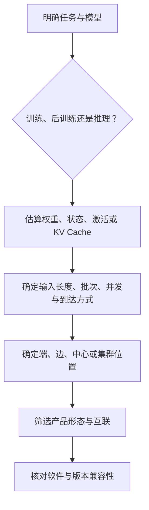

# 模块 01：昇腾硬件为什么有模块、卡、服务器和集群？

如果只看到“多少 TOPS”或“多少 TFLOPS”，很容易把芯片、加速卡和服务器当作不同尺寸的同一种商品。但一个模型能否运行，除了计算峰值，还取决于片上内存、主机 CPU、数据搬运、视频编解码、卡间互联、散热和部署环境。理解昇腾硬件的第一步不是背型号，而是先判断任务要放在端、边缘、中心服务器还是大规模集群。

## 1. 从一个质检任务看部署位置

假设工厂用摄像头检查产品缺陷。把每帧视频都传到远端中心可以集中管理模型，但网络中断会让产线失去判断能力，原始视频外传也可能不合适；把推理放在摄像头附近则能缩短响应时间，却受到功耗、空间和散热限制。这个冲突要求硬件不仅有不同性能，还要有不同**产品形态**。

同一模型可能先在中心训练或适配，再压缩后部署到边缘；也可能始终在数据中心以服务方式运行。因此“端、边、中心、集群”描述的是部署位置和系统责任，不是简单的性能排名。

## 2. 芯片与 Atlas 产品不是同一层

**Ascend（昇腾）AI 处理器**是计算核心，提供面向矩阵、向量和标量等运算的处理能力。处理器要成为可采购、可部署的系统，还需要内存、电源、散热、接口、主机和管理能力。华为以 **Atlas** 品牌把这些能力组合成多种产品形态。

| 产品形态 | 它解决的系统问题 | 当前公开示例 | 典型任务 |
| --- | --- | --- | --- |
| AI 加速模块、开发者套件 | 在体积和功耗受限设备中提供推理能力 | Atlas 200I A2、Atlas 200I DK | 机器人、摄像机、无人机、端侧原型 |
| AI 加速卡 | 给现有服务器增加 NPU 能力 | Atlas 300I A2、300I Pro、300I Duo | OCR、检索、语音、视频与通用推理 |
| 智能边缘设备 | 在现场形成可独立运行和维护的节点 | Atlas 500 A2、Atlas 500 Pro | 园区、产线、电力巡检、边缘视频分析 |
| AI 服务器 | 把 CPU、内存、NPU、存储和网络组合成中心节点 | Atlas 800T/800I A2、A3 | 训练、后训练、中心推理和服务化 |
| AI 集群或超节点 | 解决单机容量与互联不足 | Atlas 900 A2 PoD、Atlas 900 A3 SuperPoD | 大模型训练、MoE 推理和大规模并发 |

其中 `T` 常用于训练产品、`I` 常用于推理产品，但选型仍应以产品文档为准，不能只根据名称推断能力。以 Atlas 900 A3 SuperPoD 为例，公开页面强调最多 384 张 NPU 的高速互联；它的价值不只是把单卡算力相加，而是降低大量设备协同训练或推理时的通信阻力。

## 3. 为什么不能只比较峰值算力

D20～D22 已经建立过“计算、访存、通信和负载共同决定性能”的判断。这个原则在昇腾上完全适用。峰值算力只说明特定精度和理想条件下的理论上限，模型是否能稳定服务还要检查四组资源：

- **容量：** 权重、KV Cache、激活和工作区能否放入片上内存；主机内存和本地存储能否供给模型与数据。
- **带宽：** 权重和 KV Cache 的读取是否受内存带宽限制，Host 与 Device 之间的数据是否频繁搬运。
- **互联：** 多卡训练中的梯度同步、模型并行通信，以及大模型推理中的张量并行、专家并行或 KV Cache 传输是否有合适链路。
- **工程条件：** 功耗、散热、机柜、电源、网络、操作系统和驱动是否满足产品要求。

例如，大模型权重放不进一张卡时，“再找一张峰值更高但内存仍不足的卡”并没有解决问题；需要的是更大片上内存、量化，或多卡切分与足够快的互联。反过来，小型视觉模型部署在产线边缘时，大规模训练服务器即使更快，也可能在成本、功耗和现场维护上不合适。

## 4. 训练硬件与推理硬件分别在优化什么

训练需要保存参数、梯度、优化器状态和中间激活，还要在多卡间频繁同步，因此更关注大容量内存、高带宽互联、集群扩展和长时间稳定运行。推理通常不保存梯度，但大模型服务会受到权重、KV Cache、请求调度和并发的共同约束；传统视觉推理还可能强依赖图像预处理和视频编解码能力。

这不是说训练产品只能训练、推理产品只能推理，而是它们的系统资源和优化重点不同。选型时应该从工作负载反推，而不是先挑设备再寻找用途：

## 5. 当前产品信息怎样读才不会过时

截至 2026-09-21，官方产品总览仍同时列出 A2、A3 以及较早的推理产品，官方文档目录也已经出现 Ascend 950PR、950DT、Atlas 950 SuperPoD、Atlas 850E 和 Atlas 650E 等名称。这里应区分三种状态：已经有公开产品页和规格、已经在软件版本中出现支持、仅公开了未来供货计划。三者不能都写成“当前可直接购买并部署”。

因此，学习阶段记住产品层次和选择维度；采购或实验阶段再核对目标地区、具体 SKU、产品白皮书、CANN/驱动兼容表和供货状态。**最新型号不自动等于最适合当前模型，公开计划也不等于现货能力。**

## 6. 接到下一模块：硬件为什么还不能直接运行模型

选定 Atlas 设备后，PyTorch 或 MindSpore 中的矩阵计算仍不能自行变成 NPU 指令。系统还需要驱动管理设备、运行时管理内存与任务、图引擎编译和优化计算图、算子库提供高性能实现、通信库协调多卡。这一层就是下一模块的 CANN 与昇腾基础软件。

## 助记卡片

**卡片 1：Ascend 处理器与 Atlas 产品是什么关系？**

> **答案：** Ascend 处理器是计算核心，Atlas 将处理器与内存、接口、散热、主机和管理能力组合成模块、卡、服务器或集群产品。

**卡片 2：端、边、中心和集群主要区分什么？**

> **答案：** 它们区分部署位置、资源规模和系统责任，不只是算力从小到大的排名。

**卡片 3：为什么峰值算力不足以决定选型？**

> **答案：** 实际任务还受内存容量与带宽、互联、功耗散热、编解码、软件兼容性和负载形态限制。

**卡片 4：训练硬件为什么特别关注互联？**

> **答案：** 分布式训练需要频繁同步梯度或参数，多卡通信可能成为扩展效率的主要限制。

**卡片 5：大模型推理中片上内存主要装什么？**

> **答案：** 至少包括模型权重、KV Cache 和运行工作区；并发与上下文长度会继续扩大 KV Cache 占用。

**卡片 6：看到公开的新芯片名称时应先判断什么？**

> **答案：** 区分产品已发布、软件已支持和未来供货计划，并核对具体产品、地区与版本兼容性。

## 自测题

1. 为什么“Ascend 处理器、Atlas 300I 加速卡、Atlas 800 服务器”不能作为同一层级直接比较？
2. 工厂相机必须在网络中断时继续完成缺陷检测，首先应优先考虑哪类部署位置？还需检查哪些工程条件？
3. 一个模型的 BF16 权重已经大于单卡片上内存。仅比较两款设备的 BF16 峰值算力能否完成选型？为什么？
4. 训练与大模型推理都可能需要多卡，但它们的主要内存对象和通信任务有何不同？
5. 官方 CANN 更新说明写明支持某款新处理器，是否足以证明某个具体服务器型号已经在当地可采购并支持你的框架版本？
6. 为“医院内网大模型问答服务”列出从任务到硬件产品形态的五项必要输入条件。

[查看参考答案](quiz-answers.md)

## 官方依据与延伸阅读

- [昇腾计算产品总览](https://e.huawei.com/cn/products/computing/ascend)
- [Atlas 900 A3 SuperPoD](https://e.huawei.com/cn/products/computing/ascend/atlas-900-a3-superpod)
- [Atlas 300I Pro 推理卡](https://e.huawei.com/cn/products/computing/ascend/atlas-300-ai)
- [大模型推理解决方案](https://e.huawei.com/cn/solutions/computing/ascend-computing/large-model-inference)
- [CANN 9.1.0 版本说明](https://www.hiascend.com/document/detail/en/CANNCommunityEdition/910/softwareinst/releasenote/9.1.0/release-notes_en.md)

