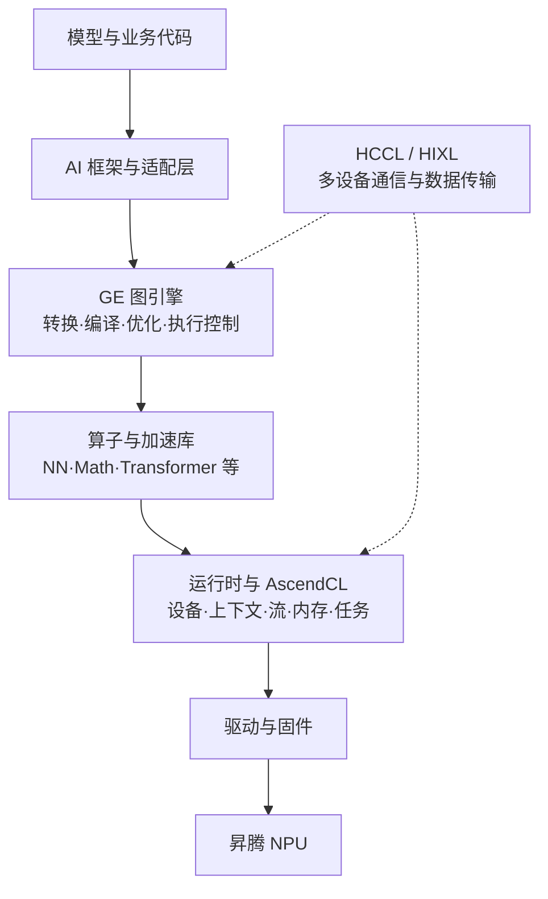

# 模块 02：框架中的计算怎样真正落到昇腾 NPU？

上一模块已经选好了硬件形态，但一段 `matmul` 或一个 Transformer 模型并不是 NPU 可以直接执行的指令。开发者使用的是框架中的张量和计算图，设备执行的是经过编译、调度和资源管理的算子任务；两者之间必须有一套承上启下的软件。昇腾平台中的核心基础软件是 **CANN（Compute Architecture for Neural Networks，异构计算架构）**。

## 1. 一次矩阵乘法为什么需要多层软件

假设 PyTorch 模型执行矩阵乘法。框架先识别运算和张量，适配层把它映射到昇腾可支持的算子；图模式下还可能把一组运算转换成统一中间表示并进行融合；算子库选择对应硬件与数据类型的实现；运行时分配设备内存、创建流并下发任务；驱动最终与 NPU 交互。任何一层不匹配，都可能表现为“不支持该算子”“编译失败”“精度偏差”或“运行很慢”。

这张图是职责图，不表示每个调用都严格逐层穿过同一条路径。动态图可能按算子即时执行，离线模型可能预先完成部分编译；但无论哪条路径，都绕不开算子实现、运行资源管理和设备驱动。

## 2. 驱动、固件与 CANN 为什么要分开理解

**固件（Firmware）**运行在设备侧，控制硬件内部的底层行为；**驱动（Driver/Ascend HDK）**让操作系统识别和管理 NPU，并为上层运行时提供设备访问能力；**CANN**则面向 AI 计算提供图、算子、运行时、通信和开发接口。驱动能识别设备，不代表框架模型已经可以运行；CANN 安装完成，也不代表任意版本的框架插件都兼容。

版本关系必须按整条链核对。CANN 9.1.0 的官方说明给出了与 Ascend HDK 的兼容矩阵，并把 Toolkit、ops 和 NNAL 等组合包及可独立升级子包分开列出。这意味着排障时不能只记录“装了 CANN 9.1”，还要记录驱动、固件、算子包、框架插件和目标产品。

## 3. GE、算子库和运行时各自解决什么问题

当模型包含成百上千个算子时，逐个照原样下发往往会产生多余的数据搬运与调度开销。**GE（Graph Engine，图引擎）**负责把框架计算转换为 Ascend IR 表示的图，并进行图编译、优化与执行控制。它解决的是“整张计算图怎样组织得更适合设备”。

图最终仍由具体算子完成计算。CANN 的算子包和加速库提供针对昇腾硬件优化的算子实现，例如神经网络、数学、计算机视觉和 Transformer 相关算子。若现有算子不覆盖新模型需要的运算，开发者可以使用 **Ascend C** 等方式开发自定义算子；这解决的是“单个计算单元怎样正确、高效地运行”。

模型开始执行后，还需要创建 Device、Context 和 Stream，分配与释放 Host/Device 内存，加载模型或 Kernel，管理异步任务与同步。**NPU Runtime** 和 **AscendCL** 提供这些运行资源与应用开发接口。可以把三者简化为：GE 管整图，算子库管计算实现，运行时管执行现场。

## 4. 多卡为什么需要 HCCL，单边传输又为什么出现

单卡容量或吞吐不足时，模型会被拆到多个 NPU。训练中的 AllReduce、AllGather、ReduceScatter，推理中的张量并行或专家并行，都需要多设备集体协作。**HCCL（Huawei Collective Communication Library）**是 CANN 的核心集合通信组件，向上服务框架，向下利用昇腾设备间的互联。

有些新型推理架构还需要一个节点主动把 KV Cache 等数据直接传给另一节点，而不是让所有参与者进入同一个集合操作。CANN 9.1 文档中的 **HIXL** 提供单边通信能力，并包含面向 KV Cache 语义的数据传输接口。两者的关键区别是：HCCL 主要抽象一组参与者共同完成的集合或点对点通信，HIXL 强调由一侧发起的高效数据访问与传输。具体引擎是否使用它们，仍由版本和部署架构决定。

## 5. Toolkit、ops 和 NNAL 为什么拆成不同包

CANN 9.1.0 的发行说明将主要内容分为 Toolkit、ops 与 NNAL。理解它们的目的不是记包名，而是避免错误的版本观：

- **Toolkit**包含编译、运行、开发接口和工具等主体能力。
- **ops**包含设备相关的算子实现以及 HCCL、HIXL 等子包。
- **NNAL（Neural Network Acceleration Library）**包含面向神经网络场景的加速库，例如 ATB（Ascend Transformer Boost）。

部分子包允许独立升级，提高了更新灵活性，也增加了组合验证责任。一个算子包可以与多个 Toolkit 版本兼容，并不意味着任意组合都安全；应使用官方兼容矩阵选择被验证的组合。

## 6. 从错误现象反推软件层

| 现象 | 首先检查的层 | 不能直接下的结论 |
| --- | --- | --- |
| 系统看不到 NPU | 设备、固件、驱动、权限 | 不能先归因于模型代码 |
| 框架无法加载 NPU 后端 | CANN、框架插件、Python 与版本映射 | 不能仅通过重装驱动解决 |
| 某个运算不支持或编译失败 | 框架映射、GE、算子包、自定义算子 | 不能说明整款硬件不支持 AI 任务 |
| 多卡扩展效率低 | HCCL/HIXL、拓扑、网络、并行策略与负载 | 不能只看单卡利用率 |
| 结果正确但速度慢 | 图优化、算子实现、访存、调度和通信 | 不能直接认定峰值算力不足 |

这一分层诊断与 D17、D22 的方法一致：先确定错误发生在哪个阶段，再提出可以被验证的假设，而不是一次更换整个软件栈。

## 7. 接到下一模块：有了 CANN，为什么还需要训推框架

CANN 提供的是设备计算基础能力，但训练还需要自动微分、优化器、数据管道与分布式策略，在线推理还需要模型加载、KV Cache、请求调度、批处理和服务接口。这些更高层责任由 MindSpore、PyTorch/TorchNPU、MindSpeed、MindIE 或其他推理引擎承担。下一模块将按“训练”和“推理”两条路径区分它们。

## 助记卡片

**卡片 1：CANN 在整条软件栈中的位置是什么？**

> **答案：** CANN 位于 AI 框架与昇腾硬件之间，为图编译、算子、运行时、通信和应用开发提供基础能力。

**卡片 2：驱动能识别 NPU 是否等于模型可以运行？**

> **答案：** 不等于；模型还依赖匹配的 CANN、算子包、框架插件和模型支持。

**卡片 3：GE 与算子库的职责差异是什么？**

> **答案：** GE 负责计算图转换、编译、优化和执行控制，算子库提供图中具体计算的硬件优化实现。

**卡片 4：AscendCL 主要提供什么？**

> **答案：** 它提供设备、上下文、流、内存、模型和算子执行等应用开发接口。

**卡片 5：HCCL 主要解决什么问题？**

> **答案：** 它为多 NPU 训练和推理提供集合通信及相关通信能力。

**卡片 6：为什么不能只记录一个 CANN 版本号？**

> **答案：** 实际系统还包含驱动固件、Toolkit、算子包、加速库和框架插件，兼容性取决于整套组合。

## 自测题

1. 用一次框架矩阵乘法说明为什么驱动、CANN 和算子库缺一不可。
2. “系统能执行 `npu-smi`，所以任意 PyTorch 模型都能运行”错在哪里？
3. GE 图引擎与 NPU Runtime 分别管理什么？
4. 多卡训练速度没有随卡数成比例增长，应从哪些层提出假设？
5. 自定义算子主要弥补整图优化、算子实现还是驱动识别中的哪一类缺口？
6. 为什么允许 ops 子包独立升级既有价值，又需要更严格的版本记录？

[查看参考答案](quiz-answers.md)

## 官方依据与延伸阅读

- [CANN 9.1.0 总览](https://www.hiascend.com/document/detail/zh/CANNCommunityEdition/910/index/index.html)
- [CANN 9.1.0 版本与软件包映射](https://www.hiascend.com/document/detail/en/CANNCommunityEdition/910/softwareinst/releasenote/9.1.0/release-notes_en.md)
- [GE 图引擎说明](https://www.hiascend.com/document/detail/zh/CANNCommunityEdition/910beta3/programug/graphdevg/atlasag_25_0081.html)
- [HCCL 简介](https://www.hiascend.com/document/detail/en/CANNCommunityEdition/910/commlib/commopdev/docs/en/comm_op_dev_guide/intro.md)
- [Runtime API 分类](https://www.hiascend.com/document/detail/en/CANNCommunityEdition/900/API/runtimeapi/aclcppdevg_03_1952.html)

