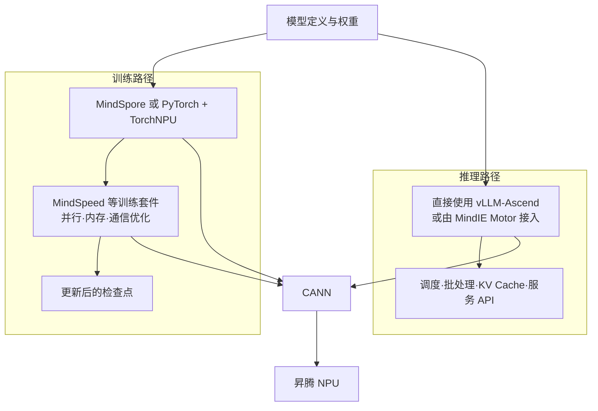

# 模块 03：同一个模型为什么有多条昇腾训推路线？

CANN 已经能够把图和算子交给 NPU，但开发者很少从运行时 API 手写完整训练系统。训练需要自动微分、优化器、并行策略和检查点；推理服务需要模型适配、KV Cache、批处理、调度和 API。不同组件解决的是不同层级的问题，因此“用 PyTorch”“用 MindSpeed”和“用 MindIE”并不是三个完全对等的选择。

## 1. 先把训练与推理分成两条路径

仍以一个大语言模型为例。训练阶段接收样本，执行前向计算、损失、反向传播和参数更新；推理阶段加载已确定的权重，根据请求反复完成 Prefill 与 Decode。两者都调用 NPU 算子，但状态、通信和服务目标不同。

框架决定模型怎样表达和求导，训练套件在框架之上提供大模型并行与亲和优化，推理引擎则把已训练模型组织成高吞吐、低时延服务。它们可以组合，不能仅凭名字判断谁“替代”谁。

## 2. MindSpore 与 PyTorch + TorchNPU 是两种框架接入路线

**MindSpore（昇思）**是完整 AI 框架，提供张量、自动微分、动态图/静态图、数据处理和分布式并行等能力，并对 Ascend 后端进行适配。适合从模型开发开始采用 MindSpore 生态，或需要其自动并行、图编译和昇腾原生能力的项目。截至本资料核对日，官方已经发布 MindSpore 2.9.0 文档。

大量现有模型使用 PyTorch。为了让 PyTorch 的张量和算子在昇腾上执行，需要 **TorchNPU** 适配插件。它保留了 PyTorch 的开发体验，并把后端调用接到昇腾软件栈。官方在 26.1.0 中把原 Ascend Extension for PyTorch 与 torch_npu 的产品称谓统一为 TorchNPU，但 Python 导入名和 Wheel 前缀仍保留 `torch_npu`。这条路线适合迁移已有 PyTorch 项目，但“改设备名就完成迁移”只有在算子、第三方库、精度和性能均兼容时才成立。

TensorFlow 也有 TF Adapter，但当前官方商用文档列出的支持版本集中在 TensorFlow 1.15 和 2.6.5。对于新项目，它更像既有资产迁移路线，而不是因为“框架越多越好”就默认采用的主线。

## 3. 动态执行、图编译与算子支持怎样影响使用

开发时逐个执行算子便于调试，但频繁的 Host 调度和小算子启动可能降低效率；把多个运算捕获成图后，编译器可以融合算子、规划内存和减少调度。PyTorch 路线可通过 `torch.compile` 与 TorchAir 等能力进入图模式，MindSpore 也提供动态图和静态图路径。

图模式并不是无条件更快：动态形状、数据相关控制流、不支持算子或频繁重编译都可能削弱收益。正确的使用顺序是先得到正确基线，再确认图捕获范围和回退，再通过性能数据验证收益。若某个算子缺失，可选择框架等价改写、等待或升级算子支持、注册自定义算子，或在明确代价后允许回退；不能为了“跑通”而忽略输出精度和性能变化。

## 4. MindSpeed 为什么不是另一个通用框架

当单机训练演变为数十或数百卡的大模型训练，仅有自动微分还不够：模型、优化器状态和序列需要切分，通信要与计算重叠，激活和参数需要压缩或重计算。**MindSpeed** 是面向昇腾的大模型训练加速库和套件，而不是替代 PyTorch/MindSpore 基础抽象的通用框架。

MindSpeed 2.2.0 文档将其分成四类能力：

| 组件 | 主要责任 |
| --- | --- |
| MindSpeed Core | 从计算、内存、通信和并行四个维度提供昇腾亲和优化 |
| MindSpeed LLM | 大语言模型的预训练、指令微调、权重转换、评估等端到端流程 |
| MindSpeed MM | 多模态理解与生成模型的训练流程 |
| MindSpeed RL | 强化学习场景中的训推共卡/分离、异步调度和通信能力 |

使用时先确定模型是否在支持列表、需要哪些并行维度、检查点格式如何转换，再用固定数据和配置建立训练基线。训练“能启动”只说明依赖基本可用，还要观察损失是否符合预期、吞吐是否稳定、各 Rank 是否均衡、检查点能否恢复。

## 5. MindIE 与 vLLM-Ascend 怎样组合

训练得到权重后，单次 `generate` 仍不等于可用服务。多个请求需要排队和连续批处理，KV Cache 要分配和回收，长上下文可能压迫显存，还要处理流式返回、健康检查和多机扩展。**vLLM-Ascend** 是让开源 vLLM 在昇腾 NPU 上运行的硬件插件；**MindIE（Mind Inference Engine）**则是覆盖推理加速、服务化和部署能力的更大体系，两者不再适合简单理解成互相替代的两个引擎。

截至 2026-09-21，MindIE 3.1.0 的文本生成路线通过 **MindIE Motor** 对接 vLLM-Ascend：vLLM-Ascend 承担模型执行、KV Cache 和调度等引擎能力，MindIE Motor 增加服务化与部署管理；项目也可以直接使用 vLLM-Ascend。MindIE 还包含 MindIE SD 等其他场景能力，MindIE Turbo 则可按版本作为昇腾性能加速插件。选择路线时仍要比较目标模型支持、量化格式、长序列、多机并行、性能工具、升级节奏和运维支持，并在同一模型、精度、输入输出长度和负载下公平压测。

## 6. 一条保守的使用流程

在没有固定硬件和版本前，记住流程比背命令更可靠：

1. 固定模型、权重格式、任务、数据集和质量指标。
2. 根据现有代码选择 MindSpore 或 PyTorch + TorchNPU，并查兼容矩阵与算子支持。
3. 先在单设备、小批量上得到可重复的正确输出或损失曲线。
4. 训练场景再引入 MindSpeed 等分布式能力；推理场景再引入 MindIE 或开源推理引擎。
5. 每次只改变一个主要变量，记录版本、配置、原始输出、性能与精度结果。
6. 用 MindStudio 工具链定位迁移、精度或性能问题，而不是一次更换所有组件。

这份资料没有给出安装命令，因为尚未确定昇腾硬件、操作系统和目标软件组合；照抄与硬件不匹配的命令会破坏可复现性。实操时必须从对应版本的官方安装矩阵生成环境清单。

## 7. 接到下一模块：跑通以后怎样证明正确和够快

框架和引擎提供执行能力，却不能自动回答误差从哪一层开始、哪个 Rank 拖慢集群、量化后哪些层最敏感、服务请求为什么排队。下一模块把这些问题映射到 MindStudio 的迁移、精度、性能、内存、服务和监控工具。

## 助记卡片

**卡片 1：TorchNPU 的核心作用是什么？**

> **答案：** 它是 PyTorch 的昇腾适配层，使 PyTorch 能调用昇腾 NPU 与 CANN 能力。

**卡片 2：MindSpeed 为什么不等同于 MindSpore？**

> **答案：** MindSpore 是完整 AI 框架；MindSpeed 是面向昇腾大模型训练的加速库和套件，重点在并行、内存、通信与模型流程。

**卡片 3：推理引擎比一次模型前向多解决了什么？**

> **答案：** 它还负责多请求调度、连续批处理、KV Cache、服务接口、多机扩展和运行管理。

**卡片 4：图模式为什么可能加速？**

> **答案：** 它允许编译器跨算子优化、融合、规划内存并减少 Host 调度开销。

**卡片 5：为什么图模式不保证更快？**

> **答案：** 动态形状、图断裂、算子回退和频繁重编译可能抵消优化收益。

**卡片 6：选择推理引擎前应固定什么？**

> **答案：** 固定模型、精度、输入输出长度、负载、质量要求和硬件，再公平比较功能与性能。

## 自测题

1. 已有 PyTorch 模型迁移到昇腾时，PyTorch、TorchNPU 与 CANN 分别承担什么责任？
2. 为什么使用 MindSpeed 不能免除对基础框架和 CANN 兼容性的检查？
3. 某模型在 Eager 模式正确，切到图模式后反复编译且更慢。应如何解释，而不是得出“图模式无用”？
4. 单次生成脚本能够返回答案，为什么还不能证明它适合生产服务？
5. 对已有 TensorFlow 资产和新建大模型项目，选择框架时的关注点为何不同？
6. 请为“Qwen 类模型在昇腾上做 SFT 后提供在线服务”画出口头组件链，并标出训练与推理的分界。

[查看参考答案](quiz-answers.md)

## 官方依据与延伸阅读

- [TorchNPU 26.1.X 文档](https://www.hiascend.com/document/detail/zh/Pytorch/2610/index/index.html)
- [TorchNPU 26.1.0 版本映射](https://www.hiascend.com/document/detail/en/Pytorch/2610/releasenote/docs/en/release_notes/release_notes.md)
- [MindSpore 2.9.0 版本说明](https://www.mindspore.cn/docs/zh-CN/r2.9.0/RELEASE.html)
- [MindSpeed 2.2.0 概述](https://www.hiascend.com/document/detail/zh/MindSpeed/220/productoverview/ptoverview_0001.html)
- [MindIE 3.1.0 文档](https://www.hiascend.com/document/detail/zh/mindie/310/index/index.html)
- [TensorFlow 商用版支持范围](https://www.hiascend.com/document/detail/zh/TensorFlowCommercial/900/index/index.html)
