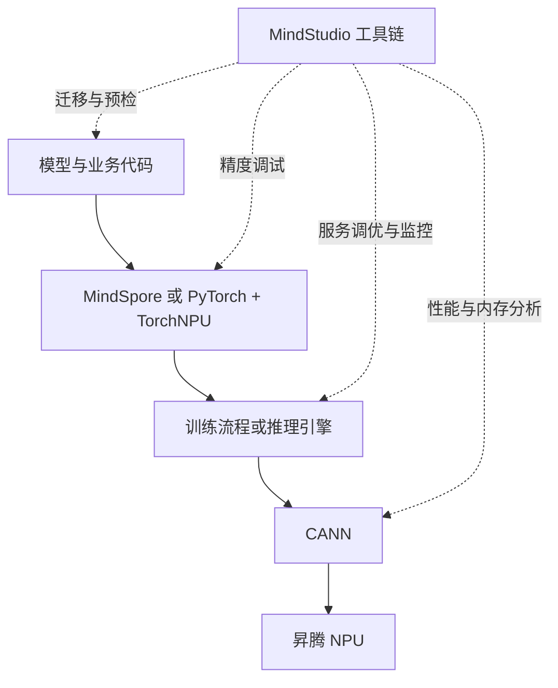

# 模块 04：模型能运行后，MindStudio 怎样帮助证明它正确而且够快？

模型从 GPU 迁移到昇腾后能够启动，并不意味着迁移完成。输出可能在某一层开始偏离，量化可能破坏质量，某个通信 Rank 可能拖慢集群，服务侧的排队也可能被误判为算子慢。**MindStudio** 在当前版本中应理解为覆盖算子、训练和推理开发的工具集合，而不只是一个写代码的 IDE。

## 1. MindStudio 究竟是什么

先看它解决的困难：MindSpore 或 PyTorch 负责表达和训练模型，CANN 负责把计算交给 NPU，MindIE Motor、vLLM-Ascend 等组件负责组织推理与服务；但是，模型运行失败或结果不符合预期时，这些组件不会自动告诉开发者“代码哪里没有迁完”“误差从哪一层出现”或“时间究竟耗在哪里”。开发者需要一组工具去检查执行链、采集证据和定位问题，这组面向昇腾开发过程的工具就是 **MindStudio 全流程工具链**。

MindStudio 不是模型运行时必须经过的一层。正常请求可以沿“框架或推理引擎 → CANN → NPU”执行；开发、调试和运维人员按问题调用 MindStudio 中的工具，从侧面观察或改善这条执行链。

图中的实线是模型正常执行路径，虚线是 MindStudio 的观察和辅助关系。MindStudio 既包含命令行工具，也包含可视化分析工具；它不是一个必须一直打开的单体应用，更不能用来替代框架、CANN 或推理引擎。

| 名称 | 它主要负责什么 | MindStudio 是否替代它 |
| --- | --- | --- |
| MindSpore、PyTorch | 用张量、算子和自动微分定义与训练模型 | 不替代；MindStudio 帮助迁移、调试和分析 |
| TorchNPU | 让 PyTorch 接入昇腾 NPU | 不替代；迁移和精度工具可检查这条路径 |
| CANN | 提供图、算子、运行时和通信基础 | 不替代；性能工具从 CANN 与 NPU 采集数据 |
| MindIE、vLLM-Ascend | 组织模型推理、调度和服务化 | 不替代；服务工具分析请求与模型执行 |
| MindStudio | 为上述开发过程提供迁移、精度、性能、内存、算子和监控工具 | 它承担的是开发与诊断工具职责 |

因此，“使用 MindStudio”不是选择一个新的训推框架，而是根据当前问题选择其中一款工具。例如代码还没迁完时使用迁移工具，结果不一致时使用精度工具，速度慢时使用性能工具。先有问题，再选择工具，才不会把工具名称当成需要全部安装和依次运行的固定流水线。

## 2. 从“能运行”到“可交付”还缺哪些证据

假设一个 PyTorch 大模型已在昇腾上返回文本。要交付它，至少还要回答：迁移改动是否完整；与标杆环境的中间结果从哪里开始偏离；时间花在 Host、算子、通信还是服务排队；峰值内存由什么构成；量化后质量是否达标；上线后怎样持续观察。每个问题需要不同数据，单一 Profiler 不能包办全部诊断。

工具链的正确用法是从现象选择最小证据链，而不是把所有工具都运行一遍。先确定问题属于环境、功能、精度、性能、内存还是服务层，再选择采集工具和分析工具。

## 3. 迁移和预检阶段先排除结构性问题

已有 PyTorch 训练或推理脚本迁移到 NPU 时，可使用 **msTransplant** 分析和辅助迁移，识别需要替换或关注的调用；推理部署前可使用 **msprechecker** 检查环境与部署条件。自动迁移只能处理它识别的模式，不能证明第三方库、控制流、精度和性能均保持一致。

因此迁移完成的证据应包括：原环境可复现的标杆输出、变更清单、目标环境的最小输出、未支持项与人工处理记录。若没有标杆环境，后续精度工具就缺少可靠比较对象。

## 4. 精度问题为什么需要逐层采集与比对

最终损失或最终文本只能说明“结果不同”，不能指出第一处偏差。**msProbe** 可在训练和推理场景采集并比较 API、Module 或张量层级的数据，用于定位从哪一层开始异常。它的核心思路与程序调试中的二分定位相似：先比较较粗粒度模块，再缩小到算子或张量。

使用时必须控制输入、随机种子、精度模式、模型版本和权重一致。浮点计算在不同实现上的微小差异并不自动等于错误，应结合容差、误差累积和任务指标判断。若一开始就把所有中间张量全部落盘，数据量和 I/O 还可能改变运行行为，因此采集范围应逐步缩小。

## 5. 性能采集、分析和可视化是三个动作

**msProf** 负责采集 CANN 与 NPU 的性能数据；框架场景也可以使用 Ascend PyTorch Profiler 或 MindSpore Profiler 获得框架语义。原始 Trace 很大，**msprof-analyze** 用于统计分析和产生聚合结果，**MindStudio Insight（msInsight）**再以时间线、算子、通信、内存等视图呈现数据。

这三步不能混成“打开可视化看颜色”：采集配置决定有没有目标数据，分析决定指标怎样汇总，可视化帮助发现时间关系。典型诊断顺序是先看端到端阶段，再看 Host 与 Device 空洞、通信与计算是否重叠、各 Rank 是否均衡，最后才下钻到热点算子。

若问题主要是设备内存，使用 **msMemScope** 观察全网多维内存并辅助诊断；若是在线服务的请求排队、调度和模型执行关系，则用 **msServiceProfiler**。算子开发还包括 msKPP、msOpGen、msDebug、msSanitizer、msOpProf 和 msKL 等工具，分别承担设计预测、工程生成、调试、异常检测、算子性能分析和调用验证。

## 6. 量化为什么不是点一下工具就结束

**msModelSlim** 提供模型压缩和量化能力。量化把部分权重或激活改用更低位表示，可以减少存储和搬运，但不同层对误差的敏感性不同。工具能生成量化结果和搜索候选配置，不能替业务决定“什么叫质量可接受”。

一个完整量化闭环应是：固定基准模型与评测集 → 生成量化候选 → 检查中间精度或敏感层 → 用同一推理引擎和负载评测质量与性能 → 不达标时回退部分层或更换方案 → 保存配置、权重与结果。MindStudio 26.1 文档中的自动调优会结合 vLLM-Ascend 与 AISBench 迭代验证配置，这恰好说明量化的终点是评测达标，而不是文件体积变小。

## 7. 按问题选工具

| 当前问题 | 首选工具或能力 | 需要保留的证据 |
| --- | --- | --- |
| GPU 脚本怎样迁到 NPU | msTransplant | 分析报告、代码改动、未支持项 |
| 部署前环境是否具备条件 | msprechecker | 环境、版本和检查结果 |
| 训练 Loss 跑飞或输出偏差 | msProbe | 标杆/目标采集、首个偏差点、容差 |
| 模型或集群为什么慢 | msProf、框架 Profiler、msprof-analyze、msInsight | 原始 Profile、时间线和瓶颈假设 |
| 设备内存在哪里增长 | msMemScope | 分配时间线、峰值来源和对象归属 |
| 服务请求为何等待 | msServiceProfiler | 请求调度、队列与模型执行时间线 |
| 怎样量化并控制质量 | msModelSlim、AISBench | 量化配置、评测集、质量与性能对照 |
| 上线后怎样持续观察 | msMonitor | 指标、告警条件、故障时段数据 |

工具名称会随版本演进，但问题分类较稳定。升级后发现名称或安装方式变化时，先在当前 MindStudio 文档中按问题寻找工具，不要继续套用旧博客的命令。

## 8. 一个可靠的诊断闭环

无论使用哪款工具，都遵守同一闭环：记录可重复现象 → 提出单一假设 → 选择能证伪它的最小采集 → 保存原始数据 → 根据证据修改一个变量 → 用相同负载复测。MindStudio 提供观测手段，但不会替代公平对照、质量阈值和业务验收。

下一模块会把这条闭环放进行业场景：医疗系统关注数据不出域与可追溯，制造边缘关注实时性与断网运行，金融服务关注安全治理与高并发。行业差异最终会改变硬件、引擎和工具证据的优先级。

## 助记卡片

**卡片 1：MindStudio 当前应怎样理解？**

> **答案：** 它是从执行链侧面提供迁移、精度、性能、内存、算子和监控能力的工具集合，不替代框架、CANN 或推理引擎，也不是模型请求必须经过的运行层。

**卡片 2：msProbe 主要解决什么问题？**

> **答案：** 它通过采集和比较训练或推理的中间数据，定位精度偏差开始出现的位置。

**卡片 3：msProf、msprof-analyze 与 msInsight 的关系是什么？**

> **答案：** msProf 采集，msprof-analyze 聚合分析，msInsight 可视化呈现；三者分别承担不同动作。

**卡片 4：服务排队问题为什么不应只看算子耗时？**

> **答案：** 端到端时延还包含接入、排队、调度、批处理和返回，需要服务级时间线。

**卡片 5：量化完成的判据是什么？**

> **答案：** 在固定评测与负载下，质量达到阈值且资源或性能收益得到验证，而不是只生成低比特权重。

**卡片 6：工具使用前最重要的动作是什么？**

> **答案：** 先把现象归类并提出可证伪假设，再选择最小必要采集。

## 自测题

1. MindStudio、MindSpore、CANN 和 MindIE 分别处于什么角色？为什么模型请求不必经过 MindStudio？
2. 为什么最终输出不同不足以定位精度问题？msProbe 的思路是什么？
3. 可视化时间线中看到某算子很长，为什么仍不能立即断定它是端到端瓶颈？
4. 一个量化模型体积减少 50%，是否可以宣布量化成功？还缺哪些证据？
5. 集群训练中某些 Rank 长时间空闲，应优先采集哪些数据？
6. 自动迁移工具生成的代码能够启动，为何仍要保留标杆输出和变更清单？
7. 把“在线问答 TTFT 突然升高”组织成一次最小诊断闭环。

[查看参考答案](quiz-answers.md)

## 官方依据与延伸阅读

- [MindStudio 26.1.0 工具目录](https://www.hiascend.com/doc_center/source/zh/mindstudio/2610/index/index.html)
- [MindStudio 推理开发工具快速入门](https://www.hiascend.com/document/detail/zh/mindstudio/2610/msquickstart/docs/zh/quick_start/msit_quick_start.md)
- [训练场景工具流程](https://www.hiascend.com/document/detail/zh/CANNCommunityEdition/83RC1alpha003/devaids/devtoolquickstart/atlasquick_train_0002.html)
- [MindStudio Insight 概述](https://www.hiascend.com/document/detail/en/mindstudio/2610/visualization_tool/MindStudioInsight/docs/en/user_guide/overview.md)
- [msProf 快速入门](https://www.hiascend.com/document/detail/en/mindstudio/2610/TITools/msProf/docs/en/quick_start/msprof_quick_start.md)
