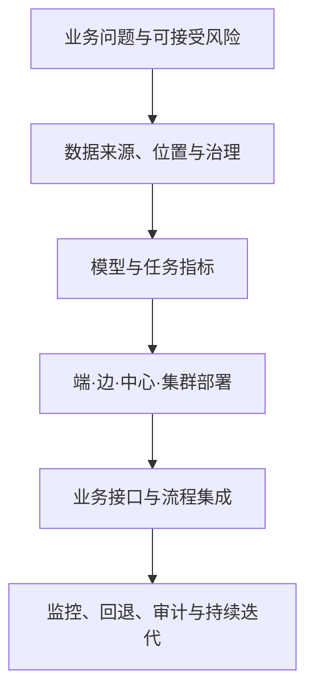

# 模块 05：昇腾能力怎样变成可交付的行业应用？

前四个模块已经有了硬件、CANN、训推框架和工具链，但行业客户并不直接购买“一个算子”或“一个框架”。他们要的是缺陷在规定时间内被发现、报告在院内安全生成、交通事件及时告警，或客服系统在高峰期仍能可靠回答。**应用使能**就是把模型能力与数据、部署位置、接口、治理、可靠性和业务指标连接起来。

## 1. 同一个模型为什么在不同行业会变成不同系统

假设都是视觉识别：制造质检要求相机旁毫秒级响应并能断网运行；医院影像分析要求接入院内影像系统、保护敏感数据并保留结果依据；城市交通可能要处理大量视频流并在中心统一调度。模型结构可以相似，但部署形态和验收指标完全不同。

因此行业方案设计的起点不是型号，而是业务失败会造成什么后果、数据能否离开现场、结果需要多快返回、人工是否必须复核。只有这些问题明确后，Atlas 产品形态和软件栈才有选择依据。

## 2. 端、边、中心与集群怎样协同

**端侧**靠近传感器，适合小功耗、低时延和隐私敏感的即时推理；**边缘侧**可以汇聚多路设备，在现场完成更复杂模型、缓存与设备管理；**中心侧**适合统一模型管理、集中推理和跨区域数据分析；**集群**解决大模型训练、后训练和大规模在线推理的容量与吞吐问题。

并非每个方案都需要四层齐全。工业质检可以在边缘完成推理，只把缺陷事件与抽样数据上传中心；大模型客服可能全部在数据中心服务；电力巡检可由边缘设备先筛选风险，再把疑似样本上传中心复核。系统设计关注数据和控制怎样流动，而不是为了“端边云协同”这个标签堆叠设备。

## 3. 五类典型场景分别在优化什么

| 行业场景 | 主要 AI 任务 | 常见部署取向 | 首要验收问题 |
| --- | --- | --- | --- |
| 制造 | 视觉缺陷、设备预测维护、知识助手 | 产线边缘推理，中心训练和模型管理 | 漏检/误检、节拍、断网运行、相机适配 |
| 电力与能源 | 视频巡检、隐患识别、机器人巡维 | 杆塔/站点边缘筛查，中心复核 | 环境适应、告警时延、弱网与可靠性 |
| 医疗 | 影像辅助、报告解读、院内问答 | 院内部署或受控中心推理 | 隐私、可追溯、人工复核、系统集成 |
| 金融与运营商 | 客服、营销、风控、运维助手 | 中心或集群推理，配合知识库 | 并发、时延、权限、审计、幻觉与回退 |
| 交通与城市治理 | 视频分析、事件检测、调度预测 | 多边缘节点加中心汇聚 | 多路流吞吐、跨点位管理、告警闭环 |

这些只是典型模式，不是行业定律。金融终端也可能有边缘推理，制造企业也可能训练行业大模型。真正稳定的区分是业务约束：数据位置、响应时间、模型规模、负载方式、风险等级和运维半径。

## 4. 从一个制造质检项目走完整链路

以涂胶缺陷检测为例，先定义“在产线节拍内识别漏涂和错涂，由工人复核疑似结果”，而不是先规定某款 Atlas。接下来依次完成：

1. **业务与数据：** 明确缺陷类别、相机分辨率、光照变化、节拍、漏检和误检代价，并划分训练、验证与现场回归数据。
2. **模型：** 选择检测或分割模型，在标杆环境形成质量基线；记录预处理、后处理和阈值。
3. **部署：** 根据断网运行、视频路数、空间与功耗决定边缘模块、小站或服务器；再估算并发和容量。
4. **适配：** 通过框架与 CANN 运行模型，必要时量化；固定输入比较迁移前后输出。
5. **集成：** 接入相机、PLC 或 MES，把告警、复核和结果回写纳入业务流程。
6. **验收与运维：** 测量真实节拍下的端到端时延、完成率和质量，监控数据漂移、设备故障和模型版本，保留回退方案。

这条链表明，硬件吞吐只覆盖第 3～4 步的一部分。相机预处理、阈值、业务回写和人工复核都可能决定最终效果。

## 5. 大模型行业应用多了哪些风险

传统识别模型通常输出类别、坐标或分数，大语言模型会生成开放文本并可能调用工具。行业大模型因此还要增加四类控制：

- **知识边界：** 用 RAG 或受控数据源提供可更新知识，并保存引用与检索证据。
- **行动边界：** 工具调用要经过参数校验、权限控制、幂等和审批，不能让模型直接拥有无限制操作权。
- **质量与安全：** 按具体任务建立评测集，检查事实性、拒答、敏感信息、提示注入和越权风险。
- **服务边界：** 设计超时、限流、降级、人工接管、版本回退和审计日志。

昇腾为这些应用提供算力和软件能力，但行业正确性、合规性和业务流程责任仍属于完整系统，不能由硬件品牌替代。

## 6. 怎样看待官方行业案例

官方案例可以证明某种组合在特定客户、数据、时间和条件下有过落地，例如昇腾官方页面展示了制造质检、交通、电力、运营商和医疗相关方案。案例中的“准确率”“效率提升”或“响应时延”不能直接迁移为新项目承诺，因为数据分布、网络、模型、硬件数量和验收口径可能不同。

阅读案例时提取四类可复用信息：业务问题是什么；部署在哪一层；用了哪些系统组件；用什么指标验收。把未经公开的模型配置、测试条件或因果关系标为未知，再用自己的数据复测。

## 7. 形成行业方案的选择矩阵

一个可评审的昇腾行业方案至少回答下面七个问题：

1. 业务任务、失败代价和人工责任是什么？
2. 数据从哪里来，能否离开现场，保存多久，谁能访问？
3. 模型、权重精度、输入输出和质量基线是什么？
4. 负载是单流、批量、并发请求还是训练作业？
5. 为什么选择端、边、中心或集群，以及对应 Atlas 产品形态？
6. CANN、框架、引擎和工具的版本组合怎样验证？
7. 性能、质量、可靠性、安全与成本分别如何验收和回退？

如果方案只能回答“使用昇腾服务器和某大模型”，它还停留在组件清单；能回答这七问，才开始形成可复现、可运维的系统设计。

## 8. 与后续推理实战衔接

本专项结束后，D33 的环境盘点可以扩展为双路线：NVIDIA/vLLM 主线或昇腾/CANN/推理引擎路线。无论选哪条路线，D35～D47 的基线、压测、单项优化、公平比较、可靠性与综合交付原则不变。平台不同会改变命令、指标来源和工具名称，不会改变“固定条件—保存原始结果—提出假设—复测”的工程方法。

## 助记卡片

**卡片 1：行业应用使能的核心是什么？**

> **答案：** 把模型和算力接入真实数据、部署位置、业务流程、治理与运维，使业务指标可以验收。

**卡片 2：为什么不是所有方案都需要完整端边云？**

> **答案：** 层级由数据、时延、容量和管理需要决定，增加无必要层级只会增加传输和运维复杂度。

**卡片 3：边缘推理最常见的价值是什么？**

> **答案：** 就近降低时延与带宽依赖，在断网或数据不宜外传时保持现场能力。

**卡片 4：行业大模型为什么需要行动边界？**

> **答案：** 生成模型可能调用外部工具，必须通过权限、校验、幂等、审批和审计限制真实副作用。

**卡片 5：为什么不能直接复用案例中的准确率？**

> **答案：** 指标依赖客户数据、模型、硬件、测试条件和口径，新项目必须在自己的条件下复测。

**卡片 6：平台变化后仍保持不变的工程方法是什么？**

> **答案：** 固定条件建立基线，保存原始结果，提出可证伪假设，只改变一个主要变量并公平复测。

## 自测题

1. 同一个视觉模型用于工厂质检和医院影像辅助时，为什么会形成不同的部署与验收方案？
2. 哪些条件会推动任务从中心侧迁到边缘侧？列出至少四项。
3. 一个运营商问答助手在压测中很快，为什么仍不能宣布可以上线？
4. 阅读行业案例时，哪些信息可以作为设计线索，哪些数字必须重新验证？
5. 为电力杆塔隐患识别设计一条端边中心数据流，并说明断网时如何退化。
6. 用本章七问审查“购买 Atlas 服务器，部署大模型，建设医疗助手”这句话缺少哪些内容。

[查看参考答案](quiz-answers.md)

## 官方依据与延伸阅读

- [昇腾制造行业应用](https://www.hiascend.com/industries/manufacturing)
- [昇腾电信行业应用](https://www.hiascend.com/industries/telecom)
- [华为智慧交通方案与案例](https://e.huawei.com/cn/industries/transportation)
- [电力巡检案例](https://e.huawei.com/cn/case-studies/industries/energy/2020/5g-ai-encounter-power-grids)
- [银行 AI 与大模型解决方案](https://e.huawei.com/cn/industries/finance/data-intelligence/ai-hub)
- [昇腾计算场景化解决方案](https://e.huawei.com/cn/solutions/computing/ascend-computing)

