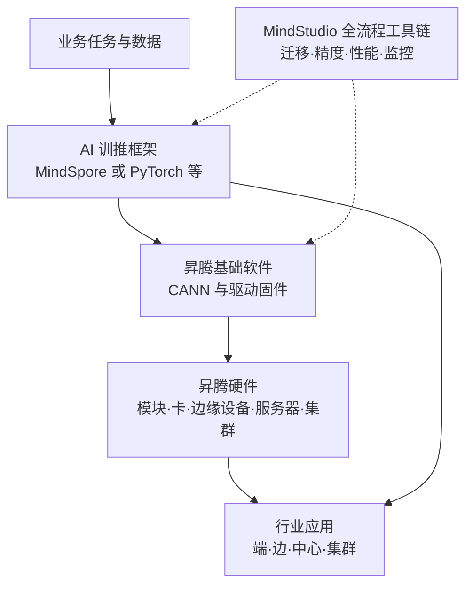

# 昇腾专项：一套 AI 任务怎样从模型落到行业系统？

昇腾并不只是某一颗芯片，也不等同于某个训练框架。面对一个需要训练或部署的模型，真正要处理的是一条完整链路：选择合适的硬件形态，由基础软件把框架计算转换成 NPU 可以执行的任务，再借助训推框架和工具链完成迁移、调试、优化，最后把能力接入真实业务。本专项沿这条链路组织五个模块，帮助你建立能够用于选型和排障的整体认识。

本专项是 D33 前后的平台补充资料，不替代 [D33～D47 推理工程实战](../../courses/03-inference-practice/README.md)。当前先建立昇腾平台的概念地图和技术边界，不要求安装软件或拥有昇腾设备；后续若确定采用昇腾环境，再把版本锁定、部署命令、压测结果和验收记录放入实战资料。

## 先看完整链路

读图时要注意两种关系：框架、CANN 和硬件构成执行路径；MindStudio 工具链从侧面观察和改善这条路径。行业应用并不是再加一层软件，而是把模型能力、部署位置、数据约束和业务指标组合成可运行系统。

## 学习顺序

| 模块 | 要回答的问题 | 学完后能够判断什么 |
| --- | --- | --- |
| [01 昇腾硬件介绍](01-hardware/README.md) | 芯片、加速卡、服务器和集群为什么不能混为一谈？ | 根据训练或推理、端边云位置、容量和互联需求选择产品形态 |
| [02 昇腾基础软件](02-software-stack/README.md) | 上层框架怎样把计算真正交给 NPU？ | 解释驱动、CANN、图引擎、算子库、运行时和通信库的职责 |
| [03 AI 训推框架](03-training-inference-frameworks/README.md) | 同一个模型为什么有多条接入昇腾的路线？ | 区分 MindSpore、TorchNPU、MindSpeed、MindIE 与开源推理引擎的边界 |
| [04 MindStudio 全流程工具链](04-mindstudio-toolchain/README.md) | 模型能运行以后，如何证明它正确而且够快？ | 按迁移、精度、性能、内存、服务和监控问题选择工具 |
| [05 昇腾应用使能](05-industry-enablement/README.md) | 硬件和模型怎样组合成真正可交付的行业方案？ | 从数据位置、时延、吞吐、可靠性和治理约束设计端边云部署 |

建议按顺序阅读。硬件模块先建立“资源在哪里”，基础软件模块说明“计算怎样落下去”，训推框架模块解释“开发者从哪里接入”，工具链模块负责“如何验证和优化”，行业模块最后把技术选择重新接回业务问题。

## 版本基线与阅读边界

资料于 **2026-09-21** 核对公开官方文档。当前用于说明软件栈关系的基线包括 CANN 9.1.0、MindStudio 26.1.0、TorchNPU 26.1.0、MindIE 3.1.0 与 MindSpeed 2.2.0；MindSpore 官方文档已发布 2.9.0。它们不是一张可以任意横向拼接的安装清单，实际部署必须以目标硬件的兼容性查询结果和对应版本说明为准。

硬件部分以当前公开的 Atlas 端、边、中心和集群产品形态为主，并提及已公开的 Ascend 950 系列方向。具体芯片后缀、可用内存、算力、操作系统和框架支持会随产品与版本变化，因此正文强调选择方法，不要求背产品参数表。

## 总自测导航

完成五个模块后，尝试不看资料解释下面这条链：一个已有 PyTorch 模型要在医院内网部署为问答服务，为什么不能只问“买哪张卡”，而要依次确认模型与负载、产品形态、CANN 和框架兼容性、推理引擎、精度与性能工具，以及数据不出域和故障恢复要求？如果能把每个判断对应到一个模块，说明已经形成专项地图。

## 官方依据

- [昇腾计算产品总览](https://e.huawei.com/cn/products/computing/ascend)
- [CANN 9.1.0 文档](https://www.hiascend.com/document/detail/zh/CANNCommunityEdition/910/index/index.html)
- [TorchNPU 26.1.X 文档](https://www.hiascend.com/document/detail/zh/Pytorch/2610/index/index.html)
- [MindIE 3.1.0 文档](https://www.hiascend.com/document/detail/zh/mindie/310/index/index.html)
- [MindSpeed 2.2.0 文档](https://www.hiascend.com/document/detail/zh/MindSpeed/220/productoverview/ptoverview_0001.html)
- [MindStudio 26.1.0 文档](https://www.hiascend.com/doc_center/source/zh/mindstudio/2610/index/index.html)
- [MindSpore 2.9.0 版本说明](https://www.mindspore.cn/docs/zh-CN/r2.9.0/RELEASE.html)
