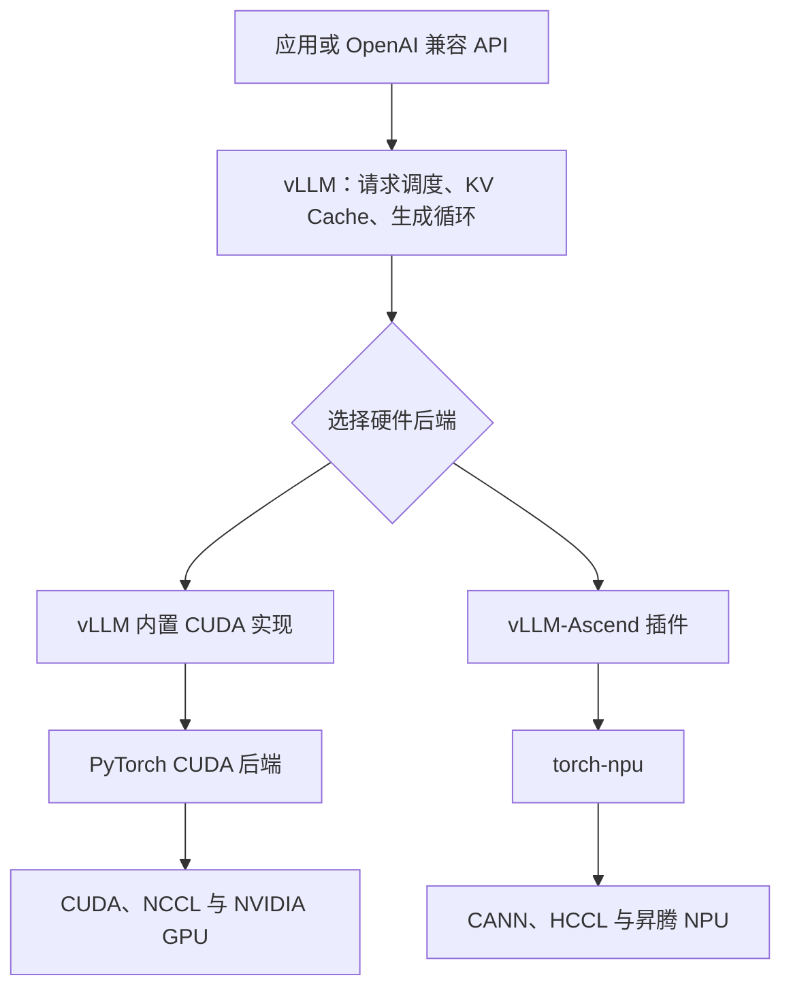

# 从 vLLM-Ascend 到 `torch.npu`：大模型怎样落到不同厂商的加速卡上？

大模型文件主要保存模型结构信息和训练得到的参数，而参数只是大量数字，不会自行管理请求，也不会自行变成某款加速卡能够执行的指令。一次推理要真正发生，至少需要有人描述数学运算、把运算适配到目标硬件、调用底层运行时，并在有多个请求时安排执行顺序。**模型提供“算什么”，软件栈逐层解决“怎样在这块硬件上算”。**

## 用跨平台应用理解整套关系

可以把大模型推理类比为把同一款应用运行在两个操作系统上。应用的业务逻辑可以复用，但窗口、图形、网络和驱动接口具有平台差异；如果代码调用了某个平台的专用接口，换平台时就必须提供新的实现。

在这个类比中，模型相当于应用的数据与业务规则，PyTorch 相当于上层开发框架，CUDA 或 CANN 相当于厂商提供的基础平台，NVIDIA GPU 或昇腾 NPU 相当于最终执行工作的硬件。vLLM 管理大量推理请求，作用类似应用服务器；vLLM-Ascend 则是把这台服务器移植到昇腾平台所需的适配代码。



图中上半部分是两种硬件都需要的推理服务逻辑，下半部分才出现厂商差异。vLLM-Ascend 不是另一个大模型，也不是 CANN 的替代品；它复用 vLLM 的通用逻辑，并补齐昇腾相关的执行实现。

## 一次模型计算为什么需要这些层

模型代码可以用 PyTorch 表达矩阵乘法、归一化和注意力等运算。例如 `output = model(inputs)` 只说明要执行模型的前向计算，并没有说明目标硬件如何分配内存、选择算子和下发任务。当模型和输入位于不同设备时，PyTorch 会把同一个上层运算分派给不同的设备后端：

```python
# NVIDIA 环境
model = model.to("cuda")
inputs = inputs.to("cuda")

# 昇腾环境
model = model.to("npu")
inputs = inputs.to("npu")

outputs = model(inputs)
```

在昇腾环境中，`torch-npu` 为 PyTorch 注册 `npu` 设备和相应算子实现；这些实现继续调用 CANN 提供的编译、运行时与算子能力，最终由昇腾 NPU 完成计算。因此几个容易混淆的名称分别表示：

| 名称 | 在代码或系统中的含义 |
| --- | --- |
| `torch-npu` | 安装的软件包与 PyTorch 昇腾扩展项目 |
| `torch_npu` | Python 中导入的模块名 |
| `torch.npu` | 扩展注册给 PyTorch 的设备管理接口 |
| `"npu:0"` | PyTorch 中第 0 块昇腾设备的标识 |
| CANN | 更接近硬件的昇腾计算软件栈 |

这里的 **NPU（Neural Processing Unit，神经网络处理器）**原本是硬件类别名称，并非华为独占；但在安装 `torch-npu` 的 PyTorch 环境中，`torch.npu` 指向的就是昇腾设备。

只运行一次模型还没有解决多用户服务问题。面对不同时间到达、长度不同的请求，还需要动态批处理、KV Cache 管理、请求抢占、Token 采样和 API 服务，这些工作由 vLLM 负责。由于高性能推理会使用与硬件紧密相关的注意力算子、缓存操作和多卡通信，昇腾不能直接复用 CUDA 实现，于是需要 vLLM-Ascend 提供昇腾后端。

## NVIDIA 与昇腾生态怎样对应

下表用于理解功能位置，不表示两边所有组件都严格一一等价。CUDA 和 CANN 都覆盖较宽的软件栈，而具体算子库、编译方式和部署产品的边界并不相同。

| 功能层 | NVIDIA 生态 | 昇腾生态 | 解决的问题 |
| --- | --- | --- | --- |
| 计算硬件 | NVIDIA GPU | Ascend NPU | 执行矩阵与张量计算 |
| 设备驱动 | NVIDIA Driver | Ascend Driver | 让操作系统识别并控制设备 |
| 基础计算平台 | CUDA Toolkit / Runtime | CANN | 内存管理、任务下发、编译与运行算子 |
| 神经网络与数学算子 | cuDNN、cuBLAS 等 | CANN 算子库、NNAL 等 | 提供高性能矩阵、注意力、归一化等实现 |
| 多卡集合通信 | NCCL | HCCL | 在多块卡之间执行 AllReduce、AllGather 等通信 |
| PyTorch 设备接入 | PyTorch CUDA 后端、`torch.cuda` | `torch-npu`、`torch.npu` | 把 PyTorch 运算分派给目标设备 |
| 厂商推理优化产品 | TensorRT、TensorRT-LLM | MindIE、CANN 图编译等 | 图优化、量化及推理部署；只能近似比较 |
| 开源大模型推理 | vLLM 及其 CUDA 实现 | vLLM + vLLM-Ascend | 调度请求、管理 KV Cache 并执行模型 |

最值得记住的不是产品名，而是三组层次关系：`torch.cuda` 与 `torch.npu` 是 PyTorch 设备入口，CUDA 与 CANN 是更底层的厂商计算平台，NCCL 与 HCCL 负责多卡通信。

## 为什么没有一个显眼的 `vllm-cuda`

NVIDIA 同样需要 vLLM 的 CUDA 适配代码，只是 vLLM 最初主要围绕 CUDA 生态发展，这部分代码已经进入 vLLM 主项目，因此通常不需要额外安装一个名为 `vllm-cuda` 的包。从抽象架构看，可以把它们理解为同一接口的两种实现：

```text
vLLM 通用核心
├── 内置 CUDA 后端       → PyTorch CUDA → CUDA/NCCL → NVIDIA GPU
└── vLLM-Ascend 插件     → torch-npu    → CANN/HCCL → Ascend NPU
```

所以，“没有 `vllm-cuda` 这个独立包”不等于“不需要 CUDA 后端”，只说明这部分代码的存放和发布方式不同。vLLM-Ascend 独立发布，也便于它按照昇腾设备、CANN 和 torch-npu 的版本节奏进行开发与测试。

## 一个开源项目能否迁移到昇腾

能否迁移不能只看项目是否使用 PyTorch，还要看它在多大程度上依赖厂商专用能力。

| 项目代码特征 | 迁移难度 | 原因 |
| --- | --- | --- |
| 只使用标准 PyTorch 算子 | 相对较低 | 若 torch-npu 已实现全部相关算子，模型主体可能只需切换设备 |
| 写死 `torch.cuda`、NCCL 等接口 | 中等 | 需要增加设备检测，并替换同步、通信等平台接口 |
| 包含 `.cu` 文件或自定义 CUDA Kernel | 较高 | 昇腾不能直接编译和执行 CUDA Kernel，必须重新实现或寻找替代算子 |
| 深度依赖 CUDA 的缓存布局和执行优化 | 很高 | 不仅要补算子，还要重做内存、调度、计算图和通信适配 |

因此，把 `device="cuda"` 改成 `device="npu"` 只是修改了设备入口。只有模型使用的全部算子、数据类型、自定义 Kernel 和通信操作都有昇腾实现，程序才真正具备可移植性。vLLM 属于高度优化的推理系统，所以需要专门的 vLLM-Ascend，而不是一次字符串替换。

## 普通开发者能感知到哪一层

不同角色看到的软件栈深度不同。只调用模型 HTTP API 的应用开发者可能完全看不到 PyTorch；编写模型的开发者主要面对 PyTorch，但会通过 `torch.npu.is_available()`、`torch.npu.synchronize()` 和 `"npu:0"` 感知 torch-npu。部署人员还要处理 vLLM-Ascend、CANN、驱动和版本匹配；只有算子与性能工程师通常会深入 CANN、自定义算子和 HCCL 通信。

| 角色 | 通常直接接触的层 |
| --- | --- |
| 应用开发者 | HTTP/OpenAI 兼容 API |
| 模型开发者 | PyTorch、`torch.npu`，必要时使用 `torch_npu` 扩展接口 |
| 推理部署工程师 | vLLM、vLLM-Ascend、torch-npu、CANN 与驱动 |
| 算子或性能工程师 | CANN、自定义算子、HCCL 与硬件执行细节 |

CANN 平时被上层封装，并不意味着开发者永远感知不到它。安装环境、版本不匹配、算子或数据类型不支持、图编译失败以及性能调优时，CANN 会直接影响错误信息和处理方法。这与普通 NVIDIA 开发者平时主要写 PyTorch，但排查问题时仍会遇到 CUDA、cuDNN 和 NCCL 相似。

## PyTorch 中还能看到哪些设备名

设备名不一定直接等于厂商名称，有的表示硬件类别，有的表示软件后端。下面只列常见形式；具体可用性取决于安装的 PyTorch 构建和厂商扩展。

| PyTorch 设备名 | 常见目标硬件或后端 |
| --- | --- |
| `cpu` | Intel、AMD、ARM 等 CPU |
| `cuda` | NVIDIA GPU；ROCm 版 PyTorch 为兼容现有代码也沿用大量 `torch.cuda` 接口 |
| `npu` | 通过 torch-npu 接入的华为昇腾 NPU |
| `xpu` | Intel GPU 后端 |
| `mps` | Apple Silicon 上的 Metal Performance Shaders 后端 |
| `hpu` | Intel Gaudi，原 Habana HPU |
| `xla` | XLA 设备，PyTorch/XLA 主要面向 Google TPU，也可存在其他 XLA 目标 |
| `musa` | 通过 torch-musa 接入的摩尔线程 GPU |
| `privateuseone` | PyTorch 为第三方设备扩展预留的通用设备槽位 |

这些设备都努力复用 `model.to(device)` 这一上层形式，但执行语义、支持算子和性能路径并不完全相同。判断一个项目能否使用某种硬件时，应继续检查对应后端是否支持项目依赖的算子、精度、通信和自定义 Kernel。

## 最短记忆链

可以用下面四句话复述整套关系：

1. **模型权重提供参数，PyTorch 描述张量计算。**
2. **torch-npu 把 PyTorch 接到昇腾，CANN 把运算真正落到昇腾 NPU。**
3. **vLLM 管理大量推理请求，vLLM-Ascend 为它补上昇腾相关的执行实现。**
4. **NVIDIA 也需要 CUDA 后端，只是它通常已经内置在 vLLM 中，没有单独叫 `vllm-cuda`。**

## 资料依据与适用时间

本文的生态组件与接口关系核对至 **2026-09-28**。版本组合和具体支持能力会变化，实际部署时应重新查看兼容矩阵。

- [vLLM-Ascend 官方仓库](https://github.com/vllm-project/vllm-ascend)
- [vLLM-Ascend 官方文档](https://docs.vllm.ai/projects/ascend/en/latest/)
- [vLLM 插件系统](https://docs.vllm.ai/en/latest/design/plugin_system/)
- [PyTorch/XLA 官方文档](https://docs.pytorch.org/xla/master/)
- [NVIDIA cuDNN 官方文档](https://docs.nvidia.com/deeplearning/cudnn/latest/)
- [NVIDIA NCCL 官方文档](https://docs.nvidia.com/deeplearning/nccl/user-guide/docs/)
- [NVIDIA TensorRT 官方文档](https://docs.nvidia.com/tensorrt/)

