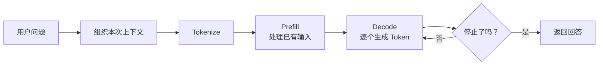
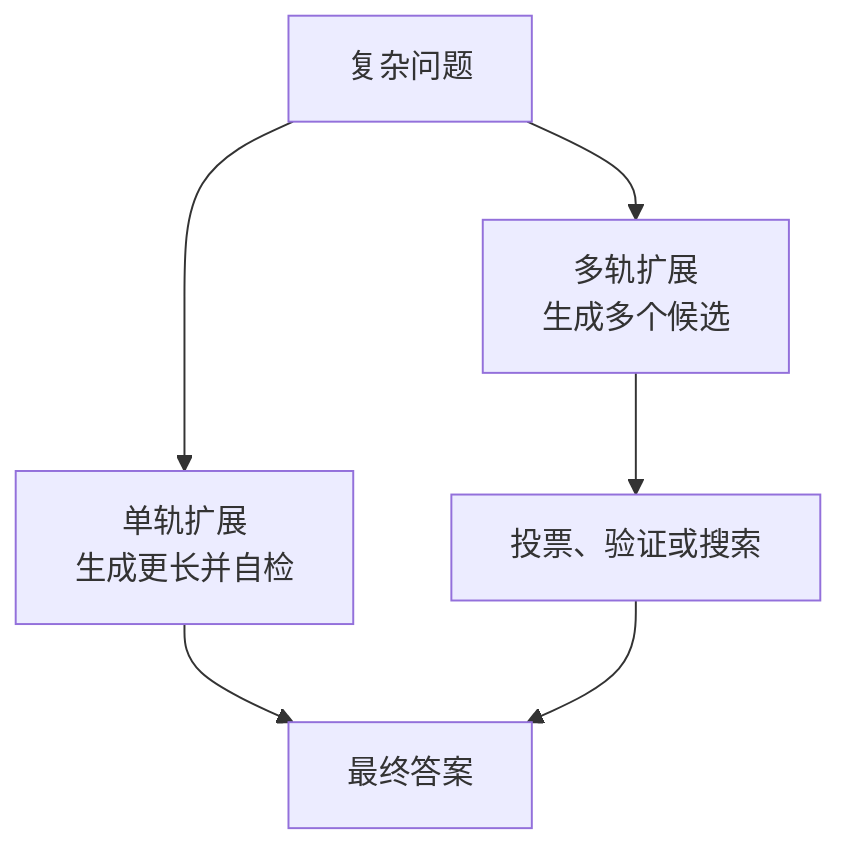

# 补充：同一个模型，为什么能答得更好或运行得更快？

公司部署了一个差旅助手。员工问：“临时改签导致费用超标，但已经得到直属经理同意，能否报销？”模型权重没有变化，工程师却可以通过补充制度、调整生成方式、改进服务调度或增加推理计算，让回答的可靠性和响应速度发生明显变化。要理解这些手段，关键不是背下一串技术名词，而是先分清：**它们改动的是一次请求的哪个环节，又在优化质量、延迟、吞吐、显存还是成本。**

先用一张表定位四个可以干预的位置。它只负责导航，后文会沿一次请求的实际流动解释它们为什么出现。

| 干预位置 | 典型手段 | 首先改变什么 | 主要代价或边界 |
| --- | --- | --- | --- |
| 模型计算前 | Prompt、示例、检索资料、历史消息、工具说明 | 模型本次能够看到的信息 | 上下文更长，Prefill 成本和噪声可能增加 |
| 逐 Token 生成时 | 温度、候选截断、停止条件、结构约束 | 输出怎样从概率分布中被选出 | 速度、稳定性和多样性之间需要取舍 |
| 推理服务执行时 | KV Cache、连续批处理、量化 | 显存占用、延迟与吞吐 | 依赖负载、硬件与实现；部分方案可能影响质量 |
| 难题求解时 | 更长推理、多候选、投票、验证或搜索 | 每道题使用的推理计算量 | 通常增加 Token、延迟和费用，收益并不保证 |

## 1. 一次请求进入系统后，模型究竟做了什么？

先暂时不谈优化，只看最基本的执行过程。系统把用户问题、系统指令、对话历史和可选资料组织成上下文，再由 tokenizer 转成 Token。模型首先并行处理已有的全部输入 Token，建立每一层注意力所需的中间状态；这一步称为 **Prefill（输入处理阶段）**。随后模型预测下一个 Token，把新 Token 接回上下文，再预测下一个，如此循环直到遇到停止标记或长度上限；这一步称为 **Decode（逐 Token 生成阶段）**。



工程师可以在计算前调整模型看到的信息，这叫输入控制；也可以调整 Token 的选择与停止规则，这叫生成控制。两者描述的是干预方式，Prefill 与 Decode 描述的是计算阶段。回到差旅问题：普通推理使用已有权重，不会因为收到一次提问就更新参数。如果模型从未学过公司的具体制度，这次输入就必须提供判断所需的依据。

## 2. 权重不变时，怎样让模型拿到回答所需的信息？

如果只问“超标能否报销”，模型不知道公司的制度版本、经理审批是否足够以及紧急改签有什么例外。最直接的改进是把任务、约束和答案格式写清楚，这属于 **Prompt 工程（Prompt Engineering）**。例如要求模型“只能依据所给制度判断；证据不足时明确说明”，再给一个相似示例，通常比只写“帮我判断”更容易得到符合任务的输出。

但真实系统面对的内容远不止一段指令。它还要选择哪段制度需要检索、保留哪些历史消息、暴露哪些工具、如何放置工具返回值，以及怎样在上下文窗口内删除无关内容。这个更完整的问题通常称为 **上下文工程（Context Engineering）**：Prompt 是上下文的一部分，上下文工程关注的是模型在当前一步究竟应该看到哪些信息，以及这些信息怎样组织。

```text
本次上下文 = 系统约束 + 用户问题 + 必要历史
             + 检索证据 + 可用工具说明 + 少量有效示例
```

公司制度很多，每次都完整放入上下文既昂贵，也容易混入无关条款。系统可以先检索“临时改签”“超标审批”等相关片段，再连同问题交给模型生成答案，这就是 **RAG（Retrieval-Augmented Generation，检索增强生成）**。它通过本次输入补充外部信息，不会自动修改模型权重。选择相关、有效的制度片段还能减少输入处理成本。

有了正确依据，回答仍可能冗长、偏离要求，或者写到一半就停止。例如用户只需要“能否报销、适用条款、还缺什么审批”，系统就要进一步控制输出格式、长度和 Token 的选择方式。

## 3. 有了正确依据，怎样控制回答的形式和长度？

在 Decode 阶段，模型每一步给出候选 Token 的概率分布，系统再依据温度、Top-k、Top-p 或确定性选择规则取出下一个 Token。最大生成长度和停止条件决定何时结束，结构化输出约束则可以限制结果必须符合 JSON 或某种字段格式。这些设置会共同影响多样性、稳定性、输出长度和耗时。

因此，把技术严格分成“提速且不影响质量”和“提质但降低速度”并不可靠。减少最大 Token 数可能更快，却会截断答案；调整采样可能不明显改变单步计算量，却会改变输出；投机解码在正确实现下保持目标模型的输出分布，但真实加速仍取决于候选接受率和系统实现。更稳妥的判断方法是：**先说明哪一个量被改变，再通过质量与性能评测确认副作用。**

单个请求的生成规则解决不了另一个现实问题：当许多员工同时提问时，如果 GPU 一次只处理一个请求，大量计算资源会闲置。这就把问题从“模型怎样生成”推到了“服务怎样组织多个请求”。

## 4. 多个请求长度不同时，为什么需要连续批处理？

普通批处理把若干请求凑成一批再执行，可以让 GPU 同时计算更多 Token；但生成长度不同，短请求结束后如果必须等待最长请求，空出来的位置就被浪费。**连续批处理（Continuous Batching）**允许已完成的请求退出，并把新请求加入后续迭代，因此批次成员可以动态变化。所谓“动态批处理”是更宽泛的说法；在大模型逐 Token 生成场景中，连续批处理强调每轮 Decode 都可以重新调度。

Decode 还会反复使用之前 Token 的 Key 和 Value。若每生成一个 Token 都重新计算全部历史，浪费会随序列增长。**KV Cache**把已计算的 Key、Value 保存下来，之后只计算新 Token 对应的部分。它减少重复计算，却会随并发数和上下文长度占用大量显存；PagedAttention 一类方法进一步按块管理这些缓存，以减少碎片和便于调度。[vLLM PagedAttention 文档](https://docs.vllm.ai/en/latest/design/paged_attention/)

连续批处理主要提高硬件利用率和吞吐，但请求等待策略可能改变首 Token 延迟；KV Cache 用显存换计算。它们都不是无条件“免费提速”。当权重本身已经占满显存、模型甚至无法加载时，调度也无从开始，于是需要进一步减少数值表示的成本。

## 5. 量化为什么能省显存，却不保证一定更快或完全无损？

模型权重原本可能用 16 位浮点数保存。若改用 8 位或 4 位表示，同样数量的权重通常需要更少存储空间，从显存读取的数据也会减少，这就是**量化（Quantization）**解决的核心困难。权重量化较常见，是因为权重固定，可以离线寻找缩放范围；激活随输入变化，分布更难稳定处理，因此权重和激活同时量化通常更具挑战。

GPTQ 和 AWQ 都是常见的训练后权重量化方法。GPTQ 逐层处理权重并尽量补偿量化误差；AWQ 利用激活统计识别更重要的权重通道并降低其量化损失。[GPTQ 论文](https://arxiv.org/abs/2210.17323)、[AWQ 论文](https://arxiv.org/abs/2306.00978)

低比特并不自动等于更快：硬件若缺少匹配的低精度 Kernel，反量化和格式转换可能抵消收益；位宽降低也可能造成质量损失。量化是否值得采用，需要在目标硬件和真实任务上同时测量显存、吞吐、延迟与质量。到这里，我们已经尽量减少了一次回答的执行成本，但复杂问题仍可能因为推理不足而答错。此时可以反过来选择：不给它更少计算，而是给难题更多计算。

## 6. Test-Time Scaling 怎样用更多推理计算换取更好的答案？

**推理时扩展（Test-Time Scaling，也称 Inference-Time Scaling）**不要求再次更新模型权重，而是在解决当前问题时动态增加计算。它至少包含两条不同路线：一条让单次推理走得更长，例如分解问题、检查中间结论或增加推理 Token；另一条并行生成多个候选，再用多数投票、奖励模型、规则验证器或搜索过程选出结果。



例如，对差旅制度中的多条件冲突，系统可以让模型先列出适用条款再核对结论；也可以生成五个候选，让验证器检查每个答案是否引用了真实条款。两者都会消耗更多生成 Token 或模型调用，因此增加延迟和费用。研究表明，合理分配推理时计算可以提高部分困难任务的表现，但最佳策略取决于题目难度、模型和验证方法，并不是预算越大就必然越正确。[Test-Time Compute 研究](https://arxiv.org/abs/2408.03314)

推理时增加计算，可以避免为这次改进重新训练模型的固定投入，也便于只给困难请求分配更多预算。但若每个请求都生成大量候选，累计服务成本可能很高。是否划算取决于请求量、正确答案的价值和验证器的可靠性；只有先查清错误原因，才能判断额外计算是否花在了有效的位置。

## 7. 面对一次效果或性能问题，应该先动哪个环节？

这些技术不是一条必须全部执行的流水线，而是不同控制面。可以按观察到的症状定位：

| 现象 | 先检查什么 | 可能使用的手段 |
| --- | --- | --- |
| 回答缺少公司事实 | 上下文里是否有正确证据 | RAG、历史裁剪、上下文组织 |
| 不遵守格式或任务边界 | 指令、示例和输出约束是否明确 | Prompt、结构化输出 |
| 单请求生成很慢 | Prefill、Decode 哪一段慢，输出是否过长 | KV Cache、停止条件、合适的解码优化 |
| 并发增加后排队严重 | 调度、批处理和显存容量 | 连续批处理、缓存管理、准入控制 |
| 模型装不下或权重搬运昂贵 | 权重精度与硬件 Kernel 支持 | 经评测的 GPTQ、AWQ 等量化方案 |
| 普通问题稳定，复杂推理题易错 | 是否值得为难题增加计算 | 更长推理、多候选、投票或验证 |

最终要记住的不是“哪种技术最高级”，而是四个判断：**输入是否提供了正确信息，生成规则是否符合任务，服务系统是否高效执行，难题是否值得追加推理预算。**任何优化都应同时测量质量、延迟、吞吐、显存与成本中的相关指标，不能只凭技术类别推断结果。

## 助记卡片

**卡片 1：Prefill 与输入控制是一回事吗？**

> **答案：** 不是。Prefill 是模型处理已有输入 Token 的计算阶段；输入控制是工程师组织 Prompt、资料和历史的干预视角。

**卡片 2：Prompt 工程与上下文工程有什么关系？**

> **答案：** Prompt 工程主要设计指令和示例；上下文工程还选择检索证据、历史、工具及其组织方式，Prompt 是其中一部分。

**卡片 3：为什么上下文不是越长越好？**

> **答案：** 无关内容可能干扰判断，长输入还会增加 Prefill 时间和 KV Cache 占用。

**卡片 4：KV Cache 用什么换取什么？**

> **答案：** 它用显存保存历史 Token 的 Key、Value，减少 Decode 时对历史内容的重复计算。

**卡片 5：连续批处理解决了什么浪费？**

> **答案：** 请求长度不同时，已完成请求可以退出，新请求可以加入，避免固定批次一直等待最长请求。

**卡片 6：量化为什么不保证一定加速？**

> **答案：** 实际速度还取决于硬件、低精度 Kernel、反量化和格式转换；低位宽也可能造成质量损失。

**卡片 7：Test-Time Scaling 会修改模型权重吗？**

> **答案：** 通常不会。它在当前请求中增加推理长度、候选数量、验证或搜索计算。

**卡片 8：多候选投票为什么不是免费提质？**

> **答案：** 它需要多次生成和聚合，增加 Token、延迟与费用，而且多个候选可能犯同一种错误。

**卡片 9：面对推理问题，为什么不能只问“哪个技术更快”？**

> **答案：** 技术可能分别改变质量、首 Token 延迟、逐 Token 速度、吞吐、显存和成本，必须先明确目标指标与负载。

## 自测题

1. 为什么“输入控制与生成控制”不能直接替代 Prefill 与 Decode 这两个概念？
2. 差旅助手已经收到清楚的任务指令，却不知道公司的最新制度。应该优先修改 Prompt 措辞、增加检索上下文，还是做模型量化？为什么？
3. 为什么给模型加入全部历史对话和整本制度，反而可能使效果或速度变差？
4. 三个请求分别需要生成 20、100、300 个 Token。固定批处理可能产生什么浪费？连续批处理怎样缓解？
5. KV Cache 为什么能够减少计算，又为什么可能限制并发数？
6. 某模型量化到 4 位后显存下降，但速度没有提升。请给出两个可能原因，并说明还要检查什么指标。
7. “对一道题生成八个答案并投票”属于怎样的 Test-Time Scaling？它为什么可能提高质量，又为什么可能失败？
8. 一个服务复杂题正确率偏低，但普通题表现稳定。请说明怎样判断应该补充上下文、调整生成控制，还是增加推理预算。

完成后再看[参考答案](quiz-answers.md)。相关主课可回顾 [D09：提示词与上下文](../../courses/01-llm-overview/d09-prompt-context/README.md)、[D14：推理过程与 KV Cache](../../courses/01-llm-overview/d14-inference-memory/README.md)、[D15：推理引擎](../../courses/01-llm-overview/d15-serving-engine/README.md)以及[D23～D32 推理工程原理](../../courses/02-inference/README.md)。
