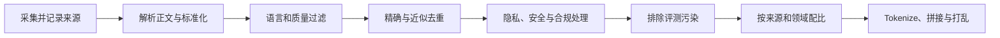

# 补充：一份资料，怎样变成大模型真正能学习的数据？

假设公司有一份《出差管理制度》，其中写着预算标准、审批流程和订票规则。把 PDF 文件丢进训练目录，并不意味着模型就会学会回答制度问题；同一份内容经过不同处理，还可能用于预训练、监督微调、偏好优化或强化学习。**训练数据的关键不只是“内容来自哪里”，而是内容被加工成了什么训练信号。**

先看这份制度在不同阶段可能变成什么：

| 用途 | 模型实际看到的数据 | 数据在告诉模型什么 |
| --- | --- | --- |
| 预训练 | “员工出差前应提交申请……”等 Token 序列 | 文本通常怎样继续 |
| SFT | 指令：“超预算怎么办？”＋理想回答 | 遇到这类指令应该怎样回答 |
| 偏好优化 | 同一问题的较优回答与较差回答 | 多个回答中更希望哪一个 |
| 强化学习 | 问题、模型生成的回答或轨迹、奖励 | 哪些尝试取得了更好结果 |
| 蒸馏 | 教师模型为问题生成的回答或推理过程 | 模仿教师模型表现出的行为 |

表格里，同一份制度有时被称为“原始数据”，有时又变成“预训练语料”“SFT 数据”或“偏好数据”。如果把这些名称误认为一套固定的上下级分类，后面就很难判断一份材料究竟处在加工流程的哪一步。因此，在追踪它怎样进入训练之前，需要先弄清这些名称分别在强调什么。

## 1. 同一份资料为什么会有不同叫法？

这些名称强调的是不同角度，而不是三个互不重叠的箱子。**数据（Data）**是最宽泛的说法，文本、图片、语音、日志和人工评分都可以是数据。**语料（Corpus）**通常指为了语言研究或模型训练收集起来的一批语言材料；它可以用于预训练，也可以是对话语料、翻译平行语料或领域语料，并不天然等于“未标注预训练文本”。

**训练数据集（Training Dataset）**强调数据已经按照某个训练目标组织好。例如，预训练数据集是 Token 序列，SFT 数据集常包含指令与目标回答，偏好数据集常包含同一提示下的较优与较差回答。原始制度文档是数据来源，清洗后的制度文本可以组成语料，切分并格式化后的样本才是模型实际消费的训练数据。

“微调数据等于指令数据”也过于狭窄。微调是预训练后继续更新模型参数的统称，其中可能包括：

- 用领域原文继续做下一 Token 预测的**继续预训练（Continued Pre-training）**数据；
- 用“指令—回答”示范行为的 **SFT 数据**；
- 用回答比较表达质量取舍的**偏好数据**；
- 为强化学习提供起始问题、模型尝试和奖励的 **Prompt 与 rollout 数据**。

因此，指令数据是常见的微调数据，但不是微调数据的全部。现在已经能根据“材料是什么、为哪个目标组织”辨认名称，接下来还差一步：原始资料即使名称明确，也不代表它已经干净、合法并适合直接训练。这就需要进入实际的数据处理过程。

## 2. 为什么原始网页不能直接送进预训练？

预训练原料可以来自网页、书籍、百科、论坛对话、论文和代码仓库，也可以按目标分成通用、数学、代码、多语言等领域。Common Crawl、Wikipedia 或 MNBVC 这样的名称描述的是来源或语料项目，不表示其中每条内容都已达到某个模型的训练标准。同一来源内部仍可能同时包含高质量正文、重复转载、广告模板和敏感信息。

### 海量数据是谁采集的，书籍又怎样变成文本？

互联网数据主要依靠程序批量获取，而不是人工逐页复制。爬虫按照 URL 列表自动请求网页，保存页面内容和来源元数据；也可以直接使用 Common Crawl 这类已经持续抓取互联网的公开档案。Common Crawl 提供原始网页、元数据和抽取文本，并允许使用 Hadoop、Spark 等工具并行处理数十亿页面。[Common Crawl 数据说明](https://commoncrawl.org/get-started) 人的工作主要是确定允许使用的来源和许可条件、编写采集与过滤规则、监控失败率、抽样检查质量，以及为少量高价值数据进行专业标注。

书籍进入处理管线通常有两个入口。EPUB、HTML 或带文本层的 PDF 可以直接解析文字；纸质书或只有页面图片的扫描 PDF，则先扫描成图像，再用**光学字符识别（Optical Character Recognition，OCR）**把字形转换成文字。Internet Archive 的图书搜索文本就是由上传的 PDF 或扫描图像经过 OCR 处理得到的。[Internet Archive 说明](https://archivesupport.zendesk.com/hc/en-us/articles/360018359991-Search-A-Basic-Guide)

无论从哪种入口获得文字，都还不能立即训练。程序要继续识别章节与段落，删除页眉、页脚、页码和目录噪声，修复断行与乱码，并执行语言识别、去重和质量过滤。通过许可与隐私检查后，文本才会被 tokenizer 转成 Token ID，再切分或拼接成固定长度附近的训练序列。可以把一本扫描书的变化压缩成：

```text
纸质页面 → 扫描图像 → OCR 文字 → 结构与错误清理 → Token ID → 训练序列
```

这里的“训练序列”通常不是整本书。一本书可能有几十万甚至更多 Token，而一次训练所能处理的长度受**训练上下文长度（Training Context Length）**限制。数据管线会先保留“这段文字来自哪本书、哪一章”的边界信息，再把正文切成许多不超过规定长度的序列。例如，一本书转换后有 20 万个 Token，而训练序列长度是 4096，那么它会形成大约几十个连续片段，而不是把 20 万个 Token 一次送入模型。

```text
一本书的 Token
    ↓ 按章节或连续位置切分
[序列 1][序列 2][序列 3]……[序列 N]
    ↓ 与其他来源的序列一起采样、打乱
分批送入模型训练
```

切分不等于把句子随意剁碎。工程上会尽量在文档或段落边界处理，并用文档结束标记告诉模型“这篇内容到这里结束”；较短文档还可能通过**拼接（Packing）**填入同一个固定长度序列，以减少空位，但仍要保留边界，避免把两本无关的书误当成同一篇连续文章。模型在某一步通常只看到当前序列，不会像人一样读完第一段后永久记住整本书；不同片段反复参与训练后，其中的语言规律和部分知识才逐渐体现在参数里。因此，书籍的章节顺序和局部上下文仍有价值，但“模型训练过整本书”不等于“它曾在一次输入中完整阅读整本书”。

OCR 可能把相似字形认错，复杂公式、表格和多栏排版也容易破坏阅读顺序，所以自动转换之后仍需要规则校验和抽样检查。更重要的是，**技术上能够抓取或识别，不等于法律和许可上可以用于训练**；项目仍要记录来源、授权或公共领域状态，并遵守适用的许可与数据保护要求。

网页可能夹着导航栏、广告、乱码和重复转载；PDF 可能把页眉页脚混进正文；代码仓库可能包含自动生成文件和密钥。如果不处理，模型消耗大量计算后，学到的可能是模板垃圾、重复内容和隐私信息。原始数据通常要经过下面这条管线：



这些步骤解决的问题不同：

| 处理步骤 | 要避免的问题 | 不能简单理解成什么 |
| --- | --- | --- |
| 解析与标准化 | HTML 标签、乱码、格式不一致 | 把所有标点和结构都删掉 |
| 质量过滤 | 垃圾页、机器模板、非目标语言 | 文本越正式就一定越好 |
| 去重 | 重复网页被模型反复看到并占用预算 | 只比较文件是否完全相同 |
| 脱敏与安全处理 | 电话、证件号、密钥等敏感内容 | 数据从此不存在任何隐私风险 |
| 污染控制 | 评测题或答案进入训练集，导致分数虚高 | 所有相似知识都必须删除 |
| 数据配比 | 某一来源过多，挤占其他能力所需 Token | 把所有来源平均混合 |

Meta 公布的 Llama 3 数据管线就包含启发式过滤、NSFW 过滤、语义去重和质量分类器，说明“来自公开来源”与“已经适合训练”之间仍隔着大量处理。[Meta Llama 3 说明](https://ai.meta.com/blog/meta-llama-3/)

文本清洗完成后，还需要**统一格式、切分、拼接（Packing）、采样和打乱（Shuffling）**，才能组织成训练批次。打乱改变的是样本出现顺序，让不同来源的数据交错参与训练；单条序列内部仍保留文字顺序，否则模型就无法学习连贯文本怎样继续。

## 3. 为什么清洗之后还要决定数据配比？

假设可用预算只有 1000 亿个 Token，而候选数据包括网页、书籍、代码、数学和公司领域资料。代码比例增加，可能改善编程能力，却会挤占其他领域的 Token；把公司制度重复很多遍，又可能造成过拟合和通用能力退化。**数据配比是在固定训练预算下，决定每种来源被采样多少。**

比例可以依靠经验设定，也可以借助小模型实验优化。例如，**RegMix** 先让许多小型代理模型在不同数据混合比例上训练，再用回归模型预测哪些比例更适合大模型。[RegMix 论文](https://arxiv.org/abs/2407.01492) 另一种代表性方法 DoReMi 使用代理模型估计各领域的采样权重。[DoReMi 论文](https://arxiv.org/abs/2305.10429)

这类方法说明，数据价值不能只靠“网页低质、书籍高质”之类固定标签判断；来源之间存在相互作用，最终比例还取决于训练目标和评测任务。

决定配比时，我们按 Token 分配预算；如果接下来准备一批制度问答，用于教模型回答员工问题，数据清单又可能按“多少条问答”记录。每条问答的长度不同，单看记录数量就无法判断需要处理多少文本。因此，在比较不同训练阶段的数据规模之前，需要先弄清每个数字在统计什么。

## 4. 预训练的万亿 Token，能和微调的万条样本直接比较吗？

不能直接比较。原始语料可能按 TB 统计，预训练通常按 Token 统计，SFT 常按样本或对话轮数统计，强化学习还会统计 Prompt、rollout 数量和生成 Token。它们回答的不是同一个问题。

模型名称中的 `B` 又是另一种单位。`B` 是 billion，即十亿；“7B 模型”通常表示模型大约有 70 亿个**参数（Parameter）**。参数是训练过程中被梯度调整、最终保存在模型权重里的数字，不是模型读过 70 亿个 Token。相对地，“15T Token”中的 `T` 是 trillion，即万亿，描述训练时处理的文本量。以 Llama 3 为例，8B 表示约 80 亿参数，而官方报告的超过 15T Token 表示它的预训练数据规模。**参数量描述模型内部有多少可调数字，Token 量描述训练过程中给这些参数提供了多少学习材料。**

| 单位 | 适合描述什么 | 容易遗漏什么 |
| --- | --- | --- |
| TB / GB | 文件占用的存储空间 | 压缩格式、编码和图片会改变体积 |
| Token | 模型实际处理的文本单位 | 不同 tokenizer 会切出不同数量 |
| 样本 / 对话 | 有多少训练记录 | 一条短回答和一条长对话成本不同 |
| Prompt | 强化学习从多少问题开始探索 | 每个 Prompt 可能生成多条 rollout |
| Rollout / 生成 Token | 模型实际尝试了多少回答或轨迹 | 还未包含评分和反向传播成本 |

例如，Llama 3 报告的是超过 15T 个预训练 Token，而不是 15TB 文件。[Llama 3 模型卡](https://github.com/meta-llama/llama3/blob/main/MODEL_CARD.md) “T”在这里表示 trillion，即万亿；把它直接换成磁盘容量会得到错误结论。

同样，“强化学习只需要少量高质量数据”不能作为普遍规律。RL 的起始 Prompt 集可能比预训练语料小，但同一个 Prompt 往往要由当前模型生成多条回答或多步轨迹；训练过程中还可能反复采样新 rollout。**静态保存的问题数量少，不等于模型实际生成和处理的数据少。**

## 5. 微调数据怎样从人工、业务场景和模型生成中得到？

回到公司制度问答。最直接的做法是请熟悉制度的人编写问题和理想回答；也可以从真实咨询中提取高频场景，经过脱敏和审核后改写成训练样本。如果覆盖不足，还可以让大模型根据少量种子任务生成新指令和回答，再执行规则过滤、去重和人工抽检。Self-Instruct 就展示了“生成指令—过滤无效或相似样本—再用于指令微调”的路线。[Self-Instruct 论文](https://arxiv.org/abs/2212.10560)

传统 NLP 数据也可以转成指令格式。例如原来的分类样本是“文本＋类别”，可以改成“判断下面申请属于哪类费用＋目标类别”。但格式转换本身不会自动增加知识：标签若错误、类别边界若含糊，转成自然语言后仍然是错误数据。

“1000 条高质量数据就能取得较好效果”来自特定条件下的研究现象，不是项目估算公式。LIMA 使用 1000 个经过精心挑选的示范，研究一个已具备强大预训练能力的模型能否用少量样本学会回答风格与对齐行为。[LIMA 论文](https://arxiv.org/abs/2305.11206) 这不能推出任意领域、任意基础模型或任意目标都只需 1000 条数据。医学诊断、冷门语言或复杂工具调用是否有效，还取决于基础能力、覆盖范围、错误成本和评测标准。

## 6. 合成数据与数据蒸馏有什么区别？

**合成数据（Synthetic Data）**只强调数据由程序或模型生成，生成者未必比被训练模型更强。**知识蒸馏（Knowledge Distillation）**则强调教师—学生关系：让能力较强或成本较高的教师模型产生回答、推理过程或其他监督信号，再训练较小的学生模型模仿。

以 Text-to-SQL 为例，可以准备数据库结构和自然语言问题，请教师模型生成 SQL，再通过数据库执行结果、语法检查和人工抽样筛掉错误答案，最后用保留下来的“问题—SQL”微调学生模型。学生可能因此获得教师的一部分数据库任务能力，但不会自动继承教师的全部知识；教师的错误和偏见也可能一起进入数据。

Long CoT 蒸馏也是同一逻辑：教师为数学或推理问题生成较长的推理与答案，经过正确性过滤后用于训练学生模型。DeepSeek-R1 的蒸馏模型使用 R1 生成的数据微调 Qwen、Llama 等基础模型，是一个已公开的例子。[DeepSeek-R1 说明](https://api-docs.deepseek.com/news/news250120/) 但“回答更长”不等于“推理一定更好”，关键仍是问题覆盖、答案正确性、推理是否自洽以及学生模型是否有足够容量学习。

## 7. 不同阶段所说的“高质量”为什么不同？

同一条数据不可能脱离目标被判定为绝对高质量。预训练文本关注语言完整性、信息密度、来源多样性和重复程度；SFT 样本还要检查指令是否明确、答案是否正确并遵守约束；偏好数据要保证比较标准一致；强化学习数据则要关注奖励是否真正代表任务成功，轨迹是否存在投机行为。

还有一类容易被忽略的质量问题是**数据污染（Data Contamination）**。如果模型训练时看过评测题及答案，之后在该评测上的高分可能来自记忆，而不是泛化能力。因此，训练集不仅要“多”和“干净”，还要与验证集、测试集和最终评测集建立可追踪的隔离关系。

判断一套训练数据是否合适，可以依次问：

1. **来源是否合法且可追踪吗？**知道从哪里来，才能处理许可、隐私和删除请求。
2. **样本对应哪个训练目标？**下一 Token、目标回答、偏好比较和环境奖励不是同一种监督。
3. **使用什么单位衡量规模？**Token、样本、Prompt 与 rollout 不能直接比较。
4. **怎样发现错误和重复？**过滤规则、人工抽检与小规模试验需要相互补充。
5. **怎样防止评测污染？**评测数据应在采集、去重和版本管理中单独保护。

因此，大模型数据工程并不是“抓取越多越好”。它是在来源、训练目标、质量、多样性、合规、配比和计算预算之间做取舍，把原始信息转成能产生正确梯度的训练样本。

## 助记卡片

**卡片 1：语料是否只指预训练的未标注文本？**

> **答案：** 不是。语料是收集起来的语言材料，可以用于预训练、对话、翻译或领域任务；具体用途取决于加工方式和训练目标。

**卡片 2：为什么指令数据不等于全部微调数据？**

> **答案：** 微调还可能使用领域原文、偏好比较、强化学习 Prompt 和 rollout；指令—回答只是其中一种形式。

**卡片 3：去重和数据配比分别解决什么问题？**

> **答案：** 去重减少相同或近似内容被反复训练；配比决定有限 Token 预算怎样分给不同来源和领域。

**卡片 4：为什么 TB、Token 和样本数不能直接比较？**

> **答案：** 它们分别描述存储体积、模型处理的文本单位和训练记录数量，受压缩、tokenizer 与样本长度影响。

**卡片 5：“7B 模型”表示读过 70 亿个 Token 吗？**

> **答案：** 不是。7B 通常表示约 70 亿个可学习参数；模型读过多少文本要看训练 Token 数。

**卡片 6：为什么强化学习的 Prompt 少不等于训练数据少？**

> **答案：** 每个 Prompt 可能生成多条回答或多步 rollout，且会在训练过程中重复采样，生成 Token 可能很多。

**卡片 7：合成数据与蒸馏数据的区别是什么？**

> **答案：** 合成数据只强调机器生成；蒸馏强调用教师模型产生监督信号，让学生模型模仿教师能力。

**卡片 8：为什么“1000 条高质量数据足够”不能普遍套用？**

> **答案：** 所需数据量取决于基础模型能力、任务覆盖、目标难度和验收标准；LIMA 的结果只证明特定条件下少量精选示范可能有效。

**卡片 9：训练数据污染为什么会让评测失真？**

> **答案：** 模型若在训练中看过评测题或答案，测试高分可能来自记忆，不能可靠反映对新问题的泛化。

**卡片 10：预训练时会把整本书一次送入模型吗？**

> **答案：** 通常不会。书籍会被转换成 Token，再按训练上下文长度切成多个序列，经过采样和打乱后分批训练。

## 自测题

1. 一份公司制度 PDF 从“原始数据”变成“预训练样本”，至少需要经过哪些不同目的的处理？
2. 一本只有扫描图片的旧书，怎样逐步变成模型能够消费的训练序列？为什么通常不能把整本书一次输入模型？其中哪些步骤适合自动完成，哪些环节仍需要人工制定规则或抽检？
3. 判断并解释：“语料是数据的子集，而且专指预训练使用的未标注文本。”
4. 某团队有网页、代码和数学数据，总预算为 1000 亿 Token。为什么清洗完成后仍要设计数据配比？
5. 一个 7B 模型使用 1T Token 训练。7B 和 1T 分别描述什么？为什么不能说该模型只有 70 亿个训练 Token？
6. 一个 RL 训练集只有 2 万个 Prompt，每个 Prompt 生成 16 条长回答。为什么“只有 2 万条数据”的说法会低估训练规模？
7. 教师模型为数据库问题生成 SQL。要把这些输出用于蒸馏，为什么还需要执行验证、去重和人工抽检？
8. 一个模型在公开基准上得分很高，但训练集中包含该基准的答案。这个结果为什么不能证明模型已经获得相应的泛化能力？

完成后再看[参考答案](quiz-answers.md)。相关主课可回顾 [D07：预训练](../../courses/01-llm-overview/d07-pretraining/README.md)、[D08：后训练](../../courses/01-llm-overview/d08-post-training/README.md)以及[训练到 Agent 的补充讲解](../training-to-agentic-ai/README.md)。
