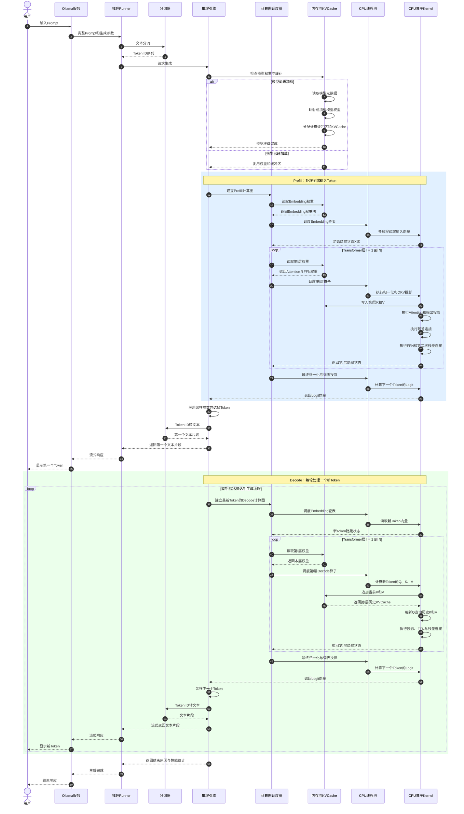
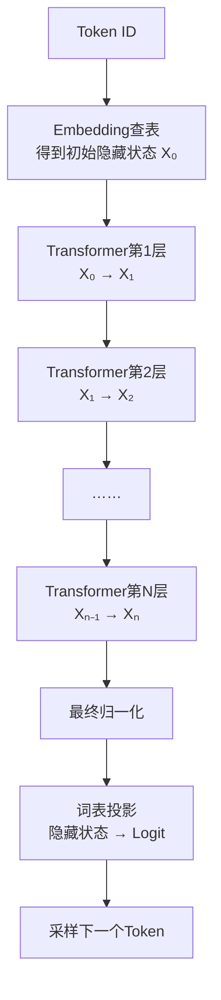
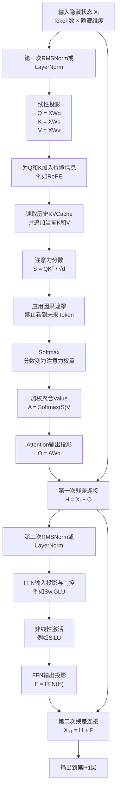
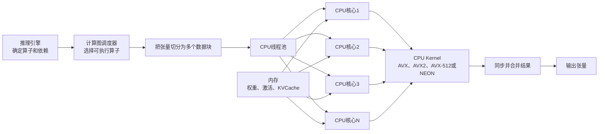

# Ollama 怎样在 CPU 上完成一次大模型推理？

调用 `ollama run` 后，我们能看到文字逐渐出现，但“模型正在运行”仍然把许多不同职责混在了一起。Ollama 要接收请求、准备 Prompt 和调度模型；推理引擎要组织计算；CPU 则执行矩阵乘法、归一化、Softmax 等底层算子。本篇沿一次文本生成请求，解释这些部分怎样接力，并重点展开一个 Token 如何经过 N 层 Transformer。

本文以典型的 **Decoder-only Transformer、CPU 推理、稠密前馈网络**为主线。不同模型可能使用 LayerNorm 或 RMSNorm、不同激活函数、分组查询注意力（GQA）或混合专家（MoE），但“推理引擎组织计算、CPU 执行算子”的边界不变。

## 1. Ollama、推理引擎和 CPU 分别做什么？

用户输入一句话之后，系统既要知道使用哪个模型和聊天模板，也要完成大量数值计算。只靠模型权重无法处理前者，只靠 Ollama 的接口服务也无法完成后者，因此整个过程自然分成四层。

| 层次 | 主要工作 | 不负责什么 |
| --- | --- | --- |
| Ollama 服务 | 接收请求、管理模型、组装 Prompt、调度 Runner、流式返回结果 | 不直接完成每个矩阵乘法 |
| 推理 Runner | 承载某个已加载模型，并连接 Ollama 与具体推理后端 | 不决定模型学到了什么 |
| 推理引擎 | 建立计算图、安排算子顺序、管理权重、缓冲区和 KV Cache | 不改变训练后权重表达的能力 |
| CPU | 按 Kernel 指令执行乘加、归一化、Softmax、激活和数据搬运 | 不理解“Attention”或“Transformer”的业务含义 |

因此，**模型权重提供参数，推理引擎决定如何执行这些参数定义的计算，CPU 完成具体数值运算，Ollama 则管理一次请求从进入到返回的全过程。**

## 2. 一次请求怎样进入 CPU？

下面的时序图从用户输入开始，先画出模型复用或加载，再区分 Prefill 与 Decode。图中的“计算图”不是新的神经网络，而是推理引擎对当前这次前向计算所需算子及其依赖关系的运行表示。



读图时抓住两条接力关系。纵向上，每一个输入或新生成的 Token 都必须依次通过第 1 层到第 N 层；横向上，推理引擎先把一层拆成算子和任务，CPU 线程池再把任务拆给不同核心执行。

## 3. 一个 Token 怎样通过 N 层网络？

分词器产生 Token ID 后，Embedding 表先把离散编号变成向量。设初始隐藏状态为 X₀，模型有 N 个 Transformer 层：第 1 层把 X₀ 变成 X₁，第 2 层把 X₁ 变成 X₂，直到第 N 层产生 Xₙ。这里的下标表示层号，而不是 Token 编号。



“模型有 32 层”并不表示生成一次回答只经过 32 层。Prefill 会让输入 Token 经过全部 32 层；此后每生成一个新 Token，Decode 都要再次经过全部 32 层。若生成 100 个 Token，宏观上就是一次 Prefill 加 100 轮 Decode，每一轮都包含完整的 32 层前向计算。

## 4. 一个 Transformer 层内部怎样计算？

进入第 l 层时，推理引擎已经拿到上一层的隐藏状态 Xₗ。当前层先让每个 Token 查询上下文，再让每个 Token 独立通过前馈网络变换，两个子过程都通过残差连接保留原信息。



为了计算注意力，Q、K、V 必须先由当前隐藏状态与三组权重相乘得到。`d` 表示单个注意力头中 Query 和 Key 的维度，除以 `√d` 是为了控制点积数值的尺度；Softmax 再把分数变成可用于加权的比例。Decode 时，当前 Token 只新计算自己的 Q、K、V，其中 K、V 被追加到缓存，Q 则用来查询从第一个 Token 到当前 Token 的历史 K、V。

注意力解决 Token 之间的信息交换后，FFN 对每个 Token 的隐藏状态进行非线性变换。上图采用常见的“归一化在子层之前”的画法；具体模型结构可能不同，实际执行必须服从模型配置与权重格式，不能让推理引擎随意调换数学含义。

## 5. 推理引擎怎样把一层计算交给 CPU？

“执行 Q 投影”对 CPU 来说仍然过于抽象。推理引擎必须把它转换成矩阵乘法等具体算子，再按矩阵行、列、Token 或数据块切分任务。线程池把这些任务分给 CPU 核心，Kernel 则使用适合当前处理器的向量指令完成大量乘加。



以 Q=XWq 为例，X 是本层输入隐藏状态，Wq 是生成 Query 的权重矩阵。计算图调度器先确认二者的形状、数据类型和内存地址，再把输出矩阵划分为数据块。多个 CPU 核心分别计算不同数据块，每个核心使用 SIMD（Single Instruction, Multiple Data，单指令多数据）指令同时处理多个数值，最后同步并组成完整的 Q。

如果模型使用 Q4、Q5 或 Q8 等量化权重，CPU Kernel 还要读取每个量化块的整数值和缩放信息。具体实现可能直接用优化后的量化乘法 Kernel，也可能在计算过程中把局部权重恢复到较高精度后累加。量化减少了权重存储和内存搬运，但能否同比加速，还取决于 CPU 指令集、Kernel 实现、线程数和内存带宽。

## 6. Prefill 与 Decode 为什么表现不同？

两者使用同一套模型层，却有不同的工作形态。Prefill 能同时处理 Prompt 中的多个 Token，矩阵通常更大，更容易形成批量计算；Decode 的下一轮必须等待本轮选出 Token，而且每轮通常只为一个新 Token 计算隐藏状态。

| 比较项 | Prefill | Decode |
| --- | --- | --- |
| 每次主要处理对象 | 整段输入中的多个 Token | 最新生成的一个 Token |
| 是否经过 N 层 | 是 | 每轮都是 |
| KV Cache 操作 | 建立输入部分的 K、V | 读取历史 K、V，并追加当前 K、V |
| 并行特点 | Token 较多，矩阵计算规模较大 | 自回归轮次之间存在严格依赖 |
| 用户感受 | 主要影响首 Token 延迟 | 主要影响后续生成速度和总完成时间 |

KV Cache 只消除了历史 Token 的 K、V 重算，并没有消除当前 Token 的 N 层计算，也没有让当前 Query 不再关注历史上下文。随着上下文增长，每层需要读取的历史 K、V 也会增长。

## 7. CPU 推理为什么经常受内存带宽限制？

每一层都要读取 Attention 和 FFN 的大量权重。尤其在单请求 Decode 中，当前只有一个新 Token，可同时计算的工作有限，但生成每个 Token 仍要依次访问 N 层权重。CPU 核心可能很快完成当前数据块的乘加，然后等待下一批权重从内存送来，此时限制速度的不是理论计算次数，而是单位时间能够搬运多少数据，即**内存带宽**。

这也解释了为什么低比特量化常能帮助 CPU 推理：权重更小意味着生成每个 Token 时需要搬运的数据更少。但量化还会引入缩放、解码或专用 Kernel 的成本，所以“位宽减半”不能直接推导出“速度翻倍”。实际速度还会受到内存通道、缓存命中、CPU 指令集、线程配置、模型结构和上下文长度影响。

## 8. 用一条链收束全过程

```text
用户输入
  → Ollama组装Prompt并选择Runner
  → 分词器生成Token ID
  → 推理引擎建立Prefill计算图
  → CPU让全部输入依次通过N层并建立KV Cache
  → 最终隐藏状态投影为整个词表的Logit
  → 采样得到第一个输出Token
  → 推理引擎建立Decode计算图
  → CPU让新Token再次通过N层并复用历史KV Cache
  → 得到下一个Token并流式返回
  → 重复Decode直到满足停止条件
```

最容易遗漏的结论是：**推理引擎不是另一套神经网络，CPU 也不会一次执行一个“Transformer 层”指令。推理引擎保存模型结构和运行状态，把每层拆成有依赖的算子；CPU 再通过线程与向量指令执行这些算子。每生成一个新 Token，都必须重新经过全部 N 层。**

## 参考与延伸

- [Ollama 请求处理源码](https://github.com/ollama/ollama/blob/main/server/routes.go)：可查看请求怎样选择模型、整合参数并取得 Runner。
- [Ollama 调度器源码](https://github.com/ollama/ollama/blob/main/server/sched.go)：可查看模型加载、复用、设备发现和运行实例管理。
- [Ollama 推理服务源码](https://github.com/ollama/ollama/blob/main/llm/server.go)：当前源码说明 GGUF 模型通过上游 `llama-server` 子进程提供服务。
- [D14：模型推理为什么占显存，响应为什么会变慢？](../../courses/01-llm-overview/d14-inference-memory/README.md)：继续复习 Prefill、Decode 与 KV Cache。
- [D15：推理引擎怎样让更多请求更快完成？](../../courses/01-llm-overview/d15-serving-engine/README.md)：继续理解并发调度、连续批处理和量化。

Ollama 的代码结构与后端支持会持续变化；上述实现信息核对日期为 **2026-09-21**，核心计算过程以典型 Decoder-only Transformer 为教学主线。
