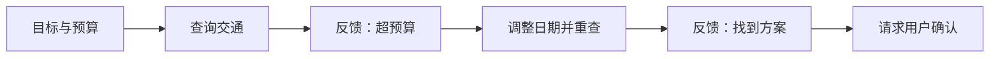

# 补充：同一个出差助手，是怎样一步步训练出来的？

用户对模型说：“帮我规划下周去上海的出差，预算不超过 3000 元；先给方案，不要替我下单。”一个模型可能把这句话继续写成对话，另一个能给出方案，还有一个会查询车票并根据结果调整计划。它们的差别不只是数据量或参数量，更关键的是：**训练时，模型通过什么信号知道自己做对了。**

先看同一个任务在四种模型上的表现，建立全文导航：

| 模型版本 | 实际表现 | 暴露出的训练缺口 |
| --- | --- | --- |
| 版本 A | 把请求继续写成“用户与助手的对话” | 理解文字，但没有稳定执行指令 |
| 版本 B | 给出三个方案，却声称某趟车“确定有票” | 会执行指令，但没有守住真实性等质量边界 |
| 版本 C | 说明无法确认实时余票，并建议查询 | 回答更可靠，但没有真的与外部系统交互 |
| 版本 D | 查询车票，遇到超预算后调整计划，最后等待确认 | 能根据工具反馈推进多步任务 |

表格只展示现象。下面沿着 A → D 逐步追问：前一种训练信号为什么不够，又需要加入什么新信号？

## 1. 只学习下一个 Token，模型能得到什么？

训练最初，模型参数近似随机。要让它理解“上海”“预算”和“出差”等文字，可以让它阅读大量文本，并反复预测下一个 Token。原文右侧的 Token 自动提供正确答案，因此这叫**自监督学习（Self-supervised Learning）**，而不是完全没有监督信号的学习。

为了持续预测正确，模型会逐渐捕捉词语搭配、语法结构、概念关系、常见事实和代码模式。它可能因此知道上海是一座城市，也见过许多行程方案，但预训练只要求它判断“文字通常怎样继续”，没有直接要求它把用户输入当成必须完成的任务。于是，基础模型可能接着写“下面是用户与助手的对话”，而不是开始规划行程。

这就是预训练留下的第一个缺口：**模型已经积累了可用的语言与知识模式，却不一定会按用户期望组织这些能力。**“预训练决定知识上限”只能作为粗略直觉，不能当作严格定律；模型能力还受结构、数据质量、训练方法和后训练影响。同理，“几十 TB 数据”“占 90% 以上算力”也不是通用规格，具体数值必须针对某个模型的技术报告核对。

## 2. 怎样让模型从续写转向执行指令？

为了补上这个缺口，可以给模型展示“指令—理想回答”。例如，输入要求三个预算内方案，目标回答就准确给出三个方案，并遵守“不要下单”的限制。模型继续逐 Token 预测目标回答，仍然通过损失、梯度和反向传播更新参数；改变的是它模仿的内容。

这种训练叫**监督微调（Supervised Fine-tuning，SFT）**。如果把预训练想成广泛阅读，SFT 更像学习带有完整解答的例题：它不是重新建立全部语言能力，而是示范怎样把已有能力组织成用户期望的行为。

SFT 本身就是监督微调的一种用途，并不是天然比所谓“传统微调”更能泛化的新算法。泛化能力来自基础模型已有的能力，以及指令数据的质量、多样性和任务覆盖；“SFT”这个名称本身不提供保证。

经过 SFT，模型能给出三个行程方案，但新的问题出现了：如果示范回答写得很自信，它也可能在没有查询购票系统时声称“目前确定有票”。单个示范告诉模型“可以怎样答”，却不容易完整表达真实性、安全性和简洁程度之间的取舍。

## 3. 怎样让模型区分两个看似合格的回答？

假设模型没有访问实时余票，却生成了两个候选回答：

- 回答 A：“推荐 G1 次列车，票价 553 元，目前确定有票。”
- 回答 B：“可以优先查询 G1 次列车；实时余票需要通过购票系统确认。”

回答 B 更可靠，因为它没有把未知状态说成事实。要把这种取舍变成训练信号，可以让人比较候选回答，也可以用规则、可验证结果或评分模型评价输出。常见方法的差别如下：

| 方法 | 好坏信号怎样进入训练 | 需要独立奖励模型吗 | 属于策略强化学习吗 |
| --- | --- | :---: | :---: |
| 经典 RLHF | 人类偏好先训练奖励模型，再用奖励更新语言模型 | 是 | 是 |
| DPO | 直接用“较优回答—较差回答”构造语言模型的训练目标 | 否 | 否 |
| GRPO | 同一问题采样一组回答，按组内相对奖励更新策略 | 不一定 | 是 |

经典**基于人类反馈的强化学习（Reinforcement Learning from Human Feedback，RLHF）**可以概括为“先训练裁判，再让模型争取高分”。InstructGPT 使用了“SFT—奖励模型—PPO 强化学习”的代表性流程。[InstructGPT 论文](https://arxiv.org/abs/2203.02155)

**直接偏好优化（Direct Preference Optimization，DPO）**直接学习偏好对，不需要独立奖励模型，也没有在线采样后再做策略强化学习的阶段。因此，DPO 属于广义的偏好优化，但不应仅因使用偏好数据就称为强化学习。[DPO 论文](https://arxiv.org/abs/2305.18290)

**组相对策略优化（Group Relative Policy Optimization，GRPO）**比较同一道题的一组回答，再提高相对高奖励回答的生成概率。奖励可以来自规则、可验证答案、奖励模型或它们的组合，并不固定要求“规则分数加模型分数”。DeepSeekMath 提出 GRPO 时，还用这种设计减少了 PPO 中价值模型带来的额外资源开销。[DeepSeekMath 论文](https://arxiv.org/abs/2402.03300)

这些方法可以改善一段回答的质量，但出差助手若要真正查票，就不再只生成一段文字。它必须选择工具、读取结果并决定下一步，评价对象也随之从“回答”扩展为“过程”。

## 4. 为什么 Agent 训练要关注整条轨迹？

出差助手先查询车票，工具返回“方案超预算”；它随后调整日期，再次查询并找到可行方案，最后停下来等待用户确认。这个过程中，前一步的结果会改变后一步的选择：

一次任务中的观察、决策、工具动作、环境反馈、状态变化和最终结果合在一起，称为**轨迹（Trajectory）**。只评价最后一句“已找到方案”并不够，因为模型可能在中途用了错误日期、反复调用同一工具，甚至未经确认尝试下单。

轨迹主要通过两种方式参与训练：

| 训练方式 | 模型从哪里学习 | 主要优点与局限 |
| --- | --- | --- |
| 轨迹 SFT | 模仿专家或筛选后的成功轨迹 | 容易获得基本工具行为，但受已有路径限制 |
| Agent 强化学习 | 在环境中尝试，根据结果与过程奖励更新策略 | 可能探索新路径，但面临奖励归因、环境成本和奖励投机 |

两者可以衔接使用。ReTool 先用带代码执行的推理轨迹进行冷启动微调，再让模型在多轮代码执行中根据任务结果进行强化学习，学习何时调用工具。[ReTool 论文](https://arxiv.org/abs/2504.11536) 因此，“Agent Tune”可以泛指面向 Agent 行为的训练，却不是边界固定的单一算法；看到这个说法时，还要追问它使用的是轨迹模仿、环境奖励，还是二者的组合。

## 5. 模型学会规划后，为什么仍需要外部系统？

Agent 训练改善的是模型选择动作的能力，不能代替真实系统的控制。模型可以建议调用购票工具，但外部程序仍要校验参数和权限、保存可信状态、限制成本与重试次数，并在下单等有副作用的操作前获得用户确认。开放步骤可以让模型动态决定，不可违反的规则仍应由工作流固定。

因此，**Agentic AI 首先是一种由模型、工具、状态和控制循环组成的系统形态，而不是预训练和后训练之后必然出现的“第三个训练阶段”。**一个模型参与“观察—行动—反馈”循环就可以构成 Agent；多 Agent 协作只是可选架构，也不会自动带来更高的正确率。

## 6. 遇到新的训练方法，怎样判断它在解决什么？

记住所有缩写并不现实。遇到一个新方法时，依次回答下面四个问题，更容易判断它处在训练链的什么位置：

1. **模型看到了什么数据？**是普通文本、理想回答、偏好对，还是环境交互轨迹？
2. **模型要产生什么？**是下一个 Token、一段回答，还是多步动作？
3. **谁提供好坏信号？**是真实 Token、人工示范、人类偏好、规则、奖励模型，还是任务结果？
4. **信号怎样更新模型？**是监督损失、直接偏好损失，还是策略强化学习？

这四问把全文连成一条因果链：普通文本让模型形成基础能力；理想示范教它遵循指令；偏好或奖励帮助它比较回答质量；环境反馈进一步训练多步决策。具体模型不一定严格走完这条固定流水线，但训练信号一变，模型正在学习的问题也会随之改变。

## 助记卡片

**卡片 1：预训练为什么属于自监督学习？**

> **答案：** 下一个 Token 的正确答案可直接从原始文本构造，不需人工逐条标注，但仍有明确监督目标。

**卡片 2：SFT 主要补上预训练留下的什么缺口？**

> **答案：** 它用“指令—理想回答”示范，教模型把已有能力组织成符合指令的行为。

**卡片 3：DPO 与经典 RLHF 的关键区别是什么？**

> **答案：** DPO 直接学习偏好对；经典 RLHF 先训练奖励模型，再用奖励进行策略强化学习。

**卡片 4：GRPO 必须使用独立奖励模型吗？**

> **答案：** 不必须。它需要可比较的奖励，但奖励可以来自规则、可验证结果或奖励模型等来源。

**卡片 5：为什么 Agent 训练要关注轨迹？**

> **答案：** 多步任务的质量取决于中间动作和环境反馈，只看最终回答会遗漏错误调用、状态变化和越权行为。

**卡片 6：轨迹 SFT 与 Agent 强化学习分别怎样学习？**

> **答案：** 轨迹 SFT 模仿已有成功过程；Agent 强化学习在环境中尝试，并根据过程或结果奖励更新策略。

**卡片 7：Agentic AI 为什么不是固定的第三训练阶段？**

> **答案：** 它首先是模型、工具、状态和控制循环组成的系统形态，其中的模型可以采用多种训练方法。

## 自测题

1. 基础模型了解上海，却把出差请求继续写成一段对话。这说明预训练建立了什么，又缺少什么？
2. 为什么不能说“SFT 天然比传统微调更能泛化”？
3. 某方法直接使用较优与较差回答训练语言模型，不训练独立奖励模型。它更接近经典 RLHF、DPO 还是 GRPO？为什么？
4. 出差 Agent 最终给出可行方案，却曾使用错误日期查询并尝试越权下单。为什么最终答案奖励不足以评价这条轨迹？
5. 同一批成功工具调用轨迹，可以怎样用于轨迹 SFT 和 Agent 强化学习的冷启动？
6. 面对一个新的训练缩写，应该用哪四个问题判断它解决的是哪一层问题？

完成后再看[参考答案](quiz-answers.md)。相关主课可回顾 [D07：预训练](../../courses/01-llm-overview/d07-pretraining/README.md)、[D08：后训练](../../courses/01-llm-overview/d08-post-training/README.md)和 [D13：Agent 工作流](../../courses/01-llm-overview/d13-agent-workflow/README.md)。
